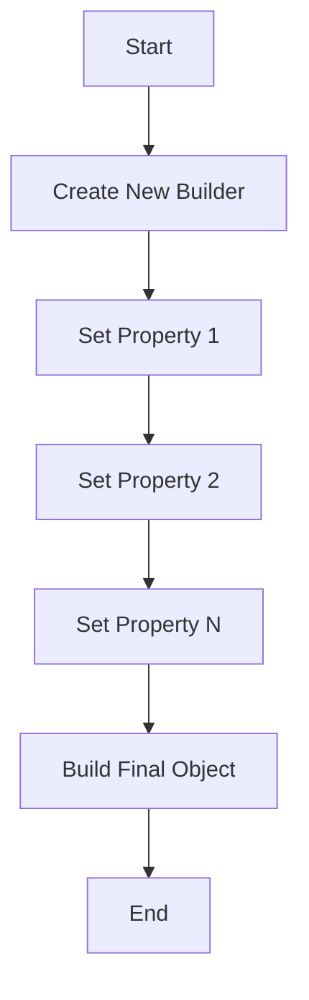

## 5.3. Builder Pattern Using Functional Approaches

In the world of software design, the Builder Pattern is a powerful creational pattern that allows for the step-by-step construction of complex objects. In Elixir, a language that embraces functional programming principles, the Builder Pattern can be implemented using immutable data structures and fluent interfaces. This section will guide you through understanding and applying the Builder Pattern in Elixir, leveraging its functional nature to create robust and maintainable code.

### Step-by-Step Object Construction

The Builder Pattern is particularly useful when dealing with complex objects that require multiple steps to construct. In traditional object-oriented programming, this might involve mutable objects and a series of method calls to set various properties. However, in Elixir, we embrace immutability, meaning that each step in the construction process returns a new instance of the object with the desired modifications.

#### The Concept of Object Construction in Elixir

In Elixir, objects are typically represented as maps or structs. The process of building these objects involves creating a base structure and then applying a series of transformations to it. Each transformation returns a new version of the object, allowing for a clean and predictable construction process.

```elixir
defmodule UserBuilder do
  defstruct name: nil, age: nil, email: nil

  def new() do
    %UserBuilder{}
  end

  def set_name(user, name) do
    %{user | name: name}
  end

  def set_age(user, age) do
    %{user | age: age}
  end

  def set_email(user, email) do
    %{user | email: email}
  end
end

# Usage
user = UserBuilder.new()
|> UserBuilder.set_name("Alice")
|> UserBuilder.set_age(30)
|> UserBuilder.set_email("alice@example.com")
```

In this example, we define a `UserBuilder` module with a struct and functions to set each property. The `|>` operator, known as the pipe operator, is used to chain function calls, making the code more readable and expressive.

### Immutable Data Structures

In Elixir, immutability is a core principle. Once a data structure is created, it cannot be changed. Instead, any modification results in a new data structure. This immutability ensures that functions do not have side effects, leading to more predictable and reliable code.

#### Benefits of Immutability

- **Safety**: Since data cannot be changed, there are no concerns about unintended side effects or race conditions.
- **Concurrency**: Immutable data structures can be shared freely between processes without the need for locks or other synchronization mechanisms.
- **Simplicity**: Functions that operate on immutable data are easier to reason about, as they do not alter the state of the program.

### Fluent Interfaces in Elixir

Fluent interfaces are a design pattern that allows for method chaining, creating a more readable and expressive code. In Elixir, the pipe operator (`|>`) is a natural fit for implementing fluent interfaces, as it passes the result of one function directly into the next.

#### Creating Fluent Interfaces

To create a fluent interface in Elixir, ensure that each function in the chain returns the modified object, allowing the next function to operate on it.

```elixir
defmodule ConfigBuilder do
  defstruct host: "localhost", port: 80, protocol: "http"

  def new() do
    %ConfigBuilder{}
  end

  def set_host(config, host) do
    %{config | host: host}
  end

  def set_port(config, port) do
    %{config | port: port}
  end

  def set_protocol(config, protocol) do
    %{config | protocol: protocol}
  end
end

# Usage
config = ConfigBuilder.new()
|> ConfigBuilder.set_host("example.com")
|> ConfigBuilder.set_port(443)
|> ConfigBuilder.set_protocol("https")
```

In this example, the `ConfigBuilder` module provides a fluent interface for constructing a configuration object. Each function modifies the configuration and returns the updated version, allowing for seamless chaining.

### Examples: Configuring a GenServer with Multiple Options

The Builder Pattern is particularly useful when configuring Elixir's GenServer, a generic server process that is part of the OTP framework. GenServers can be configured with various options, and using a builder can simplify this process.

#### Implementing a GenServer Builder

Let's create a builder for configuring a GenServer with options such as name, initial state, and timeout.

```elixir
defmodule GenServerBuilder do
  defstruct name: nil, initial_state: nil, timeout: 5000

  def new() do
    %GenServerBuilder{}
  end

  def set_name(builder, name) do
    %{builder | name: name}
  end

  def set_initial_state(builder, state) do
    %{builder | initial_state: state}
  end

  def set_timeout(builder, timeout) do
    %{builder | timeout: timeout}
  end

  def build(builder) do
    {:ok, pid} = GenServer.start_link(__MODULE__, builder.initial_state, name: builder.name)
    {:ok, pid}
  end
end

# Usage
{:ok, pid} = GenServerBuilder.new()
|> GenServerBuilder.set_name(:my_server)
|> GenServerBuilder.set_initial_state(%{count: 0})
|> GenServerBuilder.set_timeout(10000)
|> GenServerBuilder.build()
```

In this example, the `GenServerBuilder` module provides a fluent interface for setting up a GenServer. The `build/1` function starts the GenServer with the configured options.

### Visualizing the Builder Pattern in Elixir

To better understand the flow of data and function calls in the Builder Pattern, let's visualize the process using a flowchart.


```mermaid
graph TD;
    A[Start] --> B[Create New Builder]
    B --> C[Set Property 1]
    C --> D[Set Property 2]
    D --> E[Set Property N]
    E --> F[Build Final Object]
    F --> G[End]
```

This flowchart illustrates the step-by-step process of creating a builder, setting various properties, and finally building the object.

### Design Considerations

When implementing the Builder Pattern in Elixir, consider the following:

- **Immutability**: Ensure that each step returns a new instance of the object.
- **Fluent Interfaces**: Use the pipe operator to create readable and expressive code.
- **Error Handling**: Consider how to handle invalid configurations or missing required properties.
- **Performance**: Be mindful of the performance implications of creating new instances at each step.

### Elixir Unique Features

Elixir's unique features, such as immutability and the pipe operator, make it an excellent fit for the Builder Pattern. These features allow for clean, maintainable code that is easy to reason about.

### Differences and Similarities

The Builder Pattern in Elixir differs from traditional object-oriented implementations in its use of immutability and functional programming principles. However, the core concept of step-by-step construction remains the same.

### Try It Yourself

Now that we've explored the Builder Pattern in Elixir, try modifying the examples to suit your needs. For instance, add additional properties to the `UserBuilder` or `ConfigBuilder` modules, or experiment with different configurations for the GenServer.

### Knowledge Check

To reinforce your understanding of the Builder Pattern in Elixir, consider the following questions:

- What are the benefits of using immutable data structures in the Builder Pattern?
- How does the pipe operator facilitate fluent interfaces in Elixir?
- What are some potential pitfalls to avoid when implementing the Builder Pattern?

Remember, this is just the beginning. As you progress, you'll discover more ways to leverage Elixir's features to create powerful and efficient code. Keep experimenting, stay curious, and enjoy the journey!

## Quiz Time!



### What is the primary advantage of using immutable data structures in the Builder Pattern?

- [x] They prevent unintended side effects.
- [ ] They allow for faster execution.
- [ ] They simplify syntax.
- [ ] They enable dynamic typing.

> **Explanation:** Immutable data structures prevent unintended side effects by ensuring that data cannot be changed once created.

### How does the pipe operator (`|>`) enhance code readability in Elixir?

- [x] It allows for chaining function calls.
- [ ] It increases execution speed.
- [ ] It reduces the number of lines of code.
- [ ] It enables dynamic typing.

> **Explanation:** The pipe operator allows for chaining function calls, making the code more readable and expressive.

### In the context of the Builder Pattern, what does "fluent interface" refer to?

- [x] A design that allows method chaining for readability.
- [ ] A design that uses dynamic typing.
- [ ] A design that focuses on performance.
- [ ] A design that uses mutable data structures.

> **Explanation:** A fluent interface allows for method chaining, enhancing readability and expressiveness.

### What is a potential pitfall of using the Builder Pattern in Elixir?

- [x] Creating new instances at each step can impact performance.
- [ ] It leads to mutable data structures.
- [ ] It complicates error handling.
- [ ] It makes code less readable.

> **Explanation:** Creating new instances at each step can impact performance, so it's important to consider this when using the Builder Pattern.

### Which Elixir feature is particularly useful for implementing the Builder Pattern?

- [x] The pipe operator (`|>`)
- [ ] Dynamic typing
- [ ] Mutable data structures
- [ ] Synchronous execution

> **Explanation:** The pipe operator is useful for implementing the Builder Pattern as it allows for chaining function calls.

### What is the purpose of the `build/1` function in the `GenServerBuilder` example?

- [x] To start the GenServer with the configured options.
- [ ] To initialize the builder.
- [ ] To set the initial state.
- [ ] To handle errors.

> **Explanation:** The `build/1` function starts the GenServer with the configured options, completing the builder process.

### Why is immutability a core principle in Elixir?

- [x] It ensures functions do not have side effects.
- [ ] It allows for faster execution.
- [ ] It simplifies syntax.
- [ ] It enables dynamic typing.

> **Explanation:** Immutability ensures that functions do not have side effects, leading to more predictable and reliable code.

### How can you handle invalid configurations in the Builder Pattern?

- [x] By implementing error handling mechanisms.
- [ ] By using mutable data structures.
- [ ] By avoiding the Builder Pattern.
- [ ] By using dynamic typing.

> **Explanation:** Implementing error handling mechanisms allows you to handle invalid configurations in the Builder Pattern.

### What is a key difference between the Builder Pattern in Elixir and traditional object-oriented implementations?

- [x] Elixir uses immutability and functional programming principles.
- [ ] Elixir allows for mutable data structures.
- [ ] Elixir focuses on performance.
- [ ] Elixir uses dynamic typing.

> **Explanation:** The Builder Pattern in Elixir uses immutability and functional programming principles, unlike traditional object-oriented implementations.

### True or False: The Builder Pattern in Elixir can be used to configure a GenServer with multiple options.

- [x] True
- [ ] False

> **Explanation:** True. The Builder Pattern can be used to configure a GenServer with multiple options, as demonstrated in the examples.


