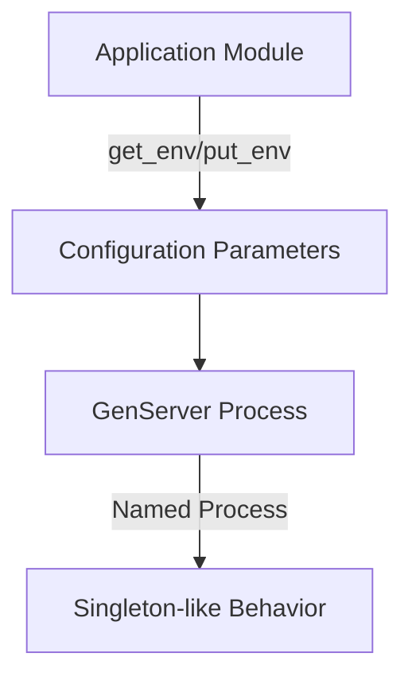

## 5.4. Singleton Pattern and Application Environment

In the world of software design patterns, the Singleton Pattern is a well-known concept, traditionally used to ensure that a class has only one instance and provides a global point of access to it. However, in Elixir, a functional programming language, the approach to implementing a Singleton is quite different due to its emphasis on immutability and process-based concurrency. In this section, we will explore how the Singleton Pattern can be adapted to Elixir, focusing on the use of the Application module for centralized configuration, accessing global state safely, and leveraging process registries.

### Singleton Concepts in Elixir

In Elixir, the Singleton Pattern is not implemented in the traditional object-oriented sense. Instead, Elixir provides mechanisms that align with its functional nature and process-oriented architecture. One of the primary tools for achieving Singleton-like behavior in Elixir is the Application module.

#### Using the Application Module as a Centralized Configuration Store

The Application module in Elixir serves as a centralized configuration store, allowing you to define and access application-specific configuration parameters. This module is part of the Elixir standard library and provides a way to manage application environment variables, which can be used to simulate Singleton behavior.

```elixir
# config/config.exs
use Mix.Config

config :my_app, :api_key, "123456"

# lib/my_app/application.ex
defmodule MyApp.Application do
  use Application

  def start(_type, _args) do
    api_key = Application.get_env(:my_app, :api_key)
    IO.puts("API Key: #{api_key}")

    children = [
      # Define workers and child supervisors to be supervised
    ]

    opts = [strategy: :one_for_one, name: MyApp.Supervisor]
    Supervisor.start_link(children, opts)
  end
end
```

In this example, we configure an API key in the `config/config.exs` file and retrieve it using `Application.get_env/2` in the application module. This approach allows you to maintain a single source of truth for configuration data, similar to a Singleton.

### Accessing Global State Safely

While Elixir discourages global mutable state, there are scenarios where accessing global state is necessary. The Application module provides a safe way to read from and write to application environment variables, ensuring that the state remains consistent across the application.

#### Reading from and Writing to Application Environment Variables

To access global state safely, you can use the `Application.get_env/3` and `Application.put_env/4` functions. These functions allow you to read and write configuration parameters, respectively.

```elixir
# Reading a configuration parameter
api_key = Application.get_env(:my_app, :api_key, "default_key")

# Writing a configuration parameter
Application.put_env(:my_app, :api_key, "new_key")
```

By using these functions, you can manage global state without compromising the functional integrity of your application.

### Process Registries

In Elixir, processes are lightweight and can be used to simulate single-instance behavior. By using named processes, you can create a Singleton-like structure that ensures only one instance of a process is running at any given time.

#### Using Named Processes to Simulate Single-Instance Behavior

Named processes in Elixir can be registered using the `:global` or `:local` registry. This allows you to access the process by name, ensuring that only one instance of the process is running.

```elixir
defmodule MySingleton do
  use GenServer

  # Client API
  def start_link(_) do
    GenServer.start_link(__MODULE__, %{}, name: __MODULE__)
  end

  def get_state do
    GenServer.call(__MODULE__, :get_state)
  end

  # Server Callbacks
  def init(state) do
    {:ok, state}
  end

  def handle_call(:get_state, _from, state) do
    {:reply, state, state}
  end
end

# Starting the singleton process
{:ok, _pid} = MySingleton.start_link([])
state = MySingleton.get_state()
```

In this example, we define a GenServer named `MySingleton` and register it using the module name. This ensures that only one instance of the GenServer is running, providing a Singleton-like behavior.

### Considerations

When implementing Singleton-like behavior in Elixir, it's important to consider the implications of global mutable state. Elixir's functional nature encourages immutability and process isolation, which can be compromised by global state.

#### Avoiding Global Mutable State to Maintain Functional Integrity

To maintain the functional integrity of your application, avoid using global mutable state. Instead, use processes and the Application module to manage state safely and effectively. This approach aligns with Elixir's philosophy of immutability and process-based concurrency.

### Design Considerations

When deciding to use Singleton-like patterns in Elixir, consider the following:

- **Use the Application module** for configuration management, ensuring a single source of truth for configuration data.
- **Leverage named processes** to simulate Singleton behavior, ensuring that only one instance of a process is running.
- **Avoid global mutable state** to maintain the functional integrity of your application.

### Elixir Unique Features

Elixir's unique features, such as the Application module and lightweight processes, provide powerful tools for implementing Singleton-like behavior. These features align with Elixir's functional nature and process-based concurrency model, allowing you to manage state safely and effectively.

### Differences and Similarities

The Singleton Pattern in Elixir differs from traditional object-oriented implementations due to its emphasis on immutability and process-based concurrency. While both approaches aim to provide a single point of access to a resource, Elixir's approach leverages processes and the Application module to achieve this goal.

### Try It Yourself

To experiment with the concepts discussed in this section, try modifying the code examples to:

- Add additional configuration parameters to the Application module and access them in your application.
- Create a new named process and implement additional GenServer callbacks to manage state.
- Explore the use of the `:global` registry for named processes and compare it with the `:local` registry.

By experimenting with these concepts, you'll gain a deeper understanding of how to implement Singleton-like behavior in Elixir.

### Visualizing Singleton Pattern in Elixir

To better understand the Singleton Pattern in Elixir, let's visualize the architecture using a Mermaid.js diagram.



**Diagram Description:** This diagram illustrates how the Application module manages configuration parameters, which are accessed by a GenServer process. The GenServer process is registered as a named process, providing Singleton-like behavior.

### Knowledge Check

- What is the primary tool for achieving Singleton-like behavior in Elixir?
- How can you safely access global state in Elixir?
- What is the role of named processes in simulating Singleton behavior?
- Why is it important to avoid global mutable state in Elixir?

### Summary

In this section, we've explored how the Singleton Pattern can be adapted to Elixir, focusing on the use of the Application module for centralized configuration, accessing global state safely, and leveraging process registries. By understanding these concepts, you can implement Singleton-like behavior in Elixir while maintaining the functional integrity of your application.

Remember, this is just the beginning. As you progress, you'll build more complex and interactive applications using Elixir's powerful features. Keep experimenting, stay curious, and enjoy the journey!

## Quiz: Singleton Pattern and Application Environment



### What is the primary tool for achieving Singleton-like behavior in Elixir?

- [x] Application module
- [ ] GenServer
- [ ] Supervisor
- [ ] Task

> **Explanation:** The Application module is used for centralized configuration management, which can simulate Singleton-like behavior.

### How can you safely access global state in Elixir?

- [x] Using Application.get_env/3 and Application.put_env/4
- [ ] Using global variables
- [ ] Using ETS tables
- [ ] Using process dictionaries

> **Explanation:** Application.get_env/3 and Application.put_env/4 provide a safe way to read and write configuration parameters.

### What is the role of named processes in simulating Singleton behavior?

- [x] Ensuring only one instance of a process is running
- [ ] Managing multiple instances of a process
- [ ] Providing global mutable state
- [ ] Handling asynchronous tasks

> **Explanation:** Named processes ensure that only one instance of a process is running, simulating Singleton behavior.

### Why is it important to avoid global mutable state in Elixir?

- [x] To maintain functional integrity
- [ ] To improve performance
- [ ] To simplify code
- [ ] To reduce memory usage

> **Explanation:** Avoiding global mutable state helps maintain the functional integrity of the application.

### Which function is used to register a named process in Elixir?

- [x] GenServer.start_link/3
- [ ] Application.start/2
- [ ] Supervisor.start_link/2
- [ ] Task.start/2

> **Explanation:** GenServer.start_link/3 is used to start a GenServer and register it as a named process.

### What is the purpose of the Application module in Elixir?

- [x] Centralized configuration management
- [ ] Process supervision
- [ ] Task scheduling
- [ ] Error handling

> **Explanation:** The Application module provides centralized configuration management for Elixir applications.

### How does Elixir's approach to Singleton differ from traditional object-oriented implementations?

- [x] Emphasizes immutability and process-based concurrency
- [ ] Uses global variables
- [ ] Relies on class inheritance
- [ ] Implements Singleton as a class

> **Explanation:** Elixir's approach emphasizes immutability and process-based concurrency, unlike traditional object-oriented implementations.

### What is a key benefit of using the Application module for configuration management?

- [x] Provides a single source of truth
- [ ] Increases code complexity
- [ ] Requires less memory
- [ ] Simplifies error handling

> **Explanation:** The Application module provides a single source of truth for configuration data.

### Which registry can be used for named processes in Elixir?

- [x] :global
- [ ] :local
- [ ] :ets
- [ ] :dets

> **Explanation:** The :global registry can be used for named processes in Elixir.

### True or False: Elixir encourages the use of global mutable state.

- [ ] True
- [x] False

> **Explanation:** Elixir discourages the use of global mutable state to maintain functional integrity.


