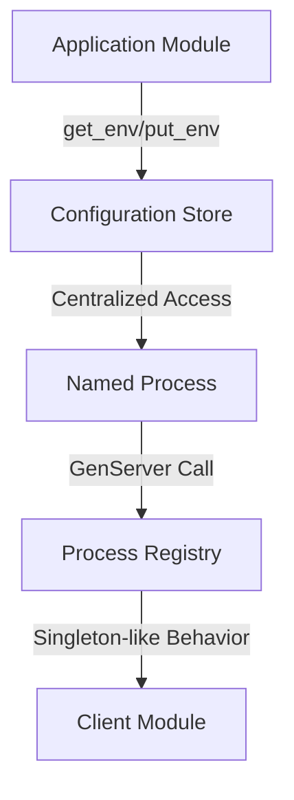

## 5.4. Singleton Pattern and Application Environment

In this section, we delve into the Singleton Pattern within the context of Elixir, a language that thrives on functional programming principles and concurrent processes. The Singleton Pattern, traditionally used in object-oriented programming to ensure a class has only one instance, is adapted in Elixir using different paradigms. We will explore how Elixir's Application module, process registries, and functional integrity play a role in achieving singleton-like behavior.

### Singleton Concepts in Elixir

In Elixir, the Singleton Pattern is not implemented in the traditional sense due to its functional nature and emphasis on immutability. Instead, Elixir provides alternative mechanisms to achieve similar results.

#### Using the Application Module as a Centralized Configuration Store

The Application module in Elixir serves as a centralized configuration store, allowing you to maintain application-wide settings and state. This is akin to a Singleton in that it provides a single point of access to configuration data.

```elixir
# config/config.exs
use Mix.Config

config :my_app,
  api_key: "123456",
  db_host: "localhost"

# Accessing configuration in your application
defmodule MyApp.Config do
  def get_api_key do
    Application.get_env(:my_app, :api_key)
  end

  def get_db_host do
    Application.get_env(:my_app, :db_host)
  end
end
```

In this example, the Application module is used to retrieve configuration values, ensuring that these values are consistent across the application. This approach avoids the pitfalls of global mutable state while providing centralized access to configuration data.

### Accessing Global State Safely

While Elixir discourages mutable global state, it does provide mechanisms to safely read from and write to application environment variables, which can be considered a form of global state.

#### Reading from and Writing to Application Environment Variables

Elixir's Application module allows you to safely manage configuration data, which can be read and updated at runtime.

```elixir
# Updating application environment
Application.put_env(:my_app, :api_key, "new_api_key")

# Reading updated configuration
defmodule MyApp.Updater do
  def update_api_key(new_key) do
    Application.put_env(:my_app, :api_key, new_key)
  end
end
```

By using `Application.put_env/3`, you can dynamically update configuration values, which can be useful for settings that need to be changed without redeploying the application.

### Process Registries

Elixir's concurrency model provides a unique approach to implementing singleton-like behavior through process registries and named processes.

#### Using Named Processes to Simulate Single-Instance Behavior

Named processes in Elixir can act as single instances that manage state or perform specific tasks. This is achieved by registering a process with a unique name.

```elixir
defmodule MyApp.Singleton do
  use GenServer

  # Client API
  def start_link(_) do
    GenServer.start_link(__MODULE__, %{}, name: __MODULE__)
  end

  def get_state do
    GenServer.call(__MODULE__, :get_state)
  end

  # Server Callbacks
  def init(state) do
    {:ok, state}
  end

  def handle_call(:get_state, _from, state) do
    {:reply, state, state}
  end
end

# Starting the singleton process
{:ok, _pid} = MyApp.Singleton.start_link([])
```

In this example, a GenServer is started with a unique name (`__MODULE__`), ensuring that only one instance of this process exists. This is a common pattern in Elixir for managing shared state or resources.

### Considerations

While Elixir provides mechanisms to achieve singleton-like behavior, it's important to consider the implications on functional integrity and application design.

#### Avoiding Global Mutable State to Maintain Functional Integrity

Elixir's functional paradigm emphasizes immutability and statelessness. Introducing global mutable state can lead to issues with concurrency and maintainability. Instead, consider using processes to encapsulate state and ensure that state changes are explicit and controlled.

### Visualizing Singleton Pattern in Elixir

To better understand how the Singleton Pattern can be applied in Elixir, let's visualize the interaction between the Application module and named processes.


```mermaid
graph TD;
    A[Application Module] -->|get_env/put_env| B[Configuration Store];
    C[Named Process] -->|GenServer Call| D[Process Registry];
    B -->|Centralized Access| C;
    D -->|Singleton-like Behavior| E[Client Module];
```

**Figure 1: Interaction between Application Module and Named Processes**

This diagram illustrates how the Application module serves as a centralized configuration store, while named processes provide singleton-like behavior by managing state through a process registry.

### Elixir Unique Features

Elixir's unique features, such as the Application module and GenServer, provide powerful abstractions for managing configuration and state. These features allow you to implement singleton-like behavior without compromising on functional programming principles.

### Differences and Similarities

The Singleton Pattern in Elixir differs from traditional object-oriented implementations due to its reliance on processes and functional constructs. While both approaches aim to provide a single point of access, Elixir's implementation emphasizes immutability and concurrency.

### Try It Yourself

To reinforce your understanding, try modifying the code examples to add new configuration settings or create additional named processes. Experiment with different process names and see how they affect the application's behavior.

### Knowledge Check

1. How does the Application module in Elixir differ from a traditional Singleton?
2. What are the benefits of using named processes for singleton-like behavior?
3. Why is it important to avoid global mutable state in Elixir?

### Embrace the Journey

Remember, mastering design patterns in Elixir is a journey. As you continue to explore and experiment, you'll discover new ways to leverage Elixir's unique features to build robust, scalable applications. Keep experimenting, stay curious, and enjoy the journey!

## Quiz Time!



### What is the primary purpose of the Singleton Pattern in Elixir?

- [x] To provide a single point of access to configuration or state
- [ ] To ensure immutability across the application
- [ ] To facilitate concurrent processing
- [ ] To enhance performance through caching

> **Explanation:** The Singleton Pattern in Elixir is used to provide a single point of access to configuration or state, similar to its purpose in other programming paradigms.

### Which Elixir module is commonly used as a centralized configuration store?

- [x] Application
- [ ] GenServer
- [ ] Supervisor
- [ ] Registry

> **Explanation:** The Application module in Elixir is commonly used as a centralized configuration store, allowing for consistent access to configuration data.

### How can you safely update configuration data at runtime in Elixir?

- [x] Using Application.put_env/3
- [ ] By directly modifying the config.exs file
- [ ] Through GenServer state updates
- [ ] Using ETS tables

> **Explanation:** Application.put_env/3 is used to safely update configuration data at runtime in Elixir.

### What is a key benefit of using named processes in Elixir?

- [x] They provide singleton-like behavior by ensuring only one instance exists
- [ ] They automatically handle all state management
- [ ] They improve application performance
- [ ] They eliminate the need for supervision trees

> **Explanation:** Named processes in Elixir provide singleton-like behavior by ensuring only one instance of a process exists with a given name.

### What should be avoided to maintain functional integrity in Elixir applications?

- [x] Global mutable state
- [ ] Use of the Application module
- [ ] Named processes
- [ ] Pattern matching

> **Explanation:** Global mutable state should be avoided in Elixir to maintain functional integrity and prevent issues with concurrency.

### How does Elixir's Singleton Pattern differ from traditional implementations?

- [x] It relies on processes and functional constructs
- [ ] It uses classes and objects
- [ ] It is implemented using global variables
- [ ] It requires inheritance

> **Explanation:** Elixir's Singleton Pattern relies on processes and functional constructs, differing from traditional implementations that use classes and objects.

### What is the role of the Application module in Elixir?

- [x] To manage application-wide configuration and state
- [ ] To handle process supervision
- [ ] To facilitate message passing
- [ ] To implement concurrency

> **Explanation:** The Application module in Elixir manages application-wide configuration and state, providing a centralized access point.

### Which of the following is a feature of Elixir's functional paradigm?

- [x] Immutability
- [ ] Global state management
- [ ] Object-oriented inheritance
- [ ] Automatic garbage collection

> **Explanation:** Immutability is a key feature of Elixir's functional paradigm, emphasizing statelessness and explicit state changes.

### What is the purpose of a process registry in Elixir?

- [x] To register and manage named processes
- [ ] To store configuration data
- [ ] To handle error logging
- [ ] To optimize memory usage

> **Explanation:** A process registry in Elixir is used to register and manage named processes, facilitating singleton-like behavior.

### True or False: Elixir encourages the use of global mutable state.

- [ ] True
- [x] False

> **Explanation:** False. Elixir discourages the use of global mutable state to maintain functional integrity and support concurrency.


