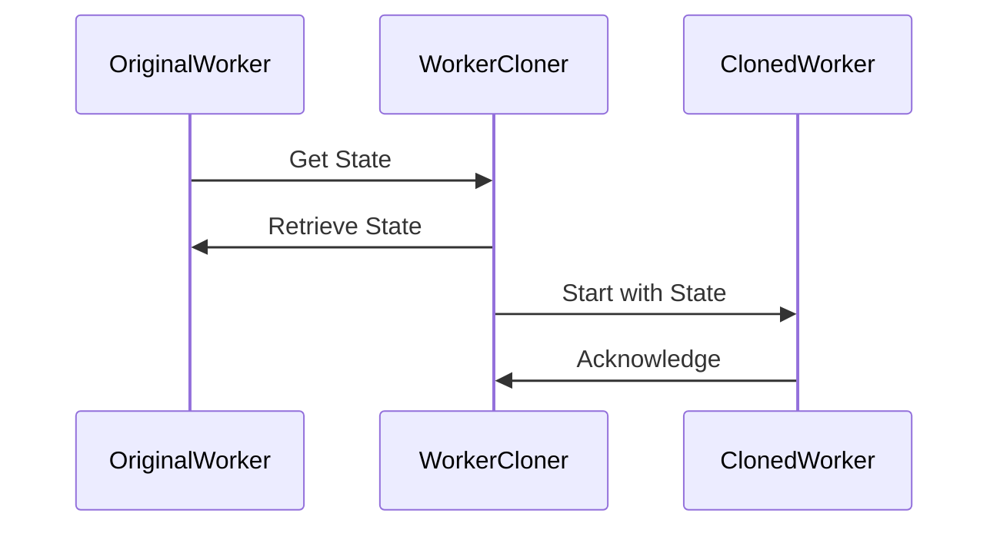

## 5.5. Prototype Pattern through Process Cloning

In the world of software design patterns, the Prototype Pattern is a creational pattern that allows objects to be cloned, making it easy to create new instances with the same properties as an existing instance. In Elixir, this concept can be applied to processes, particularly when dealing with GenServers or other OTP components. This section will delve into the Prototype Pattern through process cloning, exploring how Elixir's concurrency model can be leveraged to efficiently replicate processes with shared state.

### Cloning Processes and State

Elixir's concurrency model, built on the Erlang VM (BEAM), provides a robust environment for managing processes. Each process in Elixir is lightweight and isolated, making it an ideal candidate for cloning when you need to replicate behavior or state across multiple instances.

#### Key Concepts

- **Process Cloning**: The act of creating a new process that inherits the state of an existing process.
- **State Duplication**: Ensuring that the cloned process starts with the same initial state as the original.
- **GenServer**: A common abstraction in Elixir for implementing server processes, which can be cloned to create similar workers.

### Use Cases

The Prototype Pattern through process cloning is particularly useful in scenarios where you need to:

- **Replicate Workers**: Create multiple instances of a worker process, each starting with the same initial state.
- **Simulate Distributed Systems**: Model distributed systems by cloning processes to simulate nodes or services.
- **Load Balancing**: Distribute workload across cloned processes to achieve better performance and scalability.

### Examples

Let's explore how to implement the Prototype Pattern through process cloning in Elixir, focusing on creating similar GenServers with initial state duplication.

#### Creating a GenServer Prototype

First, we'll define a simple GenServer that maintains a state. This state will be cloned when creating new instances.

```elixir
defmodule Worker do
  use GenServer

  # Client API

  def start_link(initial_state) do
    GenServer.start_link(__MODULE__, initial_state, name: __MODULE__)
  end

  def get_state do
    GenServer.call(__MODULE__, :get_state)
  end

  # Server Callbacks

  def init(initial_state) do
    {:ok, initial_state}
  end

  def handle_call(:get_state, _from, state) do
    {:reply, state, state}
  end
end
```

In this example, the `Worker` GenServer maintains a simple state, which can be retrieved using the `get_state/0` function.

#### Cloning the GenServer

To clone the GenServer, we need a function that starts a new GenServer with the same initial state as an existing one.

```elixir
defmodule WorkerCloner do
  def clone(existing_worker) do
    initial_state = GenServer.call(existing_worker, :get_state)
    Worker.start_link(initial_state)
  end
end
```

The `WorkerCloner` module provides a `clone/1` function that retrieves the state from an existing worker and starts a new worker with that state.

#### Demonstrating Process Cloning

Let's see how this works in practice:

```elixir
{:ok, original_worker} = Worker.start_link(%{task: "Process data", status: :idle})
{:ok, cloned_worker} = WorkerCloner.clone(original_worker)

IO.inspect(GenServer.call(cloned_worker, :get_state))
```

In this example, we start an original worker with a specific state and then clone it. The cloned worker starts with the same state as the original, demonstrating the Prototype Pattern through process cloning.

### Visualizing Process Cloning

To better understand the process cloning mechanism, let's visualize it using a sequence diagram.



This diagram illustrates the interaction between the original worker, the cloner, and the cloned worker. The cloner retrieves the state from the original worker and uses it to start a new cloned worker.

### Design Considerations

When implementing the Prototype Pattern through process cloning in Elixir, consider the following:

- **State Consistency**: Ensure that the state being cloned is consistent and does not contain transient data that should not be shared.
- **Concurrency**: Be mindful of concurrency issues, especially if the state includes mutable data structures.
- **Resource Management**: Cloning processes can lead to increased resource usage. Monitor and manage resources to prevent bottlenecks.

### Elixir Unique Features

Elixir's unique features, such as lightweight processes and the BEAM's ability to handle millions of processes concurrently, make it particularly well-suited for implementing the Prototype Pattern through process cloning. The isolation of processes ensures that cloned processes do not interfere with each other, maintaining system stability.

### Differences and Similarities

The Prototype Pattern in object-oriented languages typically involves cloning objects, whereas in Elixir, it involves cloning processes. Both approaches aim to replicate behavior and state, but Elixir's process-based model offers greater concurrency and fault tolerance.

### Try It Yourself

Experiment with the provided code examples by modifying the initial state or adding new functionalities to the GenServer. Try cloning processes with different states and observe how they behave independently.

### Knowledge Check

- **Question**: What is the primary advantage of using process cloning in Elixir?
- **Exercise**: Modify the `Worker` GenServer to include additional state attributes and clone it. Observe how the cloned process behaves.

### Summary

The Prototype Pattern through process cloning in Elixir offers a powerful way to replicate processes with shared state, enabling scalable and efficient system design. By leveraging Elixir's concurrency model, developers can create robust applications that handle high loads and complex interactions.

Remember, this is just the beginning. As you progress, you'll build more complex systems that take full advantage of Elixir's capabilities. Keep experimenting, stay curious, and enjoy the journey!

## Quiz: Prototype Pattern through Process Cloning



### What is the primary purpose of the Prototype Pattern in Elixir?

- [x] To clone processes with shared state
- [ ] To create new data structures
- [ ] To manage dependencies
- [ ] To optimize performance

> **Explanation:** The Prototype Pattern in Elixir is used to clone processes with shared state, allowing for efficient replication of behavior.

### Which Elixir feature is most leveraged in the Prototype Pattern?

- [x] Lightweight processes
- [ ] Pattern matching
- [ ] Macros
- [ ] Protocols

> **Explanation:** Elixir's lightweight processes are key to implementing the Prototype Pattern, as they allow for efficient process cloning.

### What is a common use case for process cloning in Elixir?

- [x] Replicating workers
- [ ] Data serialization
- [ ] Logging
- [ ] Testing

> **Explanation:** Process cloning is commonly used to replicate workers, enabling scalable and efficient system design.

### How does Elixir ensure cloned processes do not interfere with each other?

- [x] Process isolation
- [ ] Shared memory
- [ ] Global variables
- [ ] Mutexes

> **Explanation:** Elixir ensures process isolation, meaning each process runs independently without interfering with others.

### What is the role of the `WorkerCloner` module in the example?

- [x] To clone a GenServer with the same state
- [ ] To manage process communication
- [ ] To handle errors
- [ ] To optimize performance

> **Explanation:** The `WorkerCloner` module is responsible for cloning a GenServer with the same state as an existing one.

### What should be considered when cloning processes?

- [x] State consistency
- [ ] Code readability
- [ ] Logging
- [ ] Documentation

> **Explanation:** Ensuring state consistency is crucial when cloning processes to avoid issues with shared or transient data.

### What is a potential drawback of process cloning?

- [x] Increased resource usage
- [ ] Reduced code readability
- [ ] Increased complexity
- [ ] Decreased performance

> **Explanation:** Cloning processes can lead to increased resource usage, so it's important to monitor and manage resources effectively.

### How can you modify the `Worker` GenServer to test cloning?

- [x] Add new state attributes
- [ ] Change the process name
- [ ] Remove the `init` function
- [ ] Use a different module

> **Explanation:** Adding new state attributes allows you to test how the cloned process behaves with different initial states.

### True or False: The Prototype Pattern in Elixir is similar to object cloning in OOP.

- [x] True
- [ ] False

> **Explanation:** The Prototype Pattern in Elixir is similar to object cloning in OOP, but it involves cloning processes instead of objects.

### What is the benefit of using Elixir's concurrency model for process cloning?

- [x] High scalability and fault tolerance
- [ ] Simplified code structure
- [ ] Reduced memory usage
- [ ] Improved readability

> **Explanation:** Elixir's concurrency model provides high scalability and fault tolerance, making it ideal for process cloning.


