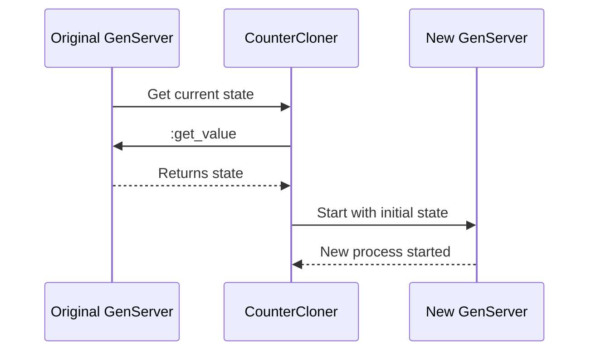

## 5.5. Prototype Pattern through Process Cloning

The Prototype Pattern is a creational design pattern that allows objects to be cloned, creating new instances with the same state as the original. In Elixir, this pattern can be effectively utilized through process cloning, enabling the replication of processes with existing states. This technique is particularly useful for creating scalable and fault-tolerant systems, as it allows for the efficient replication of workers and the simulation of distributed systems.

### Cloning Processes and State

In Elixir, processes are lightweight and independent units of computation that can be easily created and managed. Cloning processes involves starting new processes with a copy of an existing process's state. This approach leverages Elixir's strengths in concurrency and fault tolerance, allowing for the creation of robust and scalable systems.

#### Key Concepts

- **Process Cloning**: The act of creating new processes that inherit the state of an existing process.
- **State Duplication**: The mechanism by which the state of a process is copied to a new process.
- **GenServer**: A common abstraction for implementing server processes in Elixir, used to manage state and handle requests.

### Use Cases

The Prototype Pattern through process cloning is particularly useful in scenarios where you need to:

- **Replicate Workers**: Create multiple instances of a worker process with the same initial state, enabling load balancing and parallel processing.
- **Simulate Distributed Systems**: Clone processes to simulate distributed environments, facilitating testing and development of distributed applications.
- **Enhance Fault Tolerance**: Quickly recover from process failures by spawning new processes with the same state as the failed ones.

### Examples

Let's explore how to implement the Prototype Pattern through process cloning in Elixir using GenServers.

#### Creating Similar GenServers with Initial State Duplication

To demonstrate process cloning, we'll create a GenServer that manages a simple counter state. We'll then clone this process to create new GenServers with the same initial state.

```elixir
defmodule Counter do
  use GenServer

  # Client API

  def start_link(initial_value) do
    GenServer.start_link(__MODULE__, initial_value, name: __MODULE__)
  end

  def increment do
    GenServer.call(__MODULE__, :increment)
  end

  def get_value do
    GenServer.call(__MODULE__, :get_value)
  end

  # Server Callbacks

  def init(initial_value) do
    {:ok, initial_value}
  end

  def handle_call(:increment, _from, state) do
    new_state = state + 1
    {:reply, new_state, new_state}
  end

  def handle_call(:get_value, _from, state) do
    {:reply, state, state}
  end
end
```

In this example, we have a simple `Counter` GenServer that maintains a counter value. We can start this GenServer with an initial value and increment the counter using the `increment/0` function.

To clone this process and create a new GenServer with the same initial state, we can define a function that starts a new instance:

```elixir
defmodule CounterCloner do
  def clone(counter_pid) do
    # Fetch the current state of the original process
    initial_state = GenServer.call(counter_pid, :get_value)
    # Start a new GenServer with the same initial state
    Counter.start_link(initial_state)
  end
end
```

In the `CounterCloner` module, the `clone/1` function takes the PID of an existing `Counter` GenServer, retrieves its current state, and starts a new `Counter` GenServer with the same state.

### Visualizing Process Cloning

To better understand the concept of process cloning, let's visualize the process flow using a sequence diagram.


```mermaid
sequenceDiagram
    participant Original as Original GenServer
    participant Cloner as CounterCloner
    participant New as New GenServer

    Original->>Cloner: Get current state
    Cloner->>Original: :get_value
    Original-->>Cloner: Returns state
    Cloner->>New: Start with initial state
    New-->>Cloner: New process started
```

This diagram illustrates how the `CounterCloner` retrieves the state from the original GenServer and starts a new GenServer with the same state.

### Design Considerations

When implementing the Prototype Pattern through process cloning in Elixir, consider the following:

- **State Consistency**: Ensure that the state being cloned is consistent and does not contain transient or invalid data.
- **Concurrency**: Be mindful of concurrent access to the state when cloning processes, especially in a distributed environment.
- **Performance**: Cloning processes should be efficient to avoid performance bottlenecks, particularly when dealing with large states.

### Elixir Unique Features

Elixir's concurrency model, built on the Erlang VM, provides unique advantages for implementing the Prototype Pattern through process cloning:

- **Lightweight Processes**: Elixir processes are lightweight and can be created in large numbers without significant overhead.
- **Fault Tolerance**: The "let it crash" philosophy allows processes to fail and be restarted, making it easy to recover from errors.
- **Message Passing**: Processes communicate through message passing, ensuring that state is not shared directly, which simplifies cloning.

### Differences and Similarities

The Prototype Pattern in object-oriented languages typically involves cloning objects. In Elixir, the focus is on cloning processes, which involves duplicating state and behavior. This approach leverages Elixir's strengths in concurrency and fault tolerance, providing a robust solution for replicating processes.

### Try It Yourself

To experiment with process cloning, try modifying the `Counter` GenServer to include additional state, such as a timestamp or a unique identifier. Clone the process and observe how the state is duplicated in the new GenServer.

### Knowledge Check

- How does process cloning differ from object cloning in object-oriented languages?
- What are the benefits of using process cloning in Elixir?
- How can process cloning enhance fault tolerance in a system?

### Summary

In this section, we've explored the Prototype Pattern through process cloning in Elixir. By leveraging Elixir's concurrency model and process management capabilities, we can efficiently replicate processes with existing states, enhancing scalability and fault tolerance. This approach is particularly useful for replicating workers, simulating distributed systems, and recovering from process failures.

## Quiz Time!



### What is the primary purpose of the Prototype Pattern through process cloning in Elixir?

- [x] To replicate processes with existing states
- [ ] To create new processes with different states
- [ ] To manage process lifecycles
- [ ] To enhance process communication

> **Explanation:** The Prototype Pattern through process cloning is used to replicate processes with existing states, allowing for efficient duplication and scalability.

### How does Elixir's concurrency model benefit the implementation of the Prototype Pattern?

- [x] Lightweight processes and message passing
- [ ] Shared memory access
- [ ] Heavyweight processes and direct state sharing
- [ ] Synchronous communication

> **Explanation:** Elixir's concurrency model, with lightweight processes and message passing, facilitates efficient process cloning and state management.

### What is a key consideration when cloning processes in Elixir?

- [x] Ensuring state consistency
- [ ] Avoiding message passing
- [ ] Using shared memory
- [ ] Minimizing process creation

> **Explanation:** Ensuring state consistency is crucial when cloning processes to avoid duplicating invalid or transient data.

### Which Elixir module is commonly used for managing process state?

- [x] GenServer
- [ ] Supervisor
- [ ] Task
- [ ] Agent

> **Explanation:** GenServer is commonly used in Elixir for managing process state and implementing server-like behavior.

### What is the "let it crash" philosophy in Elixir?

- [x] Allowing processes to fail and be restarted
- [ ] Preventing all process failures
- [ ] Sharing state between processes
- [ ] Avoiding process communication

> **Explanation:** The "let it crash" philosophy allows processes to fail and be restarted, enhancing fault tolerance.

### How can process cloning enhance fault tolerance in a system?

- [x] By quickly recovering from process failures
- [ ] By preventing process failures
- [ ] By sharing state between processes
- [ ] By minimizing process creation

> **Explanation:** Process cloning allows for quick recovery from failures by starting new processes with the same state as failed ones.

### What is a common use case for process cloning in Elixir?

- [x] Replicating workers for load balancing
- [ ] Sharing state between processes
- [ ] Minimizing process creation
- [ ] Avoiding message passing

> **Explanation:** Replicating workers for load balancing is a common use case for process cloning in Elixir.

### How does process cloning differ from object cloning in object-oriented languages?

- [x] It focuses on duplicating process state and behavior
- [ ] It involves direct state sharing
- [ ] It uses shared memory
- [ ] It prevents process communication

> **Explanation:** Process cloning in Elixir focuses on duplicating process state and behavior, leveraging concurrency and fault tolerance.

### What is a potential performance consideration when cloning processes?

- [x] Efficiency of cloning large states
- [ ] Minimizing process communication
- [ ] Avoiding message passing
- [ ] Using shared memory

> **Explanation:** Ensuring efficient cloning of large states is important to avoid performance bottlenecks.

### True or False: Elixir processes are heavyweight and should be used sparingly.

- [ ] True
- [x] False

> **Explanation:** Elixir processes are lightweight, allowing for efficient creation and management in large numbers.



Remember, this is just the beginning. As you progress, you'll build more complex and interactive systems using Elixir's powerful concurrency model. Keep experimenting, stay curious, and enjoy the journey!
