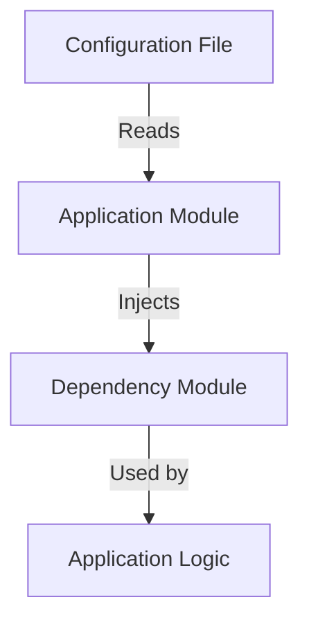

## 5.6. Dependency Injection via Module Attributes and Configurations

Dependency Injection (DI) is a powerful design pattern that enhances the flexibility and testability of software applications. In Elixir, a functional programming language known for its concurrency and fault-tolerance capabilities, DI can be implemented using module attributes and configurations. This section will guide you through the intricacies of DI in Elixir, providing you with the knowledge to build scalable and maintainable applications.

### Introduction to Dependency Injection

Dependency Injection is a design pattern that allows a class or module to receive its dependencies from an external source rather than creating them internally. This pattern promotes loose coupling and enhances the testability of the code by allowing dependencies to be swapped easily.

In Elixir, DI can be achieved through various techniques, including:

- **Passing Dependencies Explicitly**: Injecting modules and functions as parameters.
- **Using Application Configuration**: Reading dependencies from environment variables or configuration files.

### Passing Dependencies Explicitly

One of the simplest ways to implement DI in Elixir is by passing dependencies explicitly as parameters to functions or modules. This approach is straightforward and aligns well with Elixir's functional programming paradigm.

#### Example: Injecting a Logger Module

Consider a scenario where you have a module responsible for logging messages. Instead of hardcoding the logger module, you can pass it as a parameter:

```elixir
defmodule MyApp.Logger do
  def log(message) do
    IO.puts("Log: #{message}")
  end
end

defmodule MyApp.Service do
  def perform_action(logger \\ MyApp.Logger) do
    logger.log("Performing action")
  end
end

# Usage
MyApp.Service.perform_action()
```

In this example, `MyApp.Service` receives a logger module as a parameter. By default, it uses `MyApp.Logger`, but you can easily swap it with a different logger for testing or other purposes.

#### Benefits of Passing Dependencies Explicitly

- **Flexibility**: Easily swap dependencies for different environments or testing scenarios.
- **Testability**: Mock dependencies during testing to isolate the unit under test.
- **Simplicity**: Aligns with Elixir's functional nature, making the code easy to understand and maintain.

### Using Application Configuration

Another powerful technique for implementing DI in Elixir is using application configuration. This approach involves reading dependencies from environment variables or configuration files, allowing you to change dependencies without modifying the code.

#### Example: Configuring a Database Adapter

Suppose you have a module that interacts with a database. You can configure the database adapter using application configuration:

```elixir
# config/config.exs
config :my_app, :database_adapter, MyApp.PostgresAdapter

defmodule MyApp.Database do
  @adapter Application.get_env(:my_app, :database_adapter)

  def query(sql) do
    @adapter.query(sql)
  end
end

defmodule MyApp.PostgresAdapter do
  def query(sql) do
    IO.puts("Executing SQL on Postgres: #{sql}")
  end
end

# Usage
MyApp.Database.query("SELECT * FROM users")
```

In this example, the database adapter is configured in `config/config.exs`. The `MyApp.Database` module reads the adapter from the configuration, allowing you to swap it with a different adapter by changing the configuration.

#### Benefits of Using Application Configuration

- **Decoupling**: Separate configuration from code, making it easier to manage dependencies.
- **Environment-Specific Configurations**: Use different configurations for development, testing, and production environments.
- **Dynamic Configuration**: Change dependencies at runtime without recompiling the code.

### Visualizing Dependency Injection in Elixir

To better understand how DI works in Elixir, let's visualize the process using a flowchart. This diagram illustrates the flow of dependencies from configuration to the application.



**Diagram Description**: The flowchart shows how the application module reads dependencies from the configuration file and injects them into the dependency module, which is then used by the application logic.

### Key Participants in Dependency Injection

- **Configuration File**: Stores the configuration settings, including dependencies.
- **Application Module**: Reads the configuration and injects dependencies.
- **Dependency Module**: The module that provides the required functionality.
- **Application Logic**: The core logic of the application that uses the injected dependencies.

### Applicability of Dependency Injection

Dependency Injection is applicable in various scenarios, including:

- **Testing**: Easily mock dependencies to isolate the unit under test.
- **Modular Applications**: Build modular applications where components can be swapped or upgraded independently.
- **Environment-Specific Configurations**: Use different dependencies for different environments (e.g., development, testing, production).

### Design Considerations

When implementing DI in Elixir, consider the following:

- **Simplicity**: Keep the DI implementation simple and aligned with Elixir's functional nature.
- **Performance**: Ensure that the DI mechanism does not introduce significant overhead.
- **Security**: Validate and sanitize configuration inputs to prevent security vulnerabilities.

### Elixir Unique Features

Elixir offers unique features that enhance the implementation of DI:

- **Pattern Matching**: Use pattern matching to destructure and validate dependencies.
- **Immutable Data**: Leverage Elixir's immutable data structures to ensure that dependencies are not modified unexpectedly.
- **Concurrency**: Use Elixir's concurrency model to manage dependencies in a concurrent environment.

### Differences and Similarities with Other Languages

While DI is a common pattern in many programming languages, Elixir's functional nature and concurrency model offer unique advantages:

- **Functional Approach**: Elixir's functional approach simplifies DI by treating dependencies as data.
- **Concurrency**: Elixir's concurrency model allows for efficient management of dependencies in a concurrent environment.
- **Configuration Management**: Elixir's configuration management system provides a flexible way to manage dependencies.

### Try It Yourself

To deepen your understanding of DI in Elixir, try modifying the code examples provided:

- **Experiment with Different Loggers**: Create a new logger module and inject it into `MyApp.Service`.
- **Swap Database Adapters**: Configure a different database adapter in `config/config.exs` and observe the changes.
- **Test with Mocks**: Write tests for `MyApp.Service` using a mock logger.

### Knowledge Check

Before moving on, consider the following questions to reinforce your understanding:

- What are the benefits of using DI in Elixir?
- How does passing dependencies explicitly differ from using application configuration?
- What are some scenarios where DI is particularly useful?

### Summary

In this section, we've explored the concept of Dependency Injection in Elixir using module attributes and configurations. We've seen how DI enhances flexibility and testability, and we've provided examples of how to implement DI in Elixir applications. By leveraging Elixir's unique features, you can build scalable and maintainable applications that are easy to test and configure.

Remember, this is just the beginning. As you progress, you'll discover more advanced techniques for managing dependencies in Elixir. Keep experimenting, stay curious, and enjoy the journey!

## Quiz: Dependency Injection via Module Attributes and Configurations



### What is Dependency Injection?

- [x] A design pattern that allows a class or module to receive its dependencies from an external source.
- [ ] A method for creating dependencies internally within a module.
- [ ] A way to hardcode dependencies into a module.
- [ ] A technique for optimizing performance in Elixir.

> **Explanation:** Dependency Injection is a design pattern that allows a class or module to receive its dependencies from an external source, promoting loose coupling and enhancing testability.

### How can dependencies be passed explicitly in Elixir?

- [x] By injecting modules and functions as parameters.
- [ ] By hardcoding dependencies within the module.
- [ ] By using global variables.
- [ ] By using macros to define dependencies.

> **Explanation:** Dependencies can be passed explicitly in Elixir by injecting modules and functions as parameters, which aligns with Elixir's functional programming paradigm.

### What is a benefit of using application configuration for DI?

- [x] It allows for environment-specific configurations.
- [ ] It requires recompiling the code for changes.
- [ ] It makes the code less flexible.
- [ ] It increases the complexity of the code.

> **Explanation:** Using application configuration for DI allows for environment-specific configurations, enabling different dependencies for different environments without modifying the code.

### Which of the following is a key participant in DI?

- [x] Configuration File
- [ ] Global Variable
- [ ] Hardcoded Dependency
- [ ] Inline Function

> **Explanation:** A configuration file is a key participant in DI as it stores the configuration settings, including dependencies.

### What is a unique feature of Elixir that enhances DI?

- [x] Pattern Matching
- [ ] Mutable Data
- [ ] Global State
- [ ] Inline Assembly

> **Explanation:** Pattern matching is a unique feature of Elixir that enhances DI by allowing for the destructuring and validation of dependencies.

### What is the primary goal of DI?

- [x] To promote loose coupling and enhance testability.
- [ ] To increase the complexity of the code.
- [ ] To hardcode dependencies into the module.
- [ ] To reduce the flexibility of the code.

> **Explanation:** The primary goal of DI is to promote loose coupling and enhance testability by allowing dependencies to be injected from an external source.

### How does Elixir's concurrency model benefit DI?

- [x] It allows for efficient management of dependencies in a concurrent environment.
- [ ] It makes DI more complex and harder to implement.
- [ ] It requires dependencies to be hardcoded.
- [ ] It limits the flexibility of DI.

> **Explanation:** Elixir's concurrency model benefits DI by allowing for efficient management of dependencies in a concurrent environment, leveraging Elixir's strengths.

### What is a potential pitfall of DI?

- [x] Introducing significant overhead if not implemented carefully.
- [ ] Making the code less flexible.
- [ ] Hardcoding dependencies into the module.
- [ ] Reducing the testability of the code.

> **Explanation:** A potential pitfall of DI is introducing significant overhead if not implemented carefully, which can impact performance.

### What is a common use case for DI?

- [x] Testing with mock dependencies.
- [ ] Hardcoding dependencies for production.
- [ ] Using global variables for dependencies.
- [ ] Inline assembly for performance optimization.

> **Explanation:** A common use case for DI is testing with mock dependencies, which allows for isolating the unit under test.

### True or False: DI is only applicable in object-oriented programming.

- [ ] True
- [x] False

> **Explanation:** False. DI is applicable in various programming paradigms, including functional programming, as demonstrated in Elixir.




