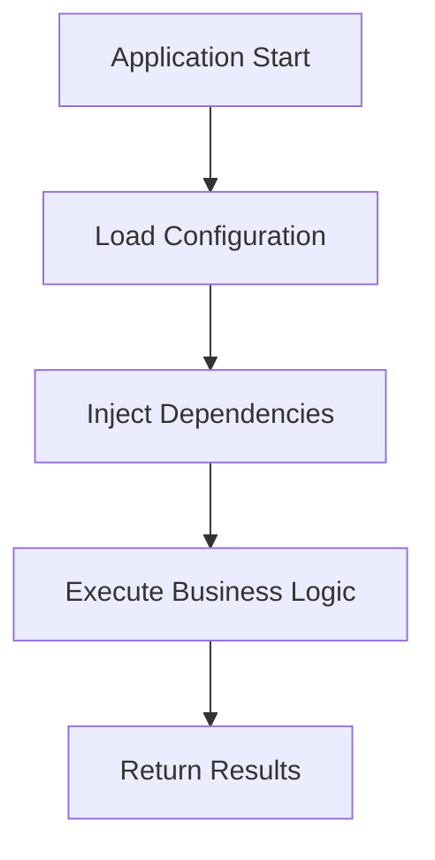

## 5.6. Dependency Injection via Module Attributes and Configurations

In the world of software design, dependency injection (DI) is a critical pattern that promotes loose coupling between components, enhancing both testability and flexibility. In Elixir, a functional programming language, we can achieve DI through module attributes and configurations. This section will guide you through the nuances of implementing dependency injection in Elixir, focusing on passing dependencies explicitly and using application configurations.

### Introduction to Dependency Injection

Dependency injection is a design pattern used to implement IoC (Inversion of Control), allowing a program to follow the Dependency Inversion Principle. It involves passing dependencies (objects or functions) to a class or module, rather than having the class or module create them internally. This separation of concerns improves modularity and makes testing easier by allowing dependencies to be swapped out for mocks or stubs.

### Passing Dependencies Explicitly

In Elixir, one common approach to DI is passing dependencies explicitly as parameters. This method involves injecting modules and functions directly into other modules or functions that require them. This approach is straightforward and leverages Elixir's functional nature.

#### Example: Injecting Modules and Functions

Consider an application that interacts with a database. Instead of hardcoding the database module, we can inject it as a dependency:

```elixir
defmodule MyApp.UserService do
  @moduledoc """
  User service for managing users.
  """

  def get_user(id, repo \\ MyApp.Repo) do
    repo.get(User, id)
  end
end
```

In this example, `MyApp.Repo` is injected as a default parameter. This allows us to swap it with a mock or alternative implementation during testing:

```elixir
defmodule MyApp.UserServiceTest do
  use ExUnit.Case

  defmodule MockRepo do
    def get(User, _id), do: %{id: 1, name: "Test User"}
  end

  test "get_user/2 returns a user" do
    user = MyApp.UserService.get_user(1, MockRepo)
    assert user.name == "Test User"
  end
end
```

This pattern enhances testability by allowing us to control the behavior of the `repo` dependency.

### Using Application Configuration

Another powerful method for DI in Elixir is using application configuration. This involves reading dependencies from environment variables or configuration files, which can be set differently for development, testing, and production environments.

#### Example: Configuring Dependencies

Let's extend our previous example to use application configuration:

```elixir
# config/config.exs
use Mix.Config

config :my_app, :repo, MyApp.Repo

# lib/my_app/user_service.ex
defmodule MyApp.UserService do
  @moduledoc """
  User service for managing users.
  """

  def get_user(id) do
    repo = Application.get_env(:my_app, :repo)
    repo.get(User, id)
  end
end
```

In this setup, the `repo` module is retrieved from the application configuration. This allows us to change the implementation without modifying the `UserService` code:

```elixir
# config/test.exs
use Mix.Config

config :my_app, :repo, MyApp.MockRepo
```

By configuring dependencies in this way, we gain flexibility in swapping implementations across different environments.

### Benefits of Dependency Injection

Implementing DI in Elixir offers several benefits:

- **Enhanced Testability**: By decoupling modules from their dependencies, we can easily substitute mocks or stubs for testing purposes, leading to more robust and isolated tests.
- **Flexibility**: DI allows for easy swapping of implementations, such as different database adapters or external services, without altering the core logic.
- **Separation of Concerns**: By externalizing dependencies, we can focus on the core functionality of modules, adhering to the Single Responsibility Principle.

### Practical Examples

Let's explore a few practical scenarios where DI can be beneficial:

#### Swapping Database Adapters

Suppose we have an application that needs to support multiple database backends. By using DI, we can easily swap adapters:

```elixir
defmodule MyApp.Database do
  @moduledoc """
  Database interface for interacting with different backends.
  """

  def get_user(id, adapter \\ Application.get_env(:my_app, :db_adapter)) do
    adapter.get_user(id)
  end
end
```

In this example, the `db_adapter` is configured via application settings, allowing us to switch between different database implementations.

#### Integrating External Services

DI is also useful when integrating with external services, such as payment gateways or email providers. By injecting service modules, we can easily switch providers or mock them during testing.

```elixir
defmodule MyApp.PaymentService do
  @moduledoc """
  Payment service for processing transactions.
  """

  def process_payment(amount, service \\ Application.get_env(:my_app, :payment_service)) do
    service.process(amount)
  end
end
```

### Design Considerations

When implementing DI in Elixir, consider the following:

- **Avoid Over-Engineering**: While DI is powerful, avoid over-complicating your design. Use DI where it adds clear value, such as in testing or when supporting multiple implementations.
- **Configuration Management**: Ensure that your configuration management strategy is robust. Use tools like `Config` for managing environment-specific settings.
- **Performance**: Be mindful of performance implications when frequently accessing configuration settings. Cache values if necessary to avoid repeated lookups.

### Elixir Unique Features

Elixir's functional nature and powerful metaprogramming capabilities offer unique opportunities for DI:

- **Pattern Matching**: Leverage pattern matching to destructure and inject dependencies seamlessly.
- **Macros**: Use macros to automate dependency injection, reducing boilerplate code.
- **Behaviours**: Define behaviours to enforce contracts for injected modules, ensuring consistency across implementations.

### Differences and Similarities

DI in Elixir shares similarities with DI in object-oriented languages but also has distinct differences:

- **Similarities**: Both approaches aim to decouple components and improve testability.
- **Differences**: Elixir leverages functional programming paradigms, such as higher-order functions and immutability, to achieve DI.

### Visualizing Dependency Injection in Elixir

To better understand how DI works in Elixir, let's visualize the process using a flowchart:


```mermaid
graph TD;
    A[Application Start] --> B[Load Configuration];
    B --> C[Inject Dependencies];
    C --> D[Execute Business Logic];
    D --> E[Return Results];
```

**Figure 1**: This flowchart illustrates the process of dependency injection in an Elixir application, from loading configuration to executing business logic with injected dependencies.

### Try It Yourself

To solidify your understanding, try modifying the examples provided:

- Swap the `MockRepo` with a different implementation in the test suite.
- Add a new configuration setting for a logging service and inject it into a module.
- Experiment with using macros to automate dependency injection.

### Knowledge Check

- What are the benefits of dependency injection in Elixir?
- How can you inject dependencies explicitly in a module?
- What role does application configuration play in DI?

### Conclusion

Dependency injection is a powerful pattern that enhances the flexibility and testability of Elixir applications. By passing dependencies explicitly or using application configurations, we can create modular and maintainable systems. Embrace DI in your Elixir projects to unlock these benefits and build robust applications.

Remember, this is just the beginning. As you progress, you'll discover more advanced techniques and patterns to further refine your Elixir applications. Keep experimenting, stay curious, and enjoy the journey!

## Quiz Time!



### What is the primary benefit of using dependency injection in Elixir?

- [x] Enhanced testability and flexibility
- [ ] Improved performance
- [ ] Reduced code complexity
- [ ] Increased code readability

> **Explanation:** Dependency injection enhances testability and flexibility by decoupling components from their dependencies, allowing for easy substitution during testing and runtime.

### How can dependencies be injected explicitly in Elixir?

- [x] By passing them as parameters to functions or modules
- [ ] By using global variables
- [ ] By hardcoding them into the module
- [ ] By using macros

> **Explanation:** Dependencies can be injected explicitly by passing them as parameters, allowing for easy substitution and testing.

### What is a common method for managing dependencies in different environments?

- [x] Using application configuration
- [ ] Using hardcoded values
- [ ] Using global variables
- [ ] Using macros

> **Explanation:** Application configuration allows for managing dependencies across different environments, such as development, testing, and production.

### What Elixir feature can be used to enforce contracts for injected modules?

- [x] Behaviours
- [ ] Protocols
- [ ] Macros
- [ ] Structs

> **Explanation:** Behaviours define a set of functions that a module must implement, ensuring consistency across different implementations.

### What is a potential pitfall of overusing dependency injection?

- [x] Over-engineering the design
- [ ] Improved testability
- [ ] Increased flexibility
- [ ] Enhanced performance

> **Explanation:** Overusing dependency injection can lead to over-engineering, making the design unnecessarily complex.

### Which Elixir feature can automate dependency injection to reduce boilerplate code?

- [x] Macros
- [ ] Structs
- [ ] Protocols
- [ ] Maps

> **Explanation:** Macros can be used to automate repetitive tasks, such as dependency injection, reducing boilerplate code.

### What is a common use case for dependency injection in Elixir?

- [x] Swapping database adapters or external services
- [ ] Improving code readability
- [ ] Reducing memory usage
- [ ] Enhancing performance

> **Explanation:** Dependency injection is commonly used to swap out implementations, such as database adapters or external services, without modifying core logic.

### How does Elixir's functional nature influence dependency injection?

- [x] It leverages higher-order functions and immutability
- [ ] It relies on global variables
- [ ] It uses object-oriented principles
- [ ] It requires macros for injection

> **Explanation:** Elixir's functional nature leverages higher-order functions and immutability to achieve dependency injection.

### What is a key advantage of using application configuration for dependency injection?

- [x] Flexibility in swapping implementations
- [ ] Improved performance
- [ ] Reduced code complexity
- [ ] Increased code readability

> **Explanation:** Application configuration provides flexibility in swapping implementations across different environments.

### True or False: Dependency injection in Elixir is identical to dependency injection in object-oriented languages.

- [x] False
- [ ] True

> **Explanation:** While dependency injection shares similarities across paradigms, Elixir's functional nature introduces unique approaches, such as using higher-order functions and immutability.




