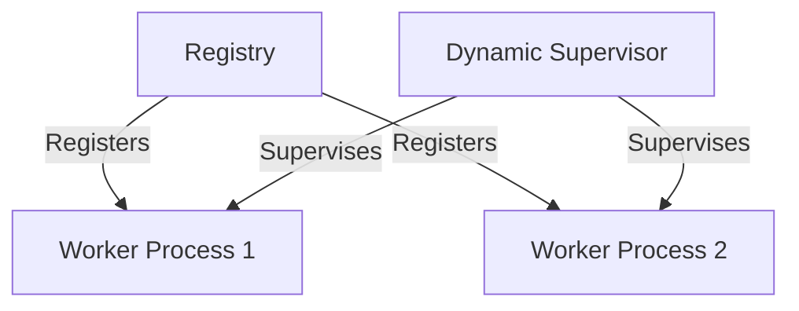

## 5.7. Registry Pattern with Elixir Processes

In the world of concurrent programming, managing processes efficiently is crucial for building scalable and fault-tolerant systems. Elixir, with its robust concurrency model and process management capabilities, provides powerful tools to implement design patterns that enhance process management. One such pattern is the **Registry Pattern**, which offers centralized access to processes and enables dynamic supervision. In this section, we will delve into the Registry Pattern with Elixir processes, exploring its concepts, implementation, and use cases.

### Design Pattern Name: Registry Pattern with Elixir Processes

#### Category

- Creational Design Patterns

#### Intent

- **Centralized Access to Processes**: Maintain a registry of active processes to facilitate efficient process management and communication.
- **Dynamic Supervision**: Enable spawning and monitoring of processes on demand, ensuring system resilience and scalability.

### Key Participants

- **Registry**: A centralized store that keeps track of active processes and their identifiers.
- **Processes**: Independent units of computation that can be registered, monitored, and communicated with.
- **Supervisor**: A process responsible for starting, stopping, and monitoring other processes, ensuring fault tolerance.

### Applicability

The Registry Pattern is applicable in scenarios where:

- You need a centralized mechanism to manage and access multiple processes.
- Dynamic process supervision is required to handle varying workloads.
- Implementing actor models or task scheduling systems is necessary.

### Elixir Unique Features

Elixir's concurrency model, built on the BEAM virtual machine, provides unique features that make the Registry Pattern particularly effective:

- **Lightweight Processes**: Elixir processes are lightweight and can be spawned in large numbers without significant overhead.
- **Fault Tolerance**: Supervisors and the "let it crash" philosophy ensure that processes can be restarted automatically in case of failures.
- **Message Passing**: Processes communicate via message passing, enabling decoupled and scalable systems.

### Differences and Similarities

The Registry Pattern is often compared with other patterns like the Singleton Pattern. However, unlike the Singleton Pattern, which restricts the instantiation of a class to a single object, the Registry Pattern allows for multiple processes to be registered and accessed dynamically.

### Implementing the Registry Pattern in Elixir

Let's explore how to implement the Registry Pattern in Elixir using a combination of processes, supervisors, and the `Registry` module.

#### Step 1: Setting Up the Registry

Elixir provides a built-in `Registry` module that can be used to create a process registry. The registry allows processes to be registered with unique keys, enabling easy lookup and communication.

```elixir
defmodule MyApp.Registry do
  use GenServer

  def start_link(opts) do
    GenServer.start_link(__MODULE__, :ok, opts)
  end

  def init(:ok) do
    {:ok, %{}}
  end

  def register(pid, key) do
    GenServer.call(pid, {:register, key})
  end

  def handle_call({:register, key}, _from, state) do
    {:reply, :ok, Map.put(state, key, self())}
  end
end
```

In this example, we define a simple GenServer that acts as a registry. Processes can register themselves with a unique key, and the registry maintains a map of keys to process identifiers (PIDs).

#### Step 2: Dynamic Supervision

To enable dynamic supervision, we can use Elixir's `DynamicSupervisor` module. This allows us to start and stop processes on demand, ensuring that the system can adapt to changing workloads.

```elixir
defmodule MyApp.DynamicSupervisor do
  use DynamicSupervisor

  def start_link(opts) do
    DynamicSupervisor.start_link(__MODULE__, :ok, opts)
  end

  def init(:ok) do
    DynamicSupervisor.init(strategy: :one_for_one)
  end

  def start_child(supervisor, module, args) do
    DynamicSupervisor.start_child(supervisor, {module, args})
  end
end
```

Here, we define a `DynamicSupervisor` that can start child processes dynamically. The `:one_for_one` strategy ensures that if a child process crashes, only that process is restarted.

#### Step 3: Registering and Supervising Processes

With the registry and dynamic supervisor in place, we can now register and supervise processes. Let's create a simple worker process that can be registered and supervised.

```elixir
defmodule MyApp.Worker do
  use GenServer

  def start_link(key) do
    GenServer.start_link(__MODULE__, key, name: via_tuple(key))
  end

  def init(key) do
    {:ok, key}
  end

  defp via_tuple(key) do
    {:via, Registry, {MyApp.Registry, key}}
  end
end

# Starting the registry and dynamic supervisor
{:ok, registry} = MyApp.Registry.start_link(name: MyApp.Registry)
{:ok, supervisor} = MyApp.DynamicSupervisor.start_link(name: MyApp.DynamicSupervisor)

# Starting and registering a worker process
{:ok, _pid} = MyApp.DynamicSupervisor.start_child(supervisor, MyApp.Worker, ["worker1"])
MyApp.Registry.register(registry, "worker1")
```

In this example, we define a `Worker` module that can be started and registered with a unique key. The `via_tuple/1` function is used to create a tuple that allows the process to be registered with the registry.

### Visualizing the Registry Pattern

To better understand the Registry Pattern, let's visualize the architecture using a Mermaid.js diagram.



**Diagram Description**: The diagram illustrates the relationship between the registry, worker processes, and the dynamic supervisor. The registry maintains a list of registered worker processes, while the dynamic supervisor manages the lifecycle of these processes.

### Use Cases

The Registry Pattern is versatile and can be applied in various scenarios:

- **Actor Models**: Implementing actor models where each actor is a process that can be registered and communicated with.
- **Task Scheduling Systems**: Managing and scheduling tasks dynamically, with each task represented as a process.
- **Service Discovery**: Facilitating service discovery in distributed systems by maintaining a registry of available services.

### Design Considerations

When implementing the Registry Pattern, consider the following:

- **Scalability**: Ensure that the registry can handle a large number of processes efficiently.
- **Fault Tolerance**: Use supervisors to manage process failures and ensure system resilience.
- **Performance**: Optimize the registry for fast lookups and updates.

### Try It Yourself

To deepen your understanding of the Registry Pattern, try modifying the code examples:

- **Experiment with Different Strategies**: Change the supervision strategy in the `DynamicSupervisor` to see how it affects process management.
- **Add More Processes**: Register additional worker processes and observe how the registry and supervisor handle them.
- **Implement Custom Logic**: Add custom logic to the worker processes and see how they interact with the registry.

### Knowledge Check

- **What is the primary purpose of the Registry Pattern in Elixir?**
- **How does the `DynamicSupervisor` contribute to the Registry Pattern?**
- **What are some use cases for the Registry Pattern?**

### Summary

The Registry Pattern with Elixir processes provides a powerful mechanism for managing and supervising processes in a concurrent system. By maintaining a centralized registry and enabling dynamic supervision, this pattern enhances process management, scalability, and fault tolerance. As you continue to explore Elixir's capabilities, remember that the Registry Pattern is just one of many tools available to build robust and efficient systems.

## Quiz: Registry Pattern with Elixir Processes



### What is the primary purpose of the Registry Pattern in Elixir?

- [x] To maintain a centralized registry of active processes
- [ ] To restrict the instantiation of a class to a single object
- [ ] To manage database connections
- [ ] To handle HTTP requests

> **Explanation:** The Registry Pattern is used to maintain a centralized registry of active processes, facilitating efficient process management and communication.

### How does the `DynamicSupervisor` contribute to the Registry Pattern?

- [x] By enabling dynamic process supervision
- [ ] By restricting process creation
- [ ] By managing database transactions
- [ ] By handling HTTP requests

> **Explanation:** The `DynamicSupervisor` allows for dynamic process supervision, enabling processes to be started and stopped on demand.

### What are some use cases for the Registry Pattern?

- [x] Implementing actor models
- [x] Task scheduling systems
- [ ] Managing database connections
- [ ] Handling HTTP requests

> **Explanation:** The Registry Pattern is useful for implementing actor models and task scheduling systems, among other use cases.

### What is a key feature of Elixir processes?

- [x] They are lightweight and can be spawned in large numbers
- [ ] They are heavyweight and resource-intensive
- [ ] They require manual memory management
- [ ] They cannot communicate with each other

> **Explanation:** Elixir processes are lightweight and can be spawned in large numbers without significant overhead.

### What is the "let it crash" philosophy?

- [x] A philosophy that encourages letting processes crash and be restarted by supervisors
- [ ] A philosophy that discourages process crashes
- [ ] A philosophy that requires manual process restarts
- [ ] A philosophy that prevents process communication

> **Explanation:** The "let it crash" philosophy encourages letting processes crash and be restarted by supervisors, ensuring fault tolerance.

### What is the role of a supervisor in the Registry Pattern?

- [x] To start, stop, and monitor processes
- [ ] To manage database connections
- [ ] To handle HTTP requests
- [ ] To restrict process creation

> **Explanation:** A supervisor is responsible for starting, stopping, and monitoring processes, ensuring fault tolerance.

### How can processes communicate in Elixir?

- [x] Via message passing
- [ ] Via shared memory
- [ ] Via direct function calls
- [ ] Via global variables

> **Explanation:** Processes in Elixir communicate via message passing, enabling decoupled and scalable systems.

### What is the `Registry` module used for in Elixir?

- [x] To create a process registry
- [ ] To manage database connections
- [ ] To handle HTTP requests
- [ ] To restrict process creation

> **Explanation:** The `Registry` module is used to create a process registry, allowing processes to be registered with unique keys.

### What is a benefit of using the Registry Pattern?

- [x] Centralized access to processes
- [ ] Increased memory usage
- [ ] Manual process management
- [ ] Restricted process communication

> **Explanation:** The Registry Pattern provides centralized access to processes, facilitating efficient process management.

### True or False: The Registry Pattern is only applicable in Elixir.

- [ ] True
- [x] False

> **Explanation:** The Registry Pattern is not exclusive to Elixir and can be applied in other concurrent programming environments.



Remember, this is just the beginning. As you progress, you'll build more complex and interactive systems using Elixir's powerful concurrency model. Keep experimenting, stay curious, and enjoy the journey!
