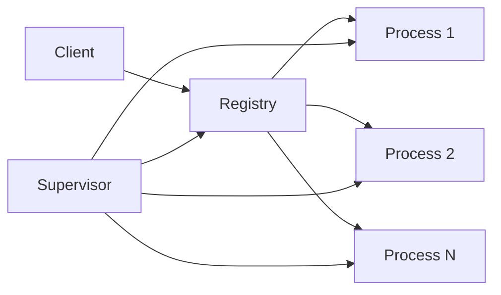

## 5.7. Registry Pattern with Elixir Processes

In the world of Elixir, where concurrency and fault tolerance are paramount, managing processes effectively is crucial. The Registry Pattern is a powerful design pattern that provides a centralized mechanism to keep track of active processes, enabling dynamic supervision and efficient communication. This pattern is particularly useful in implementing actor models and task scheduling systems, where processes need to be spawned, monitored, and accessed dynamically.

### Design Pattern Name

**Registry Pattern with Elixir Processes**

### Category

**Creational Design Patterns**

### Intent

The primary intent of the Registry Pattern is to maintain a centralized registry of processes, allowing for easy access and management. This pattern simplifies process supervision, ensuring that processes can be dynamically spawned and monitored as needed.

### Key Participants

- **Registry**: The central component that maintains a list of active processes.
- **Processes**: The individual units of work that are registered and managed.
- **Supervisor**: Responsible for spawning and monitoring processes, often using dynamic supervision strategies.
- **Clients**: Entities that interact with the registry to access or manage processes.

### Applicability

The Registry Pattern is applicable in scenarios where:

- There is a need to track and manage numerous processes dynamically.
- Processes need to be accessed by unique identifiers.
- Fault tolerance and process recovery are critical.
- Systems require dynamic process spawning and supervision.

### Elixir Unique Features

Elixir's concurrency model, built on the BEAM VM, provides unique features that make the Registry Pattern particularly powerful:

- **Lightweight Processes**: Elixir processes are lightweight and can be spawned in large numbers without significant overhead.
- **Supervision Trees**: Elixir's OTP framework provides robust supervision mechanisms to monitor and restart processes.
- **Dynamic Supervision**: Elixir allows for dynamic supervision, enabling processes to be added or removed from supervision trees at runtime.
- **Registry Module**: Elixir's built-in Registry module provides a convenient way to implement the Registry Pattern, offering features like unique and duplicate keys, partitioning, and more.

### Differences and Similarities

The Registry Pattern is often compared to other patterns like the Singleton Pattern or the Factory Pattern. However, it is distinct in its focus on managing process instances rather than objects or classes. Unlike the Singleton Pattern, which ensures a single instance of an object, the Registry Pattern allows for multiple instances of processes, each identified by a unique key.

### Sample Code Snippet

Let's dive into a code example to illustrate the Registry Pattern in Elixir.

```elixir
defmodule MyApp.Registry do
  use GenServer

  # Client API

  def start_link(opts) do
    GenServer.start_link(__MODULE__, %{}, opts)
  end

  def register(pid, key) do
    GenServer.call(pid, {:register, key})
  end

  def lookup(pid, key) do
    GenServer.call(pid, {:lookup, key})
  end

  # Server Callbacks

  def init(state) do
    {:ok, state}
  end

  def handle_call({:register, key}, _from, state) do
    {:reply, :ok, Map.put(state, key, self())}
  end

  def handle_call({:lookup, key}, _from, state) do
    {:reply, Map.get(state, key), state}
  end
end
```

In this example, we define a simple registry using a `GenServer`. The registry maintains a map of keys to process identifiers (PIDs), allowing processes to be registered and looked up by key.

### Design Considerations

When implementing the Registry Pattern, consider the following:

- **Concurrency**: Ensure that the registry can handle concurrent access efficiently. Elixir's `GenServer` provides a simple way to serialize access to shared state.
- **Fault Tolerance**: Utilize supervision trees to monitor the registry and ensure it can recover from failures.
- **Scalability**: Consider partitioning the registry if the number of processes becomes large. Elixir's `Registry` module supports partitioning out of the box.

### Dynamic Supervision

Dynamic supervision is a key aspect of the Registry Pattern, allowing processes to be spawned and monitored on demand. Elixir's `DynamicSupervisor` provides a flexible way to achieve this.

```elixir
defmodule MyApp.DynamicSupervisor do
  use DynamicSupervisor

  def start_link(opts) do
    DynamicSupervisor.start_link(__MODULE__, opts, name: __MODULE__)
  end

  def init(_opts) do
    DynamicSupervisor.init(strategy: :one_for_one)
  end

  def start_child(module, args) do
    DynamicSupervisor.start_child(__MODULE__, {module, args})
  end
end
```

In this example, we define a `DynamicSupervisor` that can start child processes on demand. This allows us to dynamically manage processes, adding them to the supervision tree as needed.

### Visualizing the Registry Pattern

To better understand the Registry Pattern, let's visualize the architecture using Mermaid.js.


```mermaid
graph LR
    A[Client] --> B[Registry]
    B --> C[Process 1]
    B --> D[Process 2]
    B --> E[Process N]
    F[Supervisor] --> B
    F --> C
    F --> D
    F --> E
```

In this diagram, the client interacts with the registry to access processes. The supervisor manages the registry and the processes, ensuring they are monitored and restarted if necessary.

### Use Cases

The Registry Pattern is particularly useful in the following scenarios:

- **Actor Models**: In actor-based systems, each actor is a process that can be registered and accessed via a unique key.
- **Task Scheduling Systems**: Processes representing tasks can be registered and managed dynamically, allowing for flexible scheduling and execution.

### Try It Yourself

To experiment with the Registry Pattern, try modifying the code examples to:

- Add support for removing processes from the registry.
- Implement a mechanism to notify clients when a process is terminated.
- Scale the registry to handle a large number of processes using partitioning.

### Knowledge Check

- What are the main components of the Registry Pattern?
- How does Elixir's `DynamicSupervisor` facilitate dynamic supervision?
- What are some use cases where the Registry Pattern is particularly useful?

### Embrace the Journey

As you explore the Registry Pattern, remember that this is just one of many powerful design patterns available in Elixir. By mastering these patterns, you'll be well-equipped to build scalable, fault-tolerant systems. Keep experimenting, stay curious, and enjoy the journey!

## Quiz Time!



### What is the primary intent of the Registry Pattern?

- [x] To maintain a centralized registry of processes for easy access and management.
- [ ] To ensure a single instance of an object.
- [ ] To create objects without specifying the exact class.
- [ ] To manage dependencies between objects.

> **Explanation:** The Registry Pattern focuses on maintaining a centralized registry of processes, allowing for easy access and management.

### Which Elixir module provides a convenient way to implement the Registry Pattern?

- [x] Registry
- [ ] GenServer
- [ ] Supervisor
- [ ] DynamicSupervisor

> **Explanation:** Elixir's built-in Registry module provides features like unique and duplicate keys, partitioning, and more, making it ideal for implementing the Registry Pattern.

### What is a key feature of Elixir processes?

- [x] They are lightweight and can be spawned in large numbers without significant overhead.
- [ ] They are heavyweight and require significant resources.
- [ ] They are only used for error handling.
- [ ] They are used exclusively for I/O operations.

> **Explanation:** Elixir processes are lightweight, allowing for a large number of processes to be spawned without significant overhead.

### What does the DynamicSupervisor module allow you to do?

- [x] Start child processes on demand.
- [ ] Create a single instance of an object.
- [ ] Manage dependencies between objects.
- [ ] Handle I/O operations exclusively.

> **Explanation:** DynamicSupervisor allows for dynamic supervision, enabling processes to be added or removed from supervision trees at runtime.

### Which of the following is NOT a use case for the Registry Pattern?

- [ ] Actor Models
- [ ] Task Scheduling Systems
- [x] Singleton Pattern
- [ ] Dynamic Process Management

> **Explanation:** The Singleton Pattern is not a use case for the Registry Pattern, which focuses on managing multiple process instances.

### How does the Registry Pattern enhance fault tolerance?

- [x] By using supervision trees to monitor and restart processes.
- [ ] By creating a single instance of an object.
- [ ] By managing dependencies between objects.
- [ ] By handling I/O operations exclusively.

> **Explanation:** The Registry Pattern enhances fault tolerance by utilizing supervision trees to monitor and restart processes as needed.

### What is a consideration when implementing the Registry Pattern?

- [x] Ensuring the registry can handle concurrent access efficiently.
- [ ] Ensuring the registry is only accessed by a single process.
- [ ] Ensuring the registry is used exclusively for I/O operations.
- [ ] Ensuring the registry is only used for error handling.

> **Explanation:** It's important to ensure the registry can handle concurrent access efficiently, as it may be accessed by multiple clients simultaneously.

### What is the purpose of partitioning in the Registry Pattern?

- [x] To scale the registry to handle a large number of processes.
- [ ] To ensure a single instance of an object.
- [ ] To create objects without specifying the exact class.
- [ ] To manage dependencies between objects.

> **Explanation:** Partitioning helps scale the registry to handle a large number of processes by distributing them across multiple partitions.

### What is a benefit of using the Registry Pattern in actor models?

- [x] Processes can be registered and accessed via a unique key.
- [ ] Processes are limited to a single instance.
- [ ] Processes are only used for error handling.
- [ ] Processes are used exclusively for I/O operations.

> **Explanation:** In actor models, each actor is a process that can be registered and accessed via a unique key, making the Registry Pattern beneficial.

### True or False: The Registry Pattern is often compared to the Factory Pattern.

- [x] True
- [ ] False

> **Explanation:** The Registry Pattern is often compared to the Factory Pattern, but it is distinct in its focus on managing process instances rather than objects or classes.



By mastering the Registry Pattern and its application in Elixir, you are well on your way to building robust, scalable, and fault-tolerant systems. Keep pushing the boundaries of what's possible with Elixir, and enjoy the journey of continuous learning and exploration!
