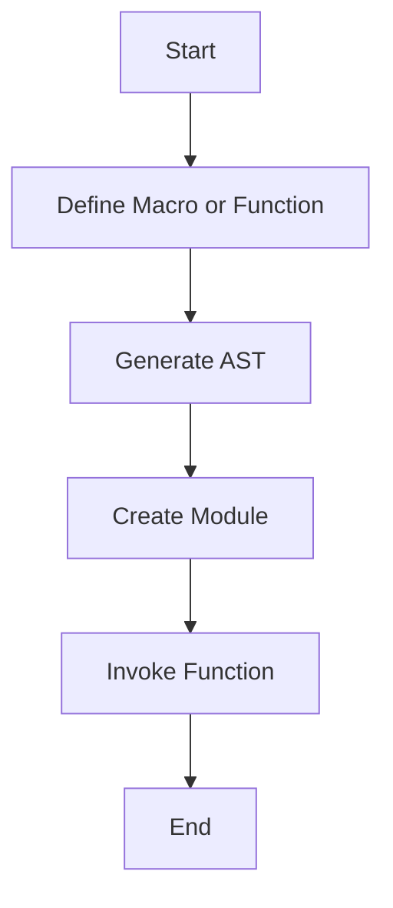

## 5.8. Dynamic Module Creation at Runtime

In the world of Elixir, dynamic module creation at runtime is a powerful technique that allows developers to generate modules and functions on the fly. This capability is particularly useful in scenarios where flexibility and adaptability are paramount, such as building domain-specific languages (DSLs), code generation tools, and applications that require runtime customization. In this section, we will delve into the intricacies of dynamic module creation, exploring metaprogramming techniques, runtime code generation, and practical examples to illustrate these concepts.

### Metaprogramming Techniques

Metaprogramming in Elixir is the art of writing code that writes code. This is achieved primarily through the use of macros, which are a powerful feature of the language. Macros allow developers to transform Elixir's abstract syntax tree (AST) at compile time, enabling the generation of new modules and functions.

#### Using Macros to Generate Modules and Functions

Macros in Elixir are defined using the `defmacro` keyword. They operate on the AST, allowing developers to manipulate code before it is compiled. This capability is essential for creating dynamic modules and functions. Let's explore how macros can be used to achieve this.

```elixir
defmodule DynamicModule do
  defmacro create_function(name, body) do
    quote do
      def unquote(name)(), do: unquote(body)
    end
  end
end

defmodule Example do
  require DynamicModule

  DynamicModule.create_function(:hello, "Hello, World!")
end

IO.puts Example.hello()  # Outputs: Hello, World!
```

In this example, we define a macro `create_function` within the `DynamicModule` module. This macro takes a function name and body as arguments and generates a new function with the specified name and body. The `quote` block is used to construct the AST for the new function, and `unquote` is used to inject the macro arguments into the AST.

### Runtime Code Generation

While macros operate at compile time, Elixir also provides mechanisms for generating code at runtime. This is particularly useful when the structure of the code depends on data that is only available during execution.

#### Creating Modules Based on Runtime Data

To create modules dynamically at runtime, we can use the `Module.create/3` function. This function allows us to define a module with a given name, body, and options. Let's see how this can be done.

```elixir
defmodule RuntimeModuleCreator do
  def create_module(module_name, function_name, function_body) do
    Module.create(module_name, quote do
      def unquote(function_name)(), do: unquote(function_body)
    end, Macro.Env.location(__ENV__))
  end
end

module_name = :"DynamicModule#{:rand.uniform(1000)}"
RuntimeModuleCreator.create_module(module_name, :greet, "Hello from runtime!")

IO.puts apply(module_name, :greet, [])  # Outputs: Hello from runtime!
```

In this example, we define a function `create_module` within the `RuntimeModuleCreator` module. This function uses `Module.create/3` to generate a new module with a specified name, function, and body. The `apply/3` function is then used to call the dynamically created function.

### Examples

Dynamic module creation is a versatile tool that can be applied in various contexts. Let's explore some practical examples where this technique can be leveraged.

#### Building Domain-Specific Languages (DSLs)

Domain-specific languages (DSLs) are specialized languages tailored to a specific application domain. Elixir's metaprogramming capabilities make it an excellent choice for building DSLs. By dynamically generating modules and functions, we can create expressive and concise DSLs that simplify complex tasks.

```elixir
defmodule DSLBuilder do
  defmacro define_dsl(name, do: block) do
    quote do
      defmodule unquote(name) do
        unquote(block)
      end
    end
  end
end

defmodule MyDSL do
  require DSLBuilder

  DSLBuilder.define_dsl MyCommands do
    def greet(name), do: "Hello, #{name}!"
  end
end

IO.puts MyDSL.MyCommands.greet("Alice")  # Outputs: Hello, Alice!
```

In this example, we define a macro `define_dsl` within the `DSLBuilder` module. This macro generates a new module with the specified name and block of code. The resulting DSL allows us to define custom commands in a concise and readable manner.

#### Code Generation Tools

Code generation tools automate the creation of repetitive code, reducing development time and minimizing errors. Elixir's dynamic module creation capabilities make it an ideal platform for building such tools.

```elixir
defmodule CodeGenerator do
  def generate_crud(module_name, entity) do
    Module.create(module_name, quote do
      def create(attrs), do: {:ok, "Created #{unquote(entity)} with #{inspect(attrs)}"}
      def read(id), do: {:ok, "Read #{unquote(entity)} with ID #{id}"}
      def update(id, attrs), do: {:ok, "Updated #{unquote(entity)} with ID #{id} and #{inspect(attrs)}"}
      def delete(id), do: {:ok, "Deleted #{unquote(entity)} with ID #{id}"}
    end, Macro.Env.location(__ENV__))
  end
end

CodeGenerator.generate_crud(MyApp.User, "User")

IO.inspect MyApp.User.create(name: "Alice")  # Outputs: {:ok, "Created User with %{name: \"Alice\"}"}
IO.inspect MyApp.User.read(1)  # Outputs: {:ok, "Read User with ID 1"}
```

In this example, we define a function `generate_crud` within the `CodeGenerator` module. This function generates a module with CRUD (Create, Read, Update, Delete) operations for a specified entity. The resulting module provides a standardized interface for interacting with the entity, reducing boilerplate code.

### Visualizing Dynamic Module Creation

To better understand the process of dynamic module creation, let's visualize it using a flowchart. This flowchart illustrates the steps involved in generating a module at runtime.



**Figure 1:** Flowchart illustrating the process of dynamic module creation at runtime.

### Key Participants

- **Macros:** Used to generate code at compile time by manipulating the AST.
- **Module.create/3:** A function that allows for the creation of modules at runtime.
- **Quote and Unquote:** Constructs used to build and inject code into the AST.

### Applicability

Dynamic module creation is applicable in scenarios where flexibility and adaptability are required. It is particularly useful for:

- Building DSLs that simplify complex tasks.
- Automating repetitive code generation.
- Creating customizable applications that adapt to runtime data.

### Design Considerations

When using dynamic module creation, consider the following:

- **Performance:** Generating modules at runtime can introduce overhead. Use this technique judiciously to avoid performance bottlenecks.
- **Complexity:** Dynamic code generation can make code harder to understand and maintain. Ensure that the generated code is well-documented and tested.
- **Security:** Be cautious when generating code based on user input to prevent security vulnerabilities.

### Elixir Unique Features

Elixir's metaprogramming capabilities, such as macros and the `quote`/`unquote` constructs, are unique features that facilitate dynamic module creation. Additionally, the `Module.create/3` function provides a straightforward way to generate modules at runtime.

### Differences and Similarities

Dynamic module creation is often compared to other metaprogramming techniques, such as reflection and code injection. However, it is distinct in its ability to generate entire modules and functions, rather than simply modifying existing code.

### Try It Yourself

To gain a deeper understanding of dynamic module creation, try modifying the examples provided in this section. Experiment with different function names, bodies, and module structures to see how they affect the generated code. This hands-on approach will help solidify your understanding of the concepts discussed.

### Knowledge Check

Before moving on, consider the following questions to reinforce your understanding:

- What are the key differences between compile-time and runtime code generation?
- How can dynamic module creation be used to build DSLs?
- What are some potential pitfalls of using dynamic module creation?

### Embrace the Journey

Remember, dynamic module creation is a powerful tool in your Elixir toolkit. As you continue to explore and experiment with these techniques, you'll discover new ways to build flexible and adaptable applications. Keep pushing the boundaries of what's possible, and enjoy the journey!

## Quiz: Dynamic Module Creation at Runtime



### What is the primary purpose of using macros in Elixir?

- [x] To generate code at compile time
- [ ] To execute code at runtime
- [ ] To manage memory allocation
- [ ] To handle exceptions

> **Explanation:** Macros in Elixir are used to generate code at compile time by manipulating the abstract syntax tree (AST).

### Which function is used to create modules at runtime in Elixir?

- [x] Module.create/3
- [ ] Module.define/2
- [ ] Module.build/3
- [ ] Module.generate/2

> **Explanation:** The `Module.create/3` function is used to create modules at runtime in Elixir.

### What is a common use case for dynamic module creation?

- [x] Building domain-specific languages (DSLs)
- [ ] Managing database connections
- [ ] Handling HTTP requests
- [ ] Performing mathematical calculations

> **Explanation:** Dynamic module creation is commonly used for building domain-specific languages (DSLs) to simplify complex tasks.

### What is the role of the `quote` construct in Elixir?

- [x] To build the abstract syntax tree (AST)
- [ ] To execute code immediately
- [ ] To handle errors
- [ ] To manage concurrency

> **Explanation:** The `quote` construct in Elixir is used to build the abstract syntax tree (AST) for code generation.

### What should be considered when using dynamic module creation?

- [x] Performance and complexity
- [ ] Only performance
- [ ] Only complexity
- [ ] Neither performance nor complexity

> **Explanation:** When using dynamic module creation, both performance and complexity should be considered to avoid potential issues.

### How can dynamic module creation affect code maintainability?

- [x] It can make code harder to understand and maintain
- [ ] It always improves code readability
- [ ] It has no impact on maintainability
- [ ] It simplifies code organization

> **Explanation:** Dynamic module creation can make code harder to understand and maintain due to the complexity of generated code.

### What is a potential security concern with dynamic module creation?

- [x] Generating code based on user input
- [ ] Using too many macros
- [ ] Handling large datasets
- [ ] Managing multiple processes

> **Explanation:** Generating code based on user input can introduce security vulnerabilities, so caution is needed.

### What is the `unquote` construct used for in Elixir?

- [x] To inject values into the abstract syntax tree (AST)
- [ ] To remove values from the AST
- [ ] To execute code immediately
- [ ] To handle exceptions

> **Explanation:** The `unquote` construct is used to inject values into the abstract syntax tree (AST) during code generation.

### What is a benefit of using dynamic module creation?

- [x] Flexibility and adaptability
- [ ] Increased memory usage
- [ ] Reduced code readability
- [ ] Slower execution speed

> **Explanation:** Dynamic module creation provides flexibility and adaptability, allowing applications to adjust to runtime data.

### True or False: Dynamic module creation is only useful for web applications.

- [ ] True
- [x] False

> **Explanation:** Dynamic module creation is not limited to web applications; it can be used in various contexts where flexibility and adaptability are needed.


