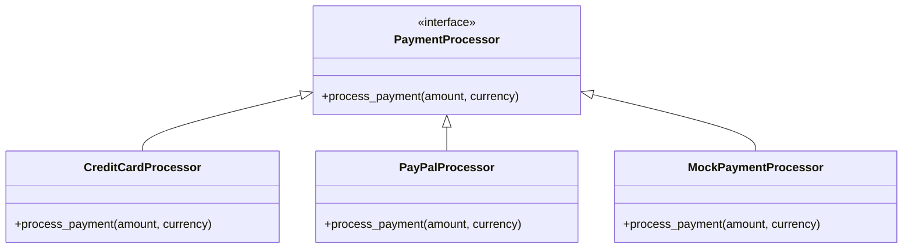

## 5.9. Using Behaviours for Polymorphism

In the realm of Elixir, behaviours play a crucial role in defining contracts and enabling polymorphism. This section will delve into the concept of behaviours, how they facilitate polymorphic implementations, and their use cases in building robust and flexible systems.

### Defining Contracts with Behaviours

Behaviours in Elixir are akin to interfaces in object-oriented languages. They allow you to define a set of function signatures that any implementing module must adhere to. This ensures consistency and reliability across different modules that share the same behaviour.

#### Specifying Required Functions for Modules

When you define a behaviour, you specify a set of functions that a module must implement. This is done using the `@callback` attribute. Here's an example of defining a simple behaviour:

```elixir
defmodule PaymentProcessor do
  @callback process_payment(amount :: float, currency :: String.t()) :: {:ok, String.t()} | {:error, String.t()}
end
```

In this example, the `PaymentProcessor` behaviour specifies that any module implementing it must provide a `process_payment/2` function that returns either an `:ok` or `:error` tuple.

### Polymorphic Implementation

Polymorphism in Elixir is achieved by allowing different modules to implement the same behaviour. This means you can have multiple modules providing different implementations of the same set of functions, which can be used interchangeably.

#### Allowing Different Modules to Implement the Same Interface

Let's create two modules that implement the `PaymentProcessor` behaviour:

```elixir
defmodule CreditCardProcessor do
  @behaviour PaymentProcessor

  @impl PaymentProcessor
  def process_payment(amount, currency) do
    # Simulate processing a credit card payment
    {:ok, "Processed credit card payment of #{amount} #{currency}"}
  end
end

defmodule PayPalProcessor do
  @behaviour PaymentProcessor

  @impl PaymentProcessor
  def process_payment(amount, currency) do
    # Simulate processing a PayPal payment
    {:ok, "Processed PayPal payment of #{amount} #{currency}"}
  end
end
```

Both `CreditCardProcessor` and `PayPalProcessor` implement the `PaymentProcessor` behaviour, allowing them to be used interchangeably in a polymorphic manner.

### Use Cases

Behaviours are particularly useful in scenarios where you need to define pluggable architectures or when testing with mocks.

#### Pluggable Architectures

In a pluggable architecture, you can swap out components without affecting the rest of the system. Behaviours make this possible by ensuring that all components adhere to the same contract.

Consider a scenario where you have a payment system that can use different payment processors. By defining a behaviour, you can easily switch between processors without changing the core logic of your application.

#### Testing with Mocks

When testing, behaviours allow you to create mock implementations that simulate the behaviour of real modules. This is invaluable for isolating tests and ensuring they run consistently.

Here's how you might define a mock for testing:

```elixir
defmodule MockPaymentProcessor do
  @behaviour PaymentProcessor

  @impl PaymentProcessor
  def process_payment(_amount, _currency) do
    {:ok, "Mock payment processed"}
  end
end
```

By using the `MockPaymentProcessor`, you can test your application logic without relying on external systems.

### Visualizing Behaviours and Polymorphism

To better understand how behaviours facilitate polymorphism, let's visualize the relationship between behaviours and implementing modules.



In this diagram, `PaymentProcessor` is the behaviour (interface), and `CreditCardProcessor`, `PayPalProcessor`, and `MockPaymentProcessor` are the implementing modules.

### Key Participants

- **Behaviour Module**: Defines the contract that implementing modules must follow.
- **Implementing Modules**: Provide concrete implementations of the behaviour's functions.
- **Client Code**: Uses the behaviour to interact with implementing modules in a polymorphic manner.

### Applicability

Behaviours are applicable in any situation where you need to define a consistent interface for multiple implementations. They are particularly useful in:

- **Pluggable Systems**: Where components can be swapped in and out.
- **Testing**: To create mock implementations for isolated testing.
- **Distributed Systems**: Ensuring consistent interfaces across different nodes or services.

### Sample Code Snippet

Let's see a complete example of using behaviours in a payment processing system:

```elixir
defmodule PaymentProcessor do
  @callback process_payment(amount :: float, currency :: String.t()) :: {:ok, String.t()} | {:error, String.t()}
end

defmodule CreditCardProcessor do
  @behaviour PaymentProcessor

  @impl PaymentProcessor
  def process_payment(amount, currency) do
    {:ok, "Processed credit card payment of #{amount} #{currency}"}
  end
end

defmodule PayPalProcessor do
  @behaviour PaymentProcessor

  @impl PaymentProcessor
  def process_payment(amount, currency) do
    {:ok, "Processed PayPal payment of #{amount} #{currency}"}
  end
end

defmodule PaymentSystem do
  def process_payment(processor, amount, currency) do
    processor.process_payment(amount, currency)
  end
end

# Usage
IO.inspect PaymentSystem.process_payment(CreditCardProcessor, 100.0, "USD")
IO.inspect PaymentSystem.process_payment(PayPalProcessor, 50.0, "EUR")
```

### Design Considerations

When using behaviours, consider the following:

- **Consistency**: Ensure all implementing modules adhere to the behaviour's contract.
- **Documentation**: Clearly document the expected behaviour and any side effects.
- **Testing**: Use mocks to test behaviour implementations in isolation.

### Elixir Unique Features

Elixir's support for behaviours is tightly integrated with its functional programming paradigm. This allows for:

- **Pattern Matching**: Simplifying the implementation of behaviour functions.
- **Concurrency**: Leveraging Elixir's lightweight processes to implement behaviours in a concurrent manner.
- **Hot Code Swapping**: Updating behaviour implementations without downtime.

### Differences and Similarities

Behaviours are similar to interfaces in object-oriented languages but differ in that they are more flexible and integrated with Elixir's functional nature. Unlike interfaces, behaviours do not enforce implementation, allowing for more dynamic and flexible designs.

### Try It Yourself

To deepen your understanding, try modifying the code examples:

- **Add a new payment processor**: Implement a new module that adheres to the `PaymentProcessor` behaviour.
- **Create a mock processor**: Use the mock processor in tests to simulate different scenarios.
- **Experiment with pattern matching**: Use pattern matching in the `process_payment` function to handle different currencies differently.

### Knowledge Check

- **What is the primary purpose of behaviours in Elixir?**
- **How do behaviours facilitate polymorphism?**
- **What are some use cases for behaviours?**

### Embrace the Journey

Remember, mastering behaviours is just one step in your Elixir journey. As you continue to explore, you'll discover more powerful patterns and techniques. Keep experimenting, stay curious, and enjoy the process!

## Quiz: Using Behaviours for Polymorphism



### What is the primary purpose of behaviours in Elixir?

- [x] To define a set of function signatures that modules must implement
- [ ] To enforce strict type checking
- [ ] To provide a graphical user interface
- [ ] To manage database connections

> **Explanation:** Behaviours define a set of function signatures that modules must implement, ensuring consistency across different modules.

### How do behaviours facilitate polymorphism in Elixir?

- [x] By allowing different modules to implement the same set of functions
- [ ] By enforcing a single implementation for all modules
- [ ] By providing a default implementation for all functions
- [ ] By restricting the use of pattern matching

> **Explanation:** Behaviours allow different modules to implement the same set of functions, enabling polymorphic use of these modules.

### Which of the following is a use case for behaviours in Elixir?

- [x] Pluggable architectures
- [ ] Real-time data processing
- [ ] User interface design
- [ ] Memory management

> **Explanation:** Behaviours are useful in pluggable architectures, where components can be swapped in and out without affecting the rest of the system.

### What attribute is used to define a behaviour in Elixir?

- [x] @callback
- [ ] @module
- [ ] @function
- [ ] @type

> **Explanation:** The `@callback` attribute is used to define the function signatures that a behaviour requires.

### What is the role of the `@behaviour` attribute in a module?

- [x] It specifies that the module implements a particular behaviour
- [ ] It defines the module's dependencies
- [ ] It sets the module's version
- [ ] It initializes the module's state

> **Explanation:** The `@behaviour` attribute specifies that a module implements a particular behaviour, ensuring it adheres to the required function signatures.

### How can behaviours aid in testing?

- [x] By allowing the creation of mock implementations
- [ ] By automatically generating test cases
- [ ] By providing built-in test functions
- [ ] By enforcing test coverage

> **Explanation:** Behaviours allow the creation of mock implementations, which can be used to isolate tests and simulate different scenarios.

### What is a key benefit of using behaviours in distributed systems?

- [x] Ensuring consistent interfaces across different nodes
- [ ] Reducing network latency
- [ ] Increasing data throughput
- [ ] Simplifying database queries

> **Explanation:** Behaviours ensure consistent interfaces across different nodes, which is crucial in distributed systems.

### Which of the following is NOT a feature of Elixir behaviours?

- [ ] Defining function signatures
- [ ] Enabling polymorphism
- [x] Enforcing implementation
- [ ] Supporting mock implementations

> **Explanation:** Behaviours do not enforce implementation; they define the required function signatures that modules must implement.

### What is the `@impl` attribute used for in Elixir?

- [x] To indicate that a function is an implementation of a behaviour's callback
- [ ] To define a module's dependencies
- [ ] To specify a module's version
- [ ] To initialize a module's state

> **Explanation:** The `@impl` attribute is used to indicate that a function is an implementation of a behaviour's callback.

### True or False: Behaviours in Elixir are similar to interfaces in object-oriented languages.

- [x] True
- [ ] False

> **Explanation:** Behaviours in Elixir are similar to interfaces in object-oriented languages in that they define a set of function signatures that modules must implement.


