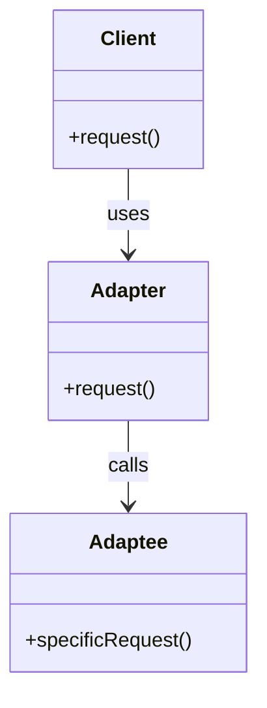

## 6.1. Adapter Pattern with Protocols and Behaviours

In the world of software engineering, the Adapter Pattern is a structural design pattern that allows objects with incompatible interfaces to work together. In Elixir, this pattern can be elegantly implemented using protocols and behaviours, which provide a powerful way to define and enforce interfaces across disparate modules. This section will guide you through the process of leveraging these features to create adaptable and maintainable code.

### Converting Incompatible Interfaces

The Adapter Pattern is essential when you need to integrate third-party libraries, legacy code, or disparate systems that do not share a common interface. By defining a common interface using protocols and ensuring that modules implement required functions through behaviours, Elixir provides a robust mechanism for achieving this integration.

#### Utilizing Elixir's Protocols

Protocols in Elixir are a means to achieve polymorphism. They allow you to define a set of functions that can be implemented by different data types. This is particularly useful when you want to perform operations on different data structures without knowing their specific types in advance.

```elixir
defprotocol Stringify do
  @doc "Converts a data structure to a string"
  def to_string(data)
end

defimpl Stringify, for: Integer do
  def to_string(integer), do: Integer.to_string(integer)
end

defimpl Stringify, for: List do
  def to_string(list), do: Enum.join(list, ", ")
end
```

In this example, the `Stringify` protocol defines a `to_string/1` function that can be implemented for different data types, such as integers and lists. This allows you to convert these types to strings without knowing their specific implementations.

#### Defining Interfaces with Behaviours

Behaviours in Elixir are similar to interfaces in other languages. They define a set of functions that a module must implement. This is useful for ensuring that modules adhere to a specific contract, making it easier to swap out implementations without affecting the rest of the system.

```elixir
defmodule LoggerBehaviour do
  @callback log(String.t()) :: :ok
end

defmodule ConsoleLogger do
  @behaviour LoggerBehaviour

  def log(message) do
    IO.puts("Log: #{message}")
    :ok
  end
end
```

Here, `LoggerBehaviour` defines a `log/1` function that any module implementing this behaviour must define. `ConsoleLogger` adheres to this contract by implementing the `log/1` function.

### Implementing the Adapter Pattern

The Adapter Pattern can be implemented in Elixir by creating adapter modules or functions that translate or map one interface to another. This allows you to integrate third-party libraries or legacy code without modifying their source code.

#### Creating Adapter Modules

Adapter modules act as intermediaries that translate calls from one interface to another. This is particularly useful when integrating external APIs or libraries that do not conform to your application's expected interfaces.

```elixir
defmodule ExternalApi do
  def fetch_data, do: {:ok, "data from external API"}
end

defmodule ApiAdapter do
  def get_data do
    case ExternalApi.fetch_data() do
      {:ok, data} -> {:success, data}
      {:error, reason} -> {:failure, reason}
    end
  end
end
```

In this example, `ApiAdapter` translates the `fetch_data/0` function from `ExternalApi` to a `get_data/0` function that returns a more consistent tuple format.

#### Using Behaviours for Consistency

By defining a behaviour for the adapter, you can ensure that all adapters conform to a specific interface, making it easier to swap out implementations.

```elixir
defmodule DataFetcherBehaviour do
  @callback get_data() :: {:success, any()} | {:failure, any()}
end

defmodule ApiAdapter do
  @behaviour DataFetcherBehaviour

  def get_data do
    case ExternalApi.fetch_data() do
      {:ok, data} -> {:success, data}
      {:error, reason} -> {:failure, reason}
    end
  end
end
```

### Use Cases

The Adapter Pattern is particularly useful in scenarios where you need to integrate different data sources or adapt external APIs to fit your application's expected interfaces.

#### Integrating Different Data Sources

When working with multiple data sources, such as databases or external APIs, the Adapter Pattern allows you to create a unified interface for accessing data, regardless of its origin.

```elixir
defmodule DatabaseAdapter do
  @behaviour DataFetcherBehaviour

  def get_data do
    # Simulate fetching data from a database
    {:success, "data from database"}
  end
end

defmodule DataService do
  def fetch_data(adapter) do
    adapter.get_data()
  end
end

# Usage
DataService.fetch_data(ApiAdapter)
DataService.fetch_data(DatabaseAdapter)
```

In this example, `DataService` can fetch data from either `ApiAdapter` or `DatabaseAdapter`, demonstrating the flexibility of the Adapter Pattern.

#### Adapting External APIs

When integrating external APIs, the Adapter Pattern allows you to create a consistent interface for interacting with these APIs, regardless of their individual quirks or differences.

```elixir
defmodule WeatherApi do
  def get_weather, do: {:ok, "sunny"}
end

defmodule WeatherAdapter do
  @behaviour DataFetcherBehaviour

  def get_data do
    case WeatherApi.get_weather() do
      {:ok, weather} -> {:success, weather}
      {:error, reason} -> {:failure, reason}
    end
  end
end

# Usage
DataService.fetch_data(WeatherAdapter)
```

### Design Considerations

When implementing the Adapter Pattern in Elixir, consider the following:

- **Consistency**: Ensure that all adapters conform to a common interface, making it easier to swap out implementations.
- **Simplicity**: Keep adapter logic simple and focused on translating interfaces, avoiding unnecessary complexity.
- **Performance**: Be mindful of the performance implications of adding an additional layer of abstraction.

### Elixir Unique Features

Elixir's protocols and behaviours provide a unique and powerful way to implement the Adapter Pattern. Protocols allow for polymorphic behavior across different data types, while behaviours enforce a consistent interface across modules. This combination makes Elixir particularly well-suited for implementing the Adapter Pattern.

### Differences and Similarities

The Adapter Pattern is often confused with the Facade Pattern, which provides a simplified interface to a complex system. While both patterns aim to simplify interactions, the Adapter Pattern focuses on translating interfaces, whereas the Facade Pattern focuses on simplifying interactions with a subsystem.

### Try It Yourself

Experiment with the Adapter Pattern by creating your own adapters for different data sources or APIs. Try modifying the code examples to adapt different interfaces or add new behaviours. This hands-on approach will deepen your understanding of the pattern and its applications.

### Visualizing the Adapter Pattern



This diagram illustrates the relationship between the client, adapter, and adaptee. The client uses the adapter to interact with the adaptee, which has a different interface.

### Knowledge Check

- What is the primary purpose of the Adapter Pattern?
- How do protocols and behaviours facilitate the implementation of the Adapter Pattern in Elixir?
- What are some common use cases for the Adapter Pattern?
- How does the Adapter Pattern differ from the Facade Pattern?

### Summary

The Adapter Pattern is a powerful tool for integrating disparate systems and interfaces in Elixir. By leveraging protocols and behaviours, you can create flexible and maintainable code that adapts to changing requirements. Remember, this is just the beginning. As you progress, you'll build more complex and interactive systems. Keep experimenting, stay curious, and enjoy the journey!

## Quiz: Adapter Pattern with Protocols and Behaviours



### What is the primary purpose of the Adapter Pattern?

- [x] To allow objects with incompatible interfaces to work together
- [ ] To simplify complex subsystems
- [ ] To enforce a single responsibility principle
- [ ] To optimize performance

> **Explanation:** The Adapter Pattern is used to allow objects with incompatible interfaces to work together by translating or mapping one interface to another.

### How do protocols in Elixir help implement the Adapter Pattern?

- [x] They define a set of functions that can be implemented by different data types
- [ ] They enforce a single implementation for all data types
- [ ] They provide a way to optimize performance
- [ ] They simplify complex subsystems

> **Explanation:** Protocols in Elixir allow you to define a set of functions that can be implemented by different data types, enabling polymorphic behavior.

### What is a key difference between protocols and behaviours in Elixir?

- [x] Protocols are for polymorphism, behaviours define a set of functions a module must implement
- [ ] Protocols enforce a single implementation, behaviours allow multiple implementations
- [ ] Protocols are used for optimization, behaviours are used for simplification
- [ ] Protocols simplify subsystems, behaviours optimize performance

> **Explanation:** Protocols enable polymorphism by allowing different data types to implement the same set of functions, while behaviours define a set of functions that a module must implement.

### Which of the following is a common use case for the Adapter Pattern?

- [x] Integrating different data sources
- [ ] Simplifying complex subsystems
- [ ] Optimizing performance
- [ ] Enforcing a single responsibility principle

> **Explanation:** The Adapter Pattern is commonly used to integrate different data sources by providing a consistent interface for accessing data.

### How does the Adapter Pattern differ from the Facade Pattern?

- [x] Adapter translates interfaces, Facade simplifies interactions with a subsystem
- [ ] Adapter simplifies interactions, Facade translates interfaces
- [ ] Adapter optimizes performance, Facade enforces a single responsibility principle
- [ ] Adapter enforces a single responsibility principle, Facade optimizes performance

> **Explanation:** The Adapter Pattern focuses on translating interfaces to allow incompatible systems to work together, while the Facade Pattern simplifies interactions with a subsystem.

### What is the role of an adapter module in Elixir?

- [x] To translate or map one interface to another
- [ ] To enforce a single implementation for all data types
- [ ] To optimize performance
- [ ] To simplify complex subsystems

> **Explanation:** An adapter module in Elixir acts as an intermediary that translates or maps one interface to another, allowing integration of disparate systems.

### What is a benefit of using behaviours in Elixir?

- [x] They ensure modules adhere to a specific contract
- [ ] They provide a way to optimize performance
- [ ] They simplify complex subsystems
- [ ] They enforce a single implementation for all data types

> **Explanation:** Behaviours in Elixir define a set of functions that a module must implement, ensuring that modules adhere to a specific contract.

### What is a key consideration when implementing the Adapter Pattern?

- [x] Consistency in interface
- [ ] Optimization of performance
- [ ] Simplification of subsystems
- [ ] Enforcement of a single responsibility principle

> **Explanation:** Consistency in interface is crucial when implementing the Adapter Pattern to ensure that all adapters conform to a common interface.

### True or False: The Adapter Pattern can be used to integrate third-party libraries without modifying their source code.

- [x] True
- [ ] False

> **Explanation:** The Adapter Pattern allows you to integrate third-party libraries or legacy code without modifying their source code by translating or mapping interfaces.

### Which Elixir feature is particularly well-suited for implementing the Adapter Pattern?

- [x] Protocols and behaviours
- [ ] GenServer
- [ ] Supervisors
- [ ] ETS

> **Explanation:** Protocols and behaviours in Elixir provide a powerful way to implement the Adapter Pattern by enabling polymorphism and enforcing consistent interfaces.


