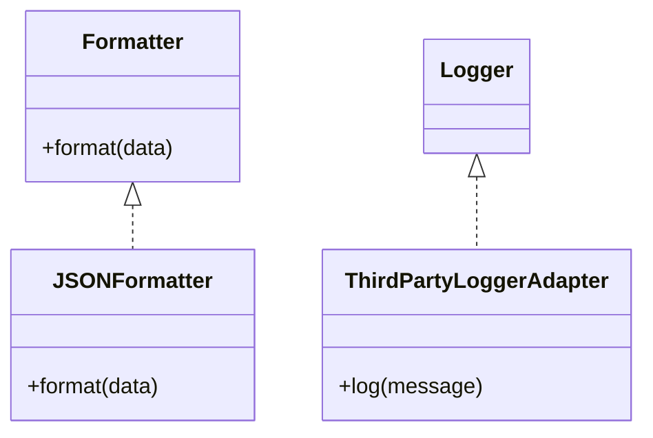

## 6.1. Adapter Pattern with Protocols and Behaviours

The Adapter Pattern is a structural design pattern that allows objects with incompatible interfaces to work together. In Elixir, this pattern can be effectively implemented using protocols and behaviours, which provide a flexible and powerful way to define and enforce interfaces. This section will guide you through the concepts, implementation, and use cases of the Adapter Pattern in Elixir.

### Converting Incompatible Interfaces

In software development, it is common to encounter situations where you need to integrate components that were not designed to work together. This is where the Adapter Pattern comes into play. By using Elixir's protocols and behaviours, we can create a common interface that disparate modules can adhere to, allowing for seamless integration.

#### Utilizing Elixir's Protocols

Protocols in Elixir are a mechanism to achieve polymorphism. They allow you to define a set of functions that can be implemented by different data types. This is particularly useful when you want to define a common interface for disparate modules.

```elixir
defprotocol Formatter do
  @doc "Formats data into a string"
  def format(data)
end
```

In this example, the `Formatter` protocol defines a single function, `format/1`, which can be implemented by any data type that needs to be formatted into a string.

#### Defining Behaviours

Behaviours in Elixir are similar to interfaces in other programming languages. They define a set of function signatures that a module must implement. This ensures that modules adhere to a specific contract, making it easier to swap out implementations.

```elixir
defmodule Logger do
  @callback log(String.t()) :: :ok
end
```

The `Logger` behaviour defines a `log/1` function that any implementing module must provide. This ensures that all loggers have a consistent interface.

### Implementing the Adapter Pattern

To implement the Adapter Pattern in Elixir, we create adapter modules or functions that translate or map one interface to another. This allows us to integrate third-party libraries or legacy code without modifying their source code.

#### Creating Adapter Modules

An adapter module acts as a bridge between the incompatible interface and the expected interface. It implements the required protocol or behaviour and translates calls to the target module.

```elixir
defmodule JSONFormatter do
  def format(data) do
    Jason.encode!(data)
  end
end

defimpl Formatter, for: JSONFormatter do
  def format(data) do
    JSONFormatter.format(data)
  end
end
```

In this example, `JSONFormatter` is an adapter that implements the `Formatter` protocol, allowing any data that needs to be formatted as JSON to use the common `format/1` interface.

#### Allowing Integration of Third-Party Libraries

Adapters are particularly useful when integrating third-party libraries. For instance, if you are using a library that provides a different logging interface, you can create an adapter to conform to your application's logging behaviour.

```elixir
defmodule ThirdPartyLoggerAdapter do
  @behaviour Logger

  def log(message) do
    ThirdPartyLibrary.log_message(message)
  end
end
```

Here, `ThirdPartyLoggerAdapter` implements the `Logger` behaviour, translating calls to the third-party library's `log_message/1` function.

### Use Cases

The Adapter Pattern is widely applicable in scenarios where you need to integrate different systems or components. Here are some common use cases:

#### Integrating Different Data Sources

When working with multiple data sources, you may encounter different interfaces for accessing data. By using adapters, you can create a uniform interface for data retrieval, simplifying your application's architecture.

```elixir
defmodule SQLDataSourceAdapter do
  @behaviour DataSource

  def get_data(query) do
    SQLClient.execute(query)
  end
end

defmodule NoSQLDataSourceAdapter do
  @behaviour DataSource

  def get_data(query) do
    NoSQLClient.query(query)
  end
end
```

In this example, both `SQLDataSourceAdapter` and `NoSQLDataSourceAdapter` implement the `DataSource` behaviour, providing a consistent interface for data retrieval.

#### Adapting External APIs

When consuming external APIs, you may need to adapt their responses to fit your application's expected data structures. Adapters can help you achieve this without modifying the external API's code.

```elixir
defmodule WeatherAPIAdapter do
  def get_weather(city) do
    response = ExternalWeatherAPI.fetch(city)
    adapt_response(response)
  end

  defp adapt_response(%{"temp" => temp, "humidity" => humidity}) do
    %{temperature: temp, humidity: humidity}
  end
end
```

The `WeatherAPIAdapter` adapts the response from an external weather API to match the expected data structure in your application.

### Diagrams

To better understand the Adapter Pattern, let's visualize the relationship between the components using a class diagram.


```mermaid
classDiagram
    class Formatter {
        +format(data)
    }

    class JSONFormatter {
        +format(data)
    }

    class ThirdPartyLoggerAdapter {
        +log(message)
    }

    Formatter <|.. JSONFormatter
    Logger <|.. ThirdPartyLoggerAdapter
```

This diagram illustrates how `JSONFormatter` and `ThirdPartyLoggerAdapter` implement the `Formatter` protocol and `Logger` behaviour, respectively.

### Key Participants

- **Target Interface**: The interface that clients expect to work with.
- **Adapter**: The module that adapts the interface of the Adaptee to the Target Interface.
- **Adaptee**: The existing interface that needs to be adapted.
- **Client**: The entity that interacts with the Target Interface through the Adapter.

### Applicability

Use the Adapter Pattern when:

- You need to use an existing class, and its interface does not match the one you need.
- You want to create a reusable class that cooperates with unrelated or unforeseen classes, that is, classes that don't necessarily have compatible interfaces.
- You need to integrate third-party libraries or legacy systems into your application.

### Sample Code Snippet

Let's look at a complete example of using the Adapter Pattern to integrate a third-party payment processing library into an e-commerce application.

```elixir
defmodule PaymentProcessor do
  @callback process_payment(map()) :: {:ok, map()} | {:error, String.t()}
end

defmodule ThirdPartyPaymentAdapter do
  @behaviour PaymentProcessor

  def process_payment(payment_info) do
    case ThirdPartyLibrary.charge(payment_info) do
      {:success, response} -> {:ok, response}
      {:failure, reason} -> {:error, reason}
    end
  end
end

defmodule ECommerceApp do
  def checkout(payment_info) do
    case ThirdPartyPaymentAdapter.process_payment(payment_info) do
      {:ok, _response} -> IO.puts("Payment processed successfully!")
      {:error, reason} -> IO.puts("Payment failed: #{reason}")
    end
  end
end
```

In this example, `ThirdPartyPaymentAdapter` adapts the `ThirdPartyLibrary`'s `charge/1` function to conform to the `PaymentProcessor` behaviour, allowing `ECommerceApp` to process payments using a consistent interface.

### Design Considerations

- **When to Use**: Consider using the Adapter Pattern when you need to integrate components with incompatible interfaces, especially when dealing with third-party libraries or legacy code.
- **Important Considerations**: Ensure that the adapter correctly translates all necessary data and handles any errors or exceptions that may arise during the adaptation process.
- **Pitfalls**: Avoid overusing adapters, as they can add unnecessary complexity if not carefully managed.

### Elixir Unique Features

Elixir's protocols and behaviours provide a unique and powerful way to implement the Adapter Pattern. Protocols offer a flexible mechanism for polymorphism, while behaviours enforce a consistent interface, making it easier to integrate disparate modules.

### Differences and Similarities

The Adapter Pattern is often confused with the Decorator Pattern. While both patterns involve wrapping an existing interface, the Adapter Pattern focuses on converting interfaces to make them compatible, whereas the Decorator Pattern adds additional functionality to an existing interface.

### Try It Yourself

To deepen your understanding of the Adapter Pattern, try modifying the code examples to:

- Implement an adapter for a different third-party library.
- Create a new protocol and behaviour for a different use case.
- Experiment with different ways to handle errors in the adapter.

### Knowledge Check

Before moving on, let's summarize the key takeaways:

- The Adapter Pattern allows incompatible interfaces to work together by creating a common interface.
- Elixir's protocols and behaviours provide a flexible and powerful way to implement the Adapter Pattern.
- Adapters are useful for integrating third-party libraries and legacy code without modification.

Remember, this is just the beginning. As you progress, you'll build more complex and interactive systems. Keep experimenting, stay curious, and enjoy the journey!

## Quiz Time!



### What is the primary purpose of the Adapter Pattern?

- [x] To allow incompatible interfaces to work together
- [ ] To add additional functionality to an existing interface
- [ ] To enforce a consistent interface across modules
- [ ] To optimize performance in concurrent applications

> **Explanation:** The Adapter Pattern is used to allow incompatible interfaces to work together by creating a common interface.

### How do protocols in Elixir facilitate the Adapter Pattern?

- [x] They define a set of functions that can be implemented by different data types
- [ ] They enforce a consistent interface across all modules
- [ ] They provide a mechanism for error handling
- [ ] They optimize performance in concurrent applications

> **Explanation:** Protocols in Elixir define a set of functions that can be implemented by different data types, facilitating polymorphism and the Adapter Pattern.

### What is the role of an adapter module in the Adapter Pattern?

- [x] It acts as a bridge between the incompatible interface and the expected interface
- [ ] It adds additional functionality to an existing interface
- [ ] It optimizes performance in concurrent applications
- [ ] It enforces a consistent interface across all modules

> **Explanation:** An adapter module acts as a bridge between the incompatible interface and the expected interface, translating calls to the target module.

### When should you consider using the Adapter Pattern?

- [x] When you need to integrate components with incompatible interfaces
- [ ] When you want to add additional functionality to an existing interface
- [ ] When you need to optimize performance in concurrent applications
- [ ] When you want to enforce a consistent interface across all modules

> **Explanation:** The Adapter Pattern is useful when you need to integrate components with incompatible interfaces, especially when dealing with third-party libraries or legacy code.

### What is the difference between the Adapter Pattern and the Decorator Pattern?

- [x] The Adapter Pattern focuses on converting interfaces, while the Decorator Pattern adds functionality
- [ ] The Adapter Pattern adds functionality, while the Decorator Pattern converts interfaces
- [ ] Both patterns focus on converting interfaces
- [ ] Both patterns focus on adding functionality

> **Explanation:** The Adapter Pattern focuses on converting interfaces to make them compatible, while the Decorator Pattern adds additional functionality to an existing interface.

### What is a key benefit of using behaviours in Elixir?

- [x] They enforce a consistent interface across modules
- [ ] They optimize performance in concurrent applications
- [ ] They provide a mechanism for error handling
- [ ] They add additional functionality to an existing interface

> **Explanation:** Behaviours in Elixir enforce a consistent interface across modules, ensuring that all implementing modules adhere to a specific contract.

### How can adapters help with integrating third-party libraries?

- [x] By adapting the library's interface to conform to your application's expected interface
- [ ] By optimizing the library's performance in concurrent applications
- [ ] By adding additional functionality to the library's interface
- [ ] By enforcing a consistent interface across all modules

> **Explanation:** Adapters can help integrate third-party libraries by adapting the library's interface to conform to your application's expected interface.

### What is a potential pitfall of overusing adapters?

- [x] They can add unnecessary complexity
- [ ] They can optimize performance in concurrent applications
- [ ] They can enforce a consistent interface across all modules
- [ ] They can add additional functionality to an existing interface

> **Explanation:** Overusing adapters can add unnecessary complexity to your application, making it harder to maintain.

### What is a common use case for the Adapter Pattern?

- [x] Integrating different data sources
- [ ] Optimizing performance in concurrent applications
- [ ] Adding additional functionality to an existing interface
- [ ] Enforcing a consistent interface across all modules

> **Explanation:** A common use case for the Adapter Pattern is integrating different data sources by creating a uniform interface for data retrieval.

### True or False: The Adapter Pattern can be used to modify the source code of third-party libraries.

- [ ] True
- [x] False

> **Explanation:** The Adapter Pattern allows for integration without modifying the source code of third-party libraries, by adapting their interfaces to conform to the expected interface.


