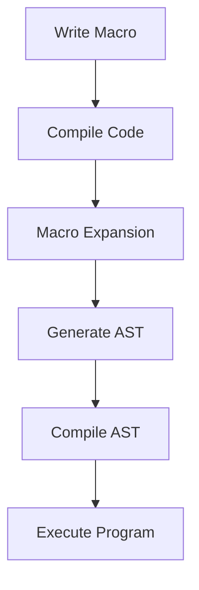

## 6.10. Extending Functionality with Macros

In the world of Elixir, macros are a powerful tool that allows developers to extend the language's capabilities by writing code that writes code. This metaprogramming technique can significantly reduce boilerplate, introduce new syntactic constructs, and enable compile-time calculations. In this section, we will delve into the intricacies of macros, explore their applications in structural design patterns, and discuss best practices for maintaining code readability and maintainability.

### Metaprogramming Techniques

Metaprogramming in Elixir involves writing code that can manipulate other code. This is achieved through macros, which are a core feature of the language. Macros allow developers to inject new behavior into the codebase at compile time, offering a level of flexibility and power that is not possible with regular functions.

#### Writing Code That Writes Code

Macros operate on the abstract syntax tree (AST) of the code, allowing you to transform and generate code dynamically. This capability is particularly useful for reducing repetitive code patterns and adding syntactic sugar to make the code more expressive and concise.

**Example: Basic Macro Definition**

```elixir
defmodule MyMacros do
  defmacro say_hello(name) do
    quote do
      IO.puts("Hello, #{unquote(name)}!")
    end
  end
end

defmodule Greeter do
  require MyMacros

  def greet do
    MyMacros.say_hello("World")
  end
end

Greeter.greet()
# Output: Hello, World!
```

In this example, the `say_hello` macro generates code that prints a greeting message. The `quote` block captures the code structure, and `unquote` is used to inject the value of `name` into the quoted expression.

#### Reducing Boilerplate

One of the primary benefits of macros is their ability to eliminate boilerplate code. By abstracting repetitive patterns into macros, you can simplify your codebase and make it easier to maintain.

**Example: Logging Macro**

```elixir
defmodule LoggerMacros do
  defmacro log(level, message) do
    quote do
      IO.puts("[#{unquote(level)}] #{unquote(message)}")
    end
  end
end

defmodule MyApp do
  require LoggerMacros

  def run do
    LoggerMacros.log(:info, "Application started")
    # Additional application logic
    LoggerMacros.log(:error, "An error occurred")
  end
end

MyApp.run()
# Output:
# [info] Application started
# [error] An error occurred
```

Here, the `log` macro simplifies logging by encapsulating the logic for formatting log messages. This approach reduces the need to repeat the same logging code throughout the application.

### Implementing Macros for Structural Patterns

Macros can be leveraged to implement various structural design patterns in Elixir, such as creating domain-specific languages (DSLs), performing code generation, and executing compile-time calculations.

#### Creating Domain-Specific Languages (DSLs)

DSLs are specialized mini-languages tailored to a specific problem domain. Macros are ideal for creating DSLs in Elixir, as they allow you to define custom syntax and semantics that align with the domain's requirements.

**Example: Simple DSL for Configuration**

```elixir
defmodule ConfigDSL do
  defmacro config(do: block) do
    quote do
      Enum.each(unquote(block), fn {key, value} ->
        IO.puts("Setting #{key} to #{value}")
      end)
    end
  end
end

defmodule MyAppConfig do
  require ConfigDSL

  ConfigDSL.config do
    [
      database: "my_db",
      username: "admin",
      password: "secret"
    ]
  end
end

# Output:
# Setting database to my_db
# Setting username to admin
# Setting password to secret
```

In this example, the `config` macro defines a simple DSL for application configuration. The macro processes a list of key-value pairs and outputs the configuration settings.

#### Code Generation

Macros can also be used for code generation, enabling you to create complex code structures programmatically. This is particularly useful for generating repetitive code patterns or scaffolding.

**Example: Generating CRUD Functions**

```elixir
defmodule CRUDMacros do
  defmacro generate_crud(entity) do
    quote do
      def create(unquote(entity)), do: IO.puts("Creating #{unquote(entity)}")
      def read(unquote(entity)), do: IO.puts("Reading #{unquote(entity)}")
      def update(unquote(entity)), do: IO.puts("Updating #{unquote(entity)}")
      def delete(unquote(entity)), do: IO.puts("Deleting #{unquote(entity)}")
    end
  end
end

defmodule UserManager do
  require CRUDMacros

  CRUDMacros.generate_crud(:user)
end

UserManager.create(:user)
# Output: Creating user
```

The `generate_crud` macro generates a set of CRUD functions for a given entity, reducing the need to manually define each function.

#### Compile-Time Calculations

Macros can perform calculations at compile time, optimizing runtime performance by precomputing values.

**Example: Compile-Time Factorial Calculation**

```elixir
defmodule MathMacros do
  defmacro factorial(n) do
    quote do
      Enum.reduce(1..unquote(n), 1, &*/2)
    end
  end
end

defmodule MathOperations do
  require MathMacros

  def calculate_factorial do
    MathMacros.factorial(5)
  end
end

IO.puts(MathOperations.calculate_factorial())
# Output: 120
```

In this example, the `factorial` macro computes the factorial of a number at compile time, resulting in a precomputed value that can be used at runtime.

### Considerations

While macros offer significant power and flexibility, they also come with certain considerations that must be addressed to ensure code readability and maintainability.

#### Ensuring Code Readability

Macros can obscure the flow of code, making it harder for developers to understand the logic. It's essential to use macros judiciously and provide clear documentation to explain their purpose and usage.

#### Maintaining Maintainability

Overuse of macros can lead to complex and hard-to-maintain codebases. It's important to strike a balance between using macros for convenience and maintaining a codebase that is easy to understand and modify.

#### Debugging Macros

Debugging macros can be challenging due to their compile-time nature. Elixir provides tools like `Macro.expand/2` to help developers understand how macros are expanded and integrated into the code.

### Elixir Unique Features

Elixir's macro system is built on top of the Erlang VM, providing unique features such as:

- **Hygienic Macros**: Elixir ensures that macros do not accidentally capture variables from the surrounding context, preventing variable name clashes.
- **Compile-Time Execution**: Macros execute at compile time, allowing for optimizations and transformations that are not possible with runtime code.
- **Integration with the AST**: Elixir macros operate directly on the AST, providing fine-grained control over code transformation.

### Differences and Similarities

Macros in Elixir are similar to macros in other languages like Lisp, but they differ significantly from preprocessor macros in languages like C. Unlike C macros, Elixir macros are hygienic and operate on the AST, providing a safer and more powerful metaprogramming tool.

### Try It Yourself

To deepen your understanding of macros, try modifying the examples provided:

- Extend the `say_hello` macro to accept a list of names and print a greeting for each.
- Enhance the `config` DSL to support nested configurations.
- Experiment with generating additional functions in the `generate_crud` macro, such as `list` or `find`.

### Visualizing Macros in Action

To better understand how macros transform code, let's visualize the process using a flowchart.



**Figure 1: Macro Expansion Process**

This flowchart illustrates the process of macro expansion in Elixir, from writing the macro to executing the compiled program.

### Knowledge Check

Before moving on, consider the following questions:

- What are the primary benefits of using macros in Elixir?
- How do macros differ from regular functions?
- What are some potential pitfalls of overusing macros?

### Summary

In this section, we've explored the power of macros in Elixir, a tool that allows developers to extend the language's capabilities through metaprogramming. We've seen how macros can reduce boilerplate, create DSLs, generate code, and perform compile-time calculations. While macros offer significant advantages, it's important to use them judiciously to maintain code readability and maintainability.

Remember, macros are just one of the many tools available in Elixir's rich ecosystem. As you continue your journey, keep experimenting, stay curious, and enjoy the process of learning and growing as a developer.

## Quiz: Extending Functionality with Macros



### What is the primary purpose of macros in Elixir?

- [x] To write code that writes code
- [ ] To execute code at runtime
- [ ] To handle errors in code
- [ ] To manage state in applications

> **Explanation:** Macros in Elixir are used to write code that writes code, allowing for metaprogramming and code transformation at compile time.

### How do macros differ from regular functions in Elixir?

- [x] Macros operate at compile time
- [ ] Macros are executed at runtime
- [ ] Macros cannot take arguments
- [ ] Macros are used for error handling

> **Explanation:** Macros operate at compile time, transforming code before it is executed, unlike regular functions that run at runtime.

### What is a potential pitfall of overusing macros?

- [x] Reduced code readability
- [ ] Increased runtime errors
- [ ] Slower code execution
- [ ] Limited code flexibility

> **Explanation:** Overusing macros can lead to reduced code readability, making it harder for developers to understand and maintain the codebase.

### What is a domain-specific language (DSL)?

- [x] A specialized mini-language for a specific problem domain
- [ ] A general-purpose programming language
- [ ] A language for writing macros
- [ ] A language for error handling

> **Explanation:** A DSL is a specialized mini-language tailored to a specific problem domain, often implemented using macros in Elixir.

### How can macros improve code maintainability?

- [x] By reducing boilerplate code
- [ ] By increasing code complexity
- [ ] By introducing runtime errors
- [ ] By limiting code flexibility

> **Explanation:** Macros can improve code maintainability by reducing boilerplate code, making the codebase simpler and easier to manage.

### What tool can help debug macros in Elixir?

- [x] Macro.expand/2
- [ ] IO.inspect/1
- [ ] Logger.debug/1
- [ ] Process.info/1

> **Explanation:** `Macro.expand/2` is a tool in Elixir that helps developers understand how macros are expanded and integrated into the code.

### What is a key feature of Elixir macros?

- [x] Hygienic macros
- [ ] Runtime execution
- [ ] Variable capture
- [ ] Error handling

> **Explanation:** Elixir macros are hygienic, meaning they prevent variable name clashes by not capturing variables from the surrounding context.

### What is the role of the `quote` block in a macro?

- [x] To capture the code structure
- [ ] To execute the code
- [ ] To handle errors
- [ ] To manage state

> **Explanation:** The `quote` block in a macro captures the code structure, allowing it to be transformed and manipulated.

### True or False: Macros can perform calculations at compile time.

- [x] True
- [ ] False

> **Explanation:** Macros can perform calculations at compile time, optimizing runtime performance by precomputing values.

### What is the benefit of using macros for code generation?

- [x] Reducing repetitive code patterns
- [ ] Increasing code complexity
- [ ] Introducing runtime errors
- [ ] Limiting code flexibility

> **Explanation:** Macros can be used for code generation to reduce repetitive code patterns, making the codebase more concise and maintainable.


