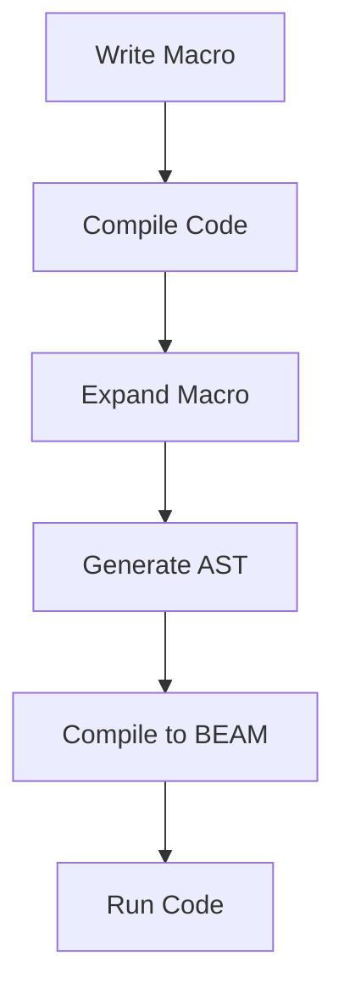

## 6.10. Extending Functionality with Macros

Metaprogramming in Elixir is a powerful tool that allows developers to write code that writes code. This technique is primarily achieved through macros, which can significantly reduce boilerplate code and add syntactic sugar to your applications. In this section, we will explore how to extend functionality with macros, focusing on their use in structural design patterns, creating domain-specific languages (DSLs), and performing compile-time calculations.

### Metaprogramming Techniques

Metaprogramming is the practice of writing programs that can manipulate themselves or other programs. In Elixir, this is primarily done through macros, which are a way to inject code during compilation. This can be incredibly useful for reducing repetitive code, enforcing consistent patterns, and creating more expressive APIs.

#### Writing Code that Writes Code

The essence of metaprogramming is to write code that can generate other code. This is particularly useful in scenarios where you want to automate repetitive tasks or enforce certain patterns across your codebase.

**Example: Simplifying Function Definitions**

Let's consider a scenario where you have multiple functions that follow a similar pattern. Instead of writing each function manually, you can use a macro to generate them.

```elixir
defmodule MathOperations do
  defmacro define_operation(name, operation) do
    quote do
      def unquote(name)(a, b) do
        a unquote(operation) b
      end
    end
  end
end

defmodule Calculator do
  require MathOperations

  MathOperations.define_operation(:add, :+)
  MathOperations.define_operation(:subtract, :-)
  MathOperations.define_operation(:multiply, :*)
  MathOperations.define_operation(:divide, :/)
end

IO.puts Calculator.add(10, 5)      # Outputs: 15
IO.puts Calculator.subtract(10, 5) # Outputs: 5
```

In this example, the `define_operation` macro generates functions for basic arithmetic operations, reducing redundancy and improving maintainability.

#### Creating Domain-Specific Languages (DSLs)

One of the most powerful uses of macros is to create DSLs. A DSL is a specialized language tailored to a specific problem domain, making it easier to express solutions in that domain.

**Example: Creating a Simple DSL for HTTP Routing**

```elixir
defmodule RouterDSL do
  defmacro route(path, do: block) do
    quote do
      def handle_request(unquote(path)), do: unquote(block)
    end
  end
end

defmodule MyRouter do
  require RouterDSL

  RouterDSL.route "/hello" do
    "Hello, world!"
  end

  RouterDSL.route "/goodbye" do
    "Goodbye, world!"
  end
end

IO.puts MyRouter.handle_request("/hello")   # Outputs: Hello, world!
IO.puts MyRouter.handle_request("/goodbye") # Outputs: Goodbye, world!
```

Here, the `route` macro allows us to define routes in a concise and readable manner, encapsulating the logic in a way that resembles a mini-language for defining HTTP routes.

#### Compile-Time Calculations

Macros can also be used to perform calculations at compile time, which can optimize performance by reducing runtime overhead.

**Example: Precomputing Values**

```elixir
defmodule CompileTimeMath do
  defmacro precompute(value) do
    result = :math.sqrt(value)
    quote do
      unquote(result)
    end
  end
end

defmodule MathUser do
  require CompileTimeMath

  def get_precomputed_value do
    CompileTimeMath.precompute(16)
  end
end

IO.puts MathUser.get_precomputed_value() # Outputs: 4.0
```

In this example, the `precompute` macro calculates the square root at compile time, embedding the result directly into the code.

### Implementing Macros for Structural Patterns

Macros can be leveraged to implement various structural design patterns, enabling more flexible and reusable code structures.

#### Creating Reusable Components

By using macros, you can create reusable components that encapsulate common patterns or structures, making your codebase more modular and maintainable.

**Example: Implementing a Simple Observer Pattern**

```elixir
defmodule ObserverPattern do
  defmacro __using__(_) do
    quote do
      def add_observer(observer) do
        :ets.insert(:observers, {observer, self()})
      end

      def notify_observers(message) do
        :ets.tab2list(:observers)
        |> Enum.each(fn {observer, _} -> send(observer, message) end)
      end
    end
  end
end

defmodule Subject do
  use ObserverPattern

  def start do
    :ets.new(:observers, [:set, :public])
  end
end

defmodule Observer do
  def listen do
    receive do
      message -> IO.puts("Received: #{message}")
    end
  end
end

# Usage
Subject.start()
Subject.add_observer(self())
Subject.notify_observers("Hello, Observer!")
Observer.listen() # Outputs: Received: Hello, Observer!
```

This example demonstrates how to use macros to implement an observer pattern, allowing subjects to notify observers of changes.

### Considerations

While macros are a powerful tool, they must be used judiciously. Here are some considerations to keep in mind:

- **Readability and Maintainability**: Macros can obscure the flow of code, making it harder for others (or even yourself) to understand what is happening. Always strive for clarity.
- **Debugging Complexity**: Debugging macro-generated code can be challenging. Use tools like `IO.inspect` and `Macro.expand` to understand what your macros are doing.
- **Compile-Time Overhead**: Macros introduce additional compile-time overhead. Ensure that the benefits outweigh the costs in performance-sensitive applications.

### Elixir Unique Features

Elixir's macro system is built on top of the Erlang Abstract Syntax Tree (AST), allowing for powerful compile-time code transformations. This is a unique feature that sets Elixir apart from many other languages, making it particularly well-suited for metaprogramming.

#### Differences and Similarities

Macros in Elixir are similar to those in Lisp, as both use a form of code-as-data philosophy. However, Elixir's macros are more restricted in terms of side effects, promoting safer and more predictable code transformations.

### Try It Yourself

To get a hands-on feel for macros, try modifying the examples above:

- Extend the `Calculator` module to include more complex operations, like exponentiation or modulus.
- Enhance the `RouterDSL` to support HTTP methods like GET and POST.
- Experiment with the `ObserverPattern` to add more sophisticated observer management, such as removing observers.

### Visualizing Macros

To better understand how macros transform code, let's visualize the process using a flowchart:


```mermaid
flowchart TD
  A[Write Macro] --> B[Compile Code]
  B --> C[Expand Macro]
  C --> D[Generate AST]
  D --> E[Compile to BEAM]
  E --> F[Run Code]
```

**Description**: This flowchart illustrates the process of writing a macro, compiling the code, expanding the macro into an Abstract Syntax Tree (AST), compiling it into BEAM bytecode, and finally running the code.

### Knowledge Check

- What are some potential pitfalls of using macros in Elixir?
- How can macros be used to create DSLs?
- What is the relationship between macros and the Erlang AST?
- How does Elixir's macro system differ from Lisp's?

### Embrace the Journey

Remember, mastering macros is a journey. As you become more comfortable with metaprogramming, you'll unlock new levels of expressiveness and efficiency in your Elixir applications. Keep experimenting, stay curious, and enjoy the process!

## Quiz Time!



### What is a primary benefit of using macros in Elixir?

- [x] Reducing boilerplate code
- [ ] Increasing runtime performance
- [ ] Simplifying debugging
- [ ] Enhancing code readability

> **Explanation:** Macros are primarily used to reduce boilerplate code by generating repetitive code patterns at compile time.

### How do macros in Elixir differ from functions?

- [x] Macros operate at compile time, while functions operate at runtime.
- [ ] Macros can have side effects, while functions cannot.
- [ ] Macros are faster than functions.
- [ ] Macros are easier to debug than functions.

> **Explanation:** Macros are expanded at compile time, allowing them to generate code that functions cannot.

### What is a DSL in the context of Elixir macros?

- [x] A Domain-Specific Language created using macros
- [ ] A type of database schema
- [ ] A debugging tool
- [ ] A performance optimization technique

> **Explanation:** A DSL is a specialized language created using macros to simplify domain-specific tasks.

### What is a potential downside of using macros?

- [x] They can make code harder to read and understand.
- [ ] They always slow down runtime performance.
- [ ] They cannot be used in production code.
- [ ] They are only available in Elixir.

> **Explanation:** Macros can obscure the flow of code, making it harder to read and maintain.

### Which Elixir feature is crucial for macros?

- [x] The Abstract Syntax Tree (AST)
- [ ] The BEAM VM
- [ ] The Phoenix Framework
- [ ] The Ecto Library

> **Explanation:** The AST is crucial for macros as it allows code transformation at compile time.

### What tool can help understand what a macro is doing?

- [x] Macro.expand
- [ ] IO.puts
- [ ] Logger.debug
- [ ] Ecto.inspect

> **Explanation:** `Macro.expand` can be used to see the expanded form of a macro.

### How can macros improve code maintainability?

- [x] By encapsulating repetitive patterns
- [ ] By improving runtime performance
- [ ] By simplifying debugging
- [ ] By eliminating all boilerplate

> **Explanation:** Macros encapsulate repetitive patterns, making code easier to maintain.

### What is a common use case for macros?

- [x] Creating DSLs
- [ ] Enhancing runtime performance
- [ ] Simplifying debugging
- [ ] Replacing functions

> **Explanation:** A common use case for macros is creating DSLs to simplify domain-specific tasks.

### How does Elixir's macro system compare to Lisp's?

- [x] Elixir's macros are more restricted in terms of side effects.
- [ ] Elixir's macros are more powerful than Lisp's.
- [ ] Elixir's macros are easier to write than Lisp's.
- [ ] Elixir's macros are slower than Lisp's.

> **Explanation:** Elixir's macros are more restricted in terms of side effects, promoting safer code transformations.

### True or False: Macros can introduce additional compile-time overhead.

- [x] True
- [ ] False

> **Explanation:** Macros introduce additional compile-time overhead due to the code generation and transformation processes.




