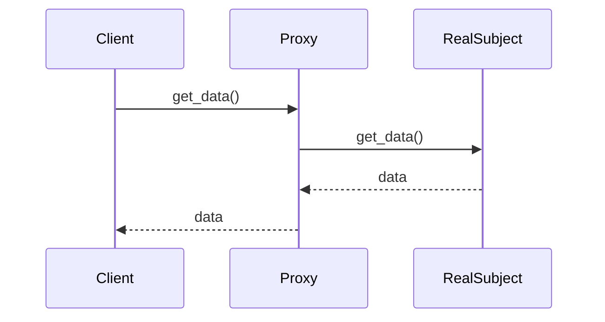

## 6.2. Proxy Pattern Using GenServers

In the realm of software design, the Proxy Pattern is a structural design pattern that provides a surrogate or placeholder for another object to control access to it. In Elixir, leveraging the power of GenServers, we can implement this pattern to manage resource access, add additional behavior such as caching or logging, and facilitate lazy initialization and security checks. This guide will delve into the intricacies of the Proxy Pattern using GenServers, providing you with the knowledge to implement this pattern effectively in your Elixir applications.

### Understanding the Proxy Pattern

The Proxy Pattern involves creating an intermediary object, known as a proxy, that controls access to another object, referred to as the real subject. The proxy can perform additional operations before or after forwarding a request to the real subject. This pattern is particularly useful in scenarios where direct access to the real subject is not desirable or possible.

#### Key Participants

- **Proxy**: The intermediary that controls access to the real subject. It implements the same interface as the real subject.
- **Real Subject**: The object that the proxy represents and to which it forwards requests.
- **Client**: The entity that interacts with the proxy to access the real subject.

### Implementing the Proxy Pattern with GenServers

In Elixir, GenServers provide a robust mechanism for implementing the Proxy Pattern. A GenServer can act as a proxy by managing requests and responses between the client and the real subject. This section will guide you through the process of implementing a proxy using GenServers.

#### Step-by-Step Implementation

1. **Define the Interface**: Start by defining the interface that both the proxy and the real subject will implement. This ensures that the client can interact with the proxy in the same way it would with the real subject.

2. **Implement the Real Subject**: Create the real subject as a GenServer that handles the core functionality.

3. **Create the Proxy GenServer**: Implement the proxy as a GenServer that forwards requests to the real subject. The proxy can add additional behavior, such as caching or logging, before or after forwarding the request.

4. **Handle Requests and Responses**: In the proxy GenServer, handle incoming requests by potentially modifying them, forwarding them to the real subject, and processing the responses.

5. **Test the Implementation**: Ensure that the proxy correctly forwards requests and handles responses, and that any additional behavior is functioning as expected.

#### Sample Code Snippet

Below is a sample implementation of the Proxy Pattern using GenServers in Elixir.

```elixir
defmodule RealSubject do
  use GenServer

  # Client API
  def start_link(initial_state) do
    GenServer.start_link(__MODULE__, initial_state, name: __MODULE__)
  end

  def get_data do
    GenServer.call(__MODULE__, :get_data)
  end

  # Server Callbacks
  def init(initial_state) do
    {:ok, initial_state}
  end

  def handle_call(:get_data, _from, state) do
    {:reply, state, state}
  end
end

defmodule Proxy do
  use GenServer

  # Client API
  def start_link do
    GenServer.start_link(__MODULE__, %{}, name: __MODULE__)
  end

  def get_data do
    GenServer.call(__MODULE__, :get_data)
  end

  # Server Callbacks
  def init(state) do
    {:ok, state}
  end

  def handle_call(:get_data, _from, state) do
    # Add pre-processing logic here (e.g., logging)
    IO.puts("Proxy: Forwarding request to RealSubject")

    # Forward request to RealSubject
    result = RealSubject.get_data()

    # Add post-processing logic here (e.g., caching)
    {:reply, result, state}
  end
end

# Usage
{:ok, _} = RealSubject.start_link("Real Data")
{:ok, _} = Proxy.start_link()

IO.puts("Client: Requesting data through Proxy")
data = Proxy.get_data()
IO.puts("Client: Received data: #{data}")
```

### Visualizing the Proxy Pattern

To better understand the flow of requests and responses in the Proxy Pattern, let's visualize the interaction between the client, proxy, and real subject using a sequence diagram.



**Diagram Description**: The sequence diagram illustrates the interaction between the client, proxy, and real subject. The client sends a request to the proxy, which forwards the request to the real subject. The real subject processes the request and returns the data to the proxy, which then forwards it to the client.

### Use Cases for the Proxy Pattern

The Proxy Pattern is versatile and can be applied in various scenarios, including:

- **Lazy Initialization**: Delay the creation and initialization of the real subject until it is needed.
- **Access Control**: Restrict access to the real subject based on certain conditions or permissions.
- **Remote Proxy**: Represent an object that resides in a different address space, such as in distributed computing.
- **Caching**: Store the results of expensive operations to improve performance.
- **Logging and Monitoring**: Record requests and responses for auditing or debugging purposes.

### Design Considerations

When implementing the Proxy Pattern using GenServers, consider the following:

- **Concurrency**: Ensure that the proxy can handle concurrent requests efficiently.
- **Error Handling**: Implement robust error handling to manage failures in the proxy or real subject.
- **Performance**: Be mindful of the overhead introduced by the proxy, especially in performance-critical applications.
- **Security**: If the proxy is used for access control, ensure that security checks are thorough and up-to-date.

### Elixir Unique Features

Elixir's concurrency model, based on the Actor Model, makes it particularly well-suited for implementing the Proxy Pattern. GenServers provide a simple yet powerful abstraction for managing state and handling requests concurrently. Additionally, Elixir's pattern matching and functional programming paradigm facilitate the implementation of clean and maintainable code.

### Differences and Similarities with Other Patterns

The Proxy Pattern is often compared to other structural patterns, such as the Decorator and Adapter patterns. While all three patterns involve wrapping an object to alter its behavior, they serve different purposes:

- **Decorator Pattern**: Adds additional responsibilities to an object dynamically.
- **Adapter Pattern**: Converts the interface of an object to match another interface.
- **Proxy Pattern**: Controls access to an object and may add additional behavior.

### Try It Yourself

To deepen your understanding of the Proxy Pattern using GenServers, try modifying the sample code to implement additional features, such as:

- **Caching**: Store the results of `get_data` in the proxy and return cached results for subsequent requests.
- **Access Control**: Implement a simple access control mechanism that restricts access to `get_data` based on a predefined condition.

### Knowledge Check

- What is the primary role of a proxy in the Proxy Pattern?
- How can GenServers be used to implement the Proxy Pattern in Elixir?
- What are some common use cases for the Proxy Pattern?
- How does the Proxy Pattern differ from the Decorator and Adapter patterns?

### Embrace the Journey

As you explore the Proxy Pattern using GenServers, remember that this is just one of many design patterns that can enhance your Elixir applications. Keep experimenting, stay curious, and enjoy the journey of mastering design patterns in Elixir.

## Quiz: Proxy Pattern Using GenServers



### What is the primary role of a proxy in the Proxy Pattern?

- [x] To control access to the real subject
- [ ] To add new functionality to the real subject
- [ ] To convert the interface of the real subject
- [ ] To store the state of the real subject

> **Explanation:** The primary role of a proxy is to control access to the real subject, potentially adding additional behavior like caching or logging.

### How can GenServers be used to implement the Proxy Pattern in Elixir?

- [x] By acting as intermediaries that manage requests and responses
- [ ] By directly modifying the real subject's code
- [ ] By converting the real subject's interface
- [ ] By storing the real subject's state

> **Explanation:** GenServers can act as intermediaries that manage requests and responses between the client and the real subject, implementing the Proxy Pattern.

### What are some common use cases for the Proxy Pattern?

- [x] Lazy initialization, security checks, remote proxies
- [ ] Direct modification of the real subject
- [ ] Interface conversion
- [ ] State storage

> **Explanation:** Common use cases for the Proxy Pattern include lazy initialization, security checks, and remote proxies for distributed computing.

### How does the Proxy Pattern differ from the Decorator Pattern?

- [x] The Proxy Pattern controls access, while the Decorator Pattern adds responsibilities
- [ ] The Proxy Pattern adds responsibilities, while the Decorator Pattern controls access
- [ ] Both patterns serve the same purpose
- [ ] The Proxy Pattern converts interfaces

> **Explanation:** The Proxy Pattern controls access to an object, while the Decorator Pattern adds additional responsibilities to an object dynamically.

### Which Elixir feature makes it well-suited for implementing the Proxy Pattern?

- [x] Concurrency model based on the Actor Model
- [ ] Object-oriented programming
- [ ] Direct memory access
- [ ] Static typing

> **Explanation:** Elixir's concurrency model, based on the Actor Model, makes it well-suited for implementing the Proxy Pattern using GenServers.

### What is a potential drawback of using the Proxy Pattern?

- [x] It can introduce performance overhead
- [ ] It simplifies the codebase
- [ ] It eliminates the need for error handling
- [ ] It reduces security risks

> **Explanation:** The Proxy Pattern can introduce performance overhead, especially in performance-critical applications.

### What additional behavior can a proxy add?

- [x] Caching and logging
- [ ] Direct modification of the real subject
- [ ] Interface conversion
- [ ] State storage

> **Explanation:** A proxy can add additional behavior such as caching and logging before or after forwarding requests to the real subject.

### What is the role of the client in the Proxy Pattern?

- [x] To interact with the proxy to access the real subject
- [ ] To directly modify the real subject
- [ ] To convert the interface of the real subject
- [ ] To store the state of the real subject

> **Explanation:** The client interacts with the proxy to access the real subject, allowing the proxy to control access and add additional behavior.

### True or False: The Proxy Pattern can be used for remote proxies in distributed computing.

- [x] True
- [ ] False

> **Explanation:** True. The Proxy Pattern can be used to represent an object that resides in a different address space, such as in distributed computing.

### What is a key consideration when implementing the Proxy Pattern?

- [x] Ensuring efficient handling of concurrent requests
- [ ] Eliminating all error handling
- [ ] Directly modifying the real subject's code
- [ ] Converting the real subject's interface

> **Explanation:** A key consideration when implementing the Proxy Pattern is ensuring that the proxy can handle concurrent requests efficiently.



By mastering the Proxy Pattern using GenServers, you can enhance your Elixir applications with controlled access, additional behavior, and improved resource management. Keep exploring and applying these concepts to build robust and scalable systems.
