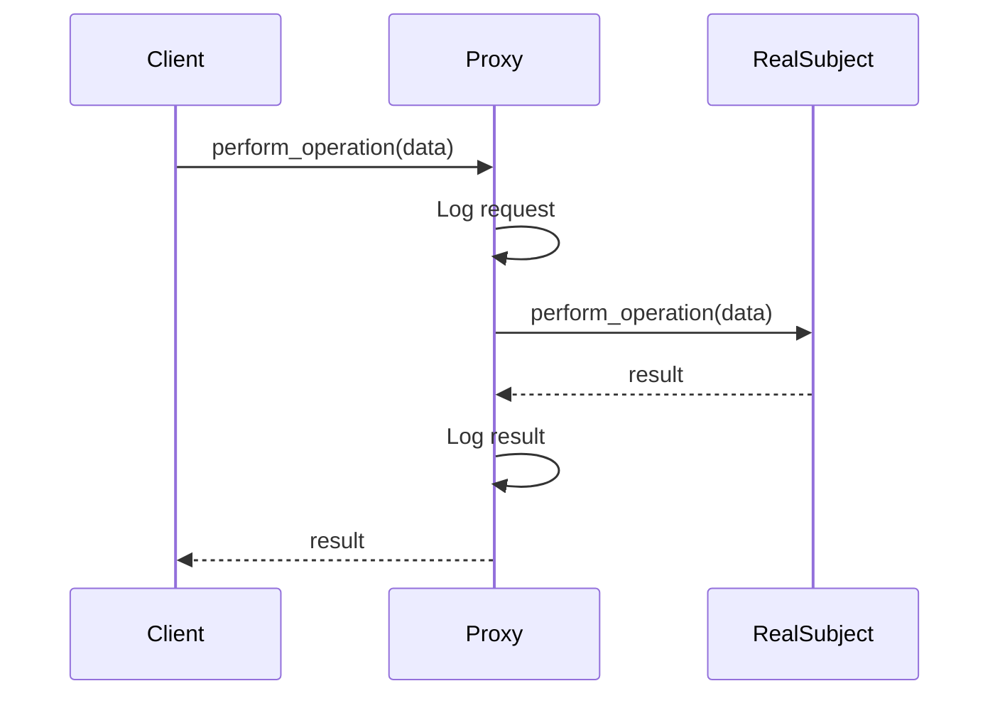

## 6.2. Proxy Pattern Using GenServers

In the world of software design, the Proxy Pattern is a structural design pattern that provides an object representing another object. This pattern is particularly useful when you need to control access to an object, add additional behavior such as caching or logging, or manage resource access. In Elixir, the Proxy Pattern can be elegantly implemented using GenServers, which are a cornerstone of Elixir's concurrency model.

### Understanding the Proxy Pattern

The Proxy Pattern involves creating a proxy object that acts as an intermediary between a client and a target object. This proxy can control access to the target, perform additional operations before or after forwarding requests, and even substitute the target object entirely in certain scenarios.

#### Key Participants

- **Proxy**: The intermediary that controls access to the target object.
- **Real Subject**: The actual object that performs the operations.
- **Client**: The entity that interacts with the proxy.

### Implementing the Proxy Pattern with GenServers

GenServers in Elixir are processes that maintain state and handle synchronous and asynchronous requests. They are ideal for implementing the Proxy Pattern because they can encapsulate the logic needed to manage access and additional behaviors.

#### Step-by-Step Implementation

1. **Define the Real Subject**: This is the module that performs the actual operations. It could be a GenServer itself or any other module.

2. **Create the Proxy GenServer**: This GenServer will receive requests from the client, perform any necessary pre-processing, forward the request to the real subject, and then handle any post-processing.

3. **Handle Requests**: Implement the GenServer callbacks to manage incoming requests, and use pattern matching to determine which requests require additional handling.

4. **Forward Requests**: Use the GenServer's `call` or `cast` functions to forward requests to the real subject.

5. **Add Additional Behavior**: Implement any additional functionality such as caching, logging, or access control within the proxy.

Here's a simple example to illustrate these steps:

```elixir
defmodule RealSubject do
  def perform_operation(data) do
    # Simulate a complex operation
    IO.puts("Performing operation on #{data}")
    {:ok, "Result of #{data}"}
  end
end

defmodule Proxy do
  use GenServer

  # Client API
  def start_link(_) do
    GenServer.start_link(__MODULE__, %{}, name: __MODULE__)
  end

  def perform_operation(data) do
    GenServer.call(__MODULE__, {:perform_operation, data})
  end

  # Server Callbacks
  def init(state) do
    {:ok, state}
  end

  def handle_call({:perform_operation, data}, _from, state) do
    # Pre-processing: Log the request
    IO.puts("Proxy: Received request to perform operation on #{data}")

    # Forward the request to the real subject
    result = RealSubject.perform_operation(data)

    # Post-processing: Log the result
    IO.puts("Proxy: Operation result is #{inspect(result)}")

    {:reply, result, state}
  end
end

# Start the Proxy GenServer and perform an operation
{:ok, _pid} = Proxy.start_link([])
Proxy.perform_operation("some data")
```

### Visualizing the Proxy Pattern

To better understand the flow of the Proxy Pattern using GenServers, let's visualize it with a sequence diagram:


```mermaid
sequenceDiagram
    participant Client
    participant Proxy
    participant RealSubject

    Client->>Proxy: perform_operation(data)
    Proxy->>Proxy: Log request
    Proxy->>RealSubject: perform_operation(data)
    RealSubject-->>Proxy: result
    Proxy->>Proxy: Log result
    Proxy-->>Client: result
```

In this diagram, the client sends a request to the proxy, which logs the request, forwards it to the real subject, logs the result, and then returns the result to the client.

### Use Cases for the Proxy Pattern

The Proxy Pattern is versatile and can be used in various scenarios:

- **Lazy Initialization**: Delay the creation and initialization of an object until it is actually needed.
- **Access Control**: Restrict access to certain operations based on user permissions or other criteria.
- **Remote Proxy**: Represent an object that exists in a different address space, such as a remote server.
- **Caching**: Store results of expensive operations to avoid redundant processing.
- **Logging**: Automatically log requests and responses for auditing or debugging purposes.

### Design Considerations

When implementing the Proxy Pattern with GenServers, consider the following:

- **Concurrency**: Ensure that the proxy can handle multiple simultaneous requests without bottlenecks.
- **State Management**: Decide whether the proxy should maintain state or be stateless.
- **Error Handling**: Implement robust error handling to manage failures in the real subject or the proxy itself.
- **Performance**: Consider the overhead introduced by the proxy and optimize as needed.

### Elixir's Unique Features

Elixir offers several features that enhance the implementation of the Proxy Pattern:

- **Pattern Matching**: Simplifies request handling by matching on message patterns.
- **Concurrency**: Leverages lightweight processes to handle multiple requests efficiently.
- **Fault Tolerance**: Uses supervision trees to restart failed processes automatically.

### Differences and Similarities with Other Patterns

The Proxy Pattern is often confused with similar patterns such as Decorator and Adapter:

- **Decorator**: Adds responsibilities to objects dynamically, whereas the proxy controls access.
- **Adapter**: Converts an interface into another interface, while the proxy provides the same interface as the real subject.

### Try It Yourself

To deepen your understanding, try modifying the example code:

- **Add Caching**: Implement a simple cache in the proxy to store results of previous operations.
- **Introduce Error Handling**: Simulate errors in the real subject and handle them gracefully in the proxy.
- **Enhance Logging**: Include timestamps and additional context in the logging output.

### Knowledge Check

Reflect on these questions to reinforce your understanding:

- How does the Proxy Pattern enhance resource management in Elixir applications?
- What are the trade-offs of using a proxy in terms of performance and complexity?
- How can you leverage Elixir's concurrency model to optimize proxy implementations?

## Quiz Time!



### What is the primary role of a proxy in the Proxy Pattern?

- [x] To control access to the real subject
- [ ] To convert one interface into another
- [ ] To add responsibilities to objects dynamically
- [ ] To handle errors in client requests

> **Explanation:** The primary role of a proxy is to control access to the real subject, potentially adding pre-processing or post-processing logic.

### Which Elixir feature is particularly useful for implementing the Proxy Pattern?

- [x] GenServers
- [ ] Supervisors
- [ ] Protocols
- [ ] Macros

> **Explanation:** GenServers are ideal for implementing the Proxy Pattern as they can manage state and handle requests efficiently.

### What is a common use case for the Proxy Pattern?

- [x] Caching results of expensive operations
- [ ] Converting interfaces
- [ ] Adding dynamic behavior to objects
- [ ] Handling exceptions

> **Explanation:** One common use case for the Proxy Pattern is caching results of expensive operations to improve performance.

### How does the Proxy Pattern differ from the Decorator Pattern?

- [x] The proxy controls access, while the decorator adds responsibilities
- [ ] The proxy adds responsibilities, while the decorator controls access
- [ ] Both patterns serve the same purpose
- [ ] The proxy is used for error handling, while the decorator is not

> **Explanation:** The proxy controls access to the real subject, whereas the decorator adds responsibilities to objects.

### What is an advantage of using GenServers for the Proxy Pattern?

- [x] They can handle concurrent requests efficiently
- [ ] They simplify error handling
- [ ] They eliminate the need for supervision
- [ ] They automatically log all requests

> **Explanation:** GenServers can handle concurrent requests efficiently, making them suitable for implementing the Proxy Pattern.

### How can you enhance the logging functionality in a proxy?

- [x] Include timestamps and additional context
- [ ] Log only successful operations
- [ ] Log only failed operations
- [ ] Avoid logging to improve performance

> **Explanation:** Enhancing logging by including timestamps and additional context can provide better insights into system behavior.

### What should be considered when implementing a proxy for performance-critical applications?

- [x] The overhead introduced by the proxy
- [ ] The number of client requests
- [ ] The size of the real subject
- [ ] The programming language used

> **Explanation:** The overhead introduced by the proxy should be considered to ensure it does not negatively impact performance.

### Which of the following is NOT a use case for the Proxy Pattern?

- [ ] Lazy initialization
- [ ] Access control
- [ ] Remote proxy
- [x] Converting interfaces

> **Explanation:** Converting interfaces is not a use case for the Proxy Pattern; it is typically handled by the Adapter Pattern.

### What is the role of pattern matching in implementing the Proxy Pattern?

- [x] It simplifies request handling by matching on message patterns
- [ ] It converts one interface into another
- [ ] It adds responsibilities to objects dynamically
- [ ] It handles errors in client requests

> **Explanation:** Pattern matching simplifies request handling by allowing the proxy to match on specific message patterns.

### True or False: The Proxy Pattern can be used to represent an object that exists in a different address space.

- [x] True
- [ ] False

> **Explanation:** True. The Proxy Pattern can be used as a remote proxy to represent an object that exists in a different address space, such as a remote server.



Remember, mastering design patterns like the Proxy Pattern is a journey. As you continue to explore and experiment, you'll uncover new ways to enhance your Elixir applications. Stay curious and keep pushing the boundaries of what's possible with Elixir and GenServers!
