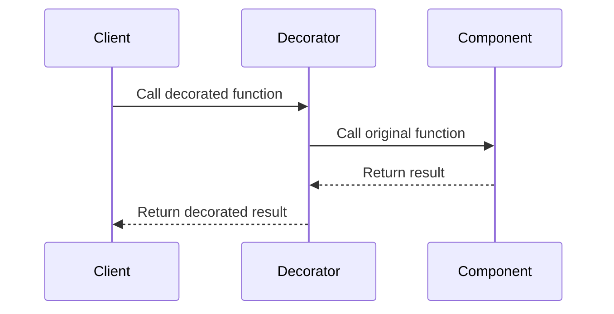

## 6.3. Decorator Pattern with Function Wrapping

In the world of software design, the Decorator Pattern is a structural pattern that allows behavior to be added to individual objects, dynamically, without affecting the behavior of other objects from the same class. In Elixir, a functional programming language, we can implement this pattern using function wrapping, which leverages higher-order functions to extend or modify the behavior of existing functions. This approach is particularly useful for scenarios such as logging, authentication, and input validation.

### Adding Responsibilities Dynamically

The core idea behind the Decorator Pattern is to add responsibilities to objects dynamically. In Elixir, we achieve this by wrapping functions with additional behavior. This is done without altering the original function code, thus maintaining the purity and immutability principles of functional programming.

#### Higher-Order Functions

Higher-order functions are functions that take other functions as arguments or return them as results. They are a cornerstone of functional programming and are essential for implementing the Decorator Pattern in Elixir. By using higher-order functions, we can create decorators that wrap existing functions, adding new behavior before or after the original function is executed.

### Implementing the Decorator Pattern

To implement the Decorator Pattern in Elixir, we create wrapping functions that enhance or modify the behavior of existing functions. This involves defining a decorator function that takes the original function as an argument and returns a new function with the added behavior.

#### Basic Example

Let's start with a simple example to illustrate the concept. Suppose we have a function that greets a user:

```elixir
defmodule Greeter do
  def greet(name) do
    "Hello, #{name}!"
  end
end
```

Now, let's say we want to log every time this function is called. We can create a decorator function to achieve this:

```elixir
defmodule LoggerDecorator do
  def log_decorator(func) do
    fn args ->
      IO.puts("Calling function with arguments: #{inspect(args)}")
      result = func.(args)
      IO.puts("Function returned: #{inspect(result)}")
      result
    end
  end
end
```

We can now use this decorator to wrap the `greet` function:

```elixir
greet_with_logging = LoggerDecorator.log_decorator(&Greeter.greet/1)
greet_with_logging.("Alice")
```

**Output:**

```
Calling function with arguments: "Alice"
Function returned: "Hello, Alice!"
```

#### Key Participants

- **Component**: The original function that needs additional behavior.
- **Decorator**: The higher-order function that wraps the original function.
- **Client**: The code that uses the decorated function.

### Use Cases

The Decorator Pattern with function wrapping is versatile and can be applied to various scenarios:

#### Logging

Logging is a common use case for decorators. By wrapping functions with logging behavior, we can track function calls and their results without modifying the original function code.

#### Authentication

In web applications, authentication checks can be added to functions handling sensitive operations. A decorator can verify user credentials before allowing the function to execute.

#### Input Validation

Input validation can be enforced by wrapping functions with decorators that check the validity of arguments before proceeding with the function logic.

### Advanced Examples

Let's explore more complex examples to deepen our understanding of the Decorator Pattern in Elixir.

#### Chaining Decorators

We can chain multiple decorators to add several layers of behavior to a function. Consider a scenario where we want to log function calls and validate inputs:

```elixir
defmodule ValidatorDecorator do
  def validate_decorator(func) do
    fn args ->
      if is_binary(args) do
        func.(args)
      else
        {:error, "Invalid input"}
      end
    end
  end
end

greet_with_logging_and_validation = 
  Greeter.greet
  |> LoggerDecorator.log_decorator()
  |> ValidatorDecorator.validate_decorator()

greet_with_logging_and_validation.("Alice")
greet_with_logging_and_validation.(123)
```

**Output:**

```
Calling function with arguments: "Alice"
Function returned: "Hello, Alice!"
Calling function with arguments: 123
```

#### Dynamic Decorator Selection

In some cases, we may want to select decorators dynamically based on runtime conditions. This can be achieved by composing decorators conditionally:

```elixir
defmodule DynamicDecorator do
  def apply_decorators(func, decorators) do
    Enum.reduce(decorators, func, fn decorator, acc ->
      decorator.(acc)
    end)
  end
end

decorators = [LoggerDecorator.log_decorator(), ValidatorDecorator.validate_decorator()]
dynamic_greet = DynamicDecorator.apply_decorators(&Greeter.greet/1, decorators)

dynamic_greet.("Alice")
```

### Visualizing the Decorator Pattern

To better understand the flow of the Decorator Pattern with function wrapping, let's visualize it using a sequence diagram:



**Diagram Description:** The client calls the decorated function, which is intercepted by the decorator. The decorator then calls the original function, receives the result, and returns the decorated result to the client.

### Design Considerations

When using the Decorator Pattern in Elixir, consider the following:

- **Performance**: Each layer of decoration adds overhead. Ensure that the performance impact is acceptable for your use case.
- **Complexity**: Chaining multiple decorators can lead to complex code. Maintain clarity by documenting the purpose of each decorator.
- **State Management**: Decorators should avoid maintaining state to preserve the functional nature of Elixir.

### Elixir Unique Features

Elixir's support for first-class functions and pattern matching makes it particularly well-suited for implementing the Decorator Pattern. The ability to pass functions as arguments and return them as results allows for flexible and powerful decorators.

### Differences and Similarities

The Decorator Pattern in Elixir differs from its implementation in object-oriented languages. In Elixir, we focus on functions rather than objects, and decorators are implemented as higher-order functions rather than classes. However, the core concept of adding behavior dynamically remains the same.

### Try It Yourself

Experiment with the code examples provided. Try adding new decorators or modifying existing ones to see how they affect the behavior of the original function. Consider scenarios in your projects where decorators could simplify your code.

### Knowledge Check

- What is the primary purpose of the Decorator Pattern?
- How do higher-order functions facilitate the implementation of the Decorator Pattern in Elixir?
- What are some common use cases for decorators?
- How can decorators be chained to add multiple layers of behavior?
- What are some design considerations when using decorators in Elixir?

### Embrace the Journey

Remember, mastering design patterns is a journey. As you explore the Decorator Pattern in Elixir, you'll gain insights into the power of functional programming and how it can simplify complex software design challenges. Keep experimenting, stay curious, and enjoy the journey!

## Quiz: Decorator Pattern with Function Wrapping



### What is the primary purpose of the Decorator Pattern?

- [x] To add responsibilities to objects dynamically
- [ ] To create new objects from existing ones
- [ ] To manage object lifecycles
- [ ] To enforce data encapsulation

> **Explanation:** The Decorator Pattern is used to add responsibilities to objects dynamically without altering their structure.

### How do higher-order functions facilitate the implementation of the Decorator Pattern in Elixir?

- [x] By allowing functions to be passed as arguments and returned as results
- [ ] By enabling direct manipulation of function internals
- [ ] By providing built-in logging capabilities
- [ ] By enforcing strict type checking

> **Explanation:** Higher-order functions allow functions to be passed as arguments and returned as results, enabling flexible and dynamic behavior modification.

### What are some common use cases for decorators?

- [x] Logging, authentication, input validation
- [ ] Memory management, garbage collection, thread synchronization
- [ ] Data serialization, network communication, file I/O
- [ ] UI rendering, event handling, animation

> **Explanation:** Decorators are commonly used for logging, authentication, and input validation, among other responsibilities.

### How can decorators be chained to add multiple layers of behavior?

- [x] By composing decorators in a sequence
- [ ] By nesting decorators within each other
- [ ] By using inheritance to extend decorators
- [ ] By creating a decorator registry

> **Explanation:** Decorators can be chained by composing them in a sequence, where each decorator wraps the previous one.

### What are some design considerations when using decorators in Elixir?

- [x] Performance, complexity, state management
- [ ] Memory usage, thread safety, exception handling
- [ ] UI responsiveness, accessibility, localization
- [ ] Network latency, bandwidth, protocol compatibility

> **Explanation:** When using decorators, consider performance, complexity, and state management to ensure efficient and maintainable code.

### True or False: In Elixir, decorators are implemented as classes.

- [ ] True
- [x] False

> **Explanation:** In Elixir, decorators are implemented as higher-order functions, not classes, due to its functional nature.

### What is a key advantage of using decorators in Elixir?

- [x] They allow behavior to be added without modifying the original function
- [ ] They automatically optimize function performance
- [ ] They enforce strict type safety
- [ ] They provide built-in concurrency support

> **Explanation:** Decorators allow behavior to be added without modifying the original function, preserving its integrity.

### Which Elixir feature makes it particularly well-suited for implementing the Decorator Pattern?

- [x] First-class functions
- [ ] Immutable data structures
- [ ] Pattern matching
- [ ] Concurrency primitives

> **Explanation:** Elixir's support for first-class functions makes it well-suited for implementing the Decorator Pattern.

### What is a potential drawback of chaining multiple decorators?

- [x] Increased complexity and potential performance overhead
- [ ] Loss of function purity
- [ ] Inability to handle exceptions
- [ ] Reduced code readability

> **Explanation:** Chaining multiple decorators can increase complexity and introduce performance overhead.

### True or False: Decorators should maintain state to enhance functionality.

- [ ] True
- [x] False

> **Explanation:** Decorators should avoid maintaining state to preserve the functional nature of Elixir.




