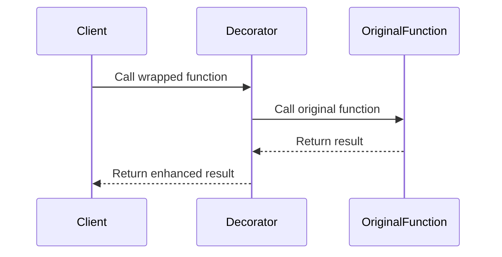

## 6.3. Decorator Pattern with Function Wrapping

In the world of software design, the ability to extend functionality without altering existing code is a hallmark of robust architecture. The Decorator Pattern is a structural design pattern that allows us to add responsibilities to objects dynamically. In Elixir, we can achieve this by using function wrapping, leveraging the power of higher-order functions to enhance or modify behavior seamlessly.

### Adding Responsibilities Dynamically

The Decorator Pattern is particularly useful when you want to add functionality to individual objects without affecting the behavior of other objects from the same class. In Elixir, we can use higher-order functions to wrap existing functions, thus dynamically adding responsibilities. This approach aligns well with Elixir's functional programming paradigm, where functions are first-class citizens.

#### Key Concepts

- **Higher-Order Functions**: Functions that take other functions as arguments or return them as results.
- **Function Wrapping**: Encapsulating a function within another function to extend or modify its behavior.
- **Dynamic Behavior**: Adding or modifying functionality at runtime without altering the original function code.

### Implementing the Decorator Pattern

To implement the Decorator Pattern in Elixir, we create wrapping functions that enhance or modify the behavior of existing functions. This involves defining a higher-order function that takes the original function as an argument and returns a new function with additional behavior.

#### Step-by-Step Implementation

1. **Define the Original Function**: Start with a simple function that performs a basic task.
2. **Create a Wrapper Function**: Define a higher-order function that takes the original function as an argument.
3. **Enhance the Functionality**: Within the wrapper function, add the desired behavior before or after calling the original function.
4. **Return the Wrapped Function**: The wrapper function should return a new function with the enhanced behavior.

#### Example: Logging Decorator

Let's illustrate this with a logging decorator that logs the input and output of a function.

```elixir
defmodule LoggerDecorator do
  # Original function that adds two numbers
  def add(a, b), do: a + b

  # Wrapper function for logging
  def log_decorator(func) do
    fn args ->
      IO.puts("Input: #{inspect(args)}")
      result = apply(func, args)
      IO.puts("Output: #{inspect(result)}")
      result
    end
  end
end

# Usage
wrapped_add = LoggerDecorator.log_decorator(&LoggerDecorator.add/2)
wrapped_add.([3, 5])
```

In this example, `log_decorator` is a higher-order function that takes the `add/2` function, logs its input and output, and returns the result.

### Use Cases

The Decorator Pattern is versatile and can be applied to various scenarios in software development. Here are some common use cases:

#### 1. Logging

Logging is essential for monitoring and debugging applications. By wrapping functions with logging decorators, we can capture input, output, and execution time without modifying the original function.

#### 2. Authentication

In web applications, authentication is crucial for securing endpoints. We can use decorators to check user credentials before executing the main logic of a function.

#### 3. Input Validation

Ensuring that functions receive valid input is vital for maintaining data integrity. Decorators can validate input data and handle errors gracefully.

### Visualizing the Decorator Pattern

To better understand the flow of the Decorator Pattern, let's visualize it using a sequence diagram.


```mermaid
sequenceDiagram
    participant Client
    participant Decorator
    participant OriginalFunction

    Client->>Decorator: Call wrapped function
    Decorator->>OriginalFunction: Call original function
    OriginalFunction-->>Decorator: Return result
    Decorator-->>Client: Return enhanced result
```

In this diagram, the client calls the decorator, which in turn calls the original function. The decorator then returns the enhanced result to the client.

### Elixir's Unique Features

Elixir's functional programming paradigm and support for higher-order functions make it an ideal language for implementing the Decorator Pattern. Some unique features that enhance this pattern include:

- **Immutability**: Elixir's immutable data structures ensure that wrapped functions do not inadvertently alter state.
- **Pattern Matching**: Allows for concise and expressive function definitions, making it easier to implement decorators that handle different types of input.
- **Concurrency**: Elixir's lightweight processes enable decorators to handle asynchronous tasks efficiently.

### Differences and Similarities

The Decorator Pattern in Elixir shares similarities with its implementation in other languages but also has distinct differences due to Elixir's functional nature.

- **Similarities**: Both involve wrapping functions or objects to extend behavior.
- **Differences**: In Elixir, decorators are implemented using higher-order functions rather than class-based inheritance.

### Design Considerations

When implementing the Decorator Pattern, consider the following:

- **Performance**: Ensure that the additional behavior introduced by decorators does not significantly impact performance.
- **Complexity**: Avoid overusing decorators, as they can make the codebase difficult to understand and maintain.
- **Testing**: Thoroughly test both the original and decorated functions to ensure correctness.

### Try It Yourself

To solidify your understanding of the Decorator Pattern, try modifying the example provided:

- **Add Timing**: Enhance the logging decorator to measure and log the execution time of the original function.
- **Error Handling**: Create a decorator that catches and logs errors without crashing the application.

### References and Further Reading

- [Elixir Official Documentation](https://elixir-lang.org/docs.html)
- [Functional Programming in Elixir](https://pragprog.com/titles/elixir16/programming-elixir-1-6/)
- [Design Patterns: Elements of Reusable Object-Oriented Software](https://en.wikipedia.org/wiki/Design_Patterns)

### Knowledge Check

Before moving on, let's review some key concepts:

- What is a higher-order function?
- How does function wrapping enhance behavior?
- What are some common use cases for the Decorator Pattern?

### Embrace the Journey

Remember, mastering design patterns is a journey. As you explore the Decorator Pattern, you'll gain insights into the power of function wrapping and how it can transform your Elixir applications. Keep experimenting, stay curious, and enjoy the process!

## Quiz Time!



### What is the primary purpose of the Decorator Pattern?

- [x] To add responsibilities to objects dynamically
- [ ] To remove unnecessary code from functions
- [ ] To optimize function performance
- [ ] To simplify complex algorithms

> **Explanation:** The Decorator Pattern is used to add responsibilities to objects dynamically without modifying their structure.

### How does Elixir implement the Decorator Pattern?

- [x] Using higher-order functions to wrap existing functions
- [ ] By subclassing and inheritance
- [ ] Through direct function modification
- [ ] By using macros exclusively

> **Explanation:** In Elixir, the Decorator Pattern is implemented using higher-order functions to wrap and extend existing functions.

### Which of the following is a use case for the Decorator Pattern?

- [x] Logging
- [x] Authentication
- [x] Input Validation
- [ ] Garbage Collection

> **Explanation:** The Decorator Pattern is commonly used for logging, authentication, and input validation.

### What is a higher-order function?

- [x] A function that takes other functions as arguments or returns them
- [ ] A function that only performs arithmetic operations
- [ ] A function that is defined at the top of a module
- [ ] A function that cannot be modified

> **Explanation:** Higher-order functions are those that can take other functions as arguments or return them as results.

### What is the advantage of using decorators in Elixir?

- [x] They allow for dynamic behavior modification without altering the original function
- [ ] They make functions run faster
- [ ] They reduce code readability
- [ ] They are only useful for logging

> **Explanation:** Decorators allow for dynamic behavior modification without altering the original function, enhancing flexibility.

### In the provided example, what does the `log_decorator` function do?

- [x] Logs the input and output of the wrapped function
- [ ] Modifies the original function's logic
- [ ] Deletes the original function
- [ ] Optimizes the function's performance

> **Explanation:** The `log_decorator` function logs the input and output of the wrapped function, providing additional information for debugging.

### What is a potential downside of overusing decorators?

- [x] Increased code complexity
- [ ] Improved performance
- [ ] Simplified codebase
- [ ] Reduced functionality

> **Explanation:** Overusing decorators can lead to increased code complexity, making the codebase harder to understand and maintain.

### How can decorators be tested in Elixir?

- [x] By testing both the original and decorated functions
- [ ] Only by testing the decorated functions
- [ ] By ignoring the original functions
- [ ] By using macros exclusively

> **Explanation:** It is important to test both the original and decorated functions to ensure correctness and reliability.

### True or False: Decorators in Elixir are implemented using class-based inheritance.

- [ ] True
- [x] False

> **Explanation:** Decorators in Elixir are implemented using higher-order functions, not class-based inheritance.

### What is the role of pattern matching in Elixir decorators?

- [x] To allow for concise and expressive function definitions
- [ ] To slow down function execution
- [ ] To replace higher-order functions
- [ ] To prevent function wrapping

> **Explanation:** Pattern matching in Elixir allows for concise and expressive function definitions, aiding in the implementation of decorators.


