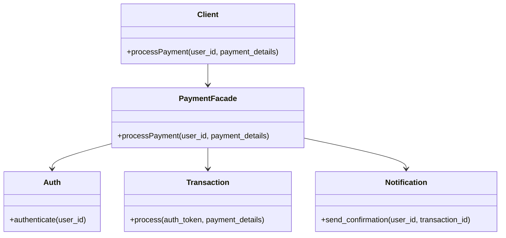

## 6.4. Facade Pattern through Public APIs

In the realm of software design, the Facade Pattern stands as a beacon of simplicity amidst complexity. This pattern is particularly valuable in Elixir, where the functional paradigm and concurrent nature of the language can lead to intricate system architectures. By providing a unified interface to a set of interfaces in a subsystem, the Facade Pattern simplifies interactions and enhances the usability of complex systems.

### Simplifying Complex Systems

The primary intent of the Facade Pattern is to offer a straightforward interface to a complex subsystem, making it easier for clients to interact with the system without needing to understand its intricacies. This is achieved by creating a facade, a higher-level interface that abstracts and encapsulates the complexities of the underlying components.

#### Key Participants

- **Facade**: The main interface that clients interact with. It provides simplified methods that internally call the appropriate subsystem components.
- **Subsystem Classes**: The complex components that perform the actual work. These are hidden behind the facade and are not directly accessed by clients.
- **Clients**: The entities that use the facade to interact with the subsystem.

### Implementing the Facade Pattern

In Elixir, implementing the Facade Pattern involves designing modules that expose simplified functions while hiding the underlying complexity. This can be particularly useful when dealing with complex libraries or systems that require multiple steps or configurations to perform a task.

#### Step-by-Step Implementation

1. **Identify the Subsystem**: Determine the components and interfaces that make up the complex subsystem.
2. **Design the Facade Interface**: Create a module that provides a simplified API for the subsystem. This module should expose functions that encapsulate the complexity of the underlying components.
3. **Implement the Facade Functions**: Within the facade module, implement functions that internally call the necessary subsystem components to perform the desired operations.
4. **Hide the Subsystem Details**: Ensure that the clients interact only with the facade and not directly with the subsystem components.

#### Code Example

Let's consider a scenario where we have a complex payment processing system with multiple components such as authentication, transaction processing, and notification services. We can create a facade to simplify the interaction with this system.

```elixir
defmodule PaymentFacade do
  alias PaymentSystem.{Auth, Transaction, Notification}

  # Public API to process a payment
  def process_payment(user_id, payment_details) do
    with {:ok, auth_token} <- Auth.authenticate(user_id),
         {:ok, transaction_id} <- Transaction.process(auth_token, payment_details),
         :ok <- Notification.send_confirmation(user_id, transaction_id) do
      {:ok, transaction_id}
    else
      {:error, reason} -> {:error, reason}
    end
  end
end
```

In this example, the `PaymentFacade` module provides a single function `process_payment/2` that abstracts the complexity of authenticating the user, processing the transaction, and sending a notification. The clients only need to call this function without worrying about the underlying details.

### Use Cases

The Facade Pattern is particularly useful in scenarios where:

- **Complex Libraries**: You need to simplify interactions with complex libraries or systems.
- **Legacy Systems**: You want to provide a modern interface to a legacy system without altering its core functionality.
- **Microservices**: You need to aggregate multiple microservices into a single cohesive API.

### Design Considerations

When implementing the Facade Pattern, consider the following:

- **Maintainability**: Ensure that the facade remains consistent even if the underlying subsystem changes.
- **Performance**: Be mindful of the performance implications of adding an additional layer of abstraction.
- **Flexibility**: Design the facade to be flexible enough to accommodate future changes or extensions.

### Elixir Unique Features

Elixir's features such as pattern matching, the pipe operator, and the "let it crash" philosophy can enhance the implementation of the Facade Pattern. For instance, using pattern matching in the `with` construct allows for clean and readable error handling, as demonstrated in the code example.

### Differences and Similarities

The Facade Pattern is often confused with the Adapter Pattern. While both provide a simplified interface, the Adapter Pattern is used to make incompatible interfaces compatible, whereas the Facade Pattern is used to simplify a complex interface.

### Visualizing the Facade Pattern

To better understand the Facade Pattern, let's visualize it using a Mermaid.js diagram:



**Diagram Description**: The diagram illustrates the relationship between the client, the facade, and the subsystem components. The client interacts with the `PaymentFacade`, which in turn communicates with the `Auth`, `Transaction`, and `Notification` components.

### Try It Yourself

To deepen your understanding, try modifying the `PaymentFacade` example:

- Add a new subsystem component, such as a logging service, and integrate it into the facade.
- Experiment with different error handling strategies within the facade.
- Create a new facade for a different subsystem, such as a user management system.

### Knowledge Check

- What is the primary purpose of the Facade Pattern?
- How does the Facade Pattern differ from the Adapter Pattern?
- What are some scenarios where the Facade Pattern is particularly useful?

### Embrace the Journey

Remember, mastering design patterns is a journey. As you continue to explore and implement patterns like the Facade Pattern, you'll gain a deeper understanding of how to build scalable and maintainable systems. Keep experimenting, stay curious, and enjoy the process!

## Quiz: Facade Pattern through Public APIs



### What is the primary purpose of the Facade Pattern?

- [x] To provide a simplified interface to a complex subsystem
- [ ] To convert one interface into another
- [ ] To allow multiple interfaces to work together
- [ ] To encapsulate a group of individual factories

> **Explanation:** The Facade Pattern provides a simplified interface to a complex subsystem, making it easier for clients to interact with it.

### How does the Facade Pattern differ from the Adapter Pattern?

- [x] The Facade Pattern simplifies a complex interface, while the Adapter Pattern makes incompatible interfaces compatible.
- [ ] The Facade Pattern is used for creating objects, while the Adapter Pattern is used for structuring code.
- [ ] The Facade Pattern is used for concurrency, while the Adapter Pattern is used for communication.
- [ ] The Facade Pattern is used for error handling, while the Adapter Pattern is used for logging.

> **Explanation:** The Facade Pattern simplifies complex interfaces, whereas the Adapter Pattern is used to make incompatible interfaces compatible.

### Which Elixir feature can enhance the implementation of the Facade Pattern?

- [x] Pattern matching
- [ ] Object-oriented inheritance
- [ ] Dynamic typing
- [ ] Manual memory management

> **Explanation:** Elixir's pattern matching can enhance the implementation of the Facade Pattern by providing clean and readable error handling.

### In which scenario is the Facade Pattern particularly useful?

- [x] Simplifying interactions with complex libraries
- [ ] Implementing low-level system calls
- [ ] Managing memory allocation
- [ ] Directly accessing hardware components

> **Explanation:** The Facade Pattern is particularly useful for simplifying interactions with complex libraries or systems.

### What is a key consideration when implementing the Facade Pattern?

- [x] Maintainability
- [ ] Direct access to subsystem components
- [ ] Manual memory management
- [ ] Use of global variables

> **Explanation:** Maintainability is a key consideration when implementing the Facade Pattern to ensure the facade remains consistent even if the underlying subsystem changes.

### What is the role of the Facade in the Facade Pattern?

- [x] To provide a unified interface to the subsystem
- [ ] To directly modify subsystem components
- [ ] To manage memory allocation
- [ ] To handle low-level system calls

> **Explanation:** The Facade provides a unified interface to the subsystem, simplifying client interactions.

### How can the Facade Pattern improve system design?

- [x] By reducing complexity for clients
- [ ] By increasing the number of interfaces
- [ ] By allowing direct access to all components
- [ ] By requiring clients to understand subsystem details

> **Explanation:** The Facade Pattern improves system design by reducing complexity for clients, making it easier to interact with the system.

### What is a potential drawback of the Facade Pattern?

- [x] It can add an additional layer of abstraction
- [ ] It requires clients to understand subsystem details
- [ ] It increases the complexity of the subsystem
- [ ] It makes the system less maintainable

> **Explanation:** A potential drawback of the Facade Pattern is that it can add an additional layer of abstraction, which may have performance implications.

### Which of the following is NOT a participant in the Facade Pattern?

- [x] Factory
- [ ] Facade
- [ ] Subsystem Classes
- [ ] Clients

> **Explanation:** The Factory is not a participant in the Facade Pattern. The main participants are the Facade, Subsystem Classes, and Clients.

### True or False: The Facade Pattern is used to provide a direct interface to subsystem components.

- [ ] True
- [x] False

> **Explanation:** False. The Facade Pattern is used to provide a simplified interface, not a direct interface, to subsystem components.




