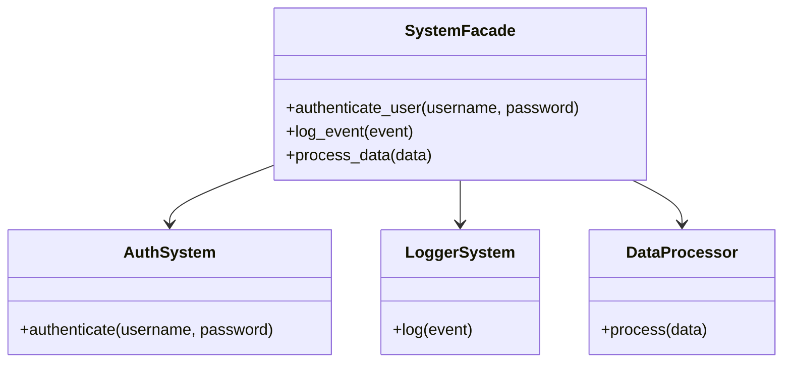

## 6.4. Facade Pattern through Public APIs

In the realm of software architecture, complexity is often an unavoidable aspect of building robust systems. As systems grow, they tend to become intricate, with numerous components interacting in various ways. The Facade Pattern is a structural design pattern that aims to simplify these complexities by providing a unified interface to a set of interfaces in a subsystem. This approach is particularly beneficial in Elixir, where functional programming paradigms and concurrency models add layers of complexity.

### Simplifying Complex Systems

The primary intent of the Facade Pattern is to abstract the complexity of subsystems and provide a simpler interface for the client. This is achieved by creating a facade that acts as an intermediary between the client and the subsystem components. By doing so, the facade pattern:

- **Reduces Complexity:** Clients interact with a simplified API rather than dealing with the intricacies of the subsystem.
- **Decouples Clients from Subsystems:** Changes in the subsystem do not affect the client as long as the facade interface remains consistent.
- **Enhances Maintainability:** The facade provides a single point of interaction, making it easier to manage and update the system.

### Implementing the Facade Pattern in Elixir

In Elixir, implementing the Facade Pattern involves designing modules that expose simplified functions while encapsulating the underlying complexity. This is achieved through the use of public APIs that serve as the facade.

#### Key Participants

1. **Facade Module:** The module that provides the simplified interface to the client.
2. **Subsystem Modules:** The complex modules that perform the actual work, hidden behind the facade.
3. **Client:** The entity that interacts with the facade to perform operations.

#### Applicability

The Facade Pattern is particularly useful in scenarios where:

- You are dealing with complex libraries or systems that require multiple steps or configurations.
- You want to provide a simplified API for a set of functionalities.
- You aim to decouple the client from the underlying system to enhance flexibility and maintainability.

#### Sample Code Snippet

Let's consider an example where we have a complex system that handles user authentication, logging, and data processing. We will implement a facade to simplify interactions with this system.

```elixir
defmodule SystemFacade do
  # Public API exposed by the facade
  def authenticate_user(username, password) do
    case AuthSystem.authenticate(username, password) do
      {:ok, user} -> {:ok, user}
      {:error, reason} -> {:error, reason}
    end
  end

  def log_event(event) do
    LoggerSystem.log(event)
  end

  def process_data(data) do
    DataProcessor.process(data)
  end
end

defmodule AuthSystem do
  def authenticate(username, password) do
    # Complex authentication logic
    {:ok, %{username: username}}
  end
end

defmodule LoggerSystem do
  def log(event) do
    # Complex logging logic
    IO.puts("Event logged: #{event}")
  end
end

defmodule DataProcessor do
  def process(data) do
    # Complex data processing logic
    {:ok, "Processed data: #{data}"}
  end
end
```

In this example, `SystemFacade` acts as the facade, providing a unified interface for authentication, logging, and data processing. The client interacts with `SystemFacade`, unaware of the complexities within `AuthSystem`, `LoggerSystem`, and `DataProcessor`.

### Design Considerations

When implementing the Facade Pattern, consider the following:

- **Identify the Subsystem Boundaries:** Clearly define which components belong to the subsystem and require simplification through the facade.
- **Design a Consistent API:** Ensure that the facade provides a coherent and intuitive interface for the client.
- **Maintain Flexibility:** While the facade simplifies interactions, it should not become a bottleneck. Allow clients to bypass the facade if necessary for advanced functionalities.
- **Encapsulation:** The facade should encapsulate the complexity without exposing internal details to the client.

### Elixir Unique Features

Elixir's features such as pattern matching, immutability, and concurrency models provide unique advantages when implementing the Facade Pattern:

- **Pattern Matching:** Simplifies the implementation of the facade by allowing concise and expressive code.
- **Immutability:** Ensures that data remains consistent and predictable when passed through the facade.
- **Concurrency Models:** Leverage Elixir's lightweight processes to handle concurrent requests through the facade efficiently.

### Differences and Similarities

The Facade Pattern is often confused with other structural patterns like the Adapter and Proxy patterns. Here are some distinctions:

- **Facade vs. Adapter:** The Facade Pattern provides a simplified interface to a complex subsystem, while the Adapter Pattern translates one interface into another that a client expects.
- **Facade vs. Proxy:** The Proxy Pattern provides a surrogate or placeholder for another object to control access, while the Facade Pattern simplifies interaction with a subsystem.

### Visualizing the Facade Pattern

Below is a Mermaid.js diagram illustrating the Facade Pattern in Elixir:


```mermaid
classDiagram
    class SystemFacade {
        +authenticate_user(username, password)
        +log_event(event)
        +process_data(data)
    }

    class AuthSystem {
        +authenticate(username, password)
    }

    class LoggerSystem {
        +log(event)
    }

    class DataProcessor {
        +process(data)
    }

    SystemFacade --> AuthSystem
    SystemFacade --> LoggerSystem
    SystemFacade --> DataProcessor
```

This diagram shows how the `SystemFacade` interacts with the `AuthSystem`, `LoggerSystem`, and `DataProcessor` to provide a simplified interface to the client.

### Use Cases

The Facade Pattern is applicable in various scenarios, such as:

- **Simplifying Interactions with Complex Libraries:** When using libraries that require multiple configurations or steps, a facade can streamline the process.
- **Building APIs for Legacy Systems:** Facades can provide modern interfaces for legacy systems, facilitating integration with new applications.
- **Modularizing Monolithic Applications:** In large applications, facades can help modularize components, making them easier to manage and evolve.

### Try It Yourself

To deepen your understanding of the Facade Pattern, try modifying the sample code:

- Add a new subsystem module, such as a `NotificationSystem`, and extend the facade to include notification functionalities.
- Experiment with different ways to handle errors within the facade.
- Implement a facade for a real-world library or system you are currently using.

### Knowledge Check

Before we wrap up, let's reinforce what we've learned:

- **What is the primary purpose of the Facade Pattern?**
- **How does the Facade Pattern differ from the Adapter Pattern?**
- **What are some considerations when designing a facade in Elixir?**

### Embrace the Journey

Remember, mastering design patterns is a journey. The Facade Pattern is just one tool in your arsenal for building scalable and maintainable systems in Elixir. As you continue to explore and experiment, you'll discover new ways to apply these patterns effectively. Keep learning, stay curious, and enjoy the process!

## Quiz Time!



### What is the main purpose of the Facade Pattern?

- [x] To provide a simplified interface to a complex subsystem
- [ ] To translate one interface into another
- [ ] To control access to another object
- [ ] To enhance performance

> **Explanation:** The Facade Pattern provides a simplified interface to a complex subsystem, making it easier for clients to interact with it.

### How does the Facade Pattern differ from the Adapter Pattern?

- [x] Facade simplifies interaction, while Adapter translates interfaces
- [ ] Facade controls access, while Adapter provides a simplified interface
- [ ] Facade enhances performance, while Adapter controls access
- [ ] Facade and Adapter are the same

> **Explanation:** The Facade Pattern simplifies interaction with a subsystem, while the Adapter Pattern translates one interface into another that a client expects.

### Which of the following is a benefit of using the Facade Pattern?

- [x] Reduces complexity for the client
- [ ] Increases subsystem complexity
- [ ] Limits subsystem functionality
- [ ] Decreases system performance

> **Explanation:** The Facade Pattern reduces complexity for the client by providing a simplified interface to interact with the subsystem.

### In Elixir, what unique feature aids in implementing the Facade Pattern?

- [x] Pattern matching
- [ ] Inheritance
- [ ] Polymorphism
- [ ] Reflection

> **Explanation:** Pattern matching in Elixir allows for concise and expressive code, making it easier to implement the Facade Pattern.

### What role does the Facade Module play in the Facade Pattern?

- [x] Provides a unified interface for the client
- [ ] Performs the actual work of the subsystem
- [ ] Acts as the client
- [ ] Translates interfaces

> **Explanation:** The Facade Module provides a unified interface for the client, simplifying interaction with the subsystem.

### Why is encapsulation important in the Facade Pattern?

- [x] To hide subsystem complexity from the client
- [ ] To expose internal details to the client
- [ ] To increase system complexity
- [ ] To enhance performance

> **Explanation:** Encapsulation is important in the Facade Pattern to hide subsystem complexity from the client, providing a simplified interface.

### What is a potential use case for the Facade Pattern?

- [x] Simplifying interactions with complex libraries
- [ ] Enhancing performance of a single function
- [ ] Replacing existing APIs
- [ ] Increasing subsystem complexity

> **Explanation:** The Facade Pattern is useful for simplifying interactions with complex libraries by providing a unified and simplified interface.

### How can the Facade Pattern enhance maintainability?

- [x] By providing a single point of interaction
- [ ] By exposing all subsystem details
- [ ] By increasing the number of interfaces
- [ ] By limiting subsystem functionality

> **Explanation:** The Facade Pattern enhances maintainability by providing a single point of interaction, making it easier to manage and update the system.

### What is an example of a subsystem module in the provided code?

- [x] AuthSystem
- [ ] SystemFacade
- [ ] Client
- [ ] PublicAPI

> **Explanation:** In the provided code, `AuthSystem` is an example of a subsystem module that performs the actual work hidden behind the facade.

### True or False: The Facade Pattern can be used to modularize monolithic applications.

- [x] True
- [ ] False

> **Explanation:** True, the Facade Pattern can be used to modularize monolithic applications by simplifying interactions and providing a unified interface for different components.



---

This comprehensive guide on the Facade Pattern through Public APIs in Elixir aims to equip you with the knowledge and tools to simplify complex systems effectively. By understanding and applying this pattern, you can build more maintainable, scalable, and efficient applications.
