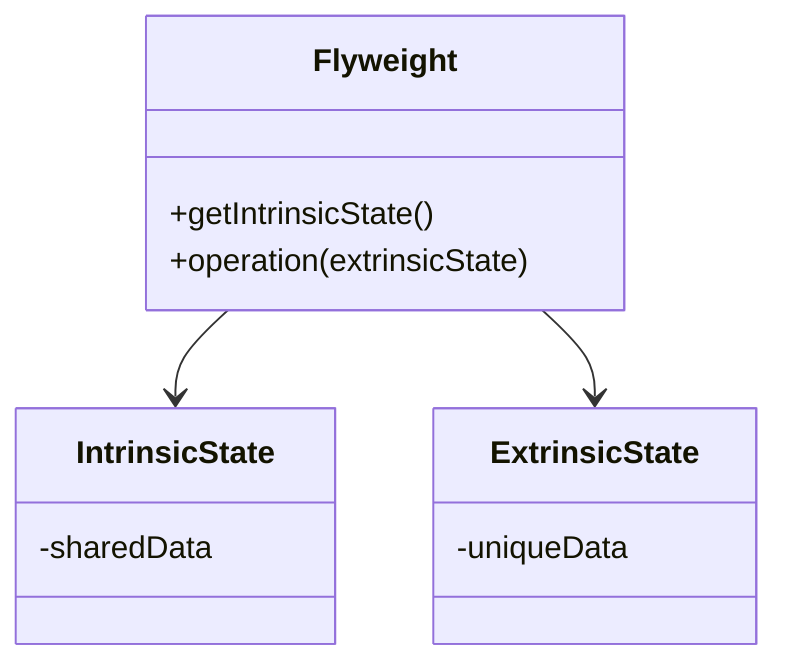

## 6.5. Flyweight Pattern with Shared Data and ETS

In the world of software design patterns, the Flyweight Pattern stands out as a powerful technique for optimizing memory usage by sharing common data among a large number of fine-grained objects. In Elixir, we can leverage the Erlang Term Storage (ETS) to implement this pattern effectively. This section will guide you through understanding the Flyweight Pattern, its implementation using ETS, and its practical applications in Elixir.

### Optimizing Memory Usage

The Flyweight Pattern is particularly useful when you need to manage a large number of objects that share some common data. By sharing this data, you can significantly reduce memory consumption and improve performance.

#### Key Concepts

- **Intrinsic State**: The shared, immutable data that can be stored in a central location and reused by multiple objects.
- **Extrinsic State**: The unique data that each object must maintain independently.
- **Flyweight Object**: An object that contains only the extrinsic state and references the shared intrinsic state.

### Implementing the Flyweight Pattern

In Elixir, ETS provides a robust mechanism for storing and accessing shared data across processes. ETS tables can hold large amounts of data and offer constant-time data access, making them ideal for implementing the Flyweight Pattern.

#### Using ETS for Shared State

ETS (Erlang Term Storage) is a powerful feature of the BEAM VM that allows for in-memory storage of large datasets. It is highly efficient and can be accessed by multiple processes concurrently.

- **Creating an ETS Table**: Use `:ets.new/2` to create a new ETS table.
- **Storing Data**: Use `:ets.insert/2` to store data in the table.
- **Retrieving Data**: Use `:ets.lookup/2` to retrieve data from the table.

#### Code Example: Implementing Flyweight with ETS

Let's consider a scenario where we need to manage a large number of user sessions, each with some common configuration data.

```elixir
defmodule SessionManager do
  # Create an ETS table for shared configuration data
  def start_link do
    :ets.new(:config_table, [:named_table, :public, :set])
    :ok
  end

  # Store shared configuration data
  def store_config(key, value) do
    :ets.insert(:config_table, {key, value})
  end

  # Retrieve shared configuration data
  def get_config(key) do
    case :ets.lookup(:config_table, key) do
      [{^key, value}] -> {:ok, value}
      [] -> :error
    end
  end

  # Create a new session with unique data
  def create_session(user_id, session_data) do
    %{
      user_id: user_id,
      session_data: session_data,
      config: get_all_config()
    }
  end

  # Retrieve all configuration data
  defp get_all_config do
    :ets.tab2list(:config_table)
  end
end

# Usage
SessionManager.start_link()
SessionManager.store_config(:timeout, 300)
SessionManager.store_config(:max_connections, 100)

session = SessionManager.create_session("user123", %{cart: []})
IO.inspect(session)
```

### Use Cases

The Flyweight Pattern is applicable in various scenarios where memory optimization is crucial. Here are some common use cases:

- **Caching**: Store shared cache data in ETS to reduce memory usage and improve access speed.
- **Session Management**: Manage user sessions with shared configuration data.
- **Configuration Management**: Store application-wide configuration settings in ETS for quick access.

### Visualizing the Flyweight Pattern

To better understand the Flyweight Pattern, let's visualize the relationship between the intrinsic and extrinsic states using a diagram.



**Diagram Explanation**: The `Flyweight` class contains methods to access the intrinsic state and perform operations using the extrinsic state. The `IntrinsicState` class holds the shared data, while the `ExtrinsicState` class holds the unique data for each object.

### Design Considerations

When implementing the Flyweight Pattern in Elixir, consider the following:

- **Concurrency**: ETS tables are designed for concurrent access, making them suitable for shared data in a concurrent environment.
- **Data Size**: Ensure that the intrinsic state stored in ETS is not too large, as it could negate the memory savings.
- **Access Patterns**: Analyze the access patterns to the shared data to ensure efficient retrieval and updates.

### Elixir Unique Features

Elixir's concurrency model and the BEAM VM's capabilities make it uniquely suited for implementing the Flyweight Pattern. ETS provides a fast and reliable way to store shared data, and Elixir's functional programming paradigm encourages immutability, which aligns well with the Flyweight Pattern's principles.

### Differences and Similarities

The Flyweight Pattern is often compared to other patterns like Singleton and Prototype. While Singleton ensures a single instance of a class, Flyweight focuses on sharing data among multiple instances. Prototype, on the other hand, involves cloning objects, which can be combined with Flyweight for efficient object creation.

### Try It Yourself

Experiment with the provided code example by modifying the session data or adding new configuration settings. Observe how the shared data in ETS remains consistent across different sessions.

### Knowledge Check

- How does the Flyweight Pattern optimize memory usage?
- What role does ETS play in implementing the Flyweight Pattern in Elixir?
- Can you think of other scenarios where the Flyweight Pattern would be beneficial?

### Embrace the Journey

Remember, mastering design patterns like Flyweight is a journey. As you continue to explore Elixir and its capabilities, you'll discover more ways to optimize your applications. Keep experimenting, stay curious, and enjoy the process!

## Quiz: Flyweight Pattern with Shared Data and ETS



### What is the primary goal of the Flyweight Pattern?

- [x] To optimize memory usage by sharing common data among objects.
- [ ] To ensure a single instance of a class.
- [ ] To clone objects for efficient creation.
- [ ] To encapsulate object creation logic.

> **Explanation:** The Flyweight Pattern aims to reduce memory usage by sharing common data among a large number of objects.

### How does ETS contribute to the Flyweight Pattern in Elixir?

- [x] By providing a mechanism for storing shared data accessible by multiple processes.
- [ ] By ensuring a single instance of a class.
- [ ] By cloning objects for efficient creation.
- [ ] By encapsulating object creation logic.

> **Explanation:** ETS allows for efficient storage and retrieval of shared data, making it ideal for implementing the Flyweight Pattern.

### What is intrinsic state in the Flyweight Pattern?

- [x] The shared, immutable data that can be reused by multiple objects.
- [ ] The unique data that each object maintains independently.
- [ ] The process of creating new objects.
- [ ] The logic for encapsulating object creation.

> **Explanation:** Intrinsic state refers to the shared data that can be reused across multiple objects, reducing memory usage.

### What is extrinsic state in the Flyweight Pattern?

- [x] The unique data that each object maintains independently.
- [ ] The shared, immutable data that can be reused by multiple objects.
- [ ] The process of creating new objects.
- [ ] The logic for encapsulating object creation.

> **Explanation:** Extrinsic state is the unique data specific to each object, which is not shared.

### Which of the following is a use case for the Flyweight Pattern?

- [x] Caching
- [x] Session management
- [ ] Singleton instance creation
- [ ] Object cloning

> **Explanation:** The Flyweight Pattern is useful for scenarios like caching and session management where shared data can optimize memory usage.

### What is a key consideration when using ETS for the Flyweight Pattern?

- [x] Ensuring the intrinsic state is not too large.
- [ ] Ensuring a single instance of a class.
- [ ] Cloning objects for efficient creation.
- [ ] Encapsulating object creation logic.

> **Explanation:** The intrinsic state should be kept manageable in size to ensure memory optimization benefits.

### How does Elixir's concurrency model benefit the Flyweight Pattern?

- [x] By allowing concurrent access to shared data in ETS.
- [ ] By ensuring a single instance of a class.
- [ ] By cloning objects for efficient creation.
- [ ] By encapsulating object creation logic.

> **Explanation:** Elixir's concurrency model allows multiple processes to access shared data in ETS concurrently, enhancing performance.

### What is a potential pitfall of the Flyweight Pattern?

- [x] Overloading the shared data with too much information.
- [ ] Ensuring a single instance of a class.
- [ ] Cloning objects for efficient creation.
- [ ] Encapsulating object creation logic.

> **Explanation:** Overloading the shared data can negate the memory optimization benefits of the Flyweight Pattern.

### Can the Flyweight Pattern be combined with other patterns?

- [x] Yes
- [ ] No

> **Explanation:** The Flyweight Pattern can be combined with other patterns like Prototype for efficient object creation.

### True or False: The Flyweight Pattern is only applicable in object-oriented programming.

- [ ] True
- [x] False

> **Explanation:** The Flyweight Pattern can be applied in functional programming languages like Elixir, leveraging features like ETS for shared data management.


