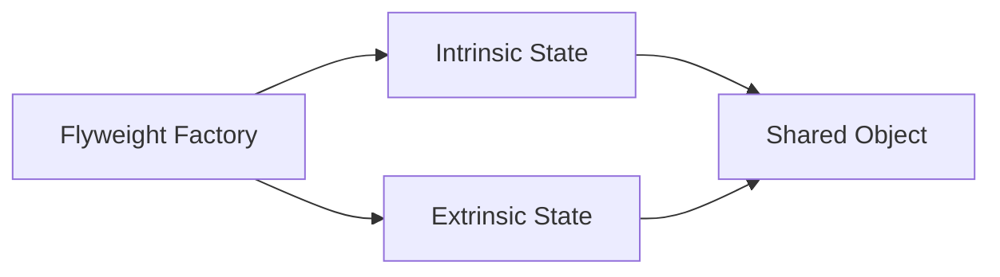

## 6.5. Flyweight Pattern with Shared Data and ETS

As expert software engineers and architects, we constantly seek ways to optimize our systems for performance and efficiency. The Flyweight Pattern is a powerful structural design pattern that helps in reducing memory usage by sharing common data across multiple objects. In this section, we will delve into the Flyweight Pattern, explore how Elixir's ETS (Erlang Term Storage) can be leveraged to implement this pattern, and discuss various use cases where this approach can be beneficial.

### Optimizing Memory Usage

The Flyweight Pattern is particularly useful when an application needs to support a large number of fine-grained objects that share common data. By sharing this data, we can significantly reduce the memory footprint and improve the application's performance.

#### Key Concepts

- **Intrinsic State**: This is the shared state that is common across multiple objects. In Elixir, we can use ETS to store this shared state.
- **Extrinsic State**: This is the unique state that each object maintains. It is not shared and is typically passed to methods as arguments.

### Implementing the Flyweight Pattern

In Elixir, ETS tables provide an efficient mechanism for storing and accessing shared data across multiple processes. Let's explore how we can implement the Flyweight Pattern using ETS.

#### Setting Up ETS

ETS is a powerful feature of the Erlang VM that allows us to store large amounts of data in-memory and access it efficiently. Here's how we can set up an ETS table for our Flyweight Pattern:

```elixir
defmodule FlyweightCache do
  @moduledoc """
  A module to demonstrate the Flyweight Pattern using ETS.
  """

  def start_link do
    :ets.new(:flyweight_table, [:named_table, :public, read_concurrency: true])
  end

  def insert(key, value) do
    :ets.insert(:flyweight_table, {key, value})
  end

  def lookup(key) do
    case :ets.lookup(:flyweight_table, key) do
      [{^key, value}] -> {:ok, value}
      [] -> :error
    end
  end
end
```

In this example, we create an ETS table named `:flyweight_table` with options for named access and public visibility, allowing multiple processes to read from it concurrently.

#### Using the Flyweight Pattern

Let's see how we can use the Flyweight Pattern to manage a large number of objects efficiently:

```elixir
defmodule FlyweightClient do
  @moduledoc """
  A client module to demonstrate the use of Flyweight Pattern.
  """

  def get_flyweight(key) do
    case FlyweightCache.lookup(key) do
      {:ok, value} -> value
      :error ->
        value = create_flyweight(key)
        FlyweightCache.insert(key, value)
        value
    end
  end

  defp create_flyweight(key) do
    # Simulate creation of a complex object
    %{key: key, data: "Shared data for #{key}"}
  end
end
```

In this code, the `FlyweightClient` module uses the `FlyweightCache` to retrieve or create shared objects. If the object is not found in the cache, it creates a new one and stores it for future use.

### Use Cases

The Flyweight Pattern is ideal for scenarios where memory optimization is critical. Let's explore some common use cases:

#### Caching

Caching is a classic use case for the Flyweight Pattern. By caching shared data, we can reduce the overhead of creating and managing duplicate objects.

#### Session Management

In web applications, managing user sessions efficiently is crucial. The Flyweight Pattern can help by storing shared session data in an ETS table, reducing memory usage.

#### Managing Configuration Data

Applications often require access to configuration data that remains constant across different components. The Flyweight Pattern allows us to store this data in a centralized location, making it easily accessible.

### Visualizing the Flyweight Pattern

To better understand the Flyweight Pattern, let's visualize the relationship between intrinsic and extrinsic states using a diagram.


```mermaid
graph LR
    A[Flyweight Factory] --> B[Intrinsic State]
    A --> C[Extrinsic State]
    B --> D[Shared Object]
    C --> D
```

**Diagram Description**: This diagram illustrates the Flyweight Pattern, where the Flyweight Factory manages the intrinsic state (shared data) and combines it with the extrinsic state (unique data) to create shared objects.

### Design Considerations

When implementing the Flyweight Pattern, consider the following:

- **Concurrency**: Ensure that shared data access is thread-safe. ETS provides built-in support for concurrent reads, making it suitable for this pattern.
- **Memory Usage**: Monitor the memory usage of your ETS tables to prevent excessive growth.
- **Performance**: Evaluate the performance impact of using ETS, especially in high-concurrency scenarios.

### Elixir Unique Features

Elixir's concurrency model and the robustness of the BEAM VM make it an excellent choice for implementing the Flyweight Pattern. ETS, in particular, offers:

- **Concurrent Access**: Efficient support for concurrent reads and writes.
- **Scalability**: Ability to handle large volumes of data efficiently.
- **Fault Tolerance**: Built-in mechanisms for fault tolerance and recovery.

### Differences and Similarities

The Flyweight Pattern is often compared to other caching mechanisms. However, it is distinct in its focus on sharing intrinsic state across multiple objects, rather than simply caching entire objects.

### Try It Yourself

Now that we've explored the Flyweight Pattern, let's encourage you to experiment with the code examples. Try modifying the `FlyweightCache` to store different types of data or implement additional features such as expiration policies.

### Knowledge Check

Before we conclude, let's pose a few questions to reinforce your understanding:

- What is the primary benefit of using the Flyweight Pattern?
- How does ETS facilitate the implementation of the Flyweight Pattern in Elixir?
- Can you think of a scenario where the Flyweight Pattern might not be suitable?

### Summary

In this section, we've explored the Flyweight Pattern in Elixir, leveraging ETS for efficient memory management and shared data access. We've discussed its implementation, use cases, and design considerations, highlighting Elixir's unique features that make it an ideal choice for this pattern. Remember, optimizing memory usage is just one of the many benefits of using design patterns in Elixir. Keep experimenting and exploring new ways to enhance your applications.

## Quiz Time!



### What is the primary purpose of the Flyweight Pattern?

- [x] To optimize memory usage by sharing common data across multiple objects.
- [ ] To enhance security by encrypting data.
- [ ] To improve network performance.
- [ ] To simplify user interface design.

> **Explanation:** The Flyweight Pattern is designed to optimize memory usage by sharing common data across multiple objects.

### Which Elixir feature is commonly used to implement the Flyweight Pattern?

- [x] ETS (Erlang Term Storage)
- [ ] GenServer
- [ ] Supervisor
- [ ] Task

> **Explanation:** ETS is commonly used to implement the Flyweight Pattern in Elixir due to its efficient in-memory storage capabilities.

### What are the two types of states in the Flyweight Pattern?

- [x] Intrinsic and Extrinsic
- [ ] Public and Private
- [ ] Static and Dynamic
- [ ] Synchronous and Asynchronous

> **Explanation:** The Flyweight Pattern involves intrinsic (shared) and extrinsic (unique) states.

### How does ETS support concurrent access?

- [x] By allowing multiple processes to read and write data concurrently.
- [ ] By using locks to prevent concurrent access.
- [ ] By serializing access requests.
- [ ] By storing data on disk.

> **Explanation:** ETS allows multiple processes to read and write data concurrently, making it suitable for shared data access.

### In which scenario is the Flyweight Pattern NOT suitable?

- [x] When each object requires a unique state that cannot be shared.
- [ ] When memory optimization is critical.
- [ ] When managing session data.
- [ ] When caching configuration data.

> **Explanation:** The Flyweight Pattern is not suitable when each object requires a unique state that cannot be shared.

### What is a common use case for the Flyweight Pattern?

- [x] Caching
- [ ] Logging
- [ ] Data Encryption
- [ ] User Authentication

> **Explanation:** Caching is a common use case for the Flyweight Pattern, as it involves sharing common data across multiple objects.

### Which of the following is a benefit of using ETS in Elixir?

- [x] Efficient concurrent access
- [ ] Built-in encryption
- [ ] Enhanced user interface design
- [ ] Simplified database queries

> **Explanation:** ETS provides efficient concurrent access, making it ideal for shared data storage.

### What is the role of the Flyweight Factory?

- [x] To manage the creation and sharing of intrinsic state.
- [ ] To encrypt data before storage.
- [ ] To handle user authentication.
- [ ] To generate user interface elements.

> **Explanation:** The Flyweight Factory manages the creation and sharing of intrinsic state.

### How can you monitor the memory usage of ETS tables?

- [x] By using system monitoring tools and ETS-specific functions.
- [ ] By checking the database logs.
- [ ] By analyzing network traffic.
- [ ] By reviewing user feedback.

> **Explanation:** System monitoring tools and ETS-specific functions can be used to monitor the memory usage of ETS tables.

### True or False: The Flyweight Pattern can be used to simplify user interface design.

- [ ] True
- [x] False

> **Explanation:** The Flyweight Pattern is not related to user interface design; it focuses on memory optimization by sharing data.



Remember, this is just the beginning. As you progress, you'll build more complex and efficient Elixir applications. Keep experimenting, stay curious, and enjoy the journey!
