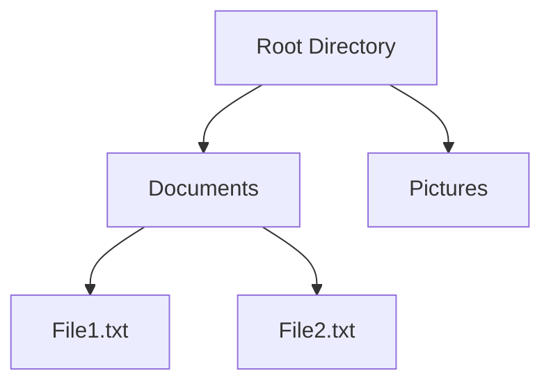

## 6.6. Composite Pattern with Nested Data Structures

The Composite Pattern is a structural design pattern that allows you to compose objects into tree structures to represent part-whole hierarchies. It enables clients to treat individual objects and compositions of objects uniformly. In Elixir, a functional programming language, we can leverage nested data structures such as maps, lists, and structs to implement this pattern effectively.

### Hierarchical Tree Structures

Hierarchical tree structures are essential in representing data that has a parent-child relationship. The Composite Pattern is particularly useful for scenarios where you need to work with complex tree structures, such as:

- **User Interfaces (UI):** Building UI components where each component can contain other components.
- **File Systems:** Representing directories and files where directories can contain other directories or files.
- **Organizational Charts:** Modeling organizational hierarchies where each node can represent a department or an employee.

### Implementing the Composite Pattern

In Elixir, we can implement the Composite Pattern using nested maps, lists, or structs. Let's explore each approach in detail.

#### Using Nested Maps

Maps in Elixir are versatile data structures that can be used to represent hierarchical data. Here's how you can use maps to implement the Composite Pattern:

```elixir
defmodule FileSystem do
  defstruct name: "", children: []

  def new(name), do: %FileSystem{name: name, children: []}

  def add_child(parent, child) do
    %FileSystem{parent | children: parent.children ++ [child]}
  end

  def print_structure(%FileSystem{name: name, children: children}, level \\ 0) do
    IO.puts(String.duplicate("  ", level) <> name)
    Enum.each(children, &print_structure(&1, level + 1))
  end
end

# Example usage
root = FileSystem.new("root")
documents = FileSystem.new("documents")
pictures = FileSystem.new("pictures")
file1 = FileSystem.new("file1.txt")
file2 = FileSystem.new("file2.txt")

root = root
|> FileSystem.add_child(documents)
|> FileSystem.add_child(pictures)

documents = documents
|> FileSystem.add_child(file1)
|> FileSystem.add_child(file2)

FileSystem.print_structure(root)
```

In this example, we define a `FileSystem` struct with a `name` and `children`. The `add_child/2` function allows us to add a child node to a parent node, and `print_structure/2` recursively prints the structure.

#### Using Nested Lists

Lists can also be used to represent hierarchical data, especially when the order of elements is important. Here's an example:

```elixir
defmodule OrgChart do
  defstruct name: "", subordinates: []

  def new(name), do: %OrgChart{name: name, subordinates: []}

  def add_subordinate(manager, subordinate) do
    %OrgChart{manager | subordinates: manager.subordinates ++ [subordinate]}
  end

  def print_chart(%OrgChart{name: name, subordinates: subordinates}, level \\ 0) do
    IO.puts(String.duplicate("  ", level) <> name)
    Enum.each(subordinates, &print_chart(&1, level + 1))
  end
end

# Example usage
ceo = OrgChart.new("CEO")
cto = OrgChart.new("CTO")
dev1 = OrgChart.new("Developer 1")
dev2 = OrgChart.new("Developer 2")

ceo = ceo
|> OrgChart.add_subordinate(cto)

cto = cto
|> OrgChart.add_subordinate(dev1)
|> OrgChart.add_subordinate(dev2)

OrgChart.print_chart(ceo)
```

Here, we define an `OrgChart` struct with a `name` and `subordinates`. The `add_subordinate/2` function adds a subordinate to a manager, and `print_chart/2` recursively prints the organizational chart.

#### Using Nested Structs

Structs provide a way to define custom data types in Elixir, making them suitable for implementing the Composite Pattern. Here's an example using structs:

```elixir
defmodule UIComponent do
  defstruct name: "", components: []

  def new(name), do: %UIComponent{name: name, components: []}

  def add_component(parent, component) do
    %UIComponent{parent | components: parent.components ++ [component]}
  end

  def render(%UIComponent{name: name, components: components}, level \\ 0) do
    IO.puts(String.duplicate("  ", level) <> name)
    Enum.each(components, &render(&1, level + 1))
  end
end

# Example usage
window = UIComponent.new("Window")
button = UIComponent.new("Button")
text_field = UIComponent.new("TextField")

window = window
|> UIComponent.add_component(button)
|> UIComponent.add_component(text_field)

UIComponent.render(window)
```

In this example, we define a `UIComponent` struct with a `name` and `components`. The `add_component/2` function adds a component to a parent component, and `render/2` recursively renders the UI structure.

### Use Cases

The Composite Pattern is versatile and can be applied to various use cases. Let's explore some common scenarios where this pattern is beneficial.

#### Building UI Components

In UI development, components often have a hierarchical structure. For example, a window can contain buttons, text fields, and other components. The Composite Pattern allows you to build complex UI structures by composing simple components.

#### File Systems

File systems are inherently hierarchical, with directories containing files and other directories. The Composite Pattern provides a natural way to represent and manipulate file systems, allowing you to perform operations on individual files or entire directories.

#### Organizational Charts

Organizational charts represent the hierarchy of an organization, with departments and employees forming a tree structure. The Composite Pattern enables you to model and manage organizational hierarchies effectively.

### Design Considerations

When implementing the Composite Pattern in Elixir, consider the following:

- **Immutability:** Elixir's immutable data structures ensure that modifications to a composite structure result in a new structure, preserving the original.
- **Recursion:** Recursive functions are essential for traversing and manipulating hierarchical data. Ensure that your recursive functions are tail-recursive to optimize performance.
- **Pattern Matching:** Leverage pattern matching to simplify operations on composite structures, such as extracting specific nodes or performing transformations.

### Elixir Unique Features

Elixir offers several unique features that enhance the implementation of the Composite Pattern:

- **Pattern Matching:** Elixir's powerful pattern matching capabilities make it easy to work with nested data structures, allowing you to deconstruct and manipulate them efficiently.
- **Immutability:** Elixir's immutable data structures ensure that modifications to a composite structure do not affect the original, enabling safe concurrent operations.
- **Concurrency:** Elixir's lightweight processes and message-passing model allow you to build concurrent applications that can process composite structures in parallel.

### Differences and Similarities

The Composite Pattern is often compared to other structural patterns, such as the Decorator and Proxy patterns. While these patterns share some similarities, they serve different purposes:

- **Decorator Pattern:** The Decorator Pattern adds behavior to individual objects without affecting other objects. In contrast, the Composite Pattern focuses on treating individual objects and compositions uniformly.
- **Proxy Pattern:** The Proxy Pattern provides a surrogate or placeholder for another object, controlling access to it. The Composite Pattern, on the other hand, is concerned with composing objects into tree structures.

### Try It Yourself

To deepen your understanding of the Composite Pattern, try modifying the code examples provided. Here are some suggestions:

- **Add More Levels:** Extend the hierarchy by adding more levels of nodes to the tree structure.
- **Implement New Operations:** Add new operations to the composite structure, such as searching for a specific node or calculating the depth of the tree.
- **Use Different Data Structures:** Experiment with different data structures, such as tuples or keyword lists, to represent the composite structure.

### Visualizing the Composite Pattern

To better understand the Composite Pattern, let's visualize a simple file system structure using a Mermaid.js diagram:



In this diagram, we have a root directory containing two subdirectories, "Documents" and "Pictures." The "Documents" directory contains two files, "File1.txt" and "File2.txt."

### Knowledge Check

Before we conclude, let's reinforce what we've learned with a few questions:

1. What is the primary purpose of the Composite Pattern?
2. How can you implement the Composite Pattern using Elixir's data structures?
3. What are some common use cases for the Composite Pattern?
4. How does Elixir's immutability benefit the implementation of the Composite Pattern?
5. What are the differences between the Composite Pattern and the Decorator Pattern?

### Summary

In this section, we've explored the Composite Pattern and how it can be implemented in Elixir using nested data structures. We've seen how this pattern allows us to treat individual objects and compositions uniformly, making it ideal for hierarchical data such as UI components, file systems, and organizational charts. By leveraging Elixir's unique features, such as pattern matching and immutability, we can build efficient and concurrent applications that utilize the Composite Pattern effectively.

Remember, this is just the beginning. As you progress, you'll build more complex and interactive applications using the Composite Pattern. Keep experimenting, stay curious, and enjoy the journey!

## Quiz: Composite Pattern with Nested Data Structures



### What is the primary purpose of the Composite Pattern?

- [x] To compose objects into tree structures to represent part-whole hierarchies.
- [ ] To add behavior to individual objects without affecting others.
- [ ] To provide a surrogate or placeholder for another object.
- [ ] To control access to an object.

> **Explanation:** The Composite Pattern is used to compose objects into tree structures to represent part-whole hierarchies, allowing clients to treat individual objects and compositions uniformly.

### Which Elixir data structure is NOT typically used to implement the Composite Pattern?

- [ ] Maps
- [ ] Lists
- [ ] Structs
- [x] Tuples

> **Explanation:** While maps, lists, and structs are commonly used to represent hierarchical data, tuples are not typically used for this purpose due to their fixed size and lack of named fields.

### What is a common use case for the Composite Pattern?

- [x] Building UI components
- [ ] Implementing authentication mechanisms
- [ ] Managing database connections
- [ ] Handling network requests

> **Explanation:** The Composite Pattern is commonly used for building UI components, file systems, and organizational charts, where hierarchical structures are prevalent.

### How does Elixir's immutability benefit the Composite Pattern?

- [x] It ensures modifications to a composite structure result in a new structure, preserving the original.
- [ ] It allows for mutable state within composite structures.
- [ ] It simplifies concurrent operations by sharing mutable state.
- [ ] It enables direct manipulation of composite structures.

> **Explanation:** Elixir's immutability ensures that modifications to a composite structure result in a new structure, preserving the original and enabling safe concurrent operations.

### What is a key difference between the Composite Pattern and the Decorator Pattern?

- [x] The Composite Pattern focuses on treating individual objects and compositions uniformly, while the Decorator Pattern adds behavior to individual objects.
- [ ] The Composite Pattern provides a surrogate for another object, while the Decorator Pattern composes objects into tree structures.
- [ ] The Composite Pattern controls access to an object, while the Decorator Pattern represents part-whole hierarchies.
- [ ] The Composite Pattern is used for authentication, while the Decorator Pattern is used for authorization.

> **Explanation:** The Composite Pattern focuses on treating individual objects and compositions uniformly, while the Decorator Pattern adds behavior to individual objects without affecting others.

### Which Elixir feature enhances the implementation of the Composite Pattern?

- [x] Pattern Matching
- [ ] Mutable State
- [ ] Direct Memory Access
- [ ] Global Variables

> **Explanation:** Elixir's powerful pattern matching capabilities enhance the implementation of the Composite Pattern by allowing efficient deconstruction and manipulation of nested data structures.

### What is a benefit of using recursive functions in the Composite Pattern?

- [x] They allow for traversing and manipulating hierarchical data efficiently.
- [ ] They enable direct manipulation of mutable state.
- [ ] They simplify the use of global variables.
- [ ] They provide direct access to memory.

> **Explanation:** Recursive functions are essential for traversing and manipulating hierarchical data efficiently, which is a key aspect of the Composite Pattern.

### How can you optimize recursive functions in Elixir?

- [x] By ensuring they are tail-recursive.
- [ ] By using global variables.
- [ ] By directly manipulating memory.
- [ ] By avoiding pattern matching.

> **Explanation:** Ensuring that recursive functions are tail-recursive optimizes performance by allowing the Elixir compiler to optimize the recursion into iteration.

### What is a visual representation of the Composite Pattern?

- [x] A tree structure diagram
- [ ] A flowchart
- [ ] A sequence diagram
- [ ] A class diagram

> **Explanation:** A tree structure diagram is a visual representation of the Composite Pattern, illustrating the hierarchical relationships between objects.

### True or False: The Composite Pattern is only applicable to UI components.

- [ ] True
- [x] False

> **Explanation:** False. The Composite Pattern is applicable to various scenarios, including UI components, file systems, organizational charts, and more, wherever hierarchical structures are needed.


