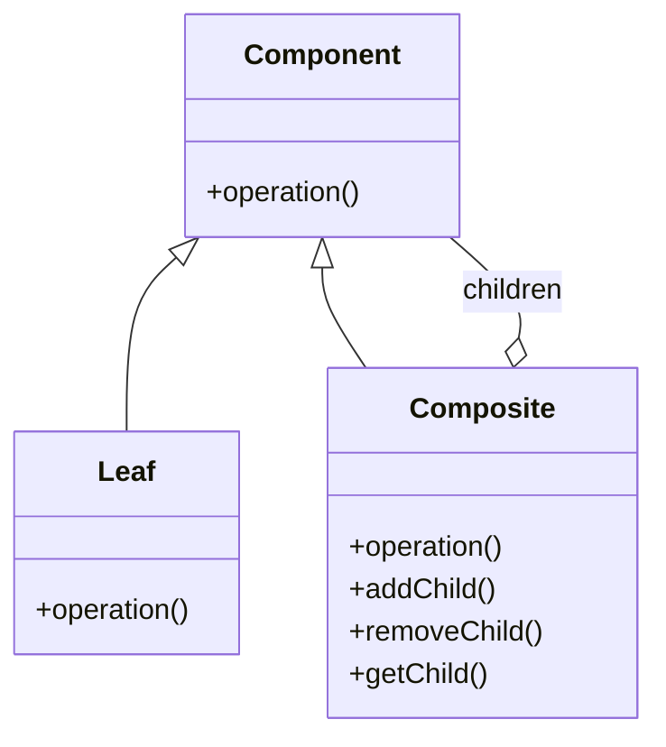

## 6.6. Composite Pattern with Nested Data Structures

In the world of software design, the Composite Pattern is a structural pattern that allows developers to treat individual objects and compositions of objects uniformly. This is particularly useful when dealing with hierarchical tree structures. In Elixir, a functional programming language known for its concurrency and fault-tolerant capabilities, implementing the Composite Pattern can be achieved using nested data structures such as maps, lists, or structs. This section will guide you through understanding the Composite Pattern, implementing it in Elixir, and exploring its practical use cases.

### Hierarchical Tree Structures

Hierarchical tree structures are prevalent in software development, representing data in a parent-child relationship. Whether you're building a file system, a UI component library, or an organizational chart, understanding how to effectively manage and traverse these structures is crucial.

#### Understanding the Composite Pattern

The Composite Pattern is designed to allow clients to treat individual objects and compositions of objects uniformly. This means that you can perform operations on single objects or entire compositions without needing to know whether you're dealing with a leaf node or a composite node.

**Intent:** The primary intent of the Composite Pattern is to compose objects into tree structures to represent part-whole hierarchies. It allows clients to treat individual objects and compositions of objects uniformly.

**Key Participants:**
- **Component:** An interface for all objects in the composition, both leaf and composite nodes.
- **Leaf:** Represents leaf objects in the composition. A leaf has no children.
- **Composite:** Defines behavior for components having children and stores child components.
- **Client:** Manipulates objects in the composition through the component interface.

#### Diagrams

To better understand the Composite Pattern, let's visualize a simple hierarchical structure using a Mermaid.js diagram:


```mermaid
classDiagram
    class Component {
        +operation()
    }
    class Leaf {
        +operation()
    }
    class Composite {
        +operation()
        +addChild()
        +removeChild()
        +getChild()
    }
    Component <|-- Leaf
    Component <|-- Composite
    Composite o-- Component : children
```

**Diagram Explanation:** This diagram illustrates the relationship between components, leaves, and composites. The `Composite` class contains methods to manage its children, while both `Leaf` and `Composite` inherit from the `Component` class, allowing them to be treated uniformly.

### Implementing the Composite Pattern

In Elixir, we can leverage nested data structures such as maps, lists, or structs to implement the Composite Pattern. Let's explore how to achieve this with a practical example.

#### Using Nested Maps

Maps in Elixir are versatile data structures that can be used to represent hierarchical data. Here's an example of how to implement a simple file system using nested maps:

```elixir
defmodule FileSystem do
  @moduledoc """
  A simple file system representation using nested maps.
  """

  defstruct name: "", children: %{}

  def new(name) do
    %FileSystem{name: name, children: %{}}
  end

  def add_child(%FileSystem{children: children} = parent, child_name) do
    new_child = new(child_name)
    %{parent | children: Map.put(children, child_name, new_child)}
  end

  def remove_child(%FileSystem{children: children} = parent, child_name) do
    %{parent | children: Map.delete(children, child_name)}
  end

  def get_child(%FileSystem{children: children}, child_name) do
    Map.get(children, child_name)
  end

  def list_children(%FileSystem{children: children}) do
    Map.keys(children)
  end
end

# Example usage
root = FileSystem.new("root")
root = FileSystem.add_child(root, "home")
root = FileSystem.add_child(root, "var")
home = FileSystem.get_child(root, "home")
home = FileSystem.add_child(home, "user")
IO.inspect(FileSystem.list_children(root))
IO.inspect(FileSystem.list_children(home))
```

**Code Explanation:** In this example, we define a `FileSystem` module with functions to create a new file system, add and remove children, and list children. The `add_child` function adds a new child to the `children` map, while `remove_child` removes a child. The `get_child` function retrieves a specific child, and `list_children` lists all child names.

#### Using Nested Lists

Lists can also be used to represent hierarchical data, particularly when order matters. Here's an example of a simple organizational chart using nested lists:

```elixir
defmodule OrgChart do
  @moduledoc """
  A simple organizational chart representation using nested lists.
  """

  defstruct name: "", subordinates: []

  def new(name) do
    %OrgChart{name: name, subordinates: []}
  end

  def add_subordinate(%OrgChart{subordinates: subs} = manager, subordinate_name) do
    new_sub = new(subordinate_name)
    %{manager | subordinates: [new_sub | subs]}
  end

  def list_subordinates(%OrgChart{subordinates: subs}) do
    Enum.map(subs, & &1.name)
  end
end

# Example usage
ceo = OrgChart.new("CEO")
ceo = OrgChart.add_subordinate(ceo, "VP of Sales")
ceo = OrgChart.add_subordinate(ceo, "VP of Engineering")
IO.inspect(OrgChart.list_subordinates(ceo))
```

**Code Explanation:** In this example, we define an `OrgChart` module with functions to create a new chart, add subordinates, and list subordinates. The `add_subordinate` function adds a new subordinate to the `subordinates` list, while `list_subordinates` lists all subordinate names.

#### Using Structs

Structs in Elixir provide a way to define custom data types with named fields, making them ideal for representing complex hierarchical data. Here's an example of a UI component tree using structs:

```elixir
defmodule UIComponent do
  @moduledoc """
  A simple UI component tree representation using structs.
  """

  defstruct name: "", children: []

  def new(name) do
    %UIComponent{name: name, children: []}
  end

  def add_child(%UIComponent{children: children} = parent, child_name) do
    new_child = new(child_name)
    %{parent | children: [new_child | children]}
  end

  def list_children(%UIComponent{children: children}) do
    Enum.map(children, & &1.name)
  end
end

# Example usage
root = UIComponent.new("Window")
root = UIComponent.add_child(root, "Button")
root = UIComponent.add_child(root, "TextBox")
IO.inspect(UIComponent.list_children(root))
```

**Code Explanation:** In this example, we define a `UIComponent` module with functions to create a new component, add children, and list children. The `add_child` function adds a new child to the `children` list, while `list_children` lists all child names.

### Use Cases

The Composite Pattern is versatile and can be applied to various scenarios where hierarchical data structures are prevalent. Let's explore some common use cases.

#### Building UI Components

In UI development, components are often nested within each other, forming a tree structure. The Composite Pattern allows developers to treat individual components and compositions of components uniformly, simplifying the management of complex UI hierarchies.

#### File Systems

File systems naturally form a hierarchical structure, with directories containing files and other directories. The Composite Pattern provides a way to navigate and manipulate this structure uniformly, whether you're dealing with a single file or an entire directory.

#### Organizational Charts

Organizational charts represent the hierarchy of an organization, with managers and subordinates. The Composite Pattern allows for easy traversal and manipulation of this hierarchy, making it simple to add, remove, or list subordinates.

### Design Considerations

When implementing the Composite Pattern in Elixir, there are several design considerations to keep in mind:

- **Immutability:** Elixir is a functional programming language, and immutability is a core principle. Ensure that your data structures are immutable, and use functions to return modified copies of data.
- **Performance:** Consider the performance implications of using nested data structures, particularly when dealing with large hierarchies. Use efficient data structures and algorithms to optimize performance.
- **Complexity:** While the Composite Pattern simplifies the management of hierarchical data, it can also introduce complexity. Ensure that your implementation is as simple and intuitive as possible.

### Elixir Unique Features

Elixir offers several unique features that make it an ideal choice for implementing the Composite Pattern:

- **Pattern Matching:** Elixir's powerful pattern matching capabilities allow for concise and expressive code, making it easy to traverse and manipulate hierarchical data structures.
- **Concurrency:** Elixir's built-in concurrency support allows for efficient parallel processing of hierarchical data, making it ideal for applications that require high performance.
- **Fault Tolerance:** Elixir's fault-tolerant design ensures that applications remain robust and resilient, even when dealing with complex hierarchical data.

### Differences and Similarities

The Composite Pattern is often compared to other design patterns, such as the Decorator Pattern and the Flyweight Pattern. While these patterns share some similarities, they serve different purposes:

- **Decorator Pattern:** The Decorator Pattern is used to add additional behavior to objects without altering their structure. It differs from the Composite Pattern, which focuses on managing hierarchical data.
- **Flyweight Pattern:** The Flyweight Pattern is used to minimize memory usage by sharing common data among objects. It differs from the Composite Pattern, which focuses on treating individual objects and compositions uniformly.

### Try It Yourself

To deepen your understanding of the Composite Pattern in Elixir, try modifying the code examples provided in this section:

- **Add More Levels:** Extend the hierarchy by adding more levels of nesting in the file system, organizational chart, or UI component tree examples.
- **Implement Additional Operations:** Implement additional operations, such as renaming nodes, moving nodes, or counting the total number of nodes in the hierarchy.
- **Optimize Performance:** Experiment with different data structures and algorithms to optimize the performance of your implementation.

### Knowledge Check

Before moving on to the next section, take a moment to review the key concepts covered in this section:

- **What is the Composite Pattern, and what problem does it solve?**
- **How can nested data structures be used to implement the Composite Pattern in Elixir?**
- **What are some common use cases for the Composite Pattern?**
- **What design considerations should be kept in mind when implementing the Composite Pattern in Elixir?**

### Embrace the Journey

Remember, mastering design patterns is a journey. As you continue to explore the Composite Pattern and other design patterns in Elixir, keep experimenting, stay curious, and enjoy the process. The skills you develop will be invaluable as you build scalable, maintainable, and robust software systems.

## Quiz Time!



### What is the primary intent of the Composite Pattern?

- [x] To compose objects into tree structures to represent part-whole hierarchies.
- [ ] To add additional behavior to objects without altering their structure.
- [ ] To minimize memory usage by sharing common data among objects.
- [ ] To separate the construction of a complex object from its representation.

> **Explanation:** The Composite Pattern is designed to compose objects into tree structures to represent part-whole hierarchies, allowing clients to treat individual objects and compositions uniformly.

### Which Elixir feature is particularly useful for implementing the Composite Pattern?

- [x] Pattern Matching
- [ ] GenServer
- [ ] Supervisor Trees
- [ ] ETS Tables

> **Explanation:** Elixir's powerful pattern matching capabilities allow for concise and expressive code, making it easy to traverse and manipulate hierarchical data structures.

### What is a key participant in the Composite Pattern?

- [x] Component
- [ ] Observer
- [ ] Proxy
- [ ] Adapter

> **Explanation:** The Component is a key participant in the Composite Pattern, serving as an interface for all objects in the composition, both leaf and composite nodes.

### In the Composite Pattern, what does a Leaf represent?

- [x] A leaf object in the composition with no children.
- [ ] A component that stores child components.
- [ ] An interface for all objects in the composition.
- [ ] A client that manipulates objects in the composition.

> **Explanation:** A Leaf represents a leaf object in the composition, which has no children and is the simplest form of a component.

### What is a common use case for the Composite Pattern?

- [x] Building UI components
- [ ] Implementing caching strategies
- [ ] Managing database connections
- [ ] Handling user authentication

> **Explanation:** Building UI components is a common use case for the Composite Pattern, as it allows developers to manage complex UI hierarchies uniformly.

### Which data structure is NOT typically used to implement the Composite Pattern in Elixir?

- [ ] Maps
- [ ] Lists
- [ ] Structs
- [x] Tuples

> **Explanation:** While maps, lists, and structs are commonly used to implement the Composite Pattern in Elixir, tuples are not typically used for this purpose as they are not well-suited for representing hierarchical data.

### What design consideration is important when implementing the Composite Pattern in Elixir?

- [x] Immutability
- [ ] Mutable State
- [ ] Shared Memory
- [ ] Global Variables

> **Explanation:** Immutability is a core principle in Elixir, and it's important to ensure that data structures are immutable when implementing the Composite Pattern.

### How does the Composite Pattern differ from the Decorator Pattern?

- [x] The Composite Pattern focuses on managing hierarchical data, while the Decorator Pattern adds additional behavior to objects.
- [ ] The Composite Pattern minimizes memory usage, while the Decorator Pattern manages hierarchical data.
- [ ] The Composite Pattern separates construction from representation, while the Decorator Pattern shares common data.
- [ ] The Composite Pattern adds behavior to objects, while the Decorator Pattern composes objects into tree structures.

> **Explanation:** The Composite Pattern focuses on managing hierarchical data, allowing clients to treat individual objects and compositions uniformly, while the Decorator Pattern adds additional behavior to objects without altering their structure.

### What is the role of the Client in the Composite Pattern?

- [x] To manipulate objects in the composition through the component interface.
- [ ] To represent leaf objects in the composition.
- [ ] To define behavior for components having children.
- [ ] To store child components.

> **Explanation:** The Client manipulates objects in the composition through the component interface, allowing for uniform treatment of individual objects and compositions.

### True or False: The Composite Pattern can be used to represent file systems.

- [x] True
- [ ] False

> **Explanation:** True. The Composite Pattern is well-suited for representing file systems, which naturally form a hierarchical structure with directories containing files and other directories.




