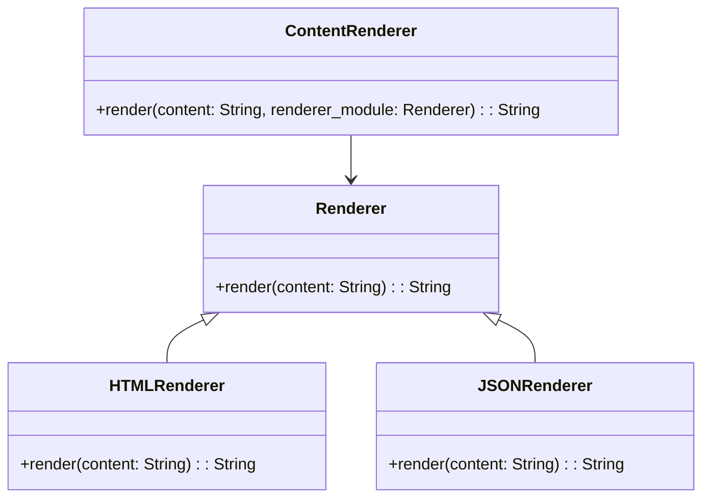

## 6.7. Bridge Pattern for Decoupling Abstraction

In the realm of software design, the Bridge Pattern stands out as a powerful structural pattern that facilitates the separation of abstraction from implementation. This separation allows for the independent development and evolution of both interfaces and their underlying implementations, leading to more scalable and maintainable systems. In this section, we will delve into the Bridge Pattern, explore its implementation in Elixir, and examine its use cases.

### Separating Abstraction from Implementation

The primary intent of the Bridge Pattern is to decouple an abstraction from its implementation so that the two can vary independently. This is particularly useful in scenarios where you need to support multiple implementations of an interface or when the implementation details are likely to change over time.

#### Key Concepts

- **Abstraction**: Represents the high-level control layer of the application. It defines the interface for the client.
- **Implementation**: Contains the concrete implementation details. It is often platform-specific or varies based on different criteria.
- **Bridge**: Acts as an intermediary that connects the abstraction to the implementation, allowing them to evolve independently.

### Implementing the Bridge Pattern in Elixir

Elixir, with its functional programming paradigm and powerful abstraction capabilities, provides a unique approach to implementing the Bridge Pattern. We can leverage Elixir's behaviors and modules to achieve this separation effectively.

#### Using Behaviors and Modules

Behaviors in Elixir define a set of functions that a module must implement. They are akin to interfaces in object-oriented languages and are instrumental in defining the abstraction layer.

```elixir
# Define a behavior for the abstraction
defmodule Renderer do
  @callback render(String.t()) :: String.t()
end

# Implement the behavior for a specific platform
defmodule HTMLRenderer do
  @behaviour Renderer

  @impl true
  def render(content) do
    "<html><body>#{content}</body></html>"
  end
end

# Implement the behavior for another platform
defmodule JSONRenderer do
  @behaviour Renderer

  @impl true
  def render(content) do
    "{ \"content\": \"#{content}\" }"
  end
end
```

In this example, `Renderer` is the abstraction, and `HTMLRenderer` and `JSONRenderer` are the concrete implementations. The Bridge Pattern allows us to switch between these implementations without altering the abstraction.

#### Connecting Abstraction to Implementation

To connect the abstraction to its implementation, we can use a module that acts as the bridge. This module will delegate the rendering task to the appropriate implementation based on the context.

```elixir
defmodule ContentRenderer do
  def render(content, renderer_module) do
    renderer_module.render(content)
  end
end

# Usage
html_content = ContentRenderer.render("Hello, World!", HTMLRenderer)
json_content = ContentRenderer.render("Hello, World!", JSONRenderer)
```

### Use Cases for the Bridge Pattern

The Bridge Pattern is particularly useful in scenarios where you need to support multiple platforms or backends. Here are some common use cases:

- **Cross-Platform Applications**: When developing applications that need to run on multiple platforms, the Bridge Pattern allows you to define a common interface while providing platform-specific implementations.
- **Supporting Multiple Backends**: In systems that interact with different backends (e.g., databases, APIs), the Bridge Pattern enables you to switch between different backend implementations without altering the client code.
- **Evolving Implementations**: When the implementation details are likely to change over time, the Bridge Pattern provides a flexible structure that accommodates these changes without impacting the abstraction.

### Visualizing the Bridge Pattern

To better understand the Bridge Pattern, let's visualize its structure using a class diagram.



**Diagram Description**: This diagram illustrates the relationship between the `Renderer` abstraction and its concrete implementations (`HTMLRenderer` and `JSONRenderer`). The `ContentRenderer` acts as the bridge, connecting the abstraction to the implementation.

### Design Considerations

When implementing the Bridge Pattern, consider the following:

- **Flexibility**: Ensure that the abstraction and implementation can evolve independently. This flexibility is crucial for accommodating future changes.
- **Complexity**: While the Bridge Pattern provides flexibility, it can also introduce complexity. Use it judiciously in scenarios where the benefits outweigh the added complexity.
- **Performance**: Consider the performance implications of using the Bridge Pattern, especially if the bridge involves additional layers of indirection.

### Elixir Unique Features

Elixir's unique features, such as its powerful metaprogramming capabilities and lightweight processes, make it an ideal language for implementing the Bridge Pattern. The use of behaviors and modules allows for clean separation of concerns, while Elixir's concurrency model ensures efficient execution of tasks.

### Differences and Similarities with Other Patterns

The Bridge Pattern is often confused with the Adapter Pattern. While both patterns involve connecting interfaces, the Bridge Pattern focuses on decoupling abstraction from implementation, whereas the Adapter Pattern is primarily used to make incompatible interfaces work together.

### Try It Yourself

To deepen your understanding of the Bridge Pattern, try modifying the code examples provided:

- **Add a new renderer**: Implement a new renderer, such as an XML renderer, and integrate it with the `ContentRenderer`.
- **Experiment with different content types**: Modify the `render` function to handle different types of content, such as images or videos.
- **Optimize the bridge**: Explore ways to optimize the `ContentRenderer` for performance, such as caching rendered content.

### Knowledge Check

- **What is the primary intent of the Bridge Pattern?**
- **How does Elixir's use of behaviors facilitate the implementation of the Bridge Pattern?**
- **What are some common use cases for the Bridge Pattern?**

### Summary

The Bridge Pattern is a powerful tool for decoupling abstraction from implementation, allowing for more flexible and maintainable software design. By leveraging Elixir's unique features, such as behaviors and modules, we can implement the Bridge Pattern effectively and efficiently. Remember, this is just the beginning. As you progress, you'll build more complex and interactive systems. Keep experimenting, stay curious, and enjoy the journey!

## Quiz: Bridge Pattern for Decoupling Abstraction



### What is the primary purpose of the Bridge Pattern?

- [x] To decouple abstraction from implementation
- [ ] To make incompatible interfaces work together
- [ ] To provide a way to create objects
- [ ] To define a family of algorithms

> **Explanation:** The Bridge Pattern is designed to decouple abstraction from implementation, allowing them to vary independently.

### Which Elixir feature is commonly used to implement the Bridge Pattern?

- [x] Behaviors
- [ ] GenServer
- [ ] Supervisors
- [ ] Protocols

> **Explanation:** Behaviors in Elixir define a set of functions that a module must implement, making them ideal for defining the abstraction layer in the Bridge Pattern.

### What is a common use case for the Bridge Pattern?

- [x] Supporting multiple backends
- [ ] Creating a singleton instance
- [ ] Implementing a state machine
- [ ] Handling asynchronous events

> **Explanation:** The Bridge Pattern is often used to support multiple backends by allowing different implementations to be swapped without altering the client code.

### How does the Bridge Pattern differ from the Adapter Pattern?

- [x] The Bridge Pattern decouples abstraction from implementation, while the Adapter Pattern makes incompatible interfaces work together.
- [ ] The Bridge Pattern is used for creating objects, while the Adapter Pattern is used for defining algorithms.
- [ ] The Bridge Pattern is used for handling events, while the Adapter Pattern is used for managing state.
- [ ] The Bridge Pattern is used for optimizing performance, while the Adapter Pattern is used for improving security.

> **Explanation:** The Bridge Pattern focuses on decoupling abstraction from implementation, whereas the Adapter Pattern is used to make incompatible interfaces work together.

### What is the role of the `ContentRenderer` module in the provided code example?

- [x] It acts as the bridge connecting the abstraction to the implementation.
- [ ] It defines the behavior for rendering content.
- [ ] It provides a concrete implementation for rendering HTML.
- [ ] It manages the lifecycle of rendering processes.

> **Explanation:** The `ContentRenderer` module acts as the bridge, delegating the rendering task to the appropriate implementation based on the context.

### What is a potential drawback of using the Bridge Pattern?

- [x] It can introduce additional complexity.
- [ ] It limits the number of implementations.
- [ ] It reduces code reusability.
- [ ] It makes the system less flexible.

> **Explanation:** While the Bridge Pattern provides flexibility, it can also introduce complexity, which should be considered when deciding to use it.

### How can you optimize the `ContentRenderer` for performance?

- [x] By caching rendered content
- [ ] By adding more layers of abstraction
- [ ] By using synchronous rendering
- [ ] By reducing the number of renderers

> **Explanation:** Caching rendered content can improve performance by avoiding redundant rendering operations.

### What is the benefit of using Elixir's concurrency model with the Bridge Pattern?

- [x] It ensures efficient execution of tasks.
- [ ] It simplifies the implementation of behaviors.
- [ ] It reduces the need for abstraction.
- [ ] It limits the number of implementations.

> **Explanation:** Elixir's concurrency model allows for efficient execution of tasks, which is beneficial when implementing the Bridge Pattern.

### Which of the following is NOT a component of the Bridge Pattern?

- [x] Singleton
- [ ] Abstraction
- [ ] Implementation
- [ ] Bridge

> **Explanation:** The Singleton is not a component of the Bridge Pattern. The pattern consists of an abstraction, implementation, and bridge.

### True or False: The Bridge Pattern is only applicable to object-oriented programming languages.

- [ ] True
- [x] False

> **Explanation:** The Bridge Pattern can be applied in both object-oriented and functional programming languages, including Elixir.


