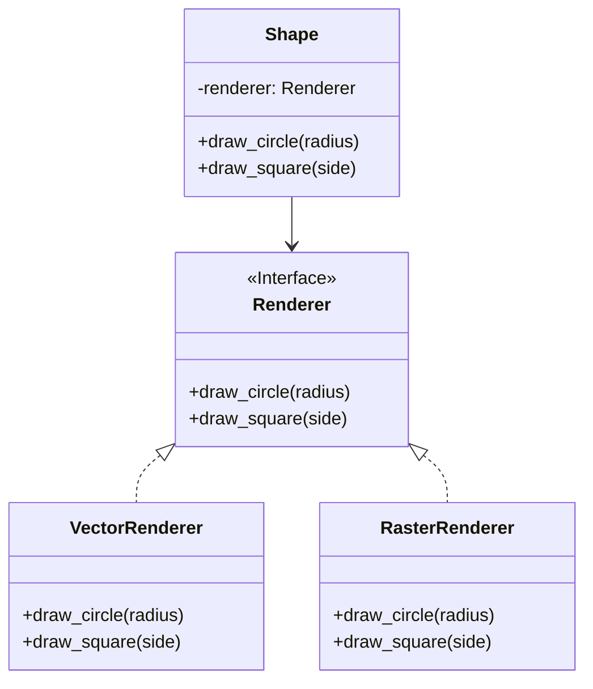

## 6.7. Bridge Pattern for Decoupling Abstraction

In this section, we delve into the Bridge Pattern, a structural design pattern that plays a crucial role in decoupling abstraction from implementation. This pattern is particularly beneficial in scenarios where you want to allow the abstraction and implementation to vary independently, making your codebase more flexible and easier to maintain.

### Separating Abstraction from Implementation

The Bridge Pattern is designed to separate the abstraction from its implementation, allowing both to evolve independently without affecting each other. This separation is achieved by creating two separate class hierarchies: one for the abstraction and one for the implementation.

#### Intent

The primary intent of the Bridge Pattern is to decouple an abstraction from its implementation so that the two can vary independently. This is particularly useful when:

- You have a high-level abstraction that needs to work with multiple implementations.
- You want to avoid a permanent binding between the abstraction and its implementation.
- You aim to enhance the flexibility and scalability of your system by supporting multiple platforms or backends.

#### Key Participants

- **Abstraction**: Defines the abstraction's interface and maintains a reference to an object of type Implementor.
- **Refined Abstraction**: Extends the interface defined by Abstraction.
- **Implementor**: Defines the interface for implementation classes. This interface doesn't have to correspond exactly to the Abstraction's interface; in fact, the two interfaces can be quite different.
- **Concrete Implementor**: Implements the Implementor interface and defines its concrete implementation.

### Implementing the Bridge Pattern in Elixir

In Elixir, we can leverage behaviors and modules to implement the Bridge Pattern. Behaviors in Elixir are akin to interfaces in object-oriented languages, allowing us to define a set of functions that must be implemented by any module that adopts the behavior.

#### Using Behaviors and Modules

Let's illustrate the Bridge Pattern with an example. Suppose we are building a cross-platform drawing application that needs to support different rendering engines.

```elixir
# Define the behavior for the rendering engine
defmodule Renderer do
  @callback draw_circle(radius :: float) :: :ok
  @callback draw_square(side :: float) :: :ok
end

# Concrete Implementor for a vector renderer
defmodule VectorRenderer do
  @behaviour Renderer

  def draw_circle(radius) do
    IO.puts("Drawing circle with radius #{radius} using vector renderer.")
    :ok
  end

  def draw_square(side) do
    IO.puts("Drawing square with side #{side} using vector renderer.")
    :ok
  end
end

# Concrete Implementor for a raster renderer
defmodule RasterRenderer do
  @behaviour Renderer

  def draw_circle(radius) do
    IO.puts("Drawing circle with radius #{radius} using raster renderer.")
    :ok
  end

  def draw_square(side) do
    IO.puts("Drawing square with side #{side} using raster renderer.")
    :ok
  end
end

# Abstraction
defmodule Shape do
  defstruct [:renderer]

  def draw_circle(%Shape{renderer: renderer}, radius) do
    renderer.draw_circle(radius)
  end

  def draw_square(%Shape{renderer: renderer}, side) do
    renderer.draw_square(side)
  end
end

# Client code
vector_renderer = %Shape{renderer: VectorRenderer}
raster_renderer = %Shape{renderer: RasterRenderer}

Shape.draw_circle(vector_renderer, 5.0)
Shape.draw_square(raster_renderer, 10.0)
```

In this example:

- **Renderer** is the behavior that defines the interface for the rendering engines.
- **VectorRenderer** and **RasterRenderer** are concrete implementors that provide specific implementations for rendering shapes.
- **Shape** is the abstraction that uses a renderer to draw shapes.

### Visualizing the Bridge Pattern

To better understand the Bridge Pattern, let's visualize its structure using a class diagram:


```mermaid
classDiagram
    class Renderer {
        <<Interface>>
        +draw_circle(radius)
        +draw_square(side)
    }

    class VectorRenderer {
        +draw_circle(radius)
        +draw_square(side)
    }

    class RasterRenderer {
        +draw_circle(radius)
        +draw_square(side)
    }

    class Shape {
        -renderer: Renderer
        +draw_circle(radius)
        +draw_square(side)
    }

    Renderer <|.. VectorRenderer
    Renderer <|.. RasterRenderer
    Shape --> Renderer
```

**Diagram Explanation:**  
- The **Renderer** interface is implemented by **VectorRenderer** and **RasterRenderer**.
- The **Shape** class maintains a reference to an object of type **Renderer**, allowing it to use any rendering implementation.

### Use Cases for the Bridge Pattern

The Bridge Pattern is particularly useful in the following scenarios:

- **Cross-Platform Applications**: When developing applications that need to support multiple platforms, the Bridge Pattern allows you to separate platform-specific code from the core logic.
- **Multiple Backends**: If your application needs to support different backends or services, the Bridge Pattern can help manage these variations without cluttering the core logic.
- **User Interface Libraries**: When building UI libraries that need to support different rendering engines or themes, the Bridge Pattern can separate the UI logic from the rendering logic.

### Design Considerations

When implementing the Bridge Pattern, consider the following:

- **Complexity**: The Bridge Pattern can introduce additional complexity due to the separation of abstraction and implementation. Ensure that the benefits of flexibility and scalability outweigh this complexity.
- **Performance**: The indirection introduced by the Bridge Pattern may have a performance impact. Evaluate whether this impact is acceptable for your application's performance requirements.
- **Maintainability**: The pattern can improve maintainability by decoupling code, but it also requires careful management of the abstraction and implementation hierarchies.

### Elixir Unique Features

Elixir's unique features, such as its emphasis on immutability and concurrency, can enhance the implementation of the Bridge Pattern:

- **Immutability**: Elixir's immutable data structures can help ensure that the state of the abstraction and implementation remains consistent.
- **Concurrency**: Elixir's lightweight processes can be used to run different implementations concurrently, enhancing the performance of applications using the Bridge Pattern.

### Differences and Similarities with Other Patterns

The Bridge Pattern is often confused with the Adapter Pattern. While both patterns involve abstraction, they serve different purposes:

- **Bridge Pattern**: Focuses on decoupling abstraction from implementation, allowing them to vary independently.
- **Adapter Pattern**: Focuses on converting the interface of a class into another interface that clients expect, facilitating compatibility between interfaces.

### Try It Yourself

To deepen your understanding of the Bridge Pattern, try modifying the code example provided:

- Add a new renderer implementation, such as a **3DRenderer**, and update the client code to use it.
- Experiment with adding new shapes to the **Shape** module, such as triangles or rectangles.

### Knowledge Check

Before we conclude, let's reinforce what we've learned about the Bridge Pattern with a few questions:

1. What is the primary intent of the Bridge Pattern?
2. How does the Bridge Pattern differ from the Adapter Pattern?
3. In what scenarios is the Bridge Pattern particularly useful?

### Embrace the Journey

Remember, mastering design patterns like the Bridge Pattern is a journey. As you continue to explore and experiment with these patterns, you'll gain deeper insights into how they can enhance your software design. Keep experimenting, stay curious, and enjoy the process of learning and applying new concepts!

## Quiz Time!



### What is the primary intent of the Bridge Pattern?

- [x] To decouple an abstraction from its implementation so that the two can vary independently.
- [ ] To convert the interface of a class into another interface that clients expect.
- [ ] To provide a way to access the elements of an aggregate object sequentially.
- [ ] To define a family of algorithms, encapsulate each one, and make them interchangeable.

> **Explanation:** The Bridge Pattern aims to decouple abstraction from implementation, allowing them to vary independently.

### How does the Bridge Pattern differ from the Adapter Pattern?

- [x] The Bridge Pattern focuses on decoupling abstraction from implementation, while the Adapter Pattern focuses on converting interfaces.
- [ ] The Bridge Pattern is used for creating objects, while the Adapter Pattern is used for structuring code.
- [ ] The Bridge Pattern is used for simplifying complex interfaces, while the Adapter Pattern is used for enhancing performance.
- [ ] The Bridge Pattern is used for managing object lifecycles, while the Adapter Pattern is used for managing dependencies.

> **Explanation:** The Bridge Pattern decouples abstraction from implementation, while the Adapter Pattern converts interfaces to make them compatible.

### Which of the following is a key participant in the Bridge Pattern?

- [x] Abstraction
- [ ] Singleton
- [ ] Factory
- [ ] Observer

> **Explanation:** The Abstraction is a key participant in the Bridge Pattern, defining the interface and maintaining a reference to the Implementor.

### In Elixir, what can be used to implement the Bridge Pattern?

- [x] Behaviors and modules
- [ ] Processes and GenServers
- [ ] Supervisors and Supervision Trees
- [ ] Protocols and Structs

> **Explanation:** Behaviors and modules in Elixir can be used to implement the Bridge Pattern by defining interfaces and implementations.

### What is a common use case for the Bridge Pattern?

- [x] Cross-platform applications
- [ ] Singleton management
- [ ] Event-driven architectures
- [ ] Data serialization

> **Explanation:** The Bridge Pattern is commonly used in cross-platform applications to separate platform-specific code from core logic.

### Which of the following is a benefit of using the Bridge Pattern?

- [x] Increased flexibility and scalability
- [ ] Simplified object creation
- [ ] Enhanced performance through direct access
- [ ] Reduced memory usage

> **Explanation:** The Bridge Pattern increases flexibility and scalability by allowing abstraction and implementation to vary independently.

### What is a potential drawback of the Bridge Pattern?

- [x] Increased complexity due to separation of abstraction and implementation
- [ ] Limited support for concurrent operations
- [ ] Difficulty in managing object lifecycles
- [ ] Reduced compatibility with existing code

> **Explanation:** The Bridge Pattern can introduce complexity due to the separation of abstraction and implementation.

### How can Elixir's concurrency features enhance the Bridge Pattern?

- [x] By running different implementations concurrently
- [ ] By simplifying the creation of new abstractions
- [ ] By reducing the need for interface conversions
- [ ] By enhancing memory management capabilities

> **Explanation:** Elixir's concurrency features can enhance the Bridge Pattern by allowing different implementations to run concurrently.

### What is the role of the Implementor in the Bridge Pattern?

- [x] To define the interface for implementation classes
- [ ] To provide a default implementation for the abstraction
- [ ] To manage the lifecycle of abstraction objects
- [ ] To convert interfaces for compatibility

> **Explanation:** The Implementor defines the interface for implementation classes in the Bridge Pattern.

### True or False: The Bridge Pattern can be used to support multiple backends in an application.

- [x] True
- [ ] False

> **Explanation:** True. The Bridge Pattern can be used to support multiple backends by decoupling the abstraction from the implementation.


