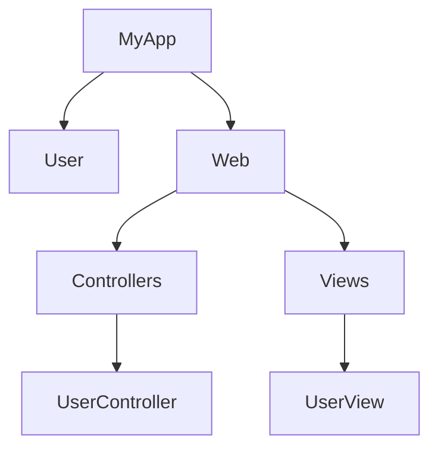

## 6.8. Module Structuring for Maintainable Code

In the realm of software development, particularly in Elixir, structuring your codebase effectively is paramount for creating maintainable and scalable applications. This section delves into the intricacies of module structuring, providing expert guidance on organizing your codebase to enhance readability and maintainability. We will explore best practices, use cases, and practical examples to equip you with the knowledge to structure your Elixir modules efficiently.

### Organizing Codebase

#### Importance of Module Structuring

Modules in Elixir serve as the building blocks of your application, encapsulating related functions and data. Proper module structuring is crucial for several reasons:

- **Readability**: A well-organized codebase is easier to read and understand, reducing the cognitive load on developers.
- **Maintainability**: Clear module boundaries and organization make it easier to modify and extend the codebase.
- **Scalability**: As your application grows, a structured codebase allows for seamless integration of new features and components.

#### Key Concepts in Module Structuring

Before diving into best practices, let's clarify some key concepts:

- **Module**: A module in Elixir is a collection of functions and data that are logically related. It serves as a namespace to prevent naming conflicts.
- **Nested Modules**: Elixir allows modules to be nested within each other, providing a hierarchical structure that can mirror the logical organization of your application.
- **Function Grouping**: Grouping related functions within a module enhances readability and provides a clear understanding of the module's purpose.

### Best Practices

#### Clear Module Boundaries

Establishing clear module boundaries is essential for maintaining a clean and organized codebase. Here are some best practices:

1. **Single Responsibility Principle**: Each module should have a single responsibility or purpose. Avoid cramming unrelated functions into a single module.

2. **Logical Grouping**: Group functions that operate on similar data or perform related tasks within the same module.

3. **Consistent Naming Conventions**: Use descriptive and consistent naming conventions for modules and functions to convey their purpose clearly.

4. **Encapsulation**: Encapsulate implementation details within modules, exposing only the necessary functions through a well-defined API.

#### Grouping Related Functions

Grouping related functions within a module enhances readability and provides a clear understanding of the module's purpose. Consider the following strategies:

- **Function Cohesion**: Ensure that functions within a module are cohesive and related to the module's primary responsibility.

- **Public and Private Functions**: Distinguish between public and private functions. Public functions form the module's API, while private functions are internal helpers.

- **Documentation**: Document each function with clear descriptions and examples to aid understanding and usage.

#### Using Nested Modules Appropriately

Nested modules provide a hierarchical structure that can mirror the logical organization of your application. Here are some guidelines for using nested modules effectively:

- **Logical Hierarchy**: Use nested modules to represent a logical hierarchy within your application. For example, in a web application, you might have `MyApp.Web.Controllers` and `MyApp.Web.Views`.

- **Avoid Deep Nesting**: While nested modules can be useful, avoid excessive nesting, which can lead to complex and hard-to-navigate code.

- **Namespace Management**: Use nested modules to manage namespaces and prevent naming conflicts.

### Use Cases

#### Large Codebases

In large codebases, module structuring becomes even more critical. Here are some strategies for managing large codebases:

- **Modular Design**: Break down the application into smaller, manageable modules, each responsible for a specific aspect of the application.

- **Domain-Driven Design**: Organize modules around the core domains of your application, aligning them with business logic and processes.

- **Consistent Structure**: Maintain a consistent structure across modules to facilitate navigation and understanding.

#### Libraries with Extensive Functionality

When developing libraries with extensive functionality, module structuring plays a vital role in usability and maintainability:

- **API Design**: Design a clear and intuitive API by organizing functions into logical modules.

- **Documentation**: Provide comprehensive documentation for each module and function, including usage examples and edge cases.

- **Versioning**: Use versioning to manage changes and updates to the library, ensuring backward compatibility.

### Code Examples

Let's explore some code examples to illustrate these concepts.

#### Example 1: Clear Module Boundaries

```elixir
defmodule MyApp.User do
  @moduledoc """
  Provides functions for managing users.
  """

  def create_user(attrs) do
    # Function to create a new user
  end

  def get_user(id) do
    # Function to retrieve a user by ID
  end

  def update_user(id, attrs) do
    # Function to update user details
  end

  def delete_user(id) do
    # Function to delete a user
  end
end
```

In this example, the `MyApp.User` module is responsible for managing user-related operations, adhering to the single responsibility principle.

#### Example 2: Using Nested Modules

```elixir
defmodule MyApp.Web do
  defmodule Controllers do
    defmodule UserController do
      def index(conn, _params) do
        # Function to list users
      end

      def show(conn, %{"id" => id}) do
        # Function to show a specific user
      end
    end
  end

  defmodule Views do
    defmodule UserView do
      def render("index.html", assigns) do
        # Function to render user index page
      end

      def render("show.html", assigns) do
        # Function to render user show page
      end
    end
  end
end
```

This example demonstrates the use of nested modules to organize controllers and views within a web application.

### Visualizing Module Structure

To better understand the module structure, let's visualize it using a Mermaid.js diagram.



**Diagram Description**: This diagram illustrates the hierarchical structure of modules within the `MyApp` application. The `User` module is separate from the `Web` module, which contains nested modules for `Controllers` and `Views`.

### References and Links

For further reading on module structuring and best practices, consider the following resources:

- [Elixir Official Documentation](https://elixir-lang.org/docs.html)
- [Elixir Style Guide](https://github.com/christopheradams/elixir_style_guide)
- [Domain-Driven Design](https://www.domainlanguage.com/ddd/)

### Knowledge Check

To reinforce your understanding of module structuring, consider the following questions:

1. What is the primary purpose of a module in Elixir?
2. How can nested modules enhance code organization?
3. What are some best practices for grouping related functions within a module?
4. Why is it important to establish clear module boundaries?
5. How can module structuring benefit large codebases?

### Embrace the Journey

Remember, mastering module structuring is a journey. As you progress, you'll develop a deeper understanding of how to organize your codebase effectively. Keep experimenting, stay curious, and enjoy the process of creating maintainable and scalable applications.

### Quiz: Module Structuring for Maintainable Code



### What is the primary purpose of a module in Elixir?

- [x] To encapsulate related functions and data
- [ ] To serve as a database
- [ ] To manage external dependencies
- [ ] To handle user authentication

> **Explanation:** Modules in Elixir are used to encapsulate related functions and data, providing a namespace to prevent naming conflicts.

### How can nested modules enhance code organization?

- [x] By providing a hierarchical structure
- [ ] By increasing code complexity
- [ ] By reducing code readability
- [ ] By eliminating the need for documentation

> **Explanation:** Nested modules provide a hierarchical structure that mirrors the logical organization of your application, enhancing code organization.

### What is a best practice for grouping related functions within a module?

- [x] Ensuring function cohesion
- [ ] Mixing unrelated functions
- [ ] Avoiding documentation
- [ ] Using inconsistent naming conventions

> **Explanation:** Grouping related functions within a module ensures function cohesion, enhancing readability and understanding.

### Why is it important to establish clear module boundaries?

- [x] To maintain a clean and organized codebase
- [ ] To increase code complexity
- [ ] To reduce code readability
- [ ] To eliminate the need for testing

> **Explanation:** Clear module boundaries help maintain a clean and organized codebase, making it easier to modify and extend.

### How can module structuring benefit large codebases?

- [x] By facilitating navigation and understanding
- [ ] By increasing code complexity
- [ ] By reducing scalability
- [ ] By eliminating the need for documentation

> **Explanation:** Module structuring facilitates navigation and understanding in large codebases, making it easier to manage and extend.

### What is a key consideration when using nested modules?

- [x] Avoiding excessive nesting
- [ ] Increasing code complexity
- [ ] Reducing code readability
- [ ] Eliminating the need for documentation

> **Explanation:** While nested modules can be useful, excessive nesting can lead to complex and hard-to-navigate code.

### What is the role of public and private functions in a module?

- [x] Public functions form the module's API, while private functions are internal helpers
- [ ] Public functions are for testing, while private functions are for production
- [ ] Public functions are for documentation, while private functions are for implementation
- [ ] Public functions are for debugging, while private functions are for deployment

> **Explanation:** Public functions form the module's API, while private functions are internal helpers used within the module.

### What is a benefit of using consistent naming conventions in modules?

- [x] It conveys the purpose of modules and functions clearly
- [ ] It increases code complexity
- [ ] It reduces code readability
- [ ] It eliminates the need for documentation

> **Explanation:** Consistent naming conventions convey the purpose of modules and functions clearly, enhancing readability and understanding.

### How can module structuring aid in developing libraries with extensive functionality?

- [x] By designing a clear and intuitive API
- [ ] By increasing code complexity
- [ ] By reducing usability
- [ ] By eliminating the need for documentation

> **Explanation:** Module structuring aids in developing libraries by designing a clear and intuitive API, enhancing usability and maintainability.

### True or False: Module structuring is only important for small codebases.

- [ ] True
- [x] False

> **Explanation:** Module structuring is important for both small and large codebases, as it enhances readability, maintainability, and scalability.



By following these guidelines and best practices, you'll be well-equipped to structure your Elixir modules for maintainable and scalable code. Keep exploring and refining your approach to module structuring as you continue your journey in software development.
