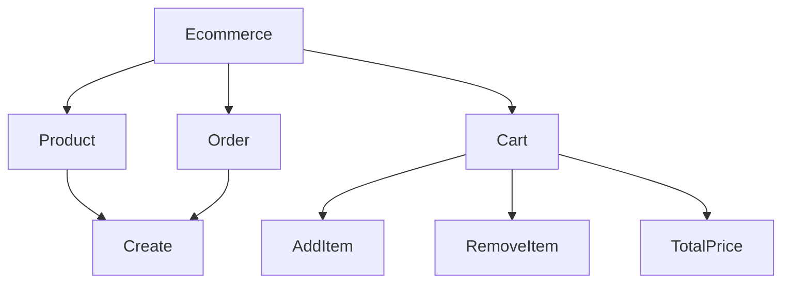

## 6.8. Module Structuring for Maintainable Code

As software systems grow, maintaining a clean and organized codebase becomes crucial. In Elixir, structuring modules effectively is key to achieving maintainability and readability. This section delves into best practices for module structuring in Elixir, providing expert insights into organizing your codebase for long-term success.

### Organizing Codebase

Effective module structuring is the backbone of a maintainable codebase. In Elixir, a functional programming language, modules serve as containers for functions and data types, making it essential to organize them thoughtfully. Let's explore how to structure modules to enhance readability and maintainability.

#### Clear Module Boundaries

Define clear boundaries for each module. Modules should have a single responsibility, encapsulating related functions and data structures. This aligns with the Single Responsibility Principle (SRP), which states that a module should have one reason to change.

**Example:**

```elixir
defmodule User do
  defstruct [:id, :name, :email]

  def create(attrs) do
    %User{id: attrs[:id], name: attrs[:name], email: attrs[:email]}
  end

  def update(user, attrs) do
    %{user | name: attrs[:name], email: attrs[:email]}
  end
end
```

In this example, the `User` module is responsible for managing user data, encapsulating functions related to user creation and updates.

#### Grouping Related Functions

Group related functions within a module to improve readability. Functions that operate on similar data or perform related tasks should reside together. This makes it easier for developers to understand and navigate the code.

**Example:**

```elixir
defmodule ShoppingCart do
  def add_item(cart, item) do
    # Adds an item to the cart
  end

  def remove_item(cart, item) do
    # Removes an item from the cart
  end

  def total_price(cart) do
    # Calculates the total price of items in the cart
  end
end
```

Here, the `ShoppingCart` module groups functions related to cart operations, making it intuitive to find and modify cart-related logic.

#### Using Nested Modules Appropriately

Nested modules can help organize code hierarchically, especially in large codebases. Use nested modules to represent subdomains or components within a larger domain. However, avoid excessive nesting, which can lead to complexity.

**Example:**

```elixir
defmodule Ecommerce do
  defmodule Product do
    defstruct [:id, :name, :price]

    def create(attrs) do
      %Product{id: attrs[:id], name: attrs[:name], price: attrs[:price]}
    end
  end

  defmodule Order do
    defstruct [:id, :products, :total_price]

    def create(attrs) do
      %Order{id: attrs[:id], products: attrs[:products], total_price: attrs[:total_price]}
    end
  end
end
```

In this example, `Ecommerce` serves as a top-level module, with `Product` and `Order` as nested modules representing different aspects of the e-commerce domain.

### Best Practices

Implementing best practices in module structuring ensures that your codebase remains maintainable and scalable. Let's explore some key practices to follow.

#### Consistent Naming Conventions

Adopt consistent naming conventions for modules and functions. Use descriptive names that convey the purpose and functionality of the module or function. This enhances readability and makes it easier for developers to understand the code.

#### Documentation and Comments

Provide comprehensive documentation and comments for modules and functions. Use Elixir's `@doc` and `@moduledoc` attributes to document the purpose and usage of modules and functions. This aids in onboarding new developers and maintaining the codebase.

**Example:**

```elixir
defmodule Math do
  @moduledoc """
  A module for performing basic mathematical operations.
  """

  @doc """
  Adds two numbers.
  """
  def add(a, b) do
    a + b
  end
end
```

#### Modular Design

Design your application in a modular fashion, breaking down complex functionality into smaller, reusable modules. This promotes code reuse and simplifies testing and maintenance.

**Example:**

```elixir
defmodule Payment do
  defmodule Gateway do
    def process_payment(payment_details) do
      # Process payment through the gateway
    end
  end

  defmodule Validator do
    def validate_payment(payment_details) do
      # Validate payment details
    end
  end
end
```

In this example, the `Payment` module is divided into `Gateway` and `Validator` submodules, each responsible for a specific aspect of payment processing.

### Use Cases

Module structuring is particularly beneficial in large codebases and libraries with extensive functionality. Let's explore some use cases where effective module structuring plays a crucial role.

#### Large Codebases

In large codebases, organizing modules effectively helps manage complexity and facilitates collaboration among developers. Clear module boundaries and consistent naming conventions make it easier to navigate and understand the code.

#### Libraries with Extensive Functionality

For libraries with extensive functionality, structuring modules logically ensures that users can easily find and use the library's features. Group related functions and provide comprehensive documentation to enhance the user experience.

### Code Examples

Let's dive into some code examples that demonstrate effective module structuring in Elixir.

#### Example 1: User Management System

```elixir
defmodule UserManager do
  defmodule User do
    defstruct [:id, :name, :email]

    def create(attrs) do
      %User{id: attrs[:id], name: attrs[:name], email: attrs[:email]}
    end

    def update(user, attrs) do
      %{user | name: attrs[:name], email: attrs[:email]}
    end
  end

  defmodule Auth do
    def login(email, password) do
      # Authenticate user
    end

    def logout(user) do
      # Log out user
    end
  end
end
```

In this example, the `UserManager` module contains nested modules `User` and `Auth`, each responsible for a specific aspect of user management.

#### Example 2: E-commerce Platform

```elixir
defmodule Ecommerce do
  defmodule Product do
    defstruct [:id, :name, :price]

    def create(attrs) do
      %Product{id: attrs[:id], name: attrs[:name], price: attrs[:price]}
    end
  end

  defmodule Order do
    defstruct [:id, :products, :total_price]

    def create(attrs) do
      %Order{id: attrs[:id], products: attrs[:products], total_price: attrs[:total_price]}
    end
  end

  defmodule Cart do
    def add_item(cart, item) do
      # Adds an item to the cart
    end

    def remove_item(cart, item) do
      # Removes an item from the cart
    end

    def total_price(cart) do
      # Calculates the total price of items in the cart
    end
  end
end
```

Here, the `Ecommerce` module is structured into `Product`, `Order`, and `Cart` submodules, each focusing on a different aspect of the e-commerce platform.

### Visualizing Module Structure

To better understand module structuring, let's visualize the structure of an e-commerce platform using a diagram.


```mermaid
graph TD;
    Ecommerce --> Product
    Ecommerce --> Order
    Ecommerce --> Cart
    Product --> Create
    Order --> Create
    Cart --> AddItem
    Cart --> RemoveItem
    Cart --> TotalPrice
```

**Description:** This diagram illustrates the hierarchical structure of the `Ecommerce` module, with `Product`, `Order`, and `Cart` as submodules. Each submodule contains functions related to its domain.

### Key Takeaways

- **Define Clear Module Boundaries:** Ensure each module has a single responsibility and encapsulates related functions and data.
- **Group Related Functions:** Organize functions within a module based on their purpose and functionality.
- **Use Nested Modules Appropriately:** Leverage nested modules to represent subdomains or components within a larger domain.
- **Adopt Consistent Naming Conventions:** Use descriptive names for modules and functions to enhance readability.
- **Provide Comprehensive Documentation:** Document modules and functions using Elixir's `@doc` and `@moduledoc` attributes.

### Try It Yourself

Experiment with the code examples provided in this section. Try modifying the structure of the modules or adding new functions to see how it affects readability and maintainability. Consider creating your own module hierarchy for a small project to practice these concepts.

### References and Further Reading

- [Elixir Documentation](https://elixir-lang.org/docs.html)
- [Elixir School: Modules](https://elixirschool.com/en/lessons/basics/modules/)

## Quiz Time!



### What is the primary purpose of structuring modules in Elixir?

- [x] To enhance readability and maintainability
- [ ] To increase code execution speed
- [ ] To reduce the number of lines of code
- [ ] To improve memory usage

> **Explanation:** Structuring modules effectively enhances readability and maintainability of the codebase.

### Which principle states that a module should have a single responsibility?

- [x] Single Responsibility Principle
- [ ] Open/Closed Principle
- [ ] Dependency Inversion Principle
- [ ] Interface Segregation Principle

> **Explanation:** The Single Responsibility Principle (SRP) states that a module should have one reason to change.

### What is a benefit of grouping related functions within a module?

- [x] It improves readability
- [ ] It reduces compilation time
- [ ] It increases code execution speed
- [ ] It decreases memory usage

> **Explanation:** Grouping related functions within a module improves readability by making it easier to understand and navigate the code.

### When should nested modules be used?

- [x] To represent subdomains or components within a larger domain
- [ ] To increase code execution speed
- [ ] To reduce memory usage
- [ ] To decrease the number of lines of code

> **Explanation:** Nested modules should be used to represent subdomains or components within a larger domain, helping organize the code hierarchically.

### What should be included in module documentation?

- [x] Purpose and usage of the module
- [ ] The number of lines of code
- [ ] Compilation time
- [ ] Memory usage

> **Explanation:** Module documentation should include the purpose and usage of the module to aid understanding and maintenance.

### What is a key consideration when adopting naming conventions for modules?

- [x] Consistency
- [ ] Length
- [ ] Complexity
- [ ] Execution speed

> **Explanation:** Consistency in naming conventions enhances readability and makes it easier for developers to understand the code.

### How can modular design benefit an application?

- [x] By promoting code reuse and simplifying testing and maintenance
- [ ] By increasing code execution speed
- [ ] By reducing memory usage
- [ ] By decreasing the number of lines of code

> **Explanation:** Modular design promotes code reuse and simplifies testing and maintenance, making the application easier to manage.

### What is a potential downside of excessive nesting in modules?

- [x] Increased complexity
- [ ] Reduced code execution speed
- [ ] Increased memory usage
- [ ] Decreased readability

> **Explanation:** Excessive nesting can lead to increased complexity, making the code harder to understand and maintain.

### What is the role of the `@doc` attribute in Elixir?

- [x] To document the purpose and usage of functions
- [ ] To increase code execution speed
- [ ] To reduce memory usage
- [ ] To decrease the number of lines of code

> **Explanation:** The `@doc` attribute is used to document the purpose and usage of functions, aiding in understanding and maintenance.

### True or False: Module structuring is only beneficial for small codebases.

- [ ] True
- [x] False

> **Explanation:** Module structuring is beneficial for both small and large codebases, helping manage complexity and improve maintainability.



Remember, effective module structuring is an ongoing process. As your codebase evolves, revisit your module organization to ensure it remains clear and maintainable. Keep experimenting, stay curious, and enjoy the journey of mastering Elixir!
