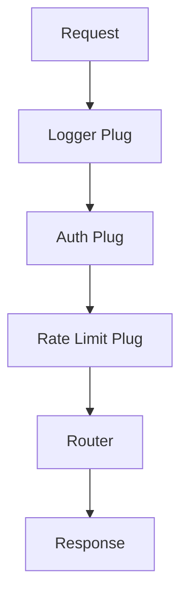

## 6.9. Implementing Wrappers and Middleware

In the world of software development, cross-cutting concerns such as logging, metrics, and error handling are essential for building robust applications. In Elixir, these concerns can be elegantly managed using wrappers and middleware. This section will guide you through the process of implementing these patterns, focusing on their application in Elixir's functional programming paradigm.

### Introduction to Wrappers and Middleware

#### Wrappers

Wrappers are a design pattern used to add additional behavior to existing functions or modules without modifying their code. This is particularly useful for injecting cross-cutting concerns such as logging, authentication, or error handling. In Elixir, wrappers can be implemented using higher-order functions, which allow you to pass functions as arguments and return them as results.

#### Middleware

Middleware refers to a series of processing steps that a request passes through. Each step can modify the request, perform actions, or halt the processing. In Elixir, middleware is commonly used in web applications, particularly with the Phoenix framework, where the Plug library provides a powerful way to build request pipelines.

### Adding Cross-Cutting Concerns with Wrappers

#### Using Wrappers for Logging

Logging is a critical aspect of any application, providing insights into its behavior and helping with debugging. In Elixir, you can use wrappers to add logging to functions without altering their core logic.

```elixir
defmodule LoggerWrapper do
  def wrap_with_logging(func) do
    fn args ->
      IO.puts("Calling function with args: #{inspect(args)}")
      result = func.(args)
      IO.puts("Function returned: #{inspect(result)}")
      result
    end
  end
end

# Example usage
add = fn {a, b} -> a + b end
logged_add = LoggerWrapper.wrap_with_logging(add)
logged_add.({1, 2})
```

In this example, `wrap_with_logging/1` is a higher-order function that takes another function as an argument and returns a new function that logs the input and output.

#### Implementing Metrics Collection

Metrics collection is another common cross-cutting concern. By wrapping functions, you can measure execution time or count the number of calls.

```elixir
defmodule MetricsWrapper do
  def wrap_with_metrics(func) do
    fn args ->
      start_time = System.monotonic_time()
      result = func.(args)
      end_time = System.monotonic_time()
      IO.puts("Execution time: #{end_time - start_time} microseconds")
      result
    end
  end
end

# Example usage
multiply = fn {a, b} -> a * b end
timed_multiply = MetricsWrapper.wrap_with_metrics(multiply)
timed_multiply.({3, 4})
```

This wrapper calculates the execution time of the wrapped function and logs it.

#### Error Handling with Wrappers

Error handling is crucial for building resilient applications. Wrappers can be used to catch and handle errors gracefully.

```elixir
defmodule ErrorHandlerWrapper do
  def wrap_with_error_handling(func) do
    fn args ->
      try do
        func.(args)
      rescue
        e -> IO.puts("Error occurred: #{inspect(e)}")
      end
    end
  end
end

# Example usage
divide = fn {a, b} -> a / b end
safe_divide = ErrorHandlerWrapper.wrap_with_error_handling(divide)
safe_divide.({4, 0})
```

Here, the wrapper catches any exceptions raised by the function and logs an error message.

### Implementing Middleware in Elixir

Middleware in Elixir is often associated with the Plug library, which provides a composable way to build request pipelines in web applications.

#### Building a Simple Plug

A Plug is a module that implements two functions: `init/1` and `call/2`. The `init/1` function is used to initialize options, while `call/2` processes the request.

```elixir
defmodule MyPlug do
  import Plug.Conn

  def init(options), do: options

  def call(conn, _opts) do
    IO.puts("Processing request: #{conn.request_path}")
    conn
  end
end
```

This simple plug logs the request path. To use it in a Phoenix application, add it to the endpoint or a specific router pipeline.

#### Creating a Middleware Pipeline

Middleware pipelines allow you to chain multiple plugs together, processing requests in a specific order.

```elixir
defmodule MyApp.Router do
  use Plug.Router

  plug :match
  plug :dispatch

  plug MyPlug

  get "/" do
    send_resp(conn, 200, "Hello, world!")
  end
end
```

In this example, `MyPlug` is part of the pipeline, and it will process every request before reaching the route handler.

#### Advanced Middleware Concepts

Middleware can also be used for more advanced tasks, such as authentication, rate limiting, or content negotiation.

##### Authentication Middleware

```elixir
defmodule AuthPlug do
  import Plug.Conn

  def init(options), do: options

  def call(conn, _opts) do
    if get_req_header(conn, "authorization") == ["Bearer secret"] do
      conn
    else
      conn
      |> send_resp(401, "Unauthorized")
      |> halt()
    end
  end
end
```

This plug checks for a specific authorization header and halts the connection if it's missing or incorrect.

##### Rate Limiting Middleware

```elixir
defmodule RateLimitPlug do
  import Plug.Conn

  def init(options), do: options

  def call(conn, _opts) do
    if rate_limit_exceeded?(conn) do
      conn
      |> send_resp(429, "Too Many Requests")
      |> halt()
    else
      conn
    end
  end

  defp rate_limit_exceeded?(_conn), do: false # Implement your logic here
end
```

This plug demonstrates how to implement rate limiting by checking if a request exceeds a predefined limit.

### Use Cases for Wrappers and Middleware

#### Web Servers

In web servers, middleware is used to handle requests, perform authentication, log requests, and more. The Plug library in Elixir is a prime example of middleware in action.

#### Request Handling in Phoenix

Phoenix, a popular web framework in Elixir, uses Plug to manage request pipelines. This allows developers to easily add and remove functionality from the request processing flow.

### Visualizing Middleware Pipelines

To better understand how middleware works, let's visualize a simple pipeline using Mermaid.js.



This diagram shows a request passing through a series of plugs before reaching the router, which then generates a response.

### Key Participants

- **Plug**: The building block of middleware in Elixir, responsible for processing requests.
- **Conn**: Represents the connection in a Plug pipeline, carrying request and response data.
- **Router**: Directs requests to the appropriate handler based on the request path.

### Applicability

Wrappers and middleware are applicable in any scenario where you need to add cross-cutting concerns or build processing pipelines. They are particularly useful in web applications, microservices, and distributed systems.

### Design Considerations

When implementing wrappers and middleware, consider the following:

- **Performance**: Each additional wrapper or middleware can add overhead. Ensure that the benefits outweigh the costs.
- **Order of Execution**: The order in which middleware is applied can affect the outcome. Be mindful of dependencies between middleware components.
- **Error Handling**: Ensure that errors are handled gracefully to prevent cascading failures.

### Elixir Unique Features

Elixir's functional programming paradigm and powerful concurrency model make it well-suited for implementing wrappers and middleware. The use of higher-order functions and the Plug library are examples of how Elixir leverages its unique features to provide elegant solutions.

### Differences and Similarities

Wrappers and middleware can be confused with decorators, another design pattern. While both add functionality to existing code, decorators are typically more tightly coupled to the objects they modify, whereas wrappers and middleware are more modular and composable.

### Try It Yourself

Experiment with the code examples provided by modifying the wrapped functions or adding new middleware components. Try implementing a custom plug that performs a specific task, such as logging request headers or modifying the response body.

### Knowledge Check

- What are the benefits of using wrappers for cross-cutting concerns?
- How does the Plug library facilitate middleware in Elixir?
- What are some common use cases for middleware in web applications?

### Summary

In this section, we've explored how to implement wrappers and middleware in Elixir to manage cross-cutting concerns and build processing pipelines. By leveraging Elixir's functional programming features and the Plug library, you can create modular, maintainable, and efficient applications.

Remember, this is just the beginning. As you progress, you'll discover more ways to apply these patterns in your projects. Keep experimenting, stay curious, and enjoy the journey!

## Quiz: Implementing Wrappers and Middleware



### What is the primary purpose of using wrappers in Elixir?

- [x] To add cross-cutting concerns like logging and error handling without modifying the original function.
- [ ] To replace the original function with a new implementation.
- [ ] To optimize the performance of the original function.
- [ ] To convert synchronous functions to asynchronous ones.

> **Explanation:** Wrappers are used to add additional behavior to existing functions, such as logging or error handling, without altering their core logic.

### How does the Plug library facilitate middleware in Elixir?

- [x] By providing a composable way to build request pipelines.
- [ ] By replacing the need for GenServer processes.
- [ ] By offering a GUI for managing middleware components.
- [ ] By automatically generating documentation for middleware.

> **Explanation:** The Plug library allows developers to create middleware components that can be composed into request pipelines, making it easier to manage cross-cutting concerns in web applications.

### What is a common use case for middleware in web applications?

- [x] Request handling and authentication.
- [ ] Database schema migration.
- [ ] Compiling Elixir code.
- [ ] Managing application state.

> **Explanation:** Middleware is commonly used in web applications to handle requests, perform authentication, log requests, and more.

### Which function in a Plug module is responsible for processing requests?

- [x] call/2
- [ ] init/1
- [ ] handle/3
- [ ] process/2

> **Explanation:** The `call/2` function in a Plug module is responsible for processing requests and modifying the connection.

### What is the role of the Conn struct in a Plug pipeline?

- [x] It represents the connection, carrying request and response data.
- [ ] It stores the application's configuration settings.
- [ ] It manages database connections.
- [ ] It handles user authentication.

> **Explanation:** The Conn struct represents the connection in a Plug pipeline, carrying data related to the request and response.

### What is a potential drawback of adding too many middleware components?

- [x] Increased overhead and potential performance issues.
- [ ] Reduced code readability.
- [ ] Difficulty in debugging.
- [ ] Incompatibility with other Elixir libraries.

> **Explanation:** Each additional middleware component can add overhead, potentially leading to performance issues if not managed carefully.

### How can you ensure that errors are handled gracefully in a middleware pipeline?

- [x] By implementing error handling in each middleware component.
- [ ] By using a single global error handler.
- [ ] By avoiding the use of middleware altogether.
- [ ] By logging all requests and responses.

> **Explanation:** Implementing error handling in each middleware component ensures that errors are caught and managed appropriately, preventing cascading failures.

### What is a key difference between wrappers and decorators?

- [x] Wrappers are more modular and composable, while decorators are more tightly coupled to the objects they modify.
- [ ] Decorators are used only in object-oriented programming, while wrappers are used in functional programming.
- [ ] Wrappers are used for performance optimization, while decorators are used for code readability.
- [ ] Decorators are automatically generated, while wrappers are manually implemented.

> **Explanation:** Wrappers are designed to be modular and composable, making them suitable for functional programming, while decorators are often more tightly coupled to the objects they modify.

### What is the purpose of the init/1 function in a Plug module?

- [x] To initialize options for the plug.
- [ ] To process the request and modify the connection.
- [ ] To handle errors in the plug pipeline.
- [ ] To manage database transactions.

> **Explanation:** The `init/1` function is used to initialize options for the plug, which can then be used in the `call/2` function.

### True or False: Middleware can be used to perform content negotiation in web applications.

- [x] True
- [ ] False

> **Explanation:** Middleware can be used to perform content negotiation, allowing the application to serve different content types based on the request headers.




