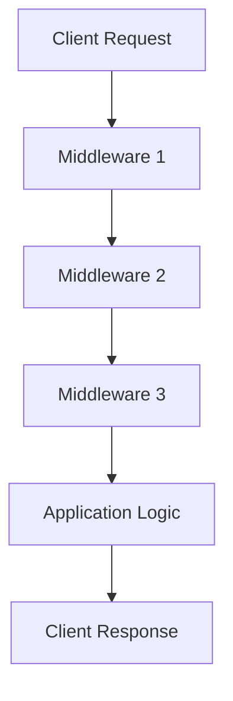

## 6.9. Implementing Wrappers and Middleware

In the realm of software design, the concepts of wrappers and middleware are pivotal for managing cross-cutting concerns such as logging, metrics, and error handling. In Elixir, these patterns are particularly powerful due to the language's functional nature and its robust concurrency model. This section will guide you through the implementation of wrappers and middleware in Elixir, providing you with the tools to build scalable and maintainable systems.

### Adding Cross-Cutting Concerns

Cross-cutting concerns are aspects of a program that affect other parts of the program. These concerns often include logging, security, and error handling. In Elixir, we can use wrappers to encapsulate these concerns, ensuring they are applied consistently across various parts of the application.

#### Using Wrappers in Elixir

Wrappers in Elixir can be implemented using higher-order functions, which allow you to add additional behavior to existing functions. This is particularly useful for injecting functionality such as logging, metrics, or error handling without modifying the core logic of the function.

**Example: Logging Wrapper**

```elixir
defmodule LoggerWrapper do
  def wrap(func) do
    fn args ->
      IO.puts("Function called with arguments: #{inspect(args)}")
      result = func.(args)
      IO.puts("Function returned: #{inspect(result)}")
      result
    end
  end
end

defmodule Example do
  def add(a, b), do: a + b
end

wrapped_add = LoggerWrapper.wrap(&Example.add/2)
wrapped_add.({3, 4})
```

In this example, the `LoggerWrapper` module defines a `wrap` function that takes another function as an argument. It returns a new function that logs the input arguments and the result of the function call.

### Implementing Middleware

Middleware is a design pattern that allows you to build pipelines where requests pass through a series of processing steps. In Elixir, the `Plug` library provides a powerful mechanism for implementing middleware, especially in web applications.

#### Building Middleware with Plug

Plug is a specification for composable modules in web applications. It provides a set of conventions for building middleware that can be used in any Elixir application, not just those built with Phoenix.

**Example: Simple Plug Middleware**

```elixir
defmodule MyApp.Plugs.Logger do
  import Plug.Conn

  def init(default), do: default

  def call(conn, _opts) do
    IO.puts("Request received: #{conn.method} #{conn.request_path}")
    conn
  end
end

defmodule MyApp.Router do
  use Plug.Router

  plug MyApp.Plugs.Logger

  plug :match
  plug :dispatch

  get "/" do
    send_resp(conn, 200, "Hello, world!")
  end
end
```

In this example, `MyApp.Plugs.Logger` is a simple Plug that logs each incoming request. It is used in `MyApp.Router`, where it is added to the pipeline using the `plug` macro.

### Use Cases for Wrappers and Middleware

Wrappers and middleware are widely used in various scenarios. Here are some common use cases:

- **Web Servers**: Middleware can be used to handle authentication, logging, and error handling in web servers.
- **Request Handling in Phoenix**: The Phoenix framework uses Plug to handle HTTP requests, making it easy to add middleware for tasks like request logging and response compression.
- **Microservices**: In a microservices architecture, middleware can be used to manage cross-cutting concerns across different services.

### Design Pattern Name

**Wrappers and Middleware**

### Category

**Structural Design Patterns**

### Intent

The intent of using wrappers and middleware is to separate cross-cutting concerns from the core logic of your application, making it easier to maintain and extend.

### Diagrams

Below is a diagram illustrating the flow of a request through a series of middleware components in a web application.


```mermaid
graph TD;
    A[Client Request] --> B[Middleware 1];
    B --> C[Middleware 2];
    C --> D[Middleware 3];
    D --> E[Application Logic];
    E --> F[Client Response];
```

**Figure 1:** A typical middleware pipeline in a web application.

### Key Participants

- **Client**: Initiates the request.
- **Middleware Components**: Process the request and response, handling cross-cutting concerns.
- **Application Logic**: The core functionality of the application.

### Applicability

Use wrappers and middleware when you need to:

- Add cross-cutting concerns like logging, metrics, or authentication.
- Build scalable and maintainable applications by separating concerns.
- Implement request and response processing pipelines in web applications.

### Sample Code Snippet

Here's a more advanced example of using middleware in a Phoenix application to handle authentication.

```elixir
defmodule MyApp.Plugs.Authentication do
  import Plug.Conn

  def init(opts), do: opts

  def call(conn, _opts) do
    case get_session(conn, :user_id) do
      nil -> 
        conn
        |> put_status(:unauthorized)
        |> halt()
      _user_id -> conn
    end
  end
end

defmodule MyApp.Router do
  use MyApp, :router

  pipeline :authenticated do
    plug MyApp.Plugs.Authentication
  end

  scope "/", MyApp do
    pipe_through :authenticated

    get "/", PageController, :index
  end
end
```

In this example, the `MyApp.Plugs.Authentication` plug checks if a user is authenticated by looking for a `:user_id` in the session. If the user is not authenticated, it halts the connection with an unauthorized status.

### Design Considerations

When using wrappers and middleware, consider the following:

- **Order Matters**: The order in which middleware is applied can affect the behavior of your application. Ensure that middleware is applied in the correct order.
- **Performance**: Adding too many layers of middleware can impact performance. Be mindful of the overhead introduced by each middleware component.
- **Error Handling**: Ensure that middleware components handle errors gracefully and do not expose sensitive information.

### Elixir Unique Features

Elixir's unique features, such as its functional programming paradigm and powerful concurrency model, make it an excellent choice for implementing wrappers and middleware. The use of higher-order functions and the `Plug` library allow for flexible and efficient middleware design.

### Differences and Similarities

Wrappers and middleware are similar in that they both aim to separate cross-cutting concerns from core logic. However, wrappers are generally used for individual functions, while middleware is used for processing pipelines, particularly in web applications.

### Try It Yourself

Experiment with the examples provided by modifying them to suit your needs. For instance, try adding additional logging information or implementing a new middleware component for request throttling.

### Knowledge Check

- What are cross-cutting concerns, and why are they important?
- How can wrappers be used to add functionality to existing functions?
- What is the role of middleware in a web application?

### Summary

In this section, we explored the implementation of wrappers and middleware in Elixir. We covered how to use these patterns to manage cross-cutting concerns and build scalable, maintainable applications. By leveraging Elixir's unique features, you can create powerful middleware pipelines that enhance your application's functionality.

## Quiz Time!



### What is the primary purpose of using wrappers in Elixir?

- [x] To encapsulate cross-cutting concerns like logging and error handling
- [ ] To replace core application logic
- [ ] To improve the performance of functions
- [ ] To manage state across processes

> **Explanation:** Wrappers are used to encapsulate cross-cutting concerns, allowing them to be added to functions without altering the core logic.

### Which Elixir library is commonly used for implementing middleware in web applications?

- [x] Plug
- [ ] Ecto
- [ ] Phoenix
- [ ] Logger

> **Explanation:** Plug is the library used for implementing middleware in Elixir web applications, providing a specification for composable modules.

### In the context of middleware, what does the term "pipeline" refer to?

- [x] A series of processing steps that a request passes through
- [ ] A data structure for managing state
- [ ] A method for optimizing function calls
- [ ] A tool for debugging applications

> **Explanation:** A pipeline refers to a series of processing steps that a request passes through, allowing for modular handling of cross-cutting concerns.

### What is a common use case for middleware in Elixir applications?

- [x] Handling authentication and authorization
- [ ] Managing database transactions
- [ ] Compiling Elixir code
- [ ] Generating HTML templates

> **Explanation:** Middleware is commonly used for handling authentication and authorization, among other cross-cutting concerns.

### How does the order of middleware affect application behavior?

- [x] The order determines the sequence of processing and can affect the outcome
- [ ] The order has no impact on application behavior
- [ ] Middleware components are executed in parallel, so order is irrelevant
- [ ] Middleware is only applied at the end of request processing

> **Explanation:** The order of middleware determines the sequence in which processing occurs, which can affect the behavior and outcome of requests.

### What is the role of the `init` function in a Plug module?

- [x] To initialize options for the Plug
- [ ] To handle incoming requests
- [ ] To generate HTML responses
- [ ] To manage database connections

> **Explanation:** The `init` function in a Plug module initializes options that are passed to the `call` function during request processing.

### What is a potential drawback of using too many middleware components?

- [x] Increased performance overhead
- [ ] Reduced code readability
- [ ] Decreased application security
- [ ] Limited scalability

> **Explanation:** Using too many middleware components can introduce performance overhead, as each component adds processing time.

### How can wrappers be implemented in Elixir?

- [x] Using higher-order functions
- [ ] By modifying the core logic of functions
- [ ] Through direct manipulation of process state
- [ ] By using macros exclusively

> **Explanation:** Wrappers can be implemented using higher-order functions, which allow additional behavior to be added to existing functions.

### What is the primary benefit of separating cross-cutting concerns from core logic?

- [x] Improved maintainability and scalability
- [ ] Enhanced performance
- [ ] Simplified debugging
- [ ] Increased security

> **Explanation:** Separating cross-cutting concerns from core logic improves maintainability and scalability by making the codebase easier to manage and extend.

### True or False: Middleware in Elixir can only be used in web applications.

- [ ] True
- [x] False

> **Explanation:** While middleware is commonly used in web applications, it can be applied in any Elixir application where modular processing of requests or tasks is beneficial.



Remember, mastering wrappers and middleware in Elixir is just the beginning. As you continue to explore these patterns, you'll discover new ways to enhance your applications with cross-cutting concerns. Keep experimenting, stay curious, and enjoy the journey!
