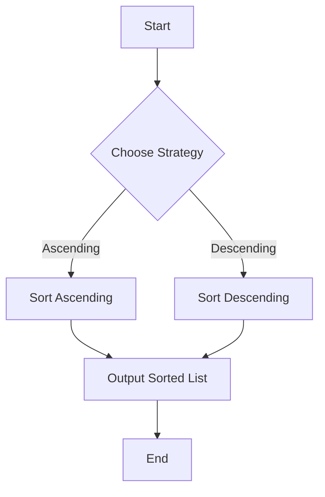

## 7.1. Strategy Pattern with Higher-Order Functions

The Strategy Pattern is a behavioral design pattern that enables selecting an algorithm's behavior at runtime. In Elixir, this pattern can be elegantly implemented using higher-order functions, which are functions that can take other functions as arguments or return them as results. This approach allows for dynamic behavior configuration and encapsulation of interchangeable algorithms.

### Encapsulating Algorithms

In traditional object-oriented programming, the Strategy Pattern involves defining a family of algorithms, encapsulating each one, and making them interchangeable. In Elixir, we achieve this by defining algorithms as separate functions and using higher-order functions to encapsulate and switch between them.

#### Key Concepts

- **Encapsulation**: Each algorithm is encapsulated within its own function.
- **Interchangeability**: Algorithms can be swapped dynamically by passing different functions as arguments.
- **Flexibility**: New algorithms can be added without modifying existing code.

### Implementing the Strategy Pattern

To implement the Strategy Pattern in Elixir, we leverage the language's support for first-class functions and higher-order functions. Let's explore how to achieve this with a practical example.

#### Example: Sorting with Different Comparison Strategies

Consider a scenario where we need to sort a list of numbers, but the sorting criteria can vary. We can implement different comparison strategies and pass them as functions to a sorting algorithm.

```elixir
defmodule Sorter do
  # Sorts a list using the provided comparison function
  def sort(list, compare_func) do
    Enum.sort(list, compare_func)
  end

  # Ascending comparison function
  def ascending(a, b), do: a <= b

  # Descending comparison function
  def descending(a, b), do: a >= b
end

# Usage
list = [5, 3, 8, 1, 2]

# Sort in ascending order
ascending_sorted = Sorter.sort(list, &Sorter.ascending/2)
IO.inspect(ascending_sorted, label: "Ascending Order")

# Sort in descending order
descending_sorted = Sorter.sort(list, &Sorter.descending/2)
IO.inspect(descending_sorted, label: "Descending Order")
```

In this example, the `Sorter` module defines a `sort/2` function that takes a list and a comparison function. The comparison functions `ascending/2` and `descending/2` are passed to `sort/2` to determine the sorting order.

### Use Cases

The Strategy Pattern is versatile and can be applied in various scenarios beyond sorting. Here are some common use cases:

1. **Customizable Calculation Methods**: Implement different calculation strategies for financial applications, such as tax calculations or discount strategies.

2. **Data Transformation**: Apply different transformation functions to data streams or collections.

3. **Validation Strategies**: Use different validation functions for user input based on context or requirements.

4. **Dynamic Configuration**: Configure behavior dynamically in applications, such as logging strategies or error handling mechanisms.

### Visualizing the Strategy Pattern

To better understand the Strategy Pattern, let's visualize how it works using a flowchart.



**Figure 1**: Flowchart illustrating the Strategy Pattern with sorting strategies.

### Design Considerations

When implementing the Strategy Pattern in Elixir, consider the following:

- **Simplicity**: Keep the design simple by encapsulating each strategy in a separate function.
- **Reusability**: Design strategies to be reusable across different contexts.
- **Extensibility**: Ensure that new strategies can be added without modifying existing code.
- **Performance**: Consider the performance implications of passing functions as arguments, especially in performance-critical applications.

### Elixir Unique Features

Elixir's functional nature and support for higher-order functions make it particularly well-suited for implementing the Strategy Pattern. Some unique features include:

- **Pattern Matching**: Use pattern matching to simplify function definitions and enhance readability.
- **Anonymous Functions**: Leverage anonymous functions for inline strategy definitions.
- **Pipelines**: Combine strategies with pipelines for elegant and readable code.

### Differences and Similarities

The Strategy Pattern is often compared to other patterns, such as the Template Method Pattern. While both involve defining a family of algorithms, the Strategy Pattern focuses on encapsulating interchangeable algorithms, whereas the Template Method Pattern defines a skeleton of an algorithm with customizable steps.

### Try It Yourself

To deepen your understanding, try modifying the code example to include additional sorting strategies, such as sorting by absolute value or even/odd criteria. Experiment with different data types and see how the Strategy Pattern can be applied.

### Knowledge Check

- How does the Strategy Pattern enhance flexibility in software design?
- What are the benefits of using higher-order functions in Elixir?
- How can you add a new strategy without modifying existing code?

### Embrace the Journey

Remember, mastering design patterns is a journey. As you explore the Strategy Pattern in Elixir, you'll discover new ways to encapsulate algorithms and configure behavior dynamically. Keep experimenting, stay curious, and enjoy the process!

## Quiz: Strategy Pattern with Higher-Order Functions



### What is the primary purpose of the Strategy Pattern?

- [x] To encapsulate interchangeable algorithms
- [ ] To define a fixed algorithm structure
- [ ] To manage object creation
- [ ] To provide a global point of access

> **Explanation:** The Strategy Pattern is used to encapsulate interchangeable algorithms, allowing them to be selected at runtime.

### How does Elixir implement the Strategy Pattern?

- [x] Using higher-order functions
- [ ] Using classes and interfaces
- [ ] Using global variables
- [ ] Using inheritance

> **Explanation:** Elixir implements the Strategy Pattern using higher-order functions, which can take other functions as arguments.

### Which Elixir feature enhances the readability of strategy implementations?

- [x] Pattern Matching
- [ ] Global Variables
- [ ] Inheritance
- [ ] Static Typing

> **Explanation:** Pattern matching enhances the readability of strategy implementations by simplifying function definitions.

### What is a key benefit of using higher-order functions in Elixir?

- [x] Dynamic behavior configuration
- [ ] Static behavior configuration
- [ ] Increased memory usage
- [ ] Reduced code readability

> **Explanation:** Higher-order functions allow for dynamic behavior configuration by passing functions as arguments.

### Which of the following is NOT a use case for the Strategy Pattern?

- [ ] Customizable calculation methods
- [ ] Data transformation
- [ ] Validation strategies
- [x] Object serialization

> **Explanation:** Object serialization is not typically a use case for the Strategy Pattern, which focuses on algorithm encapsulation.

### How can new strategies be added in Elixir without modifying existing code?

- [x] By defining new functions
- [ ] By modifying existing functions
- [ ] By using global variables
- [ ] By changing the function signature

> **Explanation:** New strategies can be added by defining new functions, allowing for extensibility without modifying existing code.

### What is a common pitfall when using the Strategy Pattern?

- [x] Overcomplicating the design
- [ ] Using too few strategies
- [ ] Not using enough global variables
- [ ] Relying on static typing

> **Explanation:** A common pitfall is overcomplicating the design by adding unnecessary complexity.

### Which Elixir feature allows for inline strategy definitions?

- [x] Anonymous Functions
- [ ] Global Variables
- [ ] Static Typing
- [ ] Inheritance

> **Explanation:** Anonymous functions allow for inline strategy definitions, providing flexibility in implementation.

### What is the role of the `sort/2` function in the provided example?

- [x] To sort a list using a comparison function
- [ ] To define a new sorting algorithm
- [ ] To modify the list in place
- [ ] To create a new list

> **Explanation:** The `sort/2` function sorts a list using a provided comparison function, demonstrating the Strategy Pattern.

### True or False: The Strategy Pattern in Elixir requires modifying existing code to add new strategies.

- [ ] True
- [x] False

> **Explanation:** False. The Strategy Pattern in Elixir allows for adding new strategies by defining new functions, without modifying existing code.


