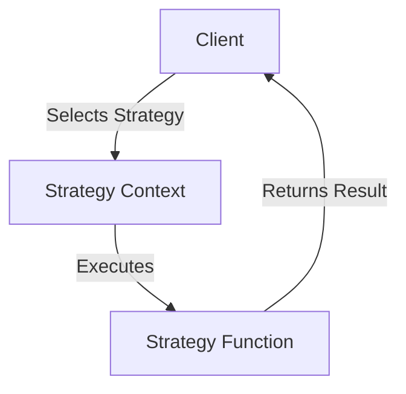

## 7.1. Strategy Pattern with Higher-Order Functions

In the realm of software design patterns, the Strategy Pattern stands out as a powerful tool for encapsulating algorithms and making them interchangeable. In Elixir, a functional programming language, this pattern is elegantly implemented using higher-order functions. This section will guide you through understanding, implementing, and utilizing the Strategy Pattern in Elixir, providing you with the expertise to dynamically configure behavior in your applications.

### Encapsulating Algorithms

The Strategy Pattern is all about encapsulating algorithms within a family of interchangeable strategies. In traditional object-oriented programming (OOP), this is often achieved by defining a set of classes that implement a common interface. However, in Elixir, we leverage the power of higher-order functions to achieve the same goal in a more functional and expressive manner.

#### Key Concepts

- **Encapsulation**: The process of hiding the implementation details of a particular strategy, exposing only the interface or the method of execution.
- **Interchangeability**: The ability to swap one strategy for another without affecting the client code that uses the strategy.

#### Example: Sorting Algorithms

Consider a scenario where you need to sort a list of numbers. You might have different strategies for sorting, such as bubble sort, quicksort, or mergesort. By encapsulating these algorithms, you can easily switch between them based on your needs.

```elixir
defmodule Sorter do
  def bubble_sort(list), do: # Implementation of bubble sort
  def quicksort(list), do: # Implementation of quicksort
  def mergesort(list), do: # Implementation of mergesort
end
```

### Implementing the Strategy Pattern

In Elixir, implementing the Strategy Pattern involves passing functions as parameters to configure behavior dynamically. This approach is facilitated by Elixir's support for first-class and higher-order functions.

#### Higher-Order Functions

A higher-order function is a function that takes other functions as arguments or returns a function as a result. This is a cornerstone of functional programming and is heavily utilized in Elixir.

```elixir
defmodule Strategy do
  def execute(strategy, data) do
    strategy.(data)
  end
end
```

In this example, `execute/2` is a higher-order function that takes a strategy (a function) and some data, then applies the strategy to the data.

#### Example: Customizable Calculation Methods

Let's consider a scenario where you need to apply different calculation methods to a dataset. You can define these methods as separate functions and pass them as strategies.

```elixir
defmodule Calculator do
  def sum(data), do: Enum.sum(data)
  def average(data), do: Enum.sum(data) / length(data)
  def max(data), do: Enum.max(data)
end

defmodule Calculation do
  def perform(strategy, data) do
    strategy.(data)
  end
end

# Usage
data = [1, 2, 3, 4, 5]
IO.inspect Calculation.perform(&Calculator.sum/1, data)      # Output: 15
IO.inspect Calculation.perform(&Calculator.average/1, data)  # Output: 3.0
IO.inspect Calculation.perform(&Calculator.max/1, data)      # Output: 5
```

### Use Cases

The Strategy Pattern with higher-order functions is versatile and can be applied in various scenarios. Here are a few common use cases:

#### Sorting with Different Comparison Strategies

You might want to sort a list of items based on different criteria. By defining comparison functions, you can easily switch between sorting strategies.

```elixir
defmodule Comparisons do
  def ascending(a, b), do: a <= b
  def descending(a, b), do: a >= b
end

defmodule Sorter do
  def sort(list, compare) do
    Enum.sort(list, compare)
  end
end

# Usage
list = [5, 3, 8, 1, 2]
IO.inspect Sorter.sort(list, &Comparisons.ascending/2)  # Output: [1, 2, 3, 5, 8]
IO.inspect Sorter.sort(list, &Comparisons.descending/2) # Output: [8, 5, 3, 2, 1]
```

#### Customizable Calculation Methods

As demonstrated earlier, you can apply different calculation methods to a dataset by encapsulating them as strategies.

#### Dynamic Configuration of Behavior

In complex systems, you might need to dynamically configure behavior based on runtime conditions. The Strategy Pattern allows you to achieve this by selecting and applying the appropriate strategy at runtime.

### Elixir Unique Features

Elixir offers several unique features that enhance the implementation of the Strategy Pattern:

- **Pattern Matching**: Allows for concise and expressive function definitions.
- **Immutability**: Ensures that data remains consistent and predictable across different strategies.
- **Concurrency**: Elixir's lightweight processes can be used to execute strategies concurrently, improving performance.

### Visualizing the Strategy Pattern

To better understand the Strategy Pattern, let's visualize the flow of data and the interaction between components.


```mermaid
graph TD;
    A[Client] -->|Selects Strategy| B[Strategy Context];
    B -->|Executes| C[Strategy Function];
    C -->|Returns Result| A;
```

**Diagram Description**: This diagram illustrates the flow of data in the Strategy Pattern. The client selects a strategy and passes it to the strategy context, which executes the strategy function and returns the result to the client.

### Design Considerations

When implementing the Strategy Pattern in Elixir, consider the following:

- **Function Interfaces**: Ensure that all strategy functions have a consistent interface to facilitate interchangeability.
- **Performance**: Evaluate the performance implications of different strategies and choose the most efficient one for your use case.
- **Error Handling**: Implement robust error handling to gracefully handle failures in strategy execution.

### Differences and Similarities

The Strategy Pattern is often compared to other behavioral patterns, such as the State Pattern and the Command Pattern. While they share similarities, the Strategy Pattern is distinct in its focus on encapsulating algorithms and making them interchangeable.

### Try It Yourself

To deepen your understanding, try modifying the code examples provided. Experiment with different strategies and observe how the behavior of the system changes. Consider implementing a new use case, such as a payment processing system with different payment strategies.

### Knowledge Check

- Can you identify scenarios where the Strategy Pattern would be beneficial?
- How does the use of higher-order functions enhance the flexibility of the Strategy Pattern in Elixir?
- What are the advantages of using the Strategy Pattern over hardcoding algorithms directly into your code?

### Summary

In this section, we've explored the Strategy Pattern in Elixir, focusing on encapsulating algorithms using higher-order functions. By understanding and implementing this pattern, you can create flexible and dynamic systems that adapt to changing requirements. Remember, the key to mastering design patterns is practice and experimentation. Keep exploring and refining your skills!

## Quiz Time!



### What is the main purpose of the Strategy Pattern?

- [x] To encapsulate algorithms and make them interchangeable
- [ ] To manage object creation
- [ ] To define a family of related objects
- [ ] To provide a way to access elements of an aggregate object

> **Explanation:** The Strategy Pattern is used to encapsulate algorithms and make them interchangeable at runtime.

### How does Elixir implement the Strategy Pattern?

- [x] Using higher-order functions
- [ ] Using classes and interfaces
- [ ] Using inheritance
- [ ] Using global variables

> **Explanation:** In Elixir, the Strategy Pattern is implemented using higher-order functions, which allow functions to be passed as parameters.

### Which Elixir feature enhances the implementation of the Strategy Pattern?

- [x] Pattern Matching
- [ ] Inheritance
- [ ] Global State
- [ ] Static Typing

> **Explanation:** Pattern matching allows for concise and expressive function definitions, enhancing the implementation of the Strategy Pattern.

### What is a higher-order function?

- [x] A function that takes other functions as arguments or returns a function as a result
- [ ] A function that is always executed first
- [ ] A function that is defined in a module
- [ ] A function that cannot be modified

> **Explanation:** A higher-order function is one that takes other functions as arguments or returns a function as a result, which is a key concept in functional programming.

### Which of the following is a use case for the Strategy Pattern?

- [x] Sorting with different comparison strategies
- [ ] Managing database connections
- [ ] Defining a class hierarchy
- [ ] Implementing a singleton object

> **Explanation:** Sorting with different comparison strategies is a common use case for the Strategy Pattern, as it allows for dynamic configuration of sorting behavior.

### What is the advantage of using the Strategy Pattern?

- [x] It allows for dynamic configuration of behavior
- [ ] It simplifies object creation
- [ ] It enforces a strict class hierarchy
- [ ] It eliminates the need for functions

> **Explanation:** The Strategy Pattern allows for dynamic configuration of behavior by encapsulating algorithms and making them interchangeable.

### In Elixir, what is used to encapsulate algorithms in the Strategy Pattern?

- [x] Functions
- [ ] Classes
- [ ] Modules
- [ ] Variables

> **Explanation:** In Elixir, functions are used to encapsulate algorithms in the Strategy Pattern, allowing for flexibility and interchangeability.

### What is a key benefit of using higher-order functions in Elixir?

- [x] They enhance flexibility and reusability
- [ ] They reduce the need for variables
- [ ] They enforce strict typing
- [ ] They eliminate the need for modules

> **Explanation:** Higher-order functions enhance flexibility and reusability by allowing functions to be passed as arguments and returned as results.

### How can the Strategy Pattern improve software design?

- [x] By promoting encapsulation and separation of concerns
- [ ] By reducing the number of functions
- [ ] By enforcing a single design approach
- [ ] By eliminating the need for algorithms

> **Explanation:** The Strategy Pattern improves software design by promoting encapsulation and separation of concerns, making systems more flexible and maintainable.

### True or False: The Strategy Pattern is only applicable in object-oriented programming.

- [ ] True
- [x] False

> **Explanation:** False. The Strategy Pattern can be applied in functional programming languages like Elixir using higher-order functions.



Remember, this is just the beginning. As you progress, you'll build more complex and interactive applications using the Strategy Pattern in Elixir. Keep experimenting, stay curious, and enjoy the journey!
