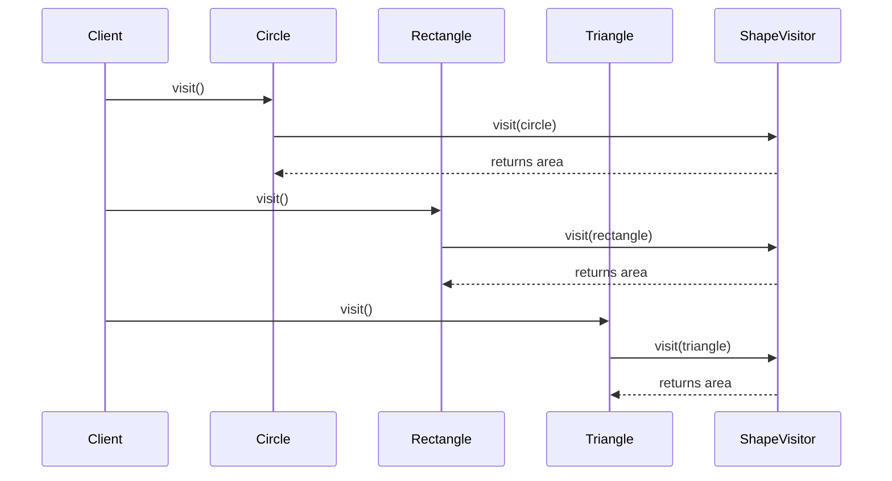

## 7.10. Visitor Pattern via Protocols

In this section, we delve into the Visitor Pattern, a behavioral design pattern that allows you to define new operations on an object structure without changing the classes of the elements on which it operates. In Elixir, we leverage protocols to implement this pattern, providing a flexible and maintainable approach to handling operations on diverse data types.

### Operations on Object Structures

The Visitor Pattern is particularly useful when you have a complex object structure and need to perform various operations on these objects. Instead of embedding these operations within the objects themselves, the Visitor Pattern allows you to separate the operations from the object structure. This separation enhances flexibility and maintainability, as you can add new operations without modifying the existing object structure.

### Implementing the Visitor Pattern

In Elixir, protocols provide a powerful mechanism to implement the Visitor Pattern. Protocols allow you to define a set of functions that can be implemented by different data types. This is akin to defining an interface in object-oriented programming, where different classes can implement the same interface in their own way.

#### Key Participants

1. **Visitor Protocol**: Defines a set of operations to be performed on elements of an object structure.
2. **Concrete Visitors**: Implement the operations defined in the Visitor Protocol for specific data types.
3. **Element**: The object structure on which operations are performed.
4. **Concrete Elements**: Implement the `accept` function to accept a visitor.

#### Sample Code Snippet

Let's explore a simple implementation of the Visitor Pattern using Elixir protocols. We'll create a system to calculate the area of different shapes.

```elixir
defprotocol ShapeVisitor do
  @doc "Calculates the area of a shape"
  def visit(shape)
end

defmodule Circle do
  defstruct radius: 0

  defimpl ShapeVisitor do
    def visit(%Circle{radius: radius}) do
      :math.pi() * radius * radius
    end
  end
end

defmodule Rectangle do
  defstruct width: 0, height: 0

  defimpl ShapeVisitor do
    def visit(%Rectangle{width: width, height: height}) do
      width * height
    end
  end
end

defmodule Triangle do
  defstruct base: 0, height: 0

  defimpl ShapeVisitor do
    def visit(%Triangle{base: base, height: height}) do
      0.5 * base * height
    end
  end
end

# Usage
circle = %Circle{radius: 5}
rectangle = %Rectangle{width: 4, height: 6}
triangle = %Triangle{base: 3, height: 4}

IO.puts("Circle area: #{ShapeVisitor.visit(circle)}")
IO.puts("Rectangle area: #{ShapeVisitor.visit(rectangle)}")
IO.puts("Triangle area: #{ShapeVisitor.visit(triangle)}")
```

### Visualizing the Visitor Pattern

To better understand the interaction between the components of the Visitor Pattern, let's visualize the process using a sequence diagram.



### Use Cases

The Visitor Pattern is particularly useful in scenarios where you need to perform operations across a set of objects with varying types. Here are some common use cases:

- **Serialization**: Convert objects into a format suitable for storage or transmission.
- **Formatting**: Apply consistent formatting rules across different data types.
- **Applying Algorithms**: Execute algorithms that operate on a variety of data structures.

### Design Considerations

When implementing the Visitor Pattern in Elixir, consider the following:

- **Extensibility**: Adding new operations is straightforward, as you only need to implement the new operation in the Visitor Protocol.
- **Maintainability**: The separation of operations from the object structure enhances maintainability.
- **Performance**: Be mindful of the performance implications of using protocols, especially in performance-critical applications.

### Elixir Unique Features

Elixir's protocols provide a unique and powerful way to implement the Visitor Pattern. Unlike traditional object-oriented languages, Elixir's functional nature and pattern matching capabilities allow for more concise and expressive implementations.

### Differences and Similarities

The Visitor Pattern is often confused with the Strategy Pattern. While both patterns define a family of algorithms, the Visitor Pattern is specifically designed for operations on object structures, whereas the Strategy Pattern is more about selecting an algorithm at runtime.

### Try It Yourself

To deepen your understanding of the Visitor Pattern, try modifying the code example to include additional shapes, such as a square or a pentagon. Implement the `visit` function for these new shapes and observe how easily the system adapts to new requirements.

### Knowledge Check

- **What is the primary benefit of using the Visitor Pattern?**
- **How does Elixir's protocol system enhance the implementation of the Visitor Pattern?**
- **What are some common use cases for the Visitor Pattern?**

### Embrace the Journey

Remember, mastering design patterns is a journey. As you continue to explore and implement patterns like the Visitor Pattern, you'll gain deeper insights into building flexible and maintainable systems. Keep experimenting, stay curious, and enjoy the journey!

## Quiz: Visitor Pattern via Protocols



### What is the primary benefit of using the Visitor Pattern?

- [x] It allows adding new operations without modifying existing object structures.
- [ ] It simplifies the object structure by embedding operations within objects.
- [ ] It enhances the performance of operations on object structures.
- [ ] It reduces the number of classes in a system.

> **Explanation:** The Visitor Pattern allows adding new operations without modifying existing object structures, enhancing flexibility and maintainability.

### How does Elixir's protocol system enhance the implementation of the Visitor Pattern?

- [x] By allowing different data types to implement the same set of functions.
- [ ] By embedding operations directly within the data types.
- [ ] By providing a built-in mechanism for serialization.
- [ ] By enforcing strict type checking.

> **Explanation:** Elixir's protocol system allows different data types to implement the same set of functions, making it ideal for the Visitor Pattern.

### What are some common use cases for the Visitor Pattern?

- [x] Serialization, formatting, applying algorithms to data structures.
- [ ] Data storage, network communication, user authentication.
- [ ] Memory management, garbage collection, thread synchronization.
- [ ] User interface design, event handling, input validation.

> **Explanation:** Common use cases for the Visitor Pattern include serialization, formatting, and applying algorithms to data structures.

### Which of the following is a key participant in the Visitor Pattern?

- [x] Visitor Protocol
- [ ] Data Manager
- [ ] Event Handler
- [ ] User Interface

> **Explanation:** The Visitor Protocol is a key participant in the Visitor Pattern, defining a set of operations to be performed on elements of an object structure.

### What is a common misconception about the Visitor Pattern?

- [x] It is often confused with the Strategy Pattern.
- [ ] It is only applicable to object-oriented programming.
- [ ] It cannot be implemented in functional languages.
- [ ] It is primarily used for performance optimization.

> **Explanation:** A common misconception is that the Visitor Pattern is often confused with the Strategy Pattern, though they serve different purposes.

### What is the role of Concrete Visitors in the Visitor Pattern?

- [x] They implement the operations defined in the Visitor Protocol for specific data types.
- [ ] They define the object structure on which operations are performed.
- [ ] They manage the lifecycle of objects in the system.
- [ ] They handle user input and output.

> **Explanation:** Concrete Visitors implement the operations defined in the Visitor Protocol for specific data types.

### How does the Visitor Pattern enhance maintainability?

- [x] By separating operations from the object structure.
- [ ] By embedding operations within the object structure.
- [ ] By reducing the number of classes in the system.
- [ ] By enforcing strict type checking.

> **Explanation:** The Visitor Pattern enhances maintainability by separating operations from the object structure.

### What is a potential drawback of using the Visitor Pattern?

- [x] It can lead to a proliferation of visitor classes.
- [ ] It reduces the flexibility of the system.
- [ ] It complicates the object structure.
- [ ] It limits the number of operations that can be performed.

> **Explanation:** A potential drawback of the Visitor Pattern is that it can lead to a proliferation of visitor classes.

### In Elixir, how are operations defined in the Visitor Pattern?

- [x] Using protocols to define a set of functions.
- [ ] Using modules to encapsulate operations.
- [ ] Using macros to generate operations at compile time.
- [ ] Using processes to handle operations concurrently.

> **Explanation:** In Elixir, operations in the Visitor Pattern are defined using protocols to define a set of functions.

### True or False: The Visitor Pattern is only applicable to object-oriented programming languages.

- [ ] True
- [x] False

> **Explanation:** False. The Visitor Pattern can be implemented in functional languages like Elixir using protocols.


