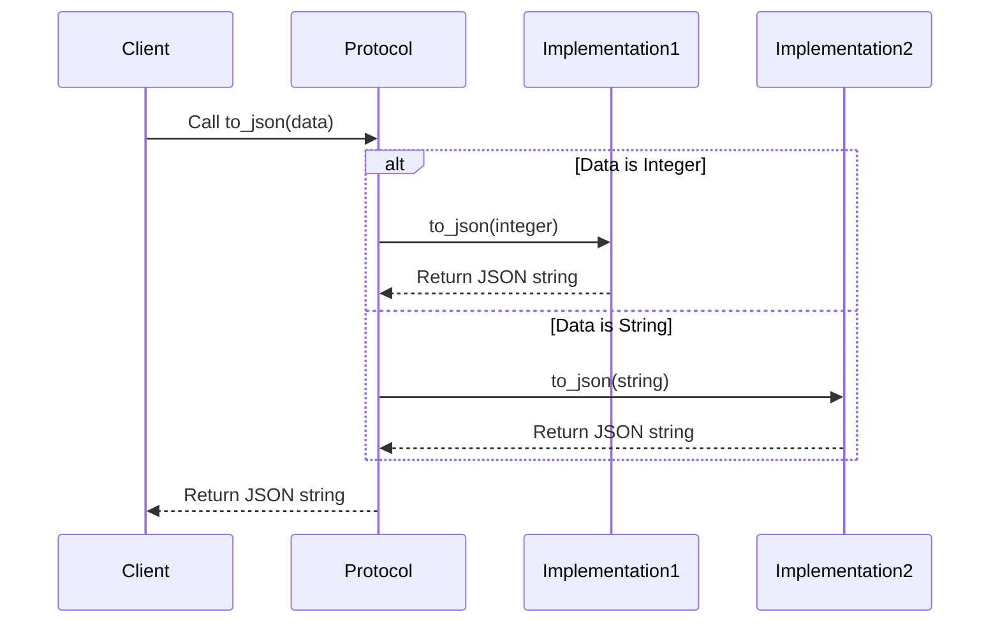

## 7.10. Visitor Pattern via Protocols

### Introduction

The Visitor Pattern is a behavioral design pattern that allows you to add operations to existing object structures without modifying them. In Elixir, we can leverage protocols to implement this pattern, enabling dynamic dispatch based on data types. This approach is particularly useful for operations like serialization, formatting, or applying algorithms to complex data structures.

### Operations on Object Structures

The core idea of the Visitor Pattern is to separate an algorithm from the object structure it operates on. This separation allows you to define new operations without altering the classes of the elements on which it operates. In Elixir, protocols provide a powerful mechanism to achieve this by defining a set of functions that can be implemented for different data types.

### Implementing the Visitor Pattern

#### Understanding Protocols

In Elixir, protocols are a means to achieve polymorphism. They allow you to define a set of functions that can be implemented for various data types. This is analogous to interfaces in object-oriented languages but is more flexible due to Elixir's dynamic nature.

#### Defining a Protocol

To implement the Visitor Pattern using protocols, you first need to define a protocol that represents the operations you want to perform. Let's consider a simple example where we want to serialize different data types into JSON.

```elixir
defprotocol JSONSerializable do
  @doc "Converts a data structure to JSON format"
  def to_json(data)
end
```

In this protocol, we define a single function `to_json/1` that will be implemented for different data types.

#### Implementing the Protocol

Next, we implement the protocol for various data types. Let's start with integers and strings.

```elixir
defimpl JSONSerializable, for: Integer do
  def to_json(integer) do
    Integer.to_string(integer)
  end
end

defimpl JSONSerializable, for: String do
  def to_json(string) do
    "\"#{string}\""
  end
end
```

Here, we provide specific implementations of the `to_json/1` function for integers and strings. This allows us to convert these data types into their JSON representations.

#### Applying the Visitor Pattern

With the protocol and its implementations in place, we can now use the Visitor Pattern to perform operations on different data types without modifying their structures. Let's see how this works in practice.

```elixir
defmodule DataProcessor do
  def process(data) do
    JSONSerializable.to_json(data)
  end
end

IO.puts DataProcessor.process(42)      # Outputs: "42"
IO.puts DataProcessor.process("Hello") # Outputs: "\"Hello\""
```

In this example, `DataProcessor` uses the `JSONSerializable` protocol to convert data into JSON format. The `process/1` function dynamically dispatches the `to_json/1` function based on the data type, demonstrating the power of the Visitor Pattern in Elixir.

### Use Cases

The Visitor Pattern is versatile and can be applied to various scenarios in software development. Here are some common use cases:

#### Serialization

As demonstrated in the example above, serialization is a classic use case for the Visitor Pattern. By defining a protocol for serialization, you can easily add support for new data types without altering existing code.

#### Formatting

Another common use case is formatting data for display. You can define a protocol for formatting and implement it for different data types, allowing you to customize the display of data without modifying the underlying structures.

#### Applying Algorithms

The Visitor Pattern is also useful for applying algorithms to complex data structures. By defining a protocol for the algorithm, you can implement it for different elements of the data structure, enabling flexible and extensible operations.

### Visualizing the Visitor Pattern

To better understand how the Visitor Pattern works in Elixir, let's visualize the process using a sequence diagram. This diagram illustrates the interaction between the protocol, its implementations, and the client code.


```mermaid
sequenceDiagram
    participant Client
    participant Protocol
    participant Implementation1
    participant Implementation2

    Client->>Protocol: Call to_json(data)
    alt Data is Integer
        Protocol->>Implementation1: to_json(integer)
        Implementation1-->>Protocol: Return JSON string
    else Data is String
        Protocol->>Implementation2: to_json(string)
        Implementation2-->>Protocol: Return JSON string
    end
    Protocol-->>Client: Return JSON string
```

This diagram shows how the client code interacts with the protocol, which then delegates the operation to the appropriate implementation based on the data type.

### Design Considerations

When implementing the Visitor Pattern using protocols in Elixir, there are several design considerations to keep in mind:

- **Extensibility**: Protocols allow you to add new implementations for additional data types without modifying existing code, making your system more extensible.
- **Performance**: Dynamic dispatch in Elixir is efficient, but it's important to consider the performance implications when working with large data structures or real-time systems.
- **Complexity**: While the Visitor Pattern provides flexibility, it can also introduce complexity, especially in large systems with many data types and operations.

### Elixir Unique Features

Elixir's dynamic and functional nature provides unique advantages when implementing the Visitor Pattern:

- **Dynamic Dispatch**: Elixir's protocols enable dynamic dispatch, allowing you to define operations that are automatically applied based on data types.
- **Functional Composition**: You can leverage Elixir's functional programming features, such as higher-order functions and function composition, to create more expressive and concise implementations.
- **Concurrency**: Elixir's concurrency model allows you to perform operations in parallel, enhancing the performance of the Visitor Pattern in concurrent applications.

### Differences and Similarities

The Visitor Pattern in Elixir differs from its implementation in object-oriented languages in several ways:

- **Protocols vs. Interfaces**: In Elixir, protocols provide a more flexible and dynamic approach to polymorphism compared to interfaces in object-oriented languages.
- **Data Immutability**: Elixir's emphasis on immutability aligns well with the Visitor Pattern, as it allows you to perform operations without modifying the original data structures.
- **Functional Paradigm**: The functional paradigm in Elixir encourages a different approach to problem-solving, focusing on functions and data transformations rather than objects and state.

### Try It Yourself

To deepen your understanding of the Visitor Pattern in Elixir, try modifying the code examples provided. Here are some suggestions:

- **Add Support for More Data Types**: Implement the `JSONSerializable` protocol for additional data types, such as lists and maps.
- **Create a New Protocol**: Define a new protocol for a different operation, such as XML serialization or data validation, and implement it for various data types.
- **Experiment with Concurrency**: Use Elixir's concurrency features to perform operations in parallel, and observe how it affects the performance of the Visitor Pattern.

### Knowledge Check

Before we move on, let's reinforce what we've learned with a few questions:

- What is the main advantage of using the Visitor Pattern in Elixir?
- How do protocols enable dynamic dispatch in Elixir?
- What are some common use cases for the Visitor Pattern?

### Conclusion

The Visitor Pattern is a powerful tool for adding operations to existing object structures without modifying them. By leveraging Elixir's protocols, you can implement this pattern in a flexible and efficient manner. Whether you're working on serialization, formatting, or complex algorithms, the Visitor Pattern provides a robust solution for dynamic operations.

Remember, this is just the beginning. As you continue to explore Elixir and its design patterns, you'll discover new ways to apply these concepts to your projects. Keep experimenting, stay curious, and enjoy the journey!

## Quiz Time!



### What is the primary purpose of the Visitor Pattern?

- [x] To add operations to existing object structures without modifying them
- [ ] To create new data types
- [ ] To improve performance
- [ ] To simplify code

> **Explanation:** The Visitor Pattern allows you to add operations to existing object structures without altering their classes.

### How does Elixir's protocol facilitate the Visitor Pattern?

- [x] By enabling dynamic dispatch based on data types
- [ ] By creating new classes
- [ ] By modifying existing data structures
- [ ] By improving concurrency

> **Explanation:** Protocols in Elixir enable dynamic dispatch, which allows you to define operations that are automatically applied based on data types.

### Which of the following is a common use case for the Visitor Pattern?

- [x] Serialization
- [ ] Memory management
- [ ] Thread synchronization
- [ ] Network communication

> **Explanation:** Serialization is a common use case for the Visitor Pattern, as it allows you to convert data structures into a different format without modifying them.

### What is a key difference between protocols in Elixir and interfaces in object-oriented languages?

- [x] Protocols provide a more flexible and dynamic approach to polymorphism
- [ ] Interfaces are more efficient
- [ ] Protocols are used for memory management
- [ ] Interfaces are used for network communication

> **Explanation:** Protocols in Elixir provide a more flexible and dynamic approach to polymorphism compared to interfaces in object-oriented languages.

### What is the role of the `to_json/1` function in the provided example?

- [x] To convert data into JSON format
- [ ] To modify data structures
- [ ] To create new data types
- [ ] To improve performance

> **Explanation:** The `to_json/1` function converts data into JSON format, demonstrating the Visitor Pattern in Elixir.

### Which Elixir feature enhances the performance of the Visitor Pattern in concurrent applications?

- [x] Concurrency model
- [ ] Data immutability
- [ ] Pattern matching
- [ ] Higher-order functions

> **Explanation:** Elixir's concurrency model allows you to perform operations in parallel, enhancing the performance of the Visitor Pattern in concurrent applications.

### What is a potential drawback of the Visitor Pattern?

- [x] It can introduce complexity
- [ ] It reduces performance
- [ ] It limits extensibility
- [ ] It requires modifying data structures

> **Explanation:** While the Visitor Pattern provides flexibility, it can also introduce complexity, especially in large systems with many data types and operations.

### How can you extend the Visitor Pattern to support new data types in Elixir?

- [x] By implementing the protocol for additional data types
- [ ] By modifying existing implementations
- [ ] By creating new classes
- [ ] By using inheritance

> **Explanation:** You can extend the Visitor Pattern to support new data types by implementing the protocol for additional data types.

### What is a benefit of using Elixir's functional paradigm with the Visitor Pattern?

- [x] It encourages a focus on functions and data transformations
- [ ] It simplifies memory management
- [ ] It improves network communication
- [ ] It enhances thread synchronization

> **Explanation:** Elixir's functional paradigm encourages a focus on functions and data transformations, which aligns well with the Visitor Pattern.

### True or False: The Visitor Pattern requires modifying the original data structures.

- [ ] True
- [x] False

> **Explanation:** The Visitor Pattern allows you to add operations without modifying the original data structures.




