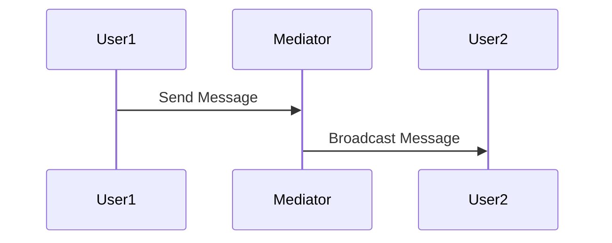

## 7.11. Mediator Pattern with Central Process Management

In the realm of software design patterns, the Mediator Pattern stands out as a powerful tool for managing complex communications between objects. In Elixir, this pattern is particularly useful for central process management, leveraging the concurrency and fault-tolerance features of the language. This section will delve into the intricacies of the Mediator Pattern, its implementation in Elixir using GenServer and Agent, and its practical applications in real-world scenarios.

### Centralizing Complex Communications

The Mediator Pattern is a behavioral design pattern that defines an object, known as the mediator, to encapsulate how a set of objects interact. By centralizing communication, the mediator reduces the dependencies between communicating objects, promoting loose coupling and enhancing maintainability.

#### Key Concepts

- **Mediator**: The central object that manages communication between other objects.
- **Colleagues**: The objects that communicate with each other through the mediator.
- **Loose Coupling**: Reducing direct dependencies between objects, making the system more flexible and easier to maintain.

#### Benefits

- **Simplified Communication**: By routing interactions through a central mediator, the complexity of communication is reduced.
- **Decoupled Components**: Components are less dependent on each other, allowing for easier modifications and extensions.
- **Enhanced Maintainability**: Changes to communication logic are localized within the mediator, simplifying maintenance.

### Implementing the Mediator Pattern

In Elixir, the Mediator Pattern can be effectively implemented using GenServer or Agent. These abstractions provide a robust foundation for managing state and handling concurrent processes.

#### Using GenServer

GenServer is a generic server implementation in Elixir that provides a framework for building concurrent processes. It is ideal for implementing the Mediator Pattern due to its ability to manage state and handle asynchronous messages.

```elixir
defmodule ChatRoomMediator do
  use GenServer

  # Client API

  def start_link(initial_state) do
    GenServer.start_link(__MODULE__, initial_state, name: __MODULE__)
  end

  def send_message(sender, message) do
    GenServer.cast(__MODULE__, {:send_message, sender, message})
  end

  # Server Callbacks

  def init(initial_state) do
    {:ok, initial_state}
  end

  def handle_cast({:send_message, sender, message}, state) do
    IO.puts("#{sender} says: #{message}")
    {:noreply, state}
  end
end

# Starting the mediator
{:ok, _pid} = ChatRoomMediator.start_link([])

# Sending a message
ChatRoomMediator.send_message("Alice", "Hello, everyone!")
```

**Explanation:**

- **GenServer**: The `ChatRoomMediator` module uses GenServer to manage state and handle messages.
- **start_link/1**: Initializes the GenServer with an initial state.
- **send_message/2**: A client API function to send messages through the mediator.
- **handle_cast/2**: Handles asynchronous messages, printing them to the console.

#### Using Agent

Agents in Elixir provide a simpler abstraction for managing state. While not as feature-rich as GenServer, they can be used for less complex mediator implementations.

```elixir
defmodule SimpleMediator do
  use Agent

  def start_link(initial_value) do
    Agent.start_link(fn -> initial_value end, name: __MODULE__)
  end

  def update_state(fun) do
    Agent.update(__MODULE__, fun)
  end

  def get_state do
    Agent.get(__MODULE__, & &1)
  end
end

# Starting the agent
{:ok, _pid} = SimpleMediator.start_link(%{})

# Updating state
SimpleMediator.update_state(fn state -> Map.put(state, :key, "value") end)

# Retrieving state
IO.inspect(SimpleMediator.get_state())
```

**Explanation:**

- **Agent**: The `SimpleMediator` module uses an Agent to manage state.
- **start_link/1**: Initializes the Agent with an initial value.
- **update_state/1**: Updates the state using a provided function.
- **get_state/0**: Retrieves the current state.

### Use Cases

The Mediator Pattern is particularly useful in scenarios where complex interactions need to be managed centrally. Here are some practical applications:

#### Chat Room Management

In a chat application, the mediator can manage message distribution, ensuring that messages from one user are broadcast to all other users.

```elixir
defmodule ChatRoom do
  use GenServer

  def start_link(_) do
    GenServer.start_link(__MODULE__, %{}, name: __MODULE__)
  end

  def join(user) do
    GenServer.cast(__MODULE__, {:join, user})
  end

  def leave(user) do
    GenServer.cast(__MODULE__, {:leave, user})
  end

  def send_message(user, message) do
    GenServer.cast(__MODULE__, {:send_message, user, message})
  end

  def handle_cast({:join, user}, state) do
    IO.puts("#{user} joined the chat.")
    {:noreply, Map.put(state, user, true)}
  end

  def handle_cast({:leave, user}, state) do
    IO.puts("#{user} left the chat.")
    {:noreply, Map.delete(state, user)}
  end

  def handle_cast({:send_message, user, message}, state) do
    Enum.each(state, fn {u, _} -> IO.puts("#{user} to #{u}: #{message}") end)
    {:noreply, state}
  end
end

# Starting the chat room
{:ok, _pid} = ChatRoom.start_link([])

# Users joining and sending messages
ChatRoom.join("Alice")
ChatRoom.join("Bob")
ChatRoom.send_message("Alice", "Hello, Bob!")
ChatRoom.leave("Alice")
```

**Explanation:**

- **join/1 and leave/1**: Functions to manage user participation in the chat.
- **send_message/2**: Sends a message from one user to all others.
- **handle_cast/2**: Handles user actions and message broadcasting.

#### Collaborative Applications

In collaborative applications, such as document editing or project management tools, the mediator can coordinate updates and ensure consistency across clients.

### Design Considerations

When implementing the Mediator Pattern in Elixir, consider the following:

- **Concurrency**: Leverage Elixir's concurrency model to handle multiple interactions efficiently.
- **Fault Tolerance**: Use OTP principles to ensure the mediator can recover from failures.
- **Scalability**: Design the mediator to handle increasing loads as the application grows.

### Elixir Unique Features

Elixir's unique features, such as lightweight processes and the actor model, make it particularly well-suited for implementing the Mediator Pattern. The language's emphasis on concurrency and fault tolerance aligns perfectly with the pattern's goals of managing complex interactions.

### Differences and Similarities

The Mediator Pattern is often compared to the Observer Pattern. While both manage interactions between objects, the Mediator Pattern centralizes communication, whereas the Observer Pattern involves direct notifications between objects.

### Visualizing the Mediator Pattern

To better understand the Mediator Pattern, let's visualize the communication flow using a Mermaid.js diagram.



**Diagram Explanation:**

- **User1** sends a message to the **Mediator**.
- The **Mediator** broadcasts the message to **User2**.

### Try It Yourself

Experiment with the provided code examples by modifying the message format or adding new functionalities, such as private messaging or user notifications. This hands-on approach will deepen your understanding of the Mediator Pattern and its implementation in Elixir.

### Knowledge Check

- **Question**: How does the Mediator Pattern promote loose coupling?
- **Exercise**: Implement a mediator for a task management application, coordinating task assignments and updates.

### Embrace the Journey

Remember, mastering design patterns is a journey. As you explore the Mediator Pattern, you'll gain insights into managing complex interactions and building scalable, maintainable systems. Keep experimenting, stay curious, and enjoy the process!

## Quiz: Mediator Pattern with Central Process Management



### What is the primary role of the mediator in the Mediator Pattern?

- [x] To centralize communication between objects
- [ ] To act as a data storage
- [ ] To replace all direct interactions
- [ ] To handle user authentication

> **Explanation:** The mediator centralizes communication, reducing dependencies between objects.

### Which Elixir abstraction is commonly used to implement the Mediator Pattern?

- [x] GenServer
- [ ] Task
- [ ] Supervisor
- [ ] Process

> **Explanation:** GenServer is used for managing state and handling messages, making it suitable for the Mediator Pattern.

### What is a key benefit of using the Mediator Pattern?

- [x] Simplified communication between components
- [ ] Increased memory usage
- [ ] Direct interaction between objects
- [ ] Reduced code readability

> **Explanation:** The Mediator Pattern simplifies communication by centralizing it, enhancing maintainability.

### In the provided chat room example, what does the `send_message/2` function do?

- [x] Sends a message from one user to all others
- [ ] Deletes a message
- [ ] Stores a message in a database
- [ ] Encrypts a message

> **Explanation:** The `send_message/2` function broadcasts a message to all users in the chat room.

### How does Elixir's concurrency model benefit the Mediator Pattern?

- [x] By efficiently handling multiple interactions
- [ ] By increasing code complexity
- [ ] By reducing process isolation
- [ ] By limiting fault tolerance

> **Explanation:** Elixir's concurrency model allows efficient handling of multiple interactions, aligning with the Mediator Pattern's goals.

### What is the difference between the Mediator and Observer Patterns?

- [x] Mediator centralizes communication; Observer involves direct notifications
- [ ] Mediator uses direct notifications; Observer centralizes communication
- [ ] Both patterns are identical
- [ ] Mediator is used for data storage; Observer for communication

> **Explanation:** The Mediator Pattern centralizes communication, while the Observer Pattern involves direct notifications between objects.

### What is a common use case for the Mediator Pattern?

- [x] Chat room management
- [ ] File storage
- [ ] Data encryption
- [ ] User authentication

> **Explanation:** The Mediator Pattern is commonly used in chat room management to handle message distribution.

### Which Elixir feature enhances the implementation of the Mediator Pattern?

- [x] Lightweight processes
- [ ] Heavyweight threads
- [ ] Synchronous communication
- [ ] Global state

> **Explanation:** Elixir's lightweight processes and actor model enhance the implementation of the Mediator Pattern.

### What is the purpose of the `handle_cast/2` function in a GenServer?

- [x] To handle asynchronous messages
- [ ] To initialize state
- [ ] To terminate the process
- [ ] To synchronize data

> **Explanation:** The `handle_cast/2` function handles asynchronous messages in a GenServer.

### True or False: The Mediator Pattern increases dependencies between objects.

- [ ] True
- [x] False

> **Explanation:** The Mediator Pattern reduces dependencies by centralizing communication.



By understanding and implementing the Mediator Pattern in Elixir, you can effectively manage complex communications in your applications, leveraging the language's unique features to build scalable and maintainable systems.
