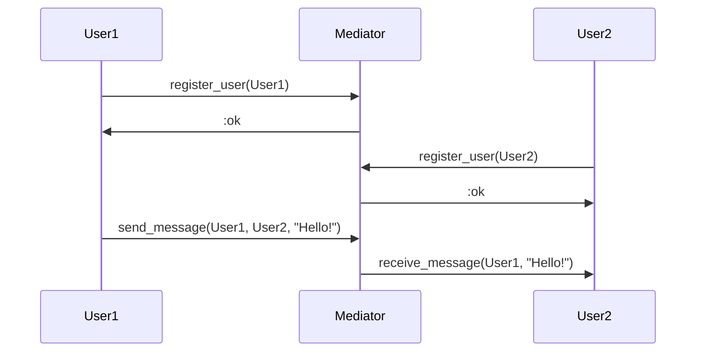

## 7.11. Mediator Pattern with Central Process Management

In the realm of software architecture, particularly within the Elixir ecosystem, managing complex interactions between processes can be challenging. The Mediator Pattern emerges as a powerful tool to centralize and streamline these communications. This pattern is particularly useful in systems where multiple objects need to interact in a decoupled manner, allowing for scalable and maintainable code.

### Centralizing Complex Communications

The Mediator Pattern defines an object that encapsulates how a set of objects interact. By centralizing the communication logic, the pattern reduces the dependencies between communicating objects, promoting loose coupling and enhancing flexibility. This is crucial in Elixir applications, where concurrency and process management are core features.

#### Key Concepts

- **Mediator**: The central hub that manages communication between various components or processes. It defines the interaction rules and controls the flow of information.
- **Colleagues**: The entities or processes that interact with each other through the mediator. They are decoupled from each other and rely on the mediator to facilitate communication.

### Implementing the Mediator Pattern

In Elixir, the Mediator Pattern can be effectively implemented using GenServer or Agent. These constructs provide the necessary infrastructure to manage state and handle messages, making them ideal for central process management.

#### Using GenServer

GenServer is a generic server module in Elixir that abstracts the common patterns of writing server processes. It is well-suited for implementing the Mediator Pattern due to its ability to maintain state and handle synchronous and asynchronous messages.

```elixir
defmodule ChatMediator do
  use GenServer

  # Client API

  def start_link(initial_state \\ %{}) do
    GenServer.start_link(__MODULE__, initial_state, name: __MODULE__)
  end

  def register_user(user) do
    GenServer.call(__MODULE__, {:register, user})
  end

  def send_message(from, to, message) do
    GenServer.cast(__MODULE__, {:send_message, from, to, message})
  end

  # Server Callbacks

  def init(initial_state) do
    {:ok, initial_state}
  end

  def handle_call({:register, user}, _from, state) do
    {:reply, :ok, Map.put(state, user, [])}
  end

  def handle_cast({:send_message, from, to, message}, state) do
    updated_state = update_in(state[to], &[{from, message} | &1])
    {:noreply, updated_state}
  end
end
```

In the example above, `ChatMediator` acts as the mediator, managing user registrations and message passing between users. The `register_user/1` function registers a user, while `send_message/3` facilitates message delivery between users.

#### Using Agent

Agents provide a simpler abstraction for managing state. They are suitable for scenarios where the state needs to be read and updated frequently without complex message handling.

```elixir
defmodule SimpleMediator do
  use Agent

  def start_link(initial_state \\ %{}) do
    Agent.start_link(fn -> initial_state end, name: __MODULE__)
  end

  def register_user(user) do
    Agent.update(__MODULE__, &Map.put(&1, user, []))
  end

  def send_message(from, to, message) do
    Agent.update(__MODULE__, fn state ->
      update_in(state[to], &[{from, message} | &1])
    end)
  end

  def get_messages(user) do
    Agent.get(__MODULE__, &Map.get(&1, user))
  end
end
```

Here, `SimpleMediator` uses an Agent to maintain state. It provides similar functionality to `ChatMediator`, but with a simpler interface for state management.

### Use Cases

The Mediator Pattern is particularly useful in scenarios where multiple entities need to communicate in a decoupled manner. Some common use cases include:

- **Chat Room Management**: In chat applications, the mediator can manage user registrations, message passing, and notifications, ensuring that users are decoupled from each other.
- **Collaborative Applications**: In applications where multiple users or processes collaborate, the mediator can coordinate actions, manage shared state, and ensure consistency.

### Visualizing the Mediator Pattern

To better understand the Mediator Pattern, let's visualize the communication flow in a chat room scenario using a sequence diagram.


```mermaid
sequenceDiagram
    participant User1
    participant Mediator
    participant User2

    User1->>Mediator: register_user(User1)
    Mediator->>User1: :ok

    User2->>Mediator: register_user(User2)
    Mediator->>User2: :ok

    User1->>Mediator: send_message(User1, User2, "Hello!")
    Mediator->>User2: receive_message(User1, "Hello!")
```

In this diagram, `User1` and `User2` interact with the `Mediator`, which manages user registrations and message passing. The mediator ensures that users are decoupled and communicate indirectly through it.

### Design Considerations

When implementing the Mediator Pattern, consider the following:

- **Scalability**: Ensure that the mediator can handle the expected load. Use GenServer for more complex scenarios where message handling is crucial.
- **Decoupling**: The primary goal of the mediator is to decouple interacting entities. Ensure that the mediator encapsulates all interaction logic.
- **State Management**: Choose between GenServer and Agent based on the complexity of state management required.

### Elixir Unique Features

Elixir's concurrency model and process management capabilities make it an excellent choice for implementing the Mediator Pattern. The use of GenServer and Agent provides robust tools for managing state and handling messages, while Elixir's functional nature promotes immutability and clear separation of concerns.

### Differences and Similarities

The Mediator Pattern is often compared to the Observer Pattern. While both patterns manage interactions between entities, the Mediator Pattern centralizes communication through a single mediator, whereas the Observer Pattern involves direct notifications between observers and subjects.

### Try It Yourself

To experiment with the Mediator Pattern, try modifying the `ChatMediator` example to include additional features such as:

- Broadcasting messages to multiple users.
- Implementing a notification system for user status changes.
- Adding logging to track message delivery.

### Knowledge Check

- **What is the primary role of the mediator in the Mediator Pattern?**
- **How does the Mediator Pattern promote loose coupling?**
- **What are the benefits of using GenServer for implementing the Mediator Pattern?**

### Conclusion

The Mediator Pattern is a powerful tool for managing complex interactions in Elixir applications. By centralizing communication logic, it promotes loose coupling and enhances scalability. Elixir's concurrency model and process management capabilities make it an ideal platform for implementing this pattern.

Remember, this is just the beginning. As you progress, you'll discover more ways to leverage the Mediator Pattern in your Elixir applications. Keep experimenting, stay curious, and enjoy the journey!

## Quiz Time!



### What is the primary role of the mediator in the Mediator Pattern?

- [x] To centralize and manage communication between various components or processes.
- [ ] To directly connect all components or processes.
- [ ] To replace all other components in the system.
- [ ] To act as a database for storing messages.

> **Explanation:** The mediator's primary role is to centralize and manage communication between components, reducing dependencies and promoting loose coupling.

### How does the Mediator Pattern promote loose coupling?

- [x] By centralizing communication logic in a single mediator.
- [ ] By allowing components to communicate directly with each other.
- [ ] By eliminating the need for communication between components.
- [ ] By using a shared global variable for communication.

> **Explanation:** The Mediator Pattern centralizes communication logic, which reduces dependencies between components and promotes loose coupling.

### What is a key benefit of using GenServer for implementing the Mediator Pattern?

- [x] It provides a robust framework for managing state and handling messages.
- [ ] It eliminates the need for state management.
- [ ] It allows for direct communication between components.
- [ ] It simplifies the user interface.

> **Explanation:** GenServer provides a robust framework for managing state and handling messages, making it ideal for implementing the Mediator Pattern.

### Which Elixir construct is simpler for managing state in the Mediator Pattern?

- [x] Agent
- [ ] GenServer
- [ ] Supervisor
- [ ] Task

> **Explanation:** Agents provide a simpler abstraction for managing state, suitable for scenarios where complex message handling is not required.

### In the Mediator Pattern, what are the entities that interact through the mediator called?

- [x] Colleagues
- [ ] Clients
- [ ] Servers
- [ ] Nodes

> **Explanation:** The entities that interact through the mediator are called colleagues. They rely on the mediator to facilitate communication.

### What is a common use case for the Mediator Pattern?

- [x] Chat room management
- [ ] Direct database access
- [ ] File system operations
- [ ] Image processing

> **Explanation:** Chat room management is a common use case for the Mediator Pattern, where the mediator manages user registrations and message passing.

### How does the Mediator Pattern differ from the Observer Pattern?

- [x] The Mediator Pattern centralizes communication through a single mediator.
- [ ] The Mediator Pattern involves direct notifications between observers and subjects.
- [ ] The Mediator Pattern is used for database management.
- [ ] The Mediator Pattern eliminates the need for communication.

> **Explanation:** The Mediator Pattern centralizes communication through a single mediator, whereas the Observer Pattern involves direct notifications.

### What is a potential modification to the `ChatMediator` example?

- [x] Implementing a notification system for user status changes.
- [ ] Removing all user registrations.
- [ ] Directly connecting all users.
- [ ] Storing messages in a global variable.

> **Explanation:** Implementing a notification system for user status changes is a potential modification to enhance the `ChatMediator` example.

### Which Elixir feature makes it ideal for implementing the Mediator Pattern?

- [x] Concurrency model and process management capabilities
- [ ] Lack of state management
- [ ] Direct communication between processes
- [ ] Absence of functional programming features

> **Explanation:** Elixir's concurrency model and process management capabilities make it ideal for implementing the Mediator Pattern.

### True or False: The Mediator Pattern eliminates the need for communication between components.

- [ ] True
- [x] False

> **Explanation:** False. The Mediator Pattern centralizes communication but does not eliminate it. It facilitates communication in a decoupled manner.




