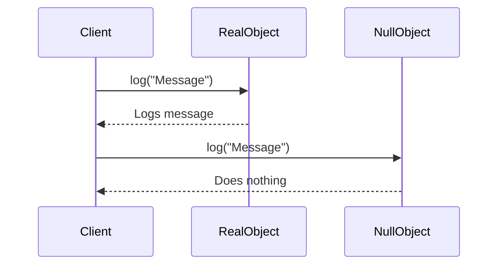

## 7.12. Null Object Pattern with Default Implementations

In the realm of software design patterns, the Null Object Pattern stands out as a pragmatic solution to a common problem: handling the absence of an object without resorting to cumbersome nil checks. This pattern is particularly useful in Elixir, where functional programming paradigms and immutability are key. In this section, we will delve into the Null Object Pattern, exploring its implementation, use cases, and benefits in Elixir.

### Object Default Behavior

The Null Object Pattern involves providing an object that acts as a surrogate for the absence of an actual object. This surrogate object implements the same interface as the real object but with default behavior. This approach eliminates the need for explicit nil checks and simplifies code logic.

#### Key Participants

- **Real Object**: The actual object that performs meaningful operations.
- **Null Object**: A placeholder object that implements the same interface as the real object but with default or no-op behavior.
- **Client**: The code that interacts with the object, unaware of whether it is dealing with a real or null object.

#### Intent

The primary intent of the Null Object Pattern is to encapsulate the absence of an object by providing a default implementation. This pattern helps in avoiding conditional logic for nil checks and enhances code readability and maintainability.

### Implementing the Null Object Pattern

In Elixir, implementing the Null Object Pattern involves defining modules or functions that provide default behavior. Let's explore how to achieve this with a practical example.

#### Example: Logging System

Consider a logging system where we want to log messages to a file. However, in some scenarios, logging might be disabled, and we don't want to perform any logging operations. Instead of checking for nil or a boolean flag, we can use the Null Object Pattern.

```elixir
defmodule Logger do
  def log(message) do
    IO.puts("Logging message: #{message}")
  end
end

defmodule NullLogger do
  def log(_message) do
    # Do nothing
  end
end

defmodule Application do
  def run(logger \\ Logger) do
    logger.log("Application started")
    # Application logic
    logger.log("Application finished")
  end
end

# Usage
Application.run(Logger)      # Logs messages
Application.run(NullLogger)  # Does nothing
```

In this example, `Logger` is the real object that logs messages, while `NullLogger` is the null object that provides a no-op implementation of the `log/1` function. The `Application` module uses either of these objects without needing to check if logging is enabled or disabled.

#### Try It Yourself

Experiment with the code by adding more methods to the `Logger` and `NullLogger` modules. Observe how the Null Object Pattern simplifies the logic in the `Application` module.

### Use Cases

The Null Object Pattern is applicable in various scenarios where default behavior is preferable to nil checks. Here are some common use cases:

- **Avoiding Nil Checks**: Simplifies code by eliminating the need for conditional logic to handle nil values.
- **Default Logging Mechanisms**: Provides a default logging mechanism that can be easily swapped with a real logger.
- **Default Configuration**: Supplies default configuration values when specific configurations are not provided.
- **Fallback Strategies**: Implements fallback strategies in case of failures or unavailability of resources.

### Visualizing the Null Object Pattern

To better understand the Null Object Pattern, let's visualize the interaction between the client, real object, and null object using a sequence diagram.



In this diagram, the client interacts with both the real object and the null object using the same interface. The real object logs the message, while the null object performs no operation.

### Design Considerations

When implementing the Null Object Pattern, consider the following:

- **Interface Consistency**: Ensure that the null object implements the same interface as the real object to maintain consistency.
- **Performance**: While the null object performs no operations, ensure that its presence does not introduce unnecessary overhead.
- **Documentation**: Clearly document the behavior of the null object to avoid confusion among developers.

### Elixir Unique Features

Elixir's functional programming paradigm and immutability make it an ideal language for implementing the Null Object Pattern. The use of modules and functions allows for clean and concise implementations. Additionally, Elixir's pattern matching capabilities can further simplify the handling of null objects.

### Differences and Similarities

The Null Object Pattern is often compared with other patterns like the Strategy Pattern. While both patterns involve interchangeable objects, the Null Object Pattern specifically addresses the absence of an object, whereas the Strategy Pattern focuses on varying behavior.

### Knowledge Check

Before we conclude, let's reinforce our understanding with a few questions:

- What is the primary intent of the Null Object Pattern?
- How does the Null Object Pattern enhance code readability?
- In what scenarios is the Null Object Pattern particularly useful?

### Embrace the Journey

Remember, mastering design patterns like the Null Object Pattern is a journey. As you continue to explore and implement these patterns, you'll find new ways to simplify and enhance your code. Keep experimenting, stay curious, and enjoy the process!

### Quiz: Null Object Pattern with Default Implementations



### What is the primary purpose of the Null Object Pattern?

- [x] To provide a default implementation for the absence of an object
- [ ] To enhance performance by reducing memory usage
- [ ] To simplify complex algorithms
- [ ] To facilitate database interactions

> **Explanation:** The Null Object Pattern provides a default implementation to handle the absence of an object, eliminating the need for nil checks.

### How does the Null Object Pattern improve code readability?

- [x] By eliminating conditional logic for nil checks
- [ ] By reducing the number of lines of code
- [ ] By using advanced algorithms
- [ ] By enhancing performance

> **Explanation:** The Null Object Pattern improves readability by removing the need for conditional logic to handle nil values.

### Which of the following is a common use case for the Null Object Pattern?

- [x] Default logging mechanisms
- [ ] Complex mathematical computations
- [ ] Database schema design
- [ ] Network protocol implementation

> **Explanation:** The Null Object Pattern is commonly used for default logging mechanisms to avoid nil checks.

### What is a key consideration when implementing the Null Object Pattern?

- [x] Interface consistency
- [ ] Database optimization
- [ ] Memory management
- [ ] Network latency

> **Explanation:** Ensuring that the null object implements the same interface as the real object is crucial for consistency.

### In Elixir, what feature aids in implementing the Null Object Pattern?

- [x] Pattern matching
- [ ] Object-oriented inheritance
- [ ] Dynamic typing
- [ ] Memory management

> **Explanation:** Elixir's pattern matching capabilities simplify the implementation of the Null Object Pattern.

### What is the role of the null object in the Null Object Pattern?

- [x] To provide a no-op implementation
- [ ] To enhance performance
- [ ] To manage memory
- [ ] To facilitate database interactions

> **Explanation:** The null object provides a no-op implementation to handle the absence of an object.

### How does the Null Object Pattern relate to the Strategy Pattern?

- [x] Both involve interchangeable objects
- [ ] Both focus on database interactions
- [ ] Both enhance performance
- [ ] Both simplify network protocols

> **Explanation:** Both patterns involve interchangeable objects, but the Null Object Pattern specifically addresses the absence of an object.

### What is a benefit of using the Null Object Pattern in Elixir?

- [x] Simplified code logic
- [ ] Enhanced memory management
- [ ] Improved network performance
- [ ] Faster database queries

> **Explanation:** The Null Object Pattern simplifies code logic by eliminating the need for nil checks.

### Which of the following is NOT a use case for the Null Object Pattern?

- [x] Complex mathematical computations
- [ ] Default logging mechanisms
- [ ] Default configuration
- [ ] Fallback strategies

> **Explanation:** The Null Object Pattern is not typically used for complex mathematical computations.

### True or False: The Null Object Pattern can be used to provide default configuration values.

- [x] True
- [ ] False

> **Explanation:** The Null Object Pattern can be used to provide default configuration values when specific configurations are not provided.



### Conclusion

The Null Object Pattern is a powerful tool in the Elixir developer's arsenal, offering a clean and efficient way to handle the absence of objects. By providing default implementations, this pattern enhances code readability, maintainability, and robustness. As you continue to explore Elixir and its design patterns, remember to embrace the journey and enjoy the process of learning and discovery.
