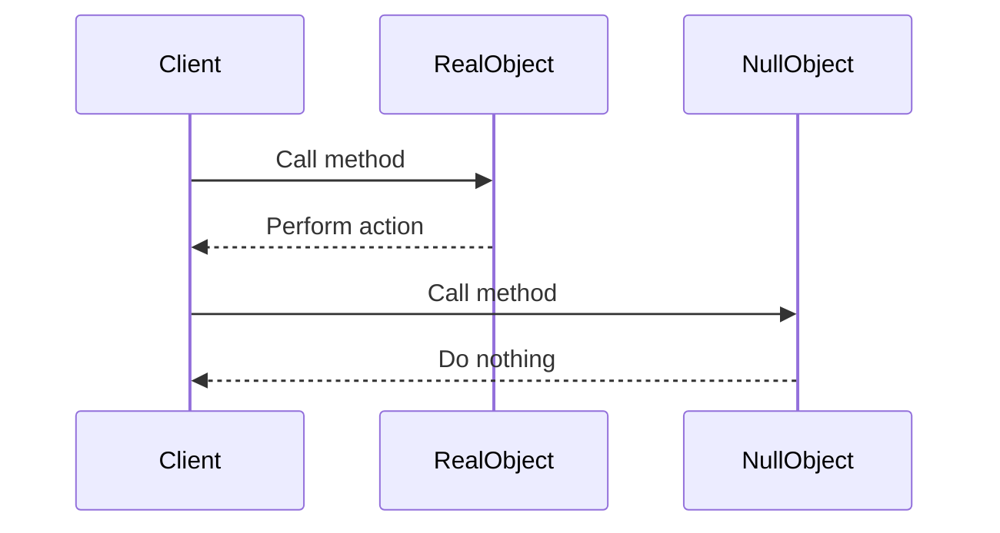

## 7.12. Null Object Pattern with Default Implementations

### Introduction to the Null Object Pattern

The Null Object Pattern is a behavioral design pattern that provides a way to handle the absence of an object by providing a default object with a neutral or "do nothing" behavior. This pattern is particularly useful in Elixir, where it helps to avoid frequent checks for `nil` values and simplifies code by providing default implementations for missing functionality.

### Object Default Behavior

The core idea behind the Null Object Pattern is to create an object that acts as a surrogate for the absence of an actual object. Instead of returning `nil` or `null` when an object is not available, a Null Object is returned. This object adheres to the expected interface but implements the methods in a way that they perform no action or return default values.

#### Benefits of Using Null Objects

1. **Simplifies Code**: By using a Null Object, you can eliminate conditional checks for `nil`, leading to cleaner and more readable code.
2. **Reduces Errors**: It minimizes the risk of `nil` dereferencing errors, which can cause runtime exceptions.
3. **Encapsulates Default Behavior**: The Null Object encapsulates default behavior, making the code more modular and easier to maintain.

### Implementing the Null Object Pattern in Elixir

In Elixir, implementing the Null Object Pattern involves defining modules or functions that return default values or perform no operations. This can be achieved using Elixir's powerful features such as protocols, structs, and pattern matching.

#### Step-by-Step Implementation

1. **Define a Protocol**: Start by defining a protocol that outlines the expected behavior of the objects.

    ```elixir
    defprotocol Logger do
      def log(message)
    end
    ```

2. **Implement the Protocol for Real Objects**: Create a module that implements the protocol for actual objects.

    ```elixir
    defmodule ConsoleLogger do
      defimpl Logger do
        def log(message) do
          IO.puts("Log: #{message}")
        end
      end
    end
    ```

3. **Create a Null Object**: Implement the protocol for the Null Object, which performs no operation.

    ```elixir
    defmodule NullLogger do
      defimpl Logger do
        def log(_message) do
          # Do nothing
        end
      end
    end
    ```

4. **Use the Null Object**: Replace `nil` checks with the Null Object in your code.

    ```elixir
    defmodule Application do
      def start(logger \\ %NullLogger{}) do
        logger.log("Application started")
        # Other application logic
      end
    end
    ```

### Use Cases for the Null Object Pattern

The Null Object Pattern is particularly useful in scenarios where you want to avoid `nil` checks and provide default implementations. Here are some common use cases:

1. **Logging**: Use a Null Object to provide a default logging mechanism that does nothing when no logger is specified.
2. **Configuration Defaults**: Provide default configuration objects that return default values when specific configurations are not set.
3. **Fallback Mechanisms**: Implement fallback behavior for services or components that may not always be available.

### Visualizing the Null Object Pattern

To better understand the Null Object Pattern, let's visualize the interaction between different components using a sequence diagram.


```mermaid
sequenceDiagram
    participant Client
    participant RealObject
    participant NullObject

    Client->>RealObject: Call method
    RealObject-->>Client: Perform action

    Client->>NullObject: Call method
    NullObject-->>Client: Do nothing
```

### Key Participants

- **Client**: The component that interacts with the objects.
- **RealObject**: The actual object that performs the desired operations.
- **NullObject**: The object that provides default behavior by doing nothing or returning default values.

### Applicability

The Null Object Pattern is applicable in situations where:

- You want to avoid conditional logic for `nil` checks.
- You need a default implementation that adheres to a specific interface.
- You aim to simplify and clean up code by removing unnecessary checks and branches.

### Sample Code Snippet

Here's a complete example demonstrating the Null Object Pattern in Elixir:

```elixir
defprotocol Logger do
  def log(message)
end

defmodule ConsoleLogger do
  defimpl Logger do
    def log(message) do
      IO.puts("Log: #{message}")
    end
  end
end

defmodule NullLogger do
  defimpl Logger do
    def log(_message) do
      # Do nothing
    end
  end
end

defmodule Application do
  def start(logger \\ %NullLogger{}) do
    logger.log("Application started")
    # Other application logic
  end
end

# Usage
Application.start(%ConsoleLogger{}) # Logs the message
Application.start() # Does nothing
```

### Design Considerations

- **When to Use**: Use the Null Object Pattern when you want to provide a default behavior and avoid `nil` checks in your code.
- **Performance**: Consider the performance implications of using Null Objects, especially if they are used extensively in performance-critical paths.
- **Complexity**: Ensure that the use of Null Objects does not introduce unnecessary complexity or obscure the logic of your application.

### Elixir Unique Features

Elixir's functional programming paradigm and features such as protocols and pattern matching make it particularly well-suited for implementing the Null Object Pattern. These features allow for clean and efficient implementations without the need for complex inheritance hierarchies.

### Differences and Similarities

The Null Object Pattern is often compared to other patterns such as the Strategy Pattern or the State Pattern. While these patterns share similarities in providing interchangeable behavior, the Null Object Pattern specifically focuses on providing a default, do-nothing behavior.

### Try It Yourself

To get a better understanding of the Null Object Pattern, try modifying the code example provided:

- **Experiment with Different Implementations**: Create additional implementations of the `Logger` protocol to see how they can be used interchangeably.
- **Add New Methods**: Extend the protocol with new methods and implement them in both the real and null objects.
- **Test in Different Scenarios**: Use the Null Object Pattern in different parts of your application to see how it simplifies code and reduces errors.

### Knowledge Check

- **What is the primary purpose of the Null Object Pattern?**
- **How does the Null Object Pattern help in reducing code complexity?**
- **What are some common use cases for the Null Object Pattern?**

### Summary

The Null Object Pattern is a powerful tool for simplifying code and reducing errors in Elixir applications. By providing default implementations, it eliminates the need for `nil` checks and encapsulates default behavior in a modular way. As you continue to explore Elixir and its design patterns, consider how the Null Object Pattern can be applied to your projects to enhance code quality and maintainability.

## Quiz Time!



### What is the primary purpose of the Null Object Pattern?

- [x] To provide a default object that performs no operation or returns default values
- [ ] To create complex inheritance hierarchies
- [ ] To replace all existing objects with null values
- [ ] To increase the complexity of code

> **Explanation:** The Null Object Pattern is designed to provide a default object that adheres to an interface but performs no operation or returns default values, simplifying code and reducing errors.

### How does the Null Object Pattern help in reducing code complexity?

- [x] By eliminating the need for nil checks
- [ ] By introducing more conditional statements
- [ ] By making code harder to read
- [ ] By requiring more extensive error handling

> **Explanation:** The Null Object Pattern reduces code complexity by eliminating the need for nil checks, leading to cleaner and more readable code.

### Which of the following is a common use case for the Null Object Pattern?

- [x] Providing a default logging mechanism
- [ ] Increasing the number of conditional checks
- [ ] Making code more error-prone
- [ ] Introducing more dependencies

> **Explanation:** A common use case for the Null Object Pattern is providing a default logging mechanism that does nothing when no logger is specified.

### What is a key benefit of using the Null Object Pattern?

- [x] It reduces the risk of nil dereferencing errors
- [ ] It complicates the codebase
- [ ] It requires more memory
- [ ] It increases the number of runtime exceptions

> **Explanation:** One of the key benefits of the Null Object Pattern is that it reduces the risk of nil dereferencing errors, which can cause runtime exceptions.

### In Elixir, how can you implement the Null Object Pattern?

- [x] By defining protocols and implementing them for both real and null objects
- [ ] By using inheritance hierarchies
- [ ] By creating complex class structures
- [ ] By avoiding the use of protocols

> **Explanation:** In Elixir, the Null Object Pattern can be implemented by defining protocols and implementing them for both real and null objects, leveraging Elixir's functional programming features.

### What is the role of the Null Object in the pattern?

- [x] To act as a surrogate for the absence of an actual object
- [ ] To perform complex operations
- [ ] To replace all objects in the system
- [ ] To introduce more errors

> **Explanation:** The Null Object acts as a surrogate for the absence of an actual object, providing default behavior by doing nothing or returning default values.

### Why is the Null Object Pattern particularly useful in Elixir?

- [x] Because Elixir's functional paradigm and features like protocols make it easy to implement
- [ ] Because Elixir lacks pattern matching
- [ ] Because Elixir does not support default values
- [ ] Because Elixir requires complex inheritance hierarchies

> **Explanation:** The Null Object Pattern is particularly useful in Elixir because its functional paradigm and features like protocols make it easy to implement clean and efficient solutions.

### What is a potential drawback of using the Null Object Pattern?

- [x] It can introduce unnecessary complexity if not used appropriately
- [ ] It always increases code readability
- [ ] It eliminates the need for any error handling
- [ ] It simplifies every aspect of the codebase

> **Explanation:** A potential drawback of using the Null Object Pattern is that it can introduce unnecessary complexity if not used appropriately, so it's important to apply it judiciously.

### How can the Null Object Pattern enhance maintainability?

- [x] By encapsulating default behavior in a modular way
- [ ] By spreading logic across multiple files
- [ ] By increasing the number of dependencies
- [ ] By making code harder to understand

> **Explanation:** The Null Object Pattern enhances maintainability by encapsulating default behavior in a modular way, making code easier to manage and modify.

### True or False: The Null Object Pattern is often compared to the Strategy Pattern.

- [x] True
- [ ] False

> **Explanation:** True. The Null Object Pattern is often compared to the Strategy Pattern because both provide interchangeable behavior, but the Null Object Pattern focuses on providing a default, do-nothing behavior.


