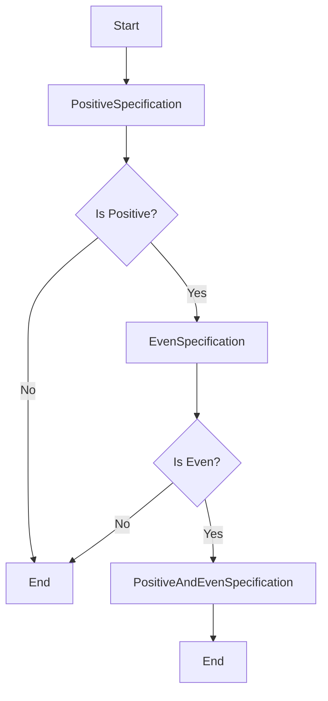

## 7.13. Specification Pattern for Complex Matching

The Specification Pattern is a powerful tool for encapsulating business logic into reusable and composable components. In Elixir, this pattern can be particularly effective due to the language's functional nature and support for higher-order functions. This section will guide you through understanding, implementing, and applying the Specification Pattern in Elixir to handle complex matching scenarios.

### Combining Business Rules

The Specification Pattern allows you to encapsulate business rules into specifications, which are objects or functions that evaluate whether a particular condition is met. This encapsulation makes it easier to manage and reuse business logic across different parts of an application.

#### Key Benefits

- **Reusability**: Specifications can be reused across different contexts, reducing duplication of logic.
- **Composability**: Specifications can be combined using logical operators to form complex conditions.
- **Maintainability**: Encapsulating business logic in specifications makes it easier to update and maintain.

### Implementing the Specification Pattern

In Elixir, you can implement the Specification Pattern using functions or modules that represent rules. These specifications can be composed using logical operators to form more complex rules.

#### Basic Implementation

Let's start with a simple example of implementing a specification in Elixir. Suppose we have a business rule that checks if a number is positive.

```elixir
defmodule PositiveSpecification do
  def satisfied_by?(number) when is_number(number) do
    number > 0
  end
end
```

Here, `PositiveSpecification` is a module that encapsulates the logic for checking if a number is positive. The `satisfied_by?/1` function returns `true` if the number is positive and `false` otherwise.

#### Composing Specifications

One of the strengths of the Specification Pattern is the ability to compose specifications to form more complex rules. Let's extend our example to include a specification for checking if a number is even.

```elixir
defmodule EvenSpecification do
  def satisfied_by?(number) when is_number(number) do
    rem(number, 2) == 0
  end
end
```

Now, we can create a composite specification that checks if a number is both positive and even.

```elixir
defmodule PositiveAndEvenSpecification do
  def satisfied_by?(number) do
    PositiveSpecification.satisfied_by?(number) and EvenSpecification.satisfied_by?(number)
  end
end
```

This composite specification uses the logical `and` operator to combine the two specifications.

#### Using Higher-Order Functions

Elixir's support for higher-order functions allows us to create more flexible and reusable specifications. Let's refactor our specifications to use functions instead of modules.

```elixir
positive_spec = fn number -> number > 0 end
even_spec = fn number -> rem(number, 2) == 0 end

positive_and_even_spec = fn number ->
  positive_spec.(number) and even_spec.(number)
end
```

This approach makes it easy to create and combine specifications on the fly.

### Use Cases

The Specification Pattern is particularly useful in scenarios where you need to validate data, filter collections, or build complex queries.

#### Validations

Specifications can be used to validate data against a set of business rules. For example, you might have a set of rules for validating user input in a form.

```elixir
defmodule UserValidation do
  def valid_name?(name) when is_binary(name) do
    String.length(name) > 2
  end

  def valid_age?(age) when is_integer(age) do
    age >= 18
  end

  def valid_user?(user) do
    valid_name?(user.name) and valid_age?(user.age)
  end
end
```

#### Filters

Specifications can be used to filter collections based on complex criteria. For example, you might want to filter a list of products based on multiple attributes.

```elixir
defmodule ProductFilter do
  def filter(products, spec) do
    Enum.filter(products, spec)
  end
end

products = [
  %{name: "Product 1", price: 100, in_stock: true},
  %{name: "Product 2", price: 200, in_stock: false},
  %{name: "Product 3", price: 150, in_stock: true}
]

in_stock_spec = fn product -> product.in_stock end
affordable_spec = fn product -> product.price < 150 end

filtered_products = ProductFilter.filter(products, fn product ->
  in_stock_spec.(product) and affordable_spec.(product)
end)
```

#### Building Complex Queries

In database applications, specifications can be used to build complex queries by combining multiple conditions.

```elixir
defmodule QueryBuilder do
  def build_query(specs) do
    Enum.reduce(specs, "", fn spec, query ->
      query <> " AND " <> spec
    end)
  end
end

specs = ["price > 100", "in_stock = true"]
query = QueryBuilder.build_query(specs)
# Result: " AND price > 100 AND in_stock = true"
```

### Visualizing the Specification Pattern

To better understand how the Specification Pattern works, let's visualize the process of combining specifications using a flowchart.



This flowchart illustrates how the `PositiveAndEvenSpecification` checks if a number is both positive and even by combining two specifications.

### Design Considerations

When implementing the Specification Pattern, consider the following:

- **Granularity**: Determine the appropriate level of granularity for your specifications. Too granular specifications can lead to excessive complexity, while too broad specifications may not be reusable.
- **Performance**: Be mindful of performance implications when combining multiple specifications, especially in large datasets or complex queries.
- **Extensibility**: Design your specifications to be easily extendable, allowing new rules to be added without modifying existing code.

### Elixir Unique Features

Elixir's functional programming paradigm and support for higher-order functions make it an ideal language for implementing the Specification Pattern. The ability to create anonymous functions and compose them using logical operators allows for flexible and reusable specifications.

### Differences and Similarities

The Specification Pattern is often compared to other patterns like the Strategy Pattern. While both patterns involve encapsulating logic, the Specification Pattern focuses on evaluating conditions, whereas the Strategy Pattern is more about selecting algorithms.

### Try It Yourself

To deepen your understanding of the Specification Pattern, try modifying the code examples provided. For instance, create a new specification that checks if a number is a multiple of three and combine it with the existing specifications.

### Knowledge Check

- **Question**: What are the key benefits of using the Specification Pattern?
- **Exercise**: Implement a specification for checking if a string is a palindrome.

### Embrace the Journey

Remember, mastering design patterns is a journey. As you explore the Specification Pattern, you'll discover new ways to encapsulate and manage business logic in your applications. Keep experimenting, stay curious, and enjoy the journey!

## Quiz: Specification Pattern for Complex Matching



### What is the primary purpose of the Specification Pattern?

- [x] To encapsulate business logic into reusable specifications
- [ ] To manage database connections
- [ ] To handle user authentication
- [ ] To optimize memory usage

> **Explanation:** The Specification Pattern is used to encapsulate business logic into reusable and composable specifications.

### How can specifications be combined in Elixir?

- [x] Using logical operators like `and` and `or`
- [ ] Using database joins
- [ ] Using recursion
- [ ] Using pattern matching

> **Explanation:** Specifications can be combined using logical operators to form complex conditions.

### What is a key benefit of using the Specification Pattern?

- [x] Reusability of business logic
- [ ] Faster execution of code
- [ ] Simplified user interfaces
- [ ] Enhanced graphics rendering

> **Explanation:** The Specification Pattern allows for the reusability of business logic across different contexts.

### Which Elixir feature is particularly useful for implementing the Specification Pattern?

- [x] Higher-order functions
- [ ] GenServer
- [ ] ETS tables
- [ ] Phoenix Channels

> **Explanation:** Higher-order functions allow for flexible and reusable specifications in Elixir.

### What is a common use case for the Specification Pattern?

- [x] Validations and filters
- [ ] Rendering HTML templates
- [ ] Managing user sessions
- [ ] Sending emails

> **Explanation:** The Specification Pattern is commonly used for validations, filters, and building complex queries.

### How does the Specification Pattern improve maintainability?

- [x] By encapsulating business logic into specifications
- [ ] By reducing the number of lines of code
- [ ] By increasing code execution speed
- [ ] By simplifying database schemas

> **Explanation:** Encapsulating business logic into specifications makes it easier to update and maintain.

### What is a potential drawback of using too granular specifications?

- [x] Excessive complexity
- [ ] Reduced code readability
- [ ] Increased execution time
- [ ] Limited reusability

> **Explanation:** Too granular specifications can lead to excessive complexity in the codebase.

### How can you test a specification in Elixir?

- [x] By writing unit tests for the specification functions
- [ ] By using a web browser
- [ ] By deploying to production
- [ ] By using a debugger

> **Explanation:** Unit tests can be written to verify the correctness of specification functions.

### What should you consider when designing specifications?

- [x] Granularity, performance, and extensibility
- [ ] Color schemes, font sizes, and layout
- [ ] User preferences, screen resolution, and device type
- [ ] Network latency, bandwidth, and server load

> **Explanation:** When designing specifications, consider granularity, performance, and extensibility.

### True or False: The Specification Pattern is only applicable to Elixir.

- [ ] True
- [x] False

> **Explanation:** The Specification Pattern is a general design pattern that can be applied in various programming languages, not just Elixir.




