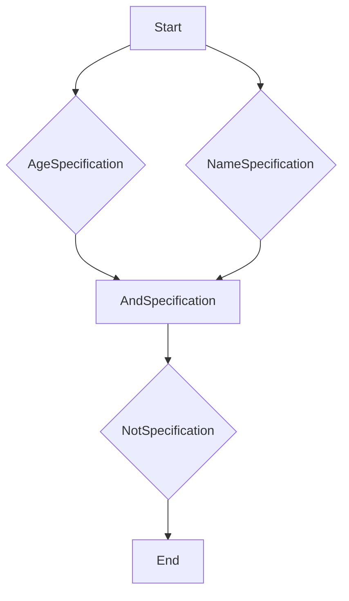

## 7.13. Specification Pattern for Complex Matching

In the world of software architecture, maintaining clean, maintainable, and flexible code is paramount. The Specification Pattern offers a robust solution for encapsulating business rules and complex matching logic. By using this pattern, we can create reusable, composable specifications that can be combined to form intricate business logic. Let's delve into how we can implement the Specification Pattern in Elixir, a language that embraces functional programming paradigms.

### Combining Business Rules

The Specification Pattern allows us to encapsulate business logic into reusable specifications. These specifications represent individual business rules or criteria that can be combined to form complex queries or validations. This pattern is particularly useful in scenarios where business rules change frequently or need to be applied in different contexts.

#### Key Benefits:
- **Reusability**: Specifications can be reused across different parts of the application.
- **Composability**: Specifications can be combined using logical operators like AND, OR, and NOT.
- **Maintainability**: Business logic is encapsulated in a single place, making it easier to manage and update.

### Implementing the Specification Pattern

To implement the Specification Pattern in Elixir, we will build composable functions or modules that represent rules. These specifications can be combined to form complex conditions. Let's walk through the process step-by-step.

#### Step 1: Define the Specification Protocol

First, we need to define a protocol that will serve as the foundation for our specifications. This protocol will have a single function, `is_satisfied_by?/2`, which checks if a given entity satisfies the specification.

```elixir
defprotocol Specification do
  @doc "Checks if the given entity satisfies the specification."
  def is_satisfied_by?(spec, entity)
end
```

#### Step 2: Create Concrete Specifications

Next, we create concrete specifications that implement the `Specification` protocol. Each specification will encapsulate a specific business rule.

```elixir
defmodule AgeSpecification do
  defstruct min_age: 0

  defimpl Specification do
    def is_satisfied_by?(%AgeSpecification{min_age: min_age}, %User{age: age}) do
      age >= min_age
    end
  end
end

defmodule NameSpecification do
  defstruct name: ""

  defimpl Specification do
    def is_satisfied_by?(%NameSpecification{name: name}, %User{name: user_name}) do
      String.contains?(user_name, name)
    end
  end
end
```

#### Step 3: Combine Specifications

We can now create composite specifications by combining existing ones using logical operators.

```elixir
defmodule AndSpecification do
  defstruct specs: []

  defimpl Specification do
    def is_satisfied_by?(%AndSpecification{specs: specs}, entity) do
      Enum.all?(specs, fn spec -> Specification.is_satisfied_by?(spec, entity) end)
    end
  end
end

defmodule OrSpecification do
  defstruct specs: []

  defimpl Specification do
    def is_satisfied_by?(%OrSpecification{specs: specs}, entity) do
      Enum.any?(specs, fn spec -> Specification.is_satisfied_by?(spec, entity) end)
    end
  end
end

defmodule NotSpecification do
  defstruct spec: nil

  defimpl Specification do
    def is_satisfied_by?(%NotSpecification{spec: spec}, entity) do
      not Specification.is_satisfied_by?(spec, entity)
    end
  end
end
```

### Use Cases

The Specification Pattern is versatile and can be applied in various scenarios, such as validations, filters, and building complex queries.

#### Validations

Specifications can be used to validate entities against a set of rules. For example, we can validate a user registration form by combining multiple specifications.

```elixir
defmodule UserValidator do
  def validate(user) do
    age_spec = %AgeSpecification{min_age: 18}
    name_spec = %NameSpecification{name: "John"}

    combined_spec = %AndSpecification{specs: [age_spec, name_spec]}

    Specification.is_satisfied_by?(combined_spec, user)
  end
end
```

#### Filters

Specifications can be used to filter collections of entities. For instance, we can filter a list of users based on age and name criteria.

```elixir
defmodule UserFilter do
  def filter_users(users, spec) do
    Enum.filter(users, fn user -> Specification.is_satisfied_by?(spec, user) end)
  end
end
```

#### Building Complex Queries

In database-driven applications, specifications can be used to build complex queries. By translating specifications into query conditions, we can dynamically construct SQL queries.

```elixir
defmodule QueryBuilder do
  def build_query(spec) do
    # Translate the specification into SQL query conditions
    # This is a simplified example
    case spec do
      %AgeSpecification{min_age: min_age} -> "age >= #{min_age}"
      %NameSpecification{name: name} -> "name LIKE '%#{name}%'"
      %AndSpecification{specs: specs} ->
        specs
        |> Enum.map(&build_query/1)
        |> Enum.join(" AND ")

      %OrSpecification{specs: specs} ->
        specs
        |> Enum.map(&build_query/1)
        |> Enum.join(" OR ")

      %NotSpecification{spec: spec} ->
        "NOT (" <> build_query(spec) <> ")"
    end
  end
end
```

### Visualizing the Specification Pattern

To better understand the Specification Pattern, let's visualize how specifications are combined using a flowchart.


```mermaid
graph TD;
    A[Start] --> B{AgeSpecification}
    A --> C{NameSpecification}
    B --> D[AndSpecification]
    C --> D
    D --> E{NotSpecification}
    E --> F[End]
```

**Diagram Description:** This flowchart illustrates how different specifications (AgeSpecification and NameSpecification) are combined using logical operators (AndSpecification and NotSpecification) to form a complex specification.

### Design Considerations

When implementing the Specification Pattern, consider the following:

- **Performance**: Combining multiple specifications can lead to performance overhead, especially if specifications are evaluated frequently.
- **Complexity**: While the pattern promotes reusability and maintainability, it can also introduce complexity if not managed properly.
- **Testing**: Ensure that each specification is thoroughly tested to verify its correctness.

### Elixir Unique Features

Elixir's functional programming paradigm and powerful pattern matching capabilities make it an ideal language for implementing the Specification Pattern. The use of protocols and structs allows us to define flexible and composable specifications.

### Differences and Similarities

The Specification Pattern is similar to other patterns like the Strategy Pattern, as both encapsulate logic. However, the Specification Pattern focuses on defining criteria or conditions, whereas the Strategy Pattern is more about defining algorithms or behaviors.

### Try It Yourself

Experiment with the Specification Pattern by modifying the code examples. Try adding new specifications or combining existing ones in different ways. Consider creating specifications for other entities or use cases.

### Knowledge Check

- Can you think of a scenario where the Specification Pattern would be beneficial?
- How would you handle a situation where a specification needs to be updated frequently?
- What are the potential drawbacks of using the Specification Pattern?

### Summary

The Specification Pattern is a powerful tool for encapsulating business rules and complex matching logic in Elixir. By creating reusable, composable specifications, we can build flexible and maintainable applications. Remember, this is just the beginning. As you progress, you'll find new ways to leverage the Specification Pattern in your projects. Keep experimenting, stay curious, and enjoy the journey!

## Quiz Time!



### What is the main benefit of using the Specification Pattern?

- [x] Encapsulating business logic into reusable specifications
- [ ] Improving database performance
- [ ] Reducing code complexity
- [ ] Enhancing user interface design

> **Explanation:** The Specification Pattern allows for encapsulating business logic into reusable specifications, making it easier to manage and update.

### Which Elixir feature is particularly useful for implementing the Specification Pattern?

- [x] Protocols
- [ ] GenServer
- [ ] ETS
- [ ] Phoenix Channels

> **Explanation:** Protocols in Elixir allow for defining flexible and composable specifications, which is essential for the Specification Pattern.

### How can specifications be combined in the Specification Pattern?

- [x] Using logical operators like AND, OR, and NOT
- [ ] By nesting them within each other
- [ ] Through database joins
- [ ] By using recursion

> **Explanation:** Specifications can be combined using logical operators like AND, OR, and NOT to form complex conditions.

### What is the purpose of the `is_satisfied_by?/2` function in the Specification Pattern?

- [x] To check if an entity satisfies a given specification
- [ ] To validate user input
- [ ] To perform database queries
- [ ] To handle errors

> **Explanation:** The `is_satisfied_by?/2` function checks if a given entity satisfies the specification, which is the core functionality of the Specification Pattern.

### Which of the following is a potential drawback of the Specification Pattern?

- [x] Performance overhead
- [ ] Lack of reusability
- [ ] Difficulty in understanding business rules
- [ ] Inability to handle complex logic

> **Explanation:** Combining multiple specifications can lead to performance overhead, especially if specifications are evaluated frequently.

### What is a common use case for the Specification Pattern?

- [x] Validations
- [ ] Logging
- [ ] User interface design
- [ ] Network communication

> **Explanation:** The Specification Pattern is commonly used for validations, where entities are checked against a set of rules.

### In the context of the Specification Pattern, what does "composability" refer to?

- [x] The ability to combine specifications using logical operators
- [ ] The ability to nest specifications within each other
- [ ] The ability to perform database joins
- [ ] The ability to handle errors

> **Explanation:** Composability refers to the ability to combine specifications using logical operators like AND, OR, and NOT.

### Which Elixir data structure is commonly used to represent specifications?

- [x] Structs
- [ ] Lists
- [ ] Maps
- [ ] Tuples

> **Explanation:** Structs are commonly used to represent specifications in Elixir, providing a clear and organized way to define business rules.

### How does the Specification Pattern improve maintainability?

- [x] By encapsulating business logic in a single place
- [ ] By reducing the number of lines of code
- [ ] By improving database performance
- [ ] By enhancing user interface design

> **Explanation:** The Specification Pattern improves maintainability by encapsulating business logic in a single place, making it easier to manage and update.

### True or False: The Specification Pattern is only useful for database-driven applications.

- [ ] True
- [x] False

> **Explanation:** False. The Specification Pattern is versatile and can be applied in various scenarios, such as validations, filters, and building complex queries, not just database-driven applications.


