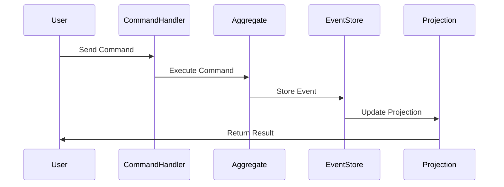

## 7.14. Event Sourcing Pattern in Elixir

In this section, we delve into the Event Sourcing pattern, a powerful architectural pattern that records all changes to an application's state as a sequence of events. This approach is particularly beneficial in Elixir, a language known for its concurrency and fault-tolerance capabilities. By the end of this guide, you'll understand how to implement Event Sourcing in Elixir using libraries like `Commanded`, and appreciate the benefits it brings, such as complete audit trails and the ability to reconstruct historical states.

### Storing System State as Events

Event Sourcing is a design pattern where state changes in an application are stored as a sequence of events. Instead of persisting the current state of an entity, you record every change as an event. This allows you to reconstruct the state of the entity at any point in time by replaying the events.

#### Key Concepts

- **Event**: A record of a change in state. Events are immutable and represent facts that have occurred.
- **Event Store**: A database that stores events. It acts as the source of truth for the system's state.
- **Projection**: A view or representation of the current state, derived by processing the sequence of events.
- **Command**: An instruction to perform an action that may result in one or more events.
- **Aggregate**: A cluster of domain objects that can be treated as a single unit for data changes.

### Implementing Event Sourcing

To implement Event Sourcing in Elixir, we can leverage libraries like `Commanded`, which provides a framework for building applications using the CQRS (Command Query Responsibility Segregation) and Event Sourcing patterns.

#### Setting Up Commanded

First, let's set up a new Elixir project and add `Commanded` to our dependencies.

```elixir
# mix.exs
defp deps do
  [
    {:commanded, "~> 1.2"},
    {:commanded_eventstore_adapter, "~> 1.2"},
    {:eventstore, "~> 1.2"}
  ]
end
```

Run `mix deps.get` to fetch the dependencies.

#### Defining Events

Events are the core of Event Sourcing. Let's define a simple event for a bank account system.

```elixir
defmodule BankAccount.Events.MoneyDeposited do
  defstruct [:account_id, :amount, :timestamp]
end
```

#### Creating an Aggregate

An aggregate is responsible for handling commands and producing events. Here's how you can define an aggregate for a bank account.

```elixir
defmodule BankAccount do
  use Commanded.Aggregates.Aggregate

  defstruct [:account_id, :balance]

  def execute(%BankAccount{}, %DepositMoney{amount: amount}) when amount > 0 do
    %MoneyDeposited{account_id: account_id, amount: amount, timestamp: DateTime.utc_now()}
  end

  def apply(%BankAccount{} = account, %MoneyDeposited{amount: amount}) do
    %{account | balance: account.balance + amount}
  end
end
```

#### Handling Commands

Commands are requests to perform actions. They are processed by aggregates.

```elixir
defmodule BankAccount.Commands.DepositMoney do
  defstruct [:account_id, :amount]
end
```

#### Setting Up the Event Store

Configure the event store in your application.

```elixir
# config/config.exs
config :my_app, MyApp.EventStore,
  serializer: Commanded.Serialization.JsonSerializer,
  username: "postgres",
  password: "postgres",
  database: "eventstore",
  hostname: "localhost"
```

#### Creating Projections

Projections are used to build read models from events.

```elixir
defmodule BankAccount.Projections.AccountBalance do
  use Commanded.Projections.Ecto, repo: MyApp.Repo

  def project(%MoneyDeposited{account_id: account_id, amount: amount}, %{account_id: account_id}) do
    update_balance(account_id, amount)
  end

  defp update_balance(account_id, amount) do
    # Logic to update the balance in the read model
  end
end
```

### Benefits of Event Sourcing

Implementing Event Sourcing in your application provides several advantages:

- **Complete Audit Trails**: Every change is recorded as an event, providing a full history of state changes.
- **Reconstruct Historical State**: You can recreate the state of the system at any point in time by replaying events.
- **Scalability**: Event Sourcing naturally supports scaling, as events can be processed in parallel.
- **Flexibility**: New projections can be created without changing the existing event store.

### Design Considerations

When implementing Event Sourcing, consider the following:

- **Event Versioning**: As your application evolves, events may need to change. Plan for event versioning to handle changes gracefully.
- **Consistency**: Ensure that commands are processed in a consistent manner to maintain the integrity of the event store.
- **Performance**: Replaying events can be resource-intensive. Use snapshots to optimize performance.

### Elixir Unique Features

Elixir's concurrency model, based on the Actor model, makes it well-suited for Event Sourcing. Processes can be used to handle commands and events concurrently, improving the responsiveness of the system.

### Differences and Similarities

Event Sourcing is often used in conjunction with CQRS. While Event Sourcing focuses on storing state changes as events, CQRS separates the read and write models, allowing for optimized queries.

### Visualizing Event Sourcing

Let's visualize the flow of Event Sourcing using a sequence diagram.



This diagram illustrates the flow of commands and events in an Event Sourcing system.

### Try It Yourself

Experiment with the code examples provided. Try modifying the `DepositMoney` command to include additional validation, or create a new event for withdrawing money. Observe how the system behaves and how projections are updated.

### Knowledge Check

- What are the main components of Event Sourcing?
- How does Event Sourcing differ from traditional state storage?
- What are the benefits of using Event Sourcing in Elixir?

### Embrace the Journey

Remember, mastering Event Sourcing takes practice. As you experiment with different scenarios, you'll gain a deeper understanding of how to leverage this pattern in your applications. Keep exploring, stay curious, and enjoy the journey!

## Quiz: Event Sourcing Pattern in Elixir



### What is the primary purpose of Event Sourcing?

- [x] To record all changes to application state as a sequence of events.
- [ ] To store the current state of an application.
- [ ] To improve the performance of database queries.
- [ ] To simplify the user interface design.

> **Explanation:** Event Sourcing records all changes to application state as a sequence of events, allowing for complete audit trails and historical state reconstruction.

### Which Elixir library is commonly used for implementing Event Sourcing?

- [x] Commanded
- [ ] Phoenix
- [ ] Ecto
- [ ] Plug

> **Explanation:** Commanded is a library that provides a framework for building applications using the CQRS and Event Sourcing patterns in Elixir.

### What is an event in the context of Event Sourcing?

- [x] A record of a change in state.
- [ ] A command to perform an action.
- [ ] A projection of the current state.
- [ ] A query to retrieve data.

> **Explanation:** An event is a record of a change in state, representing a fact that has occurred in the system.

### How can you optimize performance when replaying events?

- [x] Use snapshots to reduce the number of events that need to be replayed.
- [ ] Increase the number of database connections.
- [ ] Use a faster programming language.
- [ ] Reduce the size of the event store.

> **Explanation:** Snapshots can be used to capture the state of an aggregate at a point in time, reducing the number of events that need to be replayed to reconstruct the current state.

### What is a projection in Event Sourcing?

- [x] A view or representation of the current state, derived by processing the sequence of events.
- [ ] A command to change the state.
- [ ] A record of a change in state.
- [ ] A database query.

> **Explanation:** A projection is a view or representation of the current state, derived by processing the sequence of events stored in the event store.

### What is the role of an aggregate in Event Sourcing?

- [x] To handle commands and produce events.
- [ ] To store events in the event store.
- [ ] To query the current state.
- [ ] To manage database connections.

> **Explanation:** An aggregate is responsible for handling commands and producing events that represent changes in state.

### What is a command in Event Sourcing?

- [x] An instruction to perform an action that may result in one or more events.
- [ ] A record of a change in state.
- [ ] A view of the current state.
- [ ] A database query.

> **Explanation:** A command is an instruction to perform an action that may result in one or more events being generated.

### What is the benefit of using Event Sourcing for audit trails?

- [x] It provides a complete history of state changes.
- [ ] It reduces the size of the database.
- [ ] It simplifies the user interface.
- [ ] It improves the speed of data retrieval.

> **Explanation:** Event Sourcing provides a complete history of state changes, allowing for detailed audit trails and historical analysis.

### How does Elixir's concurrency model benefit Event Sourcing?

- [x] It allows for concurrent handling of commands and events, improving responsiveness.
- [ ] It simplifies the implementation of user interfaces.
- [ ] It reduces the complexity of database queries.
- [ ] It increases the speed of data retrieval.

> **Explanation:** Elixir's concurrency model, based on the Actor model, allows for concurrent handling of commands and events, improving the responsiveness and scalability of the system.

### True or False: Event Sourcing can be used without CQRS.

- [x] True
- [ ] False

> **Explanation:** Event Sourcing can be used independently of CQRS, although they are often used together to separate the read and write models.


