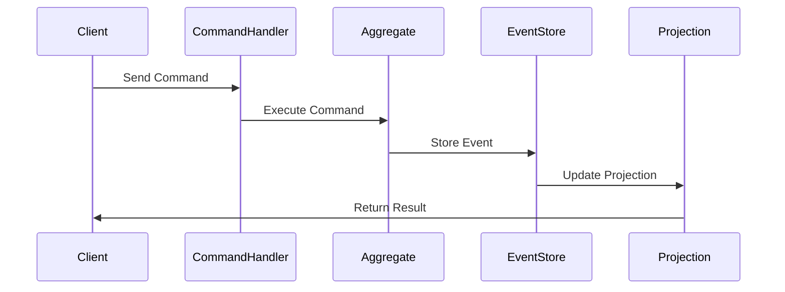

## 7.14. Event Sourcing Pattern in Elixir

In the world of software architecture, maintaining the integrity and traceability of data is crucial. The Event Sourcing pattern offers a robust solution by recording all changes to an application's state as a sequence of events. This approach not only provides a complete audit trail but also enables the reconstruction of historical states, making it an invaluable tool for expert software engineers and architects working in Elixir.

### What is Event Sourcing?

Event Sourcing is a design pattern that stores the state of a system as a series of events. Instead of storing just the current state, every change to the state is captured as an event. These events are immutable and are stored in an event store. This approach allows us to reconstruct any past state of the system by replaying the events.

#### Key Concepts

- **Event**: A record of a change in state. Events are immutable and are the single source of truth in an event-sourced system.
- **Event Store**: A database that stores events in the order they were applied.
- **Aggregate**: A cluster of domain objects that can be treated as a single unit. In event sourcing, aggregates are reconstructed by replaying events.
- **Command**: An instruction to perform an action that results in an event.
- **Projection**: A read model that is built by processing events to provide a view of the data.

### Why Use Event Sourcing in Elixir?

Elixir, with its functional programming paradigm and robust concurrency model, is well-suited for implementing event sourcing. The language's immutable data structures and pattern matching capabilities align perfectly with the principles of event sourcing.

#### Benefits of Event Sourcing

- **Audit Trail**: Every change is recorded as an event, providing a complete history of the system's state.
- **Reconstruct Historical State**: The state of the system at any point in time can be reconstructed by replaying events.
- **Scalability**: Elixir's concurrency model allows for efficient handling of large volumes of events.
- **Flexibility**: New projections can be created without altering the original event data.

### Implementing Event Sourcing in Elixir

To implement event sourcing in Elixir, we can leverage libraries such as `Commanded`, which provides a framework for building event-sourced applications.

#### Using Commanded

`Commanded` is a popular library for implementing CQRS (Command Query Responsibility Segregation) and event sourcing in Elixir. It provides tools to manage aggregates, commands, and projections.

##### Setting Up Commanded

1. **Add Dependencies**: First, add `commanded` and `commanded_eventstore_adapter` to your `mix.exs` file.

```elixir
defp deps do
  [
    {:commanded, "~> 1.2"},
    {:commanded_eventstore_adapter, "~> 1.2"}
  ]
end
```

2. **Configure Event Store**: Set up an event store using the `EventStore` library.

```elixir
config :my_app, MyApp.EventStore,
  serializer: Commanded.Serialization.JsonSerializer,
  username: "postgres",
  password: "postgres",
  database: "eventstore_dev",
  hostname: "localhost"
```

3. **Define an Aggregate**: Create an aggregate that will handle commands and produce events.

```elixir
defmodule MyApp.Accounts.Account do
  use Commanded.Aggregates.Aggregate

  defstruct [:account_number, :balance]

  def execute(%__MODULE__{}, %OpenAccount{account_number: account_number}) do
    %AccountOpened{account_number: account_number}
  end

  def apply(%__MODULE__{} = account, %AccountOpened{account_number: account_number}) do
    %__MODULE__{account | account_number: account_number}
  end
end
```

4. **Handle Commands**: Define a command handler to process commands and apply them to aggregates.

```elixir
defmodule MyApp.Accounts.AccountHandler do
  use Commanded.Commands.Handler, aggregate: MyApp.Accounts.Account

  def handle(%MyApp.Accounts.Account{}, %OpenAccount{} = command) do
    %AccountOpened{account_number: command.account_number}
  end
end
```

5. **Create Projections**: Build projections to query the current state of the system.

```elixir
defmodule MyApp.Accounts.AccountProjection do
  use Commanded.Projections.Ecto, repo: MyApp.Repo

  def project(%AccountOpened{account_number: account_number}, _metadata, multi) do
    Ecto.Multi.insert(multi, :account, %MyApp.Accounts.Account{
      account_number: account_number
    })
  end
end
```

### Visualizing Event Sourcing

Let's visualize the flow of data in an event-sourced system using a sequence diagram.


```mermaid
sequenceDiagram
    participant Client
    participant CommandHandler
    participant Aggregate
    participant EventStore
    participant Projection

    Client->>CommandHandler: Send Command
    CommandHandler->>Aggregate: Execute Command
    Aggregate->>EventStore: Store Event
    EventStore->>Projection: Update Projection
    Projection->>Client: Return Result
```

**Description**: This diagram illustrates the flow of a command from the client to the command handler, which executes the command on the aggregate. The resulting event is stored in the event store and used to update projections, which can then be queried by the client.

### Design Considerations

When implementing event sourcing, consider the following:

- **Event Versioning**: As the system evolves, events may need to change. Implement versioning to handle changes without breaking existing functionality.
- **Event Schema**: Design a clear and consistent schema for events to ensure compatibility and ease of use.
- **Performance**: Event sourcing can introduce performance overhead. Optimize event storage and retrieval to maintain system performance.
- **Consistency**: Ensure that projections are eventually consistent with the event store.

### Elixir Unique Features

Elixir's strengths in concurrency and functional programming make it an ideal choice for event sourcing. The language's pattern matching and immutable data structures simplify the handling of events and state transitions.

### Differences and Similarities

Event sourcing is often used in conjunction with CQRS, but they are distinct patterns. CQRS separates command handling from querying, while event sourcing focuses on storing state changes as events. Both patterns complement each other and can be used together to build robust systems.

### Try It Yourself

Experiment with the code examples provided by modifying the events and commands. Try creating new aggregates or projections to see how the system adapts to changes. This hands-on approach will deepen your understanding of event sourcing in Elixir.

### Knowledge Check

- **What are the benefits of using event sourcing in Elixir?**
- **How does the Commanded library assist in implementing event sourcing?**
- **What are some design considerations when using event sourcing?**

### Summary

Event sourcing is a powerful pattern for managing state in Elixir applications. By recording all changes as events, we gain a complete audit trail and the ability to reconstruct historical states. Libraries like Commanded simplify the implementation of event sourcing, allowing us to focus on building robust and scalable systems.

Remember, mastering event sourcing takes practice. Keep experimenting, stay curious, and enjoy the journey!

## Quiz Time!



### What is the primary benefit of using Event Sourcing?

- [x] Complete audit trail
- [ ] Faster data retrieval
- [ ] Simplified database schema
- [ ] Reduced storage requirements

> **Explanation:** Event Sourcing provides a complete audit trail by recording every change to the application state as an event.

### Which library is commonly used for Event Sourcing in Elixir?

- [ ] Ecto
- [x] Commanded
- [ ] Phoenix
- [ ] Plug

> **Explanation:** The `Commanded` library is widely used for implementing Event Sourcing and CQRS in Elixir applications.

### What is an Aggregate in Event Sourcing?

- [x] A cluster of domain objects treated as a single unit
- [ ] A command that results in an event
- [ ] A read model built by processing events
- [ ] A database that stores events

> **Explanation:** An Aggregate is a cluster of domain objects that can be treated as a single unit in Event Sourcing.

### How can historical states be reconstructed in Event Sourcing?

- [x] By replaying events
- [ ] By querying the current state
- [ ] By using projections
- [ ] By executing commands

> **Explanation:** Historical states can be reconstructed by replaying the sequence of events stored in the event store.

### What is a Projection in Event Sourcing?

- [ ] A command that results in an event
- [x] A read model built by processing events
- [ ] A cluster of domain objects
- [ ] A database that stores events

> **Explanation:** A Projection is a read model that is built by processing events to provide a view of the data.

### What is the role of a Command in Event Sourcing?

- [x] An instruction to perform an action that results in an event
- [ ] A record of a change in state
- [ ] A read model built by processing events
- [ ] A database that stores events

> **Explanation:** A Command is an instruction to perform an action that results in an event in Event Sourcing.

### Which of the following is a design consideration for Event Sourcing?

- [ ] Simplifying the database schema
- [x] Event versioning
- [ ] Reducing storage requirements
- [ ] Eliminating concurrency

> **Explanation:** Event versioning is a design consideration in Event Sourcing to handle changes without breaking existing functionality.

### What is the purpose of an Event Store in Event Sourcing?

- [ ] To execute commands
- [x] To store events in the order they were applied
- [ ] To process events and build projections
- [ ] To manage aggregates

> **Explanation:** An Event Store is a database that stores events in the order they were applied in Event Sourcing.

### What is the relationship between Event Sourcing and CQRS?

- [x] They are distinct but complementary patterns
- [ ] They are the same pattern
- [ ] They are incompatible patterns
- [ ] They are unrelated patterns

> **Explanation:** Event Sourcing and CQRS are distinct but complementary patterns often used together to build robust systems.

### True or False: Event Sourcing can introduce performance overhead.

- [x] True
- [ ] False

> **Explanation:** Event Sourcing can introduce performance overhead due to the need to store and retrieve a large volume of events.


