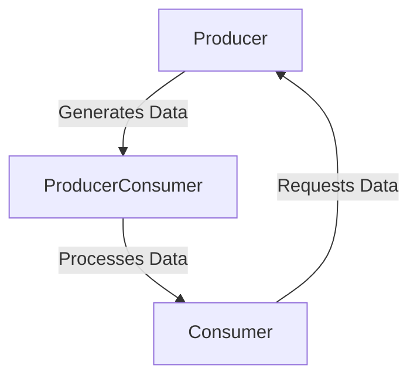

## 7.15. Implementing Reactive Programming Concepts

Reactive programming is a paradigm that focuses on asynchronous data streams and the propagation of change. In Elixir, this approach is particularly powerful due to the language's inherent support for concurrency and fault tolerance. In this section, we will explore how to implement reactive programming concepts in Elixir, focusing on asynchronous data streams, real-time data processing, and backpressure-aware systems using `GenStage` and `Flow`.

### Understanding Reactive Programming

Reactive programming is about building systems that react to changes in data in real-time. This is achieved by modeling data as streams and defining how these streams should be processed. The key components of reactive programming include:

- **Asynchronous Data Streams**: Data is treated as a continuous stream, allowing systems to react to changes as they occur.
- **Backpressure Management**: Ensures that producers do not overwhelm consumers with data.
- **Event-Driven Architecture**: Systems respond to events, making them highly responsive and scalable.

### Asynchronous Data Streams

In Elixir, asynchronous data streams can be implemented using `GenStage` and `Flow`. These libraries provide the tools necessary to build systems that process data in real-time, handling backpressure and ensuring efficient data flow.

#### GenStage: The Foundation of Reactive Streams

`GenStage` is a library for building data processing pipelines with backpressure. It allows you to define producers, consumers, and the flow of data between them.

- **Producer**: Generates data and sends it downstream.
- **Consumer**: Receives data and processes it.
- **ProducerConsumer**: Acts as both a producer and a consumer, transforming data as it passes through.

```elixir
defmodule MyProducer do
  use GenStage

  def start_link(initial) do
    GenStage.start_link(__MODULE__, initial, name: __MODULE__)
  end

  def init(initial) do
    {:producer, initial}
  end

  def handle_demand(demand, state) do
    events = Enum.to_list(state..(state + demand - 1))
    {:noreply, events, state + demand}
  end
end

defmodule MyConsumer do
  use GenStage

  def start_link() do
    GenStage.start_link(__MODULE__, :ok, name: __MODULE__)
  end

  def init(:ok) do
    {:consumer, :ok}
  end

  def handle_events(events, _from, state) do
    Enum.each(events, fn event -> IO.inspect(event) end)
    {:noreply, [], state}
  end
end
```

In this example, `MyProducer` generates a sequence of numbers, while `MyConsumer` prints each number. The `handle_demand` function in the producer ensures that data is only generated when there is demand from the consumer, effectively managing backpressure.

#### Flow: High-Level Abstractions for Data Processing

`Flow` builds on top of `GenStage` to provide a higher-level abstraction for parallel and distributed data processing. It simplifies the creation of complex data processing pipelines.

```elixir
alias Experimental.Flow

flow = Flow.from_enumerable(1..1000)
|> Flow.map(&(&1 * 2))
|> Flow.filter(&rem(&1, 2) == 0)
|> Flow.partition()
|> Flow.reduce(fn -> 0 end, &(&1 + &2))

IO.inspect(Flow.run(flow))
```

In this example, `Flow` is used to create a pipeline that doubles each number in a range, filters out odd numbers, partitions the data, and then reduces it to a sum. The use of `Flow.partition` allows for parallel processing, making the system more efficient.

### Implementing Reactive Patterns

Reactive patterns in Elixir are implemented using `GenStage` and `Flow` to handle real-time data processing and backpressure management.

#### Real-Time Data Processing

Real-time data processing involves reacting to data as it arrives, rather than processing it in batches. This is crucial for applications such as live dashboards, stream analytics, and monitoring systems.

```elixir
defmodule RealTimeProcessor do
  use GenStage

  def start_link() do
    GenStage.start_link(__MODULE__, :ok, name: __MODULE__)
  end

  def init(:ok) do
    {:producer_consumer, :ok}
  end

  def handle_events(events, _from, state) do
    processed_events = Enum.map(events, &process_event/1)
    {:noreply, processed_events, state}
  end

  defp process_event(event) do
    # Simulate processing
    IO.inspect("Processing event: #{event}")
    event
  end
end
```

In this example, `RealTimeProcessor` acts as a `ProducerConsumer`, processing events as they arrive. This pattern is ideal for applications that require immediate feedback or action based on incoming data.

#### Backpressure-Aware Systems

Backpressure is a mechanism to prevent producers from overwhelming consumers with data. In `GenStage`, backpressure is managed by the demand-driven model, where consumers request data from producers.

```elixir
defmodule BackpressureProducer do
  use GenStage

  def start_link() do
    GenStage.start_link(__MODULE__, 0, name: __MODULE__)
  end

  def init(counter) do
    {:producer, counter}
  end

  def handle_demand(demand, counter) do
    events = Enum.to_list(counter..(counter + demand - 1))
    {:noreply, events, counter + demand}
  end
end

defmodule BackpressureConsumer do
  use GenStage

  def start_link() do
    GenStage.start_link(__MODULE__, :ok, name: __MODULE__)
  end

  def init(:ok) do
    {:consumer, :ok}
  end

  def handle_events(events, _from, state) do
    Enum.each(events, fn event -> IO.inspect("Consumed: #{event}") end)
    {:noreply, [], state}
  end
end
```

In this example, `BackpressureProducer` generates events based on the demand from `BackpressureConsumer`. This ensures that the system remains responsive and does not become overloaded with data.

### Use Cases for Reactive Programming in Elixir

Reactive programming is well-suited for a variety of use cases, including:

- **Real-Time Data Processing**: Applications that require immediate processing of incoming data, such as financial trading platforms or IoT systems.
- **Live Dashboards**: Systems that display real-time data to users, such as monitoring dashboards or analytics platforms.
- **Stream Analytics**: Analyzing data streams in real-time to extract insights or detect anomalies.

### Visualizing Reactive Programming Concepts

To better understand the flow of data in a reactive system, let's visualize the components and their interactions using a Mermaid.js diagram.



**Diagram Description**: This diagram illustrates the flow of data in a reactive system using `GenStage`. The producer generates data, which is processed by the `ProducerConsumer`, and finally consumed by the consumer. The consumer requests data from the producer, creating a feedback loop that manages backpressure.

### Key Considerations for Implementing Reactive Systems

When implementing reactive systems in Elixir, consider the following:

- **Scalability**: Ensure that your system can scale horizontally by distributing work across multiple nodes.
- **Fault Tolerance**: Leverage Elixir's fault-tolerant features to handle failures gracefully.
- **Performance**: Optimize your data processing pipelines for performance, using techniques such as partitioning and parallel processing.

### Elixir Unique Features

Elixir's unique features, such as lightweight processes and the BEAM VM, make it an ideal language for implementing reactive systems. The language's support for concurrency and fault tolerance allows developers to build robust and scalable applications.

### Differences and Similarities with Other Patterns

Reactive programming shares similarities with event-driven architectures, but it focuses more on data streams and backpressure management. Unlike traditional batch processing, reactive systems process data as it arrives, providing immediate feedback.

### Try It Yourself

To deepen your understanding of reactive programming in Elixir, try modifying the code examples provided. Experiment with different data sources, processing logic, and backpressure strategies. Observe how changes affect the system's behavior and performance.

### Knowledge Check

- What is the primary goal of reactive programming?
- How does `GenStage` manage backpressure?
- What are some use cases for reactive programming in Elixir?

### Embrace the Journey

Remember, mastering reactive programming is a journey. As you experiment and build more complex systems, you'll gain a deeper understanding of how to leverage Elixir's features to create responsive and scalable applications. Keep exploring, stay curious, and enjoy the process!

## Quiz: Implementing Reactive Programming Concepts



### What is the primary goal of reactive programming?

- [x] To build systems that react to data changes in real-time
- [ ] To process data in large batches
- [ ] To use synchronous data streams
- [ ] To eliminate all forms of concurrency

> **Explanation:** Reactive programming focuses on building systems that react to data changes in real-time, using asynchronous data streams.

### How does `GenStage` manage backpressure?

- [x] By using a demand-driven model where consumers request data
- [ ] By buffering all data in memory
- [ ] By processing data in fixed-size batches
- [ ] By using synchronous communication

> **Explanation:** `GenStage` uses a demand-driven model, where consumers request data from producers, effectively managing backpressure.

### Which Elixir library provides high-level abstractions for parallel and distributed data processing?

- [x] Flow
- [ ] GenServer
- [ ] Ecto
- [ ] Phoenix

> **Explanation:** `Flow` builds on top of `GenStage` to provide high-level abstractions for parallel and distributed data processing.

### What is a common use case for reactive programming in Elixir?

- [x] Real-time data processing
- [ ] Batch processing of large datasets
- [ ] Static website generation
- [ ] Synchronous file I/O operations

> **Explanation:** Reactive programming is commonly used for real-time data processing, where immediate feedback is required.

### What role does a `ProducerConsumer` play in a `GenStage` pipeline?

- [x] It acts as both a producer and a consumer, transforming data
- [ ] It only generates data
- [ ] It only consumes data
- [ ] It manages system configuration

> **Explanation:** A `ProducerConsumer` acts as both a producer and a consumer, transforming data as it passes through the pipeline.

### What is the benefit of using `Flow.partition` in a data processing pipeline?

- [x] It allows for parallel processing of data
- [ ] It ensures data is processed in order
- [ ] It reduces memory usage
- [ ] It simplifies error handling

> **Explanation:** `Flow.partition` allows for parallel processing of data, improving the efficiency of the pipeline.

### What is the key difference between reactive programming and traditional batch processing?

- [x] Reactive programming processes data as it arrives
- [ ] Reactive programming uses synchronous data streams
- [ ] Batch processing is more responsive
- [ ] Batch processing handles backpressure better

> **Explanation:** Reactive programming processes data as it arrives, providing immediate feedback, unlike traditional batch processing.

### Which Elixir feature is particularly beneficial for implementing reactive systems?

- [x] Lightweight processes and the BEAM VM
- [ ] Static typing
- [ ] Object-oriented programming
- [ ] Manual memory management

> **Explanation:** Elixir's lightweight processes and the BEAM VM are particularly beneficial for implementing reactive systems due to their support for concurrency and fault tolerance.

### What is a potential challenge when implementing reactive systems?

- [x] Managing backpressure effectively
- [ ] Ensuring data is processed in large batches
- [ ] Avoiding all forms of concurrency
- [ ] Using synchronous communication

> **Explanation:** Managing backpressure effectively is a potential challenge when implementing reactive systems, as it ensures that producers do not overwhelm consumers with data.

### True or False: Reactive programming in Elixir is only suitable for small-scale applications.

- [ ] True
- [x] False

> **Explanation:** Reactive programming in Elixir is suitable for both small-scale and large-scale applications, thanks to Elixir's scalability and fault tolerance features.



By understanding and implementing reactive programming concepts in Elixir, you can build powerful, responsive, and scalable applications that handle real-time data efficiently. Keep experimenting with `GenStage` and `Flow` to explore the full potential of reactive systems in Elixir.
