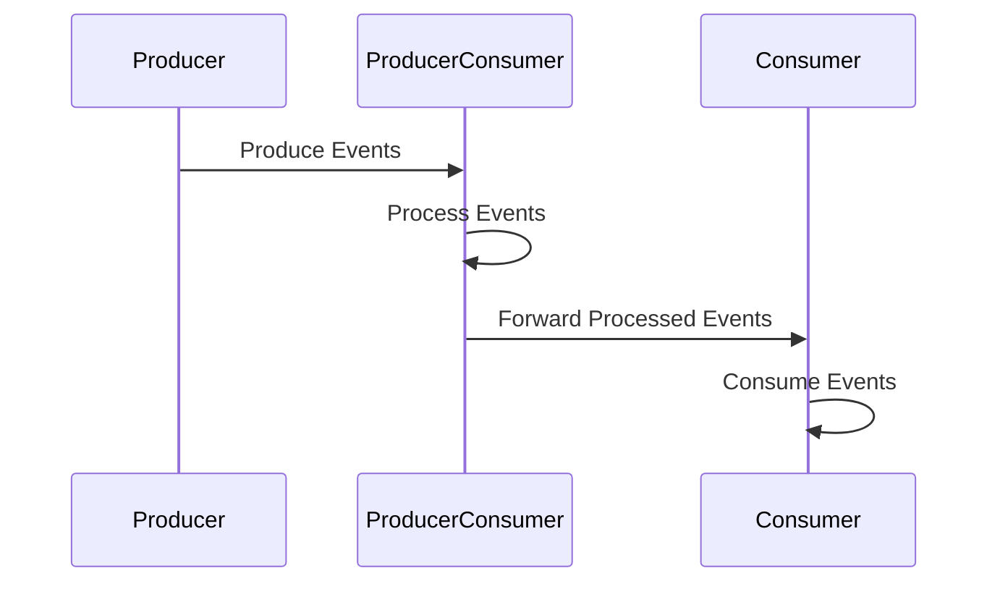

## 7.15. Implementing Reactive Programming Concepts

Reactive programming is a paradigm that revolves around asynchronous data streams and the propagation of change. In Elixir, this approach can be effectively implemented using tools like `GenStage` and `Flow`, which are designed to handle real-time data processing with backpressure management. This section will guide you through the concepts and practical implementations of reactive programming in Elixir, focusing on building applications that react to data changes in real-time.

### Asynchronous Data Streams

Reactive programming in Elixir is centered around the concept of asynchronous data streams. These streams allow applications to process data as it arrives, enabling real-time updates and interactions. This is particularly useful in scenarios where data is continuously generated and needs to be processed on-the-fly, such as live dashboards, stream analytics, and real-time notifications.

#### Key Concepts

- **Data Streams**: Continuous flow of data that can be observed and processed as it arrives.
- **Backpressure**: A mechanism to control the flow of data to prevent overwhelming the system.
- **Concurrency**: Leveraging Elixir's lightweight processes to handle multiple streams simultaneously.

#### Implementing Asynchronous Data Streams

To implement asynchronous data streams in Elixir, we can use `GenStage`, a behavior module for exchanging data between Elixir processes with built-in backpressure.

```elixir
defmodule Producer do
  use GenStage

  def start_link(initial) do
    GenStage.start_link(__MODULE__, initial, name: __MODULE__)
  end

  def init(initial) do
    {:producer, initial}
  end

  def handle_demand(demand, state) when demand > 0 do
    events = Enum.to_list(state..state + demand - 1)
    {:noreply, events, state + demand}
  end
end

defmodule Consumer do
  use GenStage

  def start_link() do
    GenStage.start_link(__MODULE__, :ok, name: __MODULE__)
  end

  def init(:ok) do
    {:consumer, :the_state_does_not_matter}
  end

  def handle_events(events, _from, state) do
    for event <- events do
      IO.inspect(event, label: "Consumed")
    end
    {:noreply, [], state}
  end
end

{:ok, producer} = Producer.start_link(0)
{:ok, consumer} = Consumer.start_link()

GenStage.sync_subscribe(consumer, to: producer)
```

In this example, we define a `Producer` that generates a sequence of numbers and a `Consumer` that processes these numbers. The `GenStage.sync_subscribe/2` function is used to connect the consumer to the producer, enabling data flow.

### Implementing Reactive Patterns

Reactive patterns in Elixir can be implemented using `GenStage` and `Flow`. These tools provide a robust framework for handling complex data processing pipelines with backpressure management.

#### Using `GenStage`

`GenStage` is a powerful tool for building data processing pipelines. It allows you to define a series of stages, each responsible for a specific part of the processing. Each stage can be a producer, a consumer, or both (producer-consumer).

```elixir
defmodule ProducerConsumer do
  use GenStage

  def start_link() do
    GenStage.start_link(__MODULE__, :ok, name: __MODULE__)
  end

  def init(:ok) do
    {:producer_consumer, :the_state_does_not_matter}
  end

  def handle_events(events, _from, state) do
    processed_events = Enum.map(events, fn event -> event * 2 end)
    {:noreply, processed_events, state}
  end
end

{:ok, producer_consumer} = ProducerConsumer.start_link()

GenStage.sync_subscribe(producer_consumer, to: producer)
GenStage.sync_subscribe(consumer, to: producer_consumer)
```

In this example, the `ProducerConsumer` stage receives events from the `Producer`, processes them by doubling each event, and then forwards them to the `Consumer`.

#### Using `Flow`

`Flow` builds on top of `GenStage` to provide a higher-level abstraction for parallel data processing. It is particularly useful for large-scale data processing tasks that require partitioning and parallel execution.

```elixir
alias Experimental.Flow

flow = Flow.from_enumerable(1..1000)
        |> Flow.map(&(&1 * 2))
        |> Flow.filter(&rem(&1, 2) == 0)
        |> Flow.partition()
        |> Flow.reduce(fn -> 0 end, &(&1 + &2))

Flow.run(flow)
```

In this example, we create a `Flow` that processes numbers from 1 to 1000, doubling each number, filtering out odd numbers, and then summing the remaining even numbers. The `Flow.partition/1` function is used to distribute the workload across multiple processes.

### Use Cases

Reactive programming is ideal for scenarios where real-time data processing is crucial. Here are some common use cases:

- **Real-Time Data Processing**: Applications that require immediate processing of incoming data, such as financial trading platforms or IoT data streams.
- **Live Dashboards**: Systems that provide real-time updates to users, such as monitoring dashboards or live analytics.
- **Stream Analytics**: Analyzing data streams in real-time, such as sentiment analysis on social media feeds or network traffic analysis.

### Visualizing Reactive Programming Concepts

To better understand the flow of data in a reactive system, let's visualize the process using a sequence diagram.


```mermaid
sequenceDiagram
    participant Producer
    participant ProducerConsumer
    participant Consumer

    Producer->>ProducerConsumer: Produce Events
    ProducerConsumer->>ProducerConsumer: Process Events
    ProducerConsumer->>Consumer: Forward Processed Events
    Consumer->>Consumer: Consume Events
```

This diagram illustrates the flow of events from the `Producer` to the `Consumer` through the `ProducerConsumer`. Each stage processes the data and forwards it to the next stage.

### Try It Yourself

Experiment with the code examples provided by making the following modifications:

- **Add a new stage**: Introduce another `ProducerConsumer` stage that filters out numbers greater than a certain threshold.
- **Change the data source**: Modify the `Producer` to generate a different sequence of numbers or even random numbers.
- **Implement custom logic**: In the `Consumer`, instead of just printing the events, try storing them in a database or sending them to an external service.

### Knowledge Check

To reinforce your understanding of reactive programming concepts in Elixir, consider the following questions:

- How does `GenStage` handle backpressure?
- What are the benefits of using `Flow` over `GenStage` for certain tasks?
- In what scenarios would you choose reactive programming over traditional approaches?

### Embrace the Journey

Remember, mastering reactive programming in Elixir is a journey. As you explore these concepts, you'll gain the skills to build more responsive and efficient applications. Keep experimenting, stay curious, and enjoy the journey!

## Quiz Time!



### What is a key feature of reactive programming?

- [x] Asynchronous data streams
- [ ] Synchronous data processing
- [ ] Static data structures
- [ ] Manual memory management

> **Explanation:** Reactive programming is centered around asynchronous data streams, allowing for real-time data processing.

### Which Elixir tool is used for backpressure-aware data processing?

- [x] GenStage
- [ ] Ecto
- [ ] Phoenix
- [ ] Plug

> **Explanation:** GenStage is specifically designed for backpressure-aware data processing in Elixir.

### What does the `Flow.partition/1` function do?

- [x] Distributes workload across multiple processes
- [ ] Combines multiple streams into one
- [ ] Filters data based on a condition
- [ ] Maps data to a new structure

> **Explanation:** `Flow.partition/1` is used to distribute the workload across multiple processes for parallel execution.

### What is a common use case for reactive programming?

- [x] Real-time data processing
- [ ] Batch processing
- [ ] Static website generation
- [ ] Manual data entry

> **Explanation:** Reactive programming is ideal for real-time data processing applications.

### Which of the following is a stage type in `GenStage`?

- [x] Producer
- [x] Consumer
- [x] Producer-Consumer
- [ ] Transformer

> **Explanation:** GenStage has three stage types: Producer, Consumer, and Producer-Consumer.

### How can you connect a consumer to a producer in `GenStage`?

- [x] Using `GenStage.sync_subscribe/2`
- [ ] Using `Flow.from_enumerable/1`
- [ ] Using `Enum.map/2`
- [ ] Using `Task.async/1`

> **Explanation:** `GenStage.sync_subscribe/2` is used to connect a consumer to a producer.

### What is a benefit of using `Flow` over `GenStage`?

- [x] Higher-level abstraction for parallel data processing
- [ ] Lower-level control over data flow
- [ ] Manual management of concurrency
- [ ] Static data processing

> **Explanation:** Flow provides a higher-level abstraction for parallel data processing, making it easier to implement complex pipelines.

### What mechanism does reactive programming use to prevent overwhelming the system?

- [x] Backpressure
- [ ] Caching
- [ ] Polling
- [ ] Throttling

> **Explanation:** Backpressure is used to control the flow of data and prevent overwhelming the system.

### Which Elixir behavior module is used for exchanging data between processes?

- [x] GenStage
- [ ] GenServer
- [ ] Supervisor
- [ ] Task

> **Explanation:** GenStage is the behavior module used for exchanging data between Elixir processes.

### True or False: Reactive programming in Elixir is only suitable for small-scale applications.

- [ ] True
- [x] False

> **Explanation:** Reactive programming in Elixir is suitable for both small-scale and large-scale applications, especially those requiring real-time data processing.



Remember, this is just the beginning. As you progress, you'll build more complex and interactive applications. Keep experimenting, stay curious, and enjoy the journey!
