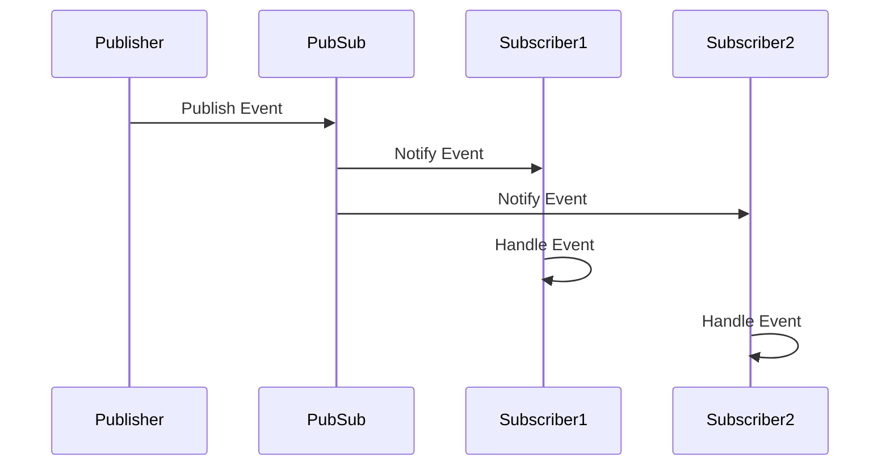

## 7.2. Observer Pattern with PubSub and `Phoenix.PubSub`

In the world of software design patterns, the Observer Pattern stands out as a powerful tool for creating systems that react to changes in state or events. In Elixir, the Observer Pattern can be effectively implemented using the publish-subscribe (PubSub) model, particularly with the `Phoenix.PubSub` library. This section will guide you through understanding, implementing, and utilizing the Observer Pattern in Elixir, leveraging the capabilities of `Phoenix.PubSub`.

### Event Subscription Mechanism

The Observer Pattern is fundamentally about event subscription. It allows different parts of a system to subscribe to events and react when those events occur. This decouples the source of the event from the consumers, promoting a more modular and maintainable architecture.

#### Key Concepts

- **Subject**: The entity that holds the state and notifies observers of changes.
- **Observer**: The entity that subscribes to the subject to receive updates.
- **Event**: A change in state or occurrence that triggers notifications to observers.

In Elixir, the PubSub model is a natural fit for implementing the Observer Pattern. It allows for efficient communication between processes, making it ideal for real-time applications.

### Implementing the Observer Pattern

Elixir provides several tools for implementing the Observer Pattern, with `Phoenix.PubSub` being one of the most popular choices. It is part of the Phoenix framework but can be used independently for PubSub functionality.

#### Using `Phoenix.PubSub`

`Phoenix.PubSub` is a distributed PubSub system that allows processes to subscribe to and broadcast messages on topics. It is designed to work seamlessly in distributed environments, making it suitable for scalable applications.

##### Setting Up `Phoenix.PubSub`

To use `Phoenix.PubSub`, you need to add it to your project. If you're using Phoenix, it's already included. Otherwise, you can add it to your `mix.exs`:

```elixir
defp deps do
  [
    {:phoenix_pubsub, "~> 2.0"}
  ]
end
```

Run `mix deps.get` to fetch the dependency.

##### Configuring `Phoenix.PubSub`

You need to configure `Phoenix.PubSub` in your application. This typically involves adding it to your supervision tree:

```elixir
defmodule MyApp.Application do
  use Application

  def start(_type, _args) do
    children = [
      {Phoenix.PubSub, name: MyApp.PubSub}
    ]

    opts = [strategy: :one_for_one, name: MyApp.Supervisor]
    Supervisor.start_link(children, opts)
  end
end
```

##### Publishing and Subscribing to Events

With `Phoenix.PubSub` set up, you can start publishing and subscribing to events.

###### Publishing Events

To publish an event, use the `Phoenix.PubSub.broadcast/3` function:

```elixir
Phoenix.PubSub.broadcast(MyApp.PubSub, "topic:example", {:event, "data"})
```

###### Subscribing to Events

To subscribe to a topic, use `Phoenix.PubSub.subscribe/2`:

```elixir
Phoenix.PubSub.subscribe(MyApp.PubSub, "topic:example")
```

Once subscribed, a process can handle messages using `receive`:

```elixir
receive do
  {:event, data} ->
    IO.puts("Received event with data: #{data}")
end
```

#### Using Elixir's Built-in `Registry`

Elixir's `Registry` module can also be used for PubSub functionality. It provides a way to register and lookup processes, which can be leveraged for event subscription.

##### Setting Up a Registry

First, add a `Registry` to your supervision tree:

```elixir
defmodule MyApp.Application do
  use Application

  def start(_type, _args) do
    children = [
      {Registry, keys: :unique, name: MyApp.Registry}
    ]

    opts = [strategy: :one_for_one, name: MyApp.Supervisor]
    Supervisor.start_link(children, opts)
  end
end
```

##### Publishing and Subscribing with Registry

You can use `Registry` to send messages to registered processes.

###### Registering a Process

Register a process with a unique key:

```elixir
Registry.register(MyApp.Registry, "topic:example", [])
```

###### Sending Messages

Send messages to all processes registered under a key:

```elixir
Registry.dispatch(MyApp.Registry, "topic:example", fn entries ->
  for {pid, _} <- entries do
    send(pid, {:event, "data"})
  end
end)
```

### Use Cases

The Observer Pattern is widely used in scenarios where real-time updates are crucial. Here are some common use cases:

- **Live Updates**: Applications that require real-time data updates, such as dashboards or live feeds.
- **Notifications**: Systems that send alerts or notifications based on specific events.
- **Logging Systems**: Centralized logging systems that collect and process logs from various sources.

### Visualizing the Observer Pattern

To better understand the flow of the Observer Pattern using PubSub, let's visualize it with a sequence diagram.



**Diagram Description**: The diagram illustrates how a publisher sends an event to the PubSub system, which then notifies all subscribers. Each subscriber independently handles the event.

### Design Considerations

When implementing the Observer Pattern with PubSub, consider the following:

- **Scalability**: Ensure your PubSub system can handle the expected load, especially in distributed environments.
- **Fault Tolerance**: Design your system to gracefully handle failures, ensuring that critical updates are not missed.
- **Performance**: Optimize message handling to minimize latency, especially for real-time applications.

### Elixir Unique Features

Elixir's concurrency model, based on the Actor model, makes it particularly well-suited for implementing the Observer Pattern. The lightweight processes and message-passing capabilities of Elixir provide a robust foundation for building reactive systems.

### Differences and Similarities

The Observer Pattern is often compared to the Mediator Pattern. While both involve communication between components, the Observer Pattern focuses on event-driven updates, whereas the Mediator Pattern centralizes communication to reduce dependencies.

### Try It Yourself

To deepen your understanding, try modifying the code examples:

- **Experiment with Different Topics**: Create multiple topics and see how subscribers react to different events.
- **Simulate Failures**: Introduce failures in the system and observe how your implementation handles them.
- **Optimize Performance**: Measure the performance of your PubSub system and implement optimizations.

### Knowledge Check

- **Question**: What is the primary role of the PubSub system in the Observer Pattern?
- **Exercise**: Implement a simple notification system using `Phoenix.PubSub` and test it with multiple subscribers.

### Embrace the Journey

Remember, mastering the Observer Pattern with PubSub in Elixir is just the beginning. As you continue to explore and experiment, you'll discover new ways to build powerful, real-time applications. Stay curious, keep learning, and enjoy the journey!

## Quiz: Observer Pattern with PubSub and `Phoenix.PubSub`



### What is the primary purpose of the Observer Pattern?

- [x] To allow parts of the system to subscribe and react to events.
- [ ] To centralize communication between components.
- [ ] To manage state transitions in a system.
- [ ] To optimize performance in distributed systems.

> **Explanation:** The Observer Pattern is designed to allow different parts of a system to subscribe to and react to events, promoting a decoupled architecture.

### Which Elixir library is commonly used to implement the Observer Pattern?

- [x] Phoenix.PubSub
- [ ] Ecto
- [ ] Plug
- [ ] ExUnit

> **Explanation:** `Phoenix.PubSub` is a popular library in Elixir for implementing the Observer Pattern using the publish-subscribe model.

### What is the role of a subscriber in the Observer Pattern?

- [x] To receive and handle events from a subject.
- [ ] To publish events to a subject.
- [ ] To manage the state of a subject.
- [ ] To optimize event handling.

> **Explanation:** A subscriber in the Observer Pattern is responsible for receiving and handling events from a subject.

### How does `Phoenix.PubSub` notify subscribers of an event?

- [x] By broadcasting messages to subscribed processes.
- [ ] By directly calling subscriber functions.
- [ ] By updating a shared state.
- [ ] By logging events to a file.

> **Explanation:** `Phoenix.PubSub` uses message broadcasting to notify subscribers of events.

### What is a common use case for the Observer Pattern?

- [x] Real-time notifications
- [ ] Data serialization
- [ ] Static code analysis
- [ ] Database migrations

> **Explanation:** Real-time notifications are a common use case for the Observer Pattern, as it allows systems to react to events as they occur.

### What is the main advantage of using the PubSub model in Elixir?

- [x] It decouples event producers from consumers.
- [ ] It centralizes event handling.
- [ ] It simplifies database interactions.
- [ ] It enhances code readability.

> **Explanation:** The PubSub model decouples event producers from consumers, allowing for more modular and maintainable systems.

### How can you optimize a PubSub system for performance?

- [x] By minimizing latency in message handling.
- [ ] By increasing the number of subscribers.
- [ ] By centralizing event processing.
- [ ] By using synchronous communication.

> **Explanation:** Optimizing a PubSub system involves minimizing latency in message handling to ensure timely event delivery.

### What is the role of the `Registry` module in Elixir?

- [x] To register and lookup processes for PubSub functionality.
- [ ] To manage database connections.
- [ ] To handle HTTP requests.
- [ ] To perform static code analysis.

> **Explanation:** The `Registry` module in Elixir is used to register and lookup processes, which can be leveraged for PubSub functionality.

### What is a key consideration when designing a PubSub system?

- [x] Scalability
- [ ] Code readability
- [ ] Database schema design
- [ ] User interface design

> **Explanation:** Scalability is a key consideration when designing a PubSub system, especially in distributed environments.

### True or False: The Observer Pattern is only useful for real-time applications.

- [ ] True
- [x] False

> **Explanation:** While the Observer Pattern is particularly useful for real-time applications, it can be applied to any system that benefits from event-driven updates.




