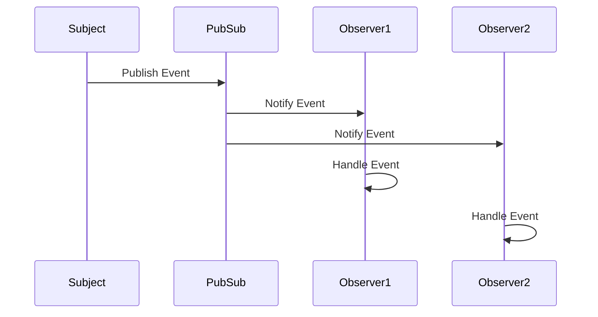

## 7.2. Observer Pattern with PubSub and `Phoenix.PubSub`

In this section, we will delve into the Observer Pattern, a fundamental behavioral design pattern that enables a one-to-many dependency between objects. This pattern is particularly useful in scenarios where parts of a system need to be notified and updated in response to events. We will explore how to implement the Observer Pattern in Elixir using the powerful `Phoenix.PubSub` library, which facilitates real-time, event-driven applications.

### Event Subscription Mechanism

The core of the Observer Pattern is the event subscription mechanism, where observers subscribe to events emitted by a subject. When an event occurs, all subscribed observers are notified, allowing them to react accordingly. This decouples the subject from the observers, promoting a more modular and maintainable codebase.

#### Key Concepts

- **Subject**: The entity that holds the state and notifies observers of changes.
- **Observer**: The entity that subscribes to the subject and reacts to changes.
- **Event**: The change or action that triggers notifications to observers.

### Implementing the Observer Pattern

In Elixir, we can implement the Observer Pattern using the `Phoenix.PubSub` library, which provides a robust publish-subscribe mechanism. Alternatively, Elixir's built-in `Registry` can also be used for similar functionality.

#### Using `Phoenix.PubSub`

`Phoenix.PubSub` is a distributed PubSub system that allows you to broadcast messages to subscribers in a scalable and efficient manner. It is a core component of the Phoenix framework, but it can be used independently in any Elixir application.

##### Setting Up `Phoenix.PubSub`

To use `Phoenix.PubSub`, you need to add it to your application's dependencies and configure it accordingly.

```elixir
# Add to your mix.exs
defp deps do
  [
    {:phoenix_pubsub, "~> 2.0"}
  ]
end
```

Next, configure `Phoenix.PubSub` in your application:

```elixir
# In your application module
def start(_type, _args) do
  children = [
    {Phoenix.PubSub, name: MyApp.PubSub}
  ]

  opts = [strategy: :one_for_one, name: MyApp.Supervisor]
  Supervisor.start_link(children, opts)
end
```

##### Publishing and Subscribing to Events

With `Phoenix.PubSub` set up, you can publish and subscribe to events using the following functions:

- **Publishing an Event**: Use `Phoenix.PubSub.broadcast/3` to publish an event to a topic.

```elixir
Phoenix.PubSub.broadcast(MyApp.PubSub, "topic:events", {:new_event, event_data})
```

- **Subscribing to a Topic**: Use `Phoenix.PubSub.subscribe/2` to subscribe to a topic.

```elixir
Phoenix.PubSub.subscribe(MyApp.PubSub, "topic:events")
```

- **Handling Events**: Define a function to handle incoming events.

```elixir
def handle_info({:new_event, event_data}, state) do
  # Process the event
  {:noreply, state}
end
```

### Use Cases

The Observer Pattern is ideal for scenarios requiring real-time updates and notifications. Here are some common use cases:

- **Live Updates**: Implement live data feeds, such as stock prices or sports scores.
- **Notifications**: Send alerts or messages to users in response to specific events.
- **Logging Systems**: Capture and record events for auditing or debugging purposes.

### Visualizing the Observer Pattern

To better understand how the Observer Pattern works with `Phoenix.PubSub`, let's visualize the flow of events and notifications.


```mermaid
sequenceDiagram
    participant Subject
    participant PubSub
    participant Observer1
    participant Observer2

    Subject->>PubSub: Publish Event
    PubSub->>Observer1: Notify Event
    PubSub->>Observer2: Notify Event
    Observer1->>Observer1: Handle Event
    Observer2->>Observer2: Handle Event
```

This diagram illustrates the sequence of interactions in the Observer Pattern using `Phoenix.PubSub`. The Subject publishes an event to the PubSub system, which then notifies all subscribed observers.

### Code Example: Real-Time Chat Application

Let's implement a simple real-time chat application using the Observer Pattern with `Phoenix.PubSub`.

#### Chat Room Module

```elixir
defmodule ChatRoom do
  use GenServer

  def start_link(name) do
    GenServer.start_link(__MODULE__, name, name: name)
  end

  def init(name) do
    Phoenix.PubSub.subscribe(MyApp.PubSub, "chat_room:#{name}")
    {:ok, %{name: name, messages: []}}
  end

  def handle_info({:new_message, message}, state) do
    new_state = Map.update!(state, :messages, fn messages -> [message | messages] end)
    IO.puts("New message in #{state.name}: #{message}")
    {:noreply, new_state}
  end
end
```

#### Chat Client Module

```elixir
defmodule ChatClient do
  def send_message(room, message) do
    Phoenix.PubSub.broadcast(MyApp.PubSub, "chat_room:#{room}", {:new_message, message})
  end
end
```

#### Usage

Start a chat room and send messages:

```elixir
{:ok, _pid} = ChatRoom.start_link("general")
ChatClient.send_message("general", "Hello, World!")
```

### Try It Yourself

Experiment with the code by adding more chat rooms or clients. Try implementing additional features, such as private messaging or message history.

### Design Considerations

When implementing the Observer Pattern with `Phoenix.PubSub`, consider the following:

- **Scalability**: Ensure your system can handle a large number of subscribers and events.
- **Fault Tolerance**: Use supervision trees to manage processes and recover from failures.
- **Performance**: Minimize latency and optimize message handling for real-time responsiveness.

### Elixir Unique Features

Elixir's concurrency model and lightweight processes make it an excellent choice for implementing the Observer Pattern. The `Phoenix.PubSub` library leverages these features to provide efficient and scalable event handling.

### Differences and Similarities

The Observer Pattern is often compared to the Publish-Subscribe Pattern. While they share similarities, the key difference lies in the decoupling of the subject and observers. In the Observer Pattern, observers are directly aware of the subject, whereas in Publish-Subscribe, they are not.

### Knowledge Check

- How does the Observer Pattern promote modularity and maintainability?
- What are the key components of the Observer Pattern?
- How can `Phoenix.PubSub` be used to implement real-time features?
- What are some common use cases for the Observer Pattern?

### Embrace the Journey

Remember, mastering the Observer Pattern with `Phoenix.PubSub` is just the beginning. As you continue to explore Elixir's capabilities, you'll discover new ways to build powerful, real-time applications. Keep experimenting, stay curious, and enjoy the journey!

---

## Quiz Time!



### What is the primary role of the Observer Pattern?

- [x] To create a one-to-many dependency between objects
- [ ] To manage database transactions
- [ ] To optimize memory usage
- [ ] To handle file I/O operations

> **Explanation:** The Observer Pattern is designed to create a one-to-many dependency, allowing multiple observers to be notified of changes in a subject.

### Which Elixir library is commonly used to implement the Observer Pattern?

- [ ] Ecto
- [x] Phoenix.PubSub
- [ ] Plug
- [ ] ExUnit

> **Explanation:** `Phoenix.PubSub` is commonly used in Elixir to implement the Observer Pattern through a publish-subscribe mechanism.

### What is the purpose of `Phoenix.PubSub.broadcast/3`?

- [x] To publish an event to a topic
- [ ] To subscribe to a topic
- [ ] To handle HTTP requests
- [ ] To start a GenServer

> **Explanation:** `Phoenix.PubSub.broadcast/3` is used to publish an event to a specific topic, notifying all subscribers.

### What is a common use case for the Observer Pattern?

- [x] Real-time notifications
- [ ] File compression
- [ ] Data encryption
- [ ] Sorting algorithms

> **Explanation:** Real-time notifications are a common use case for the Observer Pattern, as it allows systems to react to events as they occur.

### How does the Observer Pattern enhance system modularity?

- [x] By decoupling subjects and observers
- [ ] By increasing code complexity
- [ ] By using global variables
- [ ] By hardcoding dependencies

> **Explanation:** The Observer Pattern enhances modularity by decoupling subjects and observers, making the system more flexible and maintainable.

### What is a potential design consideration when using `Phoenix.PubSub`?

- [x] Scalability
- [ ] File permissions
- [ ] Network latency
- [ ] Disk space

> **Explanation:** Scalability is an important design consideration when using `Phoenix.PubSub`, as the system must handle a large number of subscribers and events efficiently.

### How can you subscribe to a topic using `Phoenix.PubSub`?

- [x] `Phoenix.PubSub.subscribe/2`
- [ ] `Phoenix.PubSub.broadcast/3`
- [ ] `Phoenix.PubSub.init/1`
- [ ] `Phoenix.PubSub.start_link/1`

> **Explanation:** `Phoenix.PubSub.subscribe/2` is used to subscribe to a specific topic, allowing a process to receive notifications.

### What is the role of a subject in the Observer Pattern?

- [x] To hold state and notify observers of changes
- [ ] To execute database queries
- [ ] To manage user sessions
- [ ] To render HTML templates

> **Explanation:** In the Observer Pattern, the subject holds the state and notifies observers of any changes, triggering their responses.

### Which of the following is NOT a component of the Observer Pattern?

- [ ] Subject
- [ ] Observer
- [x] Controller
- [ ] Event

> **Explanation:** The Controller is not a component of the Observer Pattern; the pattern primarily involves subjects, observers, and events.

### True or False: The Observer Pattern and Publish-Subscribe Pattern are the same.

- [ ] True
- [x] False

> **Explanation:** While similar, the Observer Pattern and Publish-Subscribe Pattern are not the same. The Observer Pattern involves direct awareness between subjects and observers, while Publish-Subscribe decouples them.


