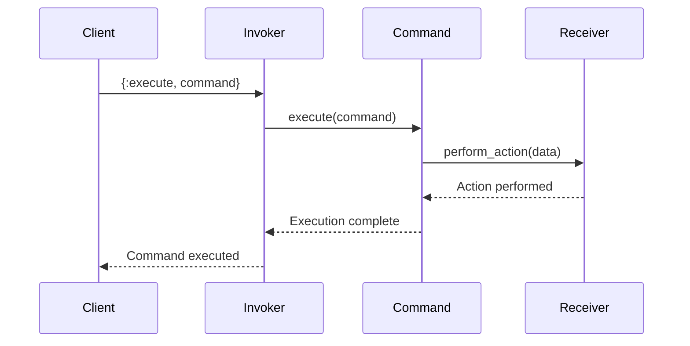

## 7.3. Command Pattern via Message Passing

In the world of software design patterns, the Command Pattern stands out as a versatile and powerful tool for encapsulating requests as objects or messages. This pattern is particularly well-suited to Elixir, where message passing between processes is a fundamental aspect of the language's concurrency model. In this section, we will explore how to implement the Command Pattern using message passing in Elixir, examine its use cases, and provide practical examples to solidify your understanding.

### Encapsulating Requests

The Command Pattern is a behavioral design pattern that encapsulates a request as an object, thereby allowing you to parameterize clients with queues, requests, and operations. This pattern is particularly useful in scenarios where you need to decouple the sender of a request from its receiver, enabling more flexible and maintainable code.

#### Key Concepts

- **Command Object**: Represents an action or operation. It contains all the information needed to perform the action, including the method to call, the method's arguments, and the object that implements the method.
- **Invoker**: Responsible for executing the command. It can also queue commands for later execution.
- **Receiver**: The object that performs the actual work when the command is executed.
- **Client**: Creates and configures command objects.

### Implementing the Command Pattern

In Elixir, the Command Pattern can be elegantly implemented using message passing between processes. This approach leverages Elixir's concurrency model, where processes communicate by sending and receiving messages. Let's break down the implementation into key steps:

#### Step 1: Define the Command

First, we need to define a command module that encapsulates the action to be performed. This module will include a function to execute the command.

```elixir
defmodule Command do
  defstruct [:action, :data]

  def execute(%Command{action: action, data: data}) do
    apply(action, data)
  end
end
```

In this example, the `Command` struct holds the action (a function) and the data (arguments for the function). The `execute/1` function applies the action to the data.

#### Step 2: Create the Invoker

The invoker is responsible for executing commands. It can also manage a queue of commands for deferred execution.

```elixir
defmodule Invoker do
  def start_link do
    Task.start_link(fn -> loop([]) end)
  end

  defp loop(commands) do
    receive do
      {:execute, command} ->
        Command.execute(command)
        loop(commands)

      {:queue, command} ->
        loop([command | commands])

      :execute_all ->
        Enum.each(commands, &Command.execute/1)
        loop([])
    end
  end
end
```

The `Invoker` module starts a process that listens for messages. It can execute a single command immediately or queue commands for later execution.

#### Step 3: Define the Receiver

The receiver is the object that performs the actual work. In Elixir, this can be any module that implements the required functions.

```elixir
defmodule Receiver do
  def perform_action(data) do
    IO.puts("Performing action with data: #{inspect(data)}")
  end
end
```

The `Receiver` module defines the `perform_action/1` function, which will be called by the command.

#### Step 4: Use the Command Pattern

Now, let's see how to use the Command Pattern in practice. We'll create a command, send it to the invoker, and execute it.

```elixir
defmodule Client do
  def run do
    {:ok, invoker} = Invoker.start_link()

    command = %Command{
      action: &Receiver.perform_action/1,
      data: ["Sample Data"]
    }

    send(invoker, {:execute, command})
  end
end

Client.run()
```

In this example, the `Client` module creates a command and sends it to the invoker for execution. The invoker then calls the `perform_action/1` function on the receiver with the provided data.

### Use Cases

The Command Pattern via message passing is particularly useful in several scenarios:

- **Task Scheduling**: Commands can be queued and executed at a later time, making it easy to implement task scheduling systems.
- **Undo Operations**: By storing executed commands, you can implement undo functionality by reversing the actions of previous commands.
- **Remote Procedure Calls (RPC)**: Commands can be sent across network boundaries, enabling remote procedure calls in distributed systems.

### Visualizing the Command Pattern

To better understand the flow of the Command Pattern via message passing, let's visualize the interaction between the components using a sequence diagram.



**Diagram Description**: This sequence diagram illustrates the flow of a command from the client to the invoker, which then executes the command by calling the appropriate function on the receiver.

### Elixir Unique Features

Elixir's concurrency model, based on the Actor model, makes it an ideal language for implementing the Command Pattern via message passing. Here are some unique features of Elixir that enhance this pattern:

- **Lightweight Processes**: Elixir processes are lightweight and can be spawned in large numbers, making it easy to handle multiple commands concurrently.
- **Fault Tolerance**: Elixir's "let it crash" philosophy and supervision trees ensure that failures in command execution do not bring down the entire system.
- **Pattern Matching**: Elixir's powerful pattern matching capabilities simplify the implementation of message handling in the invoker.

### Design Considerations

When implementing the Command Pattern via message passing in Elixir, consider the following:

- **Concurrency**: Ensure that commands are executed concurrently without blocking the invoker process.
- **Error Handling**: Implement robust error handling to manage failures in command execution.
- **Performance**: Optimize the performance of the invoker and receiver to handle high volumes of commands efficiently.

### Differences and Similarities

The Command Pattern is often confused with other behavioral patterns, such as the Strategy Pattern. While both patterns encapsulate behavior, the Command Pattern focuses on encapsulating requests as objects, whereas the Strategy Pattern encapsulates algorithms.

### Try It Yourself

To deepen your understanding of the Command Pattern via message passing, try modifying the code examples provided:

- **Experiment with Different Actions**: Create additional functions in the `Receiver` module and execute them using commands.
- **Implement a Command Queue**: Modify the `Invoker` module to queue commands and execute them in batches.
- **Add Error Handling**: Introduce error handling in the `Command` and `Invoker` modules to manage failures gracefully.

### Knowledge Check

Before we conclude, let's reinforce your understanding with a few questions:

- What is the primary purpose of the Command Pattern?
- How does Elixir's concurrency model enhance the implementation of the Command Pattern?
- What are some common use cases for the Command Pattern via message passing?

### Embrace the Journey

Remember, mastering design patterns is a journey. As you continue to explore and experiment with the Command Pattern via message passing in Elixir, you'll discover new ways to build flexible and maintainable systems. Keep experimenting, stay curious, and enjoy the journey!

## Quiz: Command Pattern via Message Passing



### What is the primary purpose of the Command Pattern?

- [x] To encapsulate requests as objects or messages
- [ ] To manage state transitions in an application
- [ ] To define a family of algorithms
- [ ] To provide a way to access elements of a collection

> **Explanation:** The Command Pattern encapsulates requests as objects or messages, allowing for flexible and decoupled execution.

### How does Elixir's concurrency model enhance the Command Pattern?

- [x] By enabling lightweight processes for concurrent command execution
- [ ] By providing a global state for command management
- [ ] By enforcing strict type checking for commands
- [ ] By limiting the number of concurrent commands

> **Explanation:** Elixir's lightweight processes allow for concurrent execution of commands without blocking the system.

### Which component is responsible for executing commands in the Command Pattern?

- [ ] Client
- [x] Invoker
- [ ] Receiver
- [ ] Command

> **Explanation:** The invoker is responsible for executing commands, either immediately or by queuing them for later execution.

### What is a common use case for the Command Pattern via message passing?

- [ ] Managing global state
- [x] Task scheduling
- [ ] Implementing data structures
- [ ] Handling user input

> **Explanation:** Task scheduling is a common use case for the Command Pattern, as it allows for deferred execution of commands.

### What is the role of the Receiver in the Command Pattern?

- [x] To perform the actual work when a command is executed
- [ ] To create and configure command objects
- [ ] To manage the lifecycle of commands
- [ ] To queue commands for later execution

> **Explanation:** The receiver performs the actual work when a command is executed, as defined by the command object.

### How can you implement undo functionality using the Command Pattern?

- [x] By storing executed commands and reversing their actions
- [ ] By creating a global undo function
- [ ] By using a stack data structure
- [ ] By implementing a state machine

> **Explanation:** Undo functionality can be implemented by storing executed commands and reversing their actions when needed.

### What is the benefit of using message passing for the Command Pattern in Elixir?

- [x] It decouples the sender and receiver of commands
- [ ] It enforces strict type checking
- [ ] It provides a global state for command management
- [ ] It limits the number of concurrent commands

> **Explanation:** Message passing decouples the sender and receiver, allowing for flexible and maintainable code.

### What is a potential pitfall when implementing the Command Pattern in Elixir?

- [ ] Using too few processes
- [x] Blocking the invoker process
- [ ] Overusing pattern matching
- [ ] Ignoring type safety

> **Explanation:** Blocking the invoker process can lead to performance issues, so it's important to ensure commands are executed concurrently.

### How can you optimize the performance of the Command Pattern in Elixir?

- [x] By ensuring commands are executed concurrently
- [ ] By using a global state for command management
- [ ] By limiting the number of commands
- [ ] By enforcing strict type checking

> **Explanation:** Ensuring commands are executed concurrently optimizes performance by preventing bottlenecks.

### True or False: The Command Pattern is often confused with the Strategy Pattern.

- [x] True
- [ ] False

> **Explanation:** The Command Pattern is often confused with the Strategy Pattern, but they serve different purposes: encapsulating requests vs. encapsulating algorithms.




