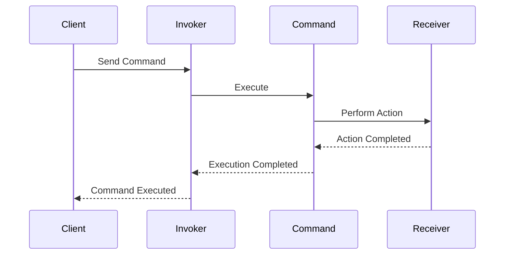

## 7.3. Command Pattern via Message Passing

In the realm of software design patterns, the Command Pattern stands out as a powerful tool for encapsulating requests as objects, thereby allowing for parameterization and queuing of requests, logging, and supporting undoable operations. In Elixir, this pattern can be elegantly implemented using message passing between processes, leveraging the language's inherent concurrency model. Let's delve into the intricacies of the Command Pattern via message passing in Elixir, exploring its implementation, use cases, and unique advantages.

### **Encapsulating Requests**

At its core, the Command Pattern involves encapsulating a request as an object, also known as a command. This abstraction allows us to treat operations as first-class entities, which can be passed around, stored, and executed at a later time. This pattern is particularly useful in scenarios where operations need to be queued, logged, or undone.

#### **Key Concepts**

- **Command Object**: Represents an operation or action. It typically includes the information necessary to perform the action.
- **Invoker**: Responsible for executing or queuing commands.
- **Receiver**: The entity that performs the actual work when a command is executed.

In Elixir, we can leverage processes and message passing to implement these concepts, allowing commands to be sent as messages between processes.

### **Implementing the Command Pattern**

Implementing the Command Pattern in Elixir involves creating a structure where commands are represented as messages sent between processes. This approach not only aligns with Elixir's concurrency model but also enhances the scalability and fault tolerance of the system.

#### **Defining Command Modules**

In Elixir, a command can be represented as a module with a function that carries out the desired operation. Let's consider a simple example of a command that turns a light on or off.

```elixir
defmodule Light do
  def turn_on do
    IO.puts("The light is on.")
  end

  def turn_off do
    IO.puts("The light is off.")
  end
end
```

Here, the `Light` module acts as the receiver, performing the actual operations.

#### **Creating Command Structures**

Next, we define a command structure that encapsulates the request to turn the light on or off.

```elixir
defmodule TurnOnCommand do
  defstruct [:light]

  def execute(%TurnOnCommand{light: light}) do
    light.turn_on()
  end
end

defmodule TurnOffCommand do
  defstruct [:light]

  def execute(%TurnOffCommand{light: light}) do
    light.turn_off()
  end
end
```

These modules encapsulate the `execute` function, which carries out the operation on the receiver.

#### **Using an Invoker**

The invoker is responsible for executing commands. In Elixir, this can be a process that receives command messages and invokes their execution.

```elixir
defmodule Invoker do
  def start_link do
    Task.start_link(fn -> loop() end)
  end

  defp loop do
    receive do
      {:execute, command} ->
        command.execute(command)
        loop()
    end
  end
end
```

The `Invoker` module starts a process that continuously listens for messages containing commands and executes them.

### **Use Cases**

The Command Pattern via message passing is versatile and can be applied in various scenarios:

- **Task Scheduling**: Commands can be queued and executed at a scheduled time.
- **Undo Operations**: By maintaining a history of commands, operations can be undone by executing inverse commands.
- **Remote Procedure Calls (RPC)**: Commands can be sent to remote nodes for execution, facilitating distributed computing.

### **Visualizing the Command Pattern**

To better understand the flow of the Command Pattern via message passing, let's visualize the interaction between components using a sequence diagram.


```mermaid
sequenceDiagram
    participant Client
    participant Invoker
    participant Command
    participant Receiver

    Client->>Invoker: Send Command
    Invoker->>Command: Execute
    Command->>Receiver: Perform Action
    Receiver-->>Command: Action Completed
    Command-->>Invoker: Execution Completed
    Invoker-->>Client: Command Executed
```

This diagram illustrates the sequence of interactions from the client sending a command to the invoker, which then executes the command on the receiver.

### **Elixir Unique Features**

Elixir's concurrency model, based on the Actor model, makes it uniquely suited for implementing the Command Pattern via message passing. The language's lightweight processes and robust message-passing capabilities allow for efficient command execution and fault tolerance.

#### **Advantages of Using Elixir**

- **Concurrency**: Elixir's processes are lightweight and can handle thousands of concurrent operations, making it ideal for command execution.
- **Fault Tolerance**: The "let it crash" philosophy ensures that failures are isolated and do not affect the entire system.
- **Scalability**: Commands can be distributed across multiple nodes, enhancing scalability.

### **Sample Code Snippet**

Let's put it all together with a complete example demonstrating the Command Pattern via message passing in Elixir.

```elixir
defmodule Light do
  def turn_on do
    IO.puts("The light is on.")
  end

  def turn_off do
    IO.puts("The light is off.")
  end
end

defmodule TurnOnCommand do
  defstruct [:light]

  def execute(%TurnOnCommand{light: light}) do
    light.turn_on()
  end
end

defmodule TurnOffCommand do
  defstruct [:light]

  def execute(%TurnOffCommand{light: light}) do
    light.turn_off()
  end
end

defmodule Invoker do
  def start_link do
    Task.start_link(fn -> loop() end)
  end

  defp loop do
    receive do
      {:execute, command} ->
        command.execute(command)
        loop()
    end
  end
end

# Usage
{:ok, invoker} = Invoker.start_link()
light = %Light{}

turn_on = %TurnOnCommand{light: light}
turn_off = %TurnOffCommand{light: light}

send(invoker, {:execute, turn_on})
send(invoker, {:execute, turn_off})
```

### **Design Considerations**

When implementing the Command Pattern via message passing, consider the following:

- **State Management**: Ensure that the state of the receiver is managed correctly, especially in concurrent environments.
- **Error Handling**: Implement robust error handling to manage failures gracefully.
- **Performance**: Optimize the command execution process to minimize latency.

### **Try It Yourself**

Experiment with the provided code examples by modifying the light operations or adding new commands. For instance, try implementing a dimming feature for the light or a command to change its color.

### **Knowledge Check**

- What are the key components of the Command Pattern?
- How does Elixir's concurrency model enhance the implementation of the Command Pattern?
- In what scenarios is the Command Pattern particularly useful?

### **Embrace the Journey**

Remember, mastering design patterns is a journey. As you explore the Command Pattern via message passing in Elixir, you'll gain insights into building scalable and maintainable systems. Keep experimenting, stay curious, and enjoy the journey!

## Quiz Time!



### What is the primary purpose of the Command Pattern?

- [x] Encapsulating requests as objects
- [ ] Managing database connections
- [ ] Handling user authentication
- [ ] Creating user interfaces

> **Explanation:** The Command Pattern is primarily used to encapsulate requests as objects, allowing for parameterization and queuing of requests.

### Which Elixir feature is particularly beneficial for implementing the Command Pattern?

- [x] Message passing between processes
- [ ] Pattern matching
- [ ] List comprehensions
- [ ] Metaprogramming

> **Explanation:** Elixir's message passing capabilities between processes make it well-suited for implementing the Command Pattern.

### In the Command Pattern, what role does the Invoker play?

- [x] Executes or queues commands
- [ ] Performs the actual work
- [ ] Stores command history
- [ ] Manages user input

> **Explanation:** The Invoker is responsible for executing or queuing commands in the Command Pattern.

### Which of the following is a use case for the Command Pattern?

- [x] Task scheduling
- [ ] Data validation
- [ ] User authentication
- [ ] Data serialization

> **Explanation:** The Command Pattern is useful for task scheduling, among other use cases.

### What is a key advantage of using Elixir for the Command Pattern?

- [x] Concurrency and fault tolerance
- [ ] Object-oriented programming
- [ ] Static typing
- [ ] Complex inheritance structures

> **Explanation:** Elixir's concurrency model and fault tolerance make it advantageous for implementing the Command Pattern.

### How does the Command Pattern enhance undo operations?

- [x] By maintaining a history of commands
- [ ] By using complex algorithms
- [ ] By relying on external libraries
- [ ] By integrating with databases

> **Explanation:** The Command Pattern can enhance undo operations by maintaining a history of commands and executing inverse commands.

### What is the role of the Receiver in the Command Pattern?

- [x] Performs the actual work when a command is executed
- [ ] Queues commands for later execution
- [ ] Sends commands to the Invoker
- [ ] Manages user sessions

> **Explanation:** The Receiver performs the actual work when a command is executed in the Command Pattern.

### Which of the following is NOT a component of the Command Pattern?

- [ ] Command Object
- [x] Database Connector
- [ ] Invoker
- [ ] Receiver

> **Explanation:** A Database Connector is not a component of the Command Pattern.

### How can the Command Pattern be used in remote procedure calls?

- [x] By sending commands to remote nodes for execution
- [ ] By integrating with REST APIs
- [ ] By using HTTP requests
- [ ] By implementing complex algorithms

> **Explanation:** The Command Pattern can be used in remote procedure calls by sending commands to remote nodes for execution.

### True or False: The Command Pattern is only useful in object-oriented programming languages.

- [ ] True
- [x] False

> **Explanation:** The Command Pattern is applicable in various programming paradigms, including functional programming languages like Elixir.


