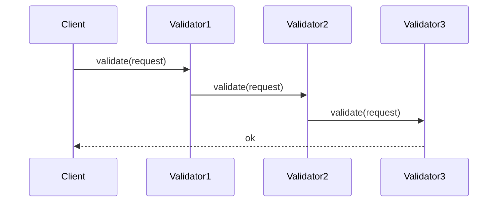

## 7.4. Chain of Responsibility with Process Chains

The Chain of Responsibility pattern is a behavioral design pattern that allows an object to pass a request along a chain of potential handlers until one of them handles the request. In Elixir, this pattern can be elegantly implemented using process chains, leveraging the language's concurrency model and functional programming paradigms.

### Passing Requests Along a Chain

The primary intent of the Chain of Responsibility pattern is to decouple the sender of a request from its receivers by allowing multiple objects to have a chance to handle the request. This is particularly useful in scenarios where you want to build flexible and scalable systems, such as middleware systems or request validation pipelines.

#### Key Concepts

- **Decoupling**: The sender of a request is not tied to a specific handler, allowing for more flexible and maintainable code.
- **Dynamic Handling**: The chain can be modified at runtime, enabling dynamic handling of requests.
- **Process Chains**: In Elixir, processes can be used to represent each handler in the chain, passing messages between them.

### Implementing the Chain of Responsibility

To implement the Chain of Responsibility pattern in Elixir, we can set up a series of processes or functions where each can handle or pass the request. Let's explore how to do this with a practical example.

#### Example: Request Validation Pipeline

Consider a scenario where we have a series of validation checks that need to be performed on incoming requests. Each validation check is independent and can either handle the request or pass it to the next validator in the chain.

```elixir
defmodule Validator do
  def start_link(next_validator \\ nil) do
    Task.start_link(fn -> loop(next_validator) end)
  end

  defp loop(next_validator) do
    receive do
      {:validate, request, sender} ->
        if valid?(request) do
          send(sender, {:ok, request})
        else
          if next_validator do
            send(next_validator, {:validate, request, sender})
          else
            send(sender, {:error, :invalid_request})
          end
        end
        loop(next_validator)
    end
  end

  defp valid?(request) do
    # Implement validation logic here
    true
  end
end
```

In this example, each `Validator` process checks if a request is valid. If it is, it sends an `:ok` message back to the sender. If not, it passes the request to the next validator in the chain, or returns an error if there are no more validators.

#### Setting Up the Chain

To set up the chain, we need to start multiple validator processes and link them together:

```elixir
defmodule ValidationChain do
  def start_chain do
    {:ok, validator3} = Validator.start_link()
    {:ok, validator2} = Validator.start_link(validator3)
    {:ok, validator1} = Validator.start_link(validator2)
    validator1
  end
end
```

Here, we start three validator processes and link them in a chain. The first validator in the chain is returned, which can be used to initiate the validation process.

#### Sending Requests Through the Chain

To send a request through the chain, we simply send a message to the first validator:

```elixir
defmodule RequestHandler do
  def handle_request(request) do
    validator_chain = ValidationChain.start_chain()
    send(validator_chain, {:validate, request, self()})

    receive do
      {:ok, _request} ->
        IO.puts("Request is valid.")
      {:error, :invalid_request} ->
        IO.puts("Request is invalid.")
    end
  end
end
```

In this module, we start the validation chain and send a request to it. We then wait for a response indicating whether the request is valid or not.

### Use Cases

The Chain of Responsibility pattern is particularly useful in the following scenarios:

- **Middleware Systems**: In web applications, middleware components can be chained to process HTTP requests and responses.
- **Request Validation Pipelines**: As demonstrated in the example, validation checks can be chained to ensure requests meet certain criteria.
- **Event Handling**: Events can be passed through a chain of handlers, each having the opportunity to process the event.

### Visualizing the Chain of Responsibility

To better understand the flow of requests through the chain, let's visualize the process using a sequence diagram.



In this diagram, the `Client` sends a validation request to `Validator1`, which passes it to `Validator2`, and so on, until `Validator3` handles it and sends a response back to the `Client`.

### Design Considerations

When implementing the Chain of Responsibility pattern in Elixir, consider the following:

- **Process Overhead**: Each handler in the chain is a separate process, which can introduce overhead. Ensure that the benefits of decoupling outweigh the cost.
- **Error Handling**: Implement robust error handling to manage failures within the chain.
- **Dynamic Chains**: Consider allowing the chain to be modified at runtime for greater flexibility.

### Elixir Unique Features

Elixir's concurrency model, based on the Actor model, makes it particularly well-suited for implementing the Chain of Responsibility pattern using process chains. The ability to spawn lightweight processes and communicate via message passing allows for scalable and fault-tolerant systems.

### Differences and Similarities

The Chain of Responsibility pattern is often compared to the Decorator pattern. While both involve chaining, the Decorator pattern focuses on adding behavior to objects, whereas the Chain of Responsibility pattern focuses on passing requests along a chain of handlers.

### Try It Yourself

Experiment with the provided code examples by modifying the validation logic or adding additional validators to the chain. Consider implementing a middleware system for a web application using this pattern.

### Knowledge Check

- What is the primary intent of the Chain of Responsibility pattern?
- How does Elixir's concurrency model facilitate the implementation of this pattern?
- What are some common use cases for the Chain of Responsibility pattern?

### Summary

The Chain of Responsibility pattern is a powerful tool for building flexible and scalable systems in Elixir. By leveraging process chains, we can decouple request senders from handlers, allowing for dynamic and maintainable code. As you continue to explore Elixir's capabilities, consider how this pattern can be applied to your own projects.

## Quiz: Chain of Responsibility with Process Chains



### What is the primary intent of the Chain of Responsibility pattern?

- [x] To decouple the sender of a request from its receivers
- [ ] To couple the sender and receiver tightly
- [ ] To ensure only one handler processes the request
- [ ] To handle requests in parallel

> **Explanation:** The Chain of Responsibility pattern aims to decouple the sender of a request from its receivers, allowing multiple handlers to process the request.

### How does Elixir's concurrency model facilitate the Chain of Responsibility pattern?

- [x] By allowing lightweight processes and message passing
- [ ] By enforcing strict process synchronization
- [ ] By using shared memory for communication
- [ ] By limiting the number of processes

> **Explanation:** Elixir's concurrency model, based on the Actor model, allows for lightweight processes and message passing, which is ideal for implementing the Chain of Responsibility pattern.

### Which of the following is a common use case for the Chain of Responsibility pattern?

- [x] Middleware systems
- [ ] Database transactions
- [ ] Static file serving
- [ ] UI rendering

> **Explanation:** Middleware systems are a common use case for the Chain of Responsibility pattern, as they involve processing requests through a series of handlers.

### What is a potential drawback of using process chains in Elixir?

- [x] Process overhead
- [ ] Lack of concurrency
- [ ] Inability to handle requests
- [ ] Difficulty in spawning processes

> **Explanation:** Each handler in the chain is a separate process, which can introduce overhead. It's important to ensure the benefits outweigh the cost.

### What is a key difference between the Chain of Responsibility and Decorator patterns?

- [x] Chain of Responsibility focuses on passing requests, while Decorator adds behavior
- [ ] Both patterns focus on adding behavior
- [ ] Chain of Responsibility is used for UI components
- [ ] Decorator is used for request handling

> **Explanation:** The Chain of Responsibility pattern focuses on passing requests along a chain of handlers, while the Decorator pattern focuses on adding behavior to objects.

### In the provided example, what does the `Validator` process do if a request is invalid?

- [x] Passes it to the next validator or returns an error
- [ ] Immediately returns an error
- [ ] Stops the chain
- [ ] Modifies the request

> **Explanation:** If a request is invalid, the `Validator` process passes it to the next validator in the chain or returns an error if there are no more validators.

### What is the role of the `ValidationChain` module in the example?

- [x] To set up and link validator processes
- [ ] To validate requests directly
- [ ] To handle errors in the chain
- [ ] To modify requests

> **Explanation:** The `ValidationChain` module sets up and links validator processes, creating the chain through which requests are passed.

### How can the chain be modified at runtime?

- [x] By dynamically adding or removing handlers
- [ ] By recompiling the code
- [ ] By restarting the application
- [ ] By using shared memory

> **Explanation:** The chain can be modified at runtime by dynamically adding or removing handlers, allowing for greater flexibility.

### What is a benefit of using the Chain of Responsibility pattern?

- [x] Increased flexibility and maintainability
- [ ] Reduced code complexity
- [ ] Guaranteed request handling by a single process
- [ ] Simplified error handling

> **Explanation:** The Chain of Responsibility pattern increases flexibility and maintainability by decoupling the sender of a request from its receivers.

### True or False: The Chain of Responsibility pattern ensures that only one handler processes the request.

- [ ] True
- [x] False

> **Explanation:** The Chain of Responsibility pattern allows multiple handlers to have a chance to process the request, not just one.



Remember, this is just the beginning. As you progress, you'll build more complex and interactive systems using Elixir's powerful concurrency model. Keep experimenting, stay curious, and enjoy the journey!
